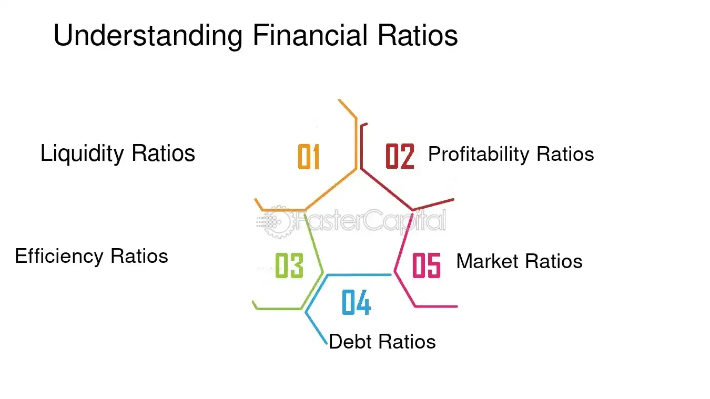

## Table of Contents

## What are financial ratios and why are they important for evaluating consumer packaged goods?

Financial ratios are numbers that help people understand how well a company is doing by comparing different parts of its financial information. They are like health check-ups for a business, showing things like how much money the company makes, how much it owes, and how well it uses its resources. For consumer packaged goods companies, which make and sell products like food, drinks, and household items, financial ratios are especially useful because these companies often work with tight profit margins and need to manage their inventory and cash flow carefully.

These ratios are important for evaluating consumer packaged goods because they help investors, managers, and other interested people see the company's performance clearly. For example, ratios can show if a company is good at turning its inventory into sales, which is crucial for consumer goods where products can go out of date quickly. They also help in comparing the company with others in the same industry, making it easier to see who is doing better at managing costs, pricing their products, or using their money wisely. By using financial ratios, people can make smarter decisions about investing in or managing these companies.

## How can beginners identify key financial ratios relevant to consumer packaged goods?

To start, beginners should look at ratios that show how well a company is making money and managing its inventory. A good place to begin is with the gross profit margin, which tells you how much money the company keeps after paying for the cost of making its products. For consumer packaged goods, this is important because it shows if the company can sell its products for more than it costs to make them. Another key ratio is the inventory turnover ratio, which shows how quickly a company sells and replaces its stock. Since consumer goods can spoil or go out of date, a high turnover is good because it means the company is selling its products fast.

Next, beginners should also pay attention to ratios that show how the company is using its money and managing its debts. The current ratio is a simple way to see if the company can pay its short-term bills. It compares what the company owns that can be quickly turned into cash (like inventory) with what it owes in the short term. For consumer packaged goods, this is crucial because they often need to buy materials and keep stock on hand. Lastly, the debt-to-equity ratio is useful because it shows how much the company relies on borrowing versus its own money. A lower ratio can be a good sign that the company is not too risky, which is important for consumer goods companies that need to be stable to keep their products moving.

## What is the current ratio and how does it apply to consumer packaged goods companies?

The current ratio is a simple way to see if a company can pay its short-term bills. It compares what the company owns that can be quickly turned into cash, like inventory, with what it owes in the short term, like bills that need to be paid soon. A current ratio higher than 1 means the company has more quick assets than short-term debts, which is good because it shows the company can cover its bills.

For consumer packaged goods companies, the current ratio is really important. These companies often need to buy a lot of materials to make their products and keep a lot of stock on hand. If their current ratio is too low, it might mean they can't pay for these things, which could cause problems like not being able to make or sell their products. A good current ratio helps these companies keep running smoothly and shows they are managing their money well.

## Can you explain the quick ratio and its significance for consumer packaged goods?

The quick ratio is another way to check if a company can pay its short-term bills, but it's a bit stricter than the current ratio. It looks at what the company can turn into cash really fast, like money in the bank and money people owe the company, but it doesn't count inventory. This is because inventory might take time to sell, and the quick ratio wants to see if the company can pay its bills right away without selling anything.

For consumer packaged goods companies, the quick ratio is important because it shows how well they can handle money problems without relying on selling their products. These companies often have a lot of inventory, which can take time to turn into cash. If their quick ratio is good, it means they have enough quick cash to cover their short-term bills even if they can't sell their products right away. This is really helpful because it shows the company is in a strong position to handle unexpected money issues.

## How does the inventory turnover ratio help in assessing consumer packaged goods businesses?

The inventory turnover ratio tells us how many times a company sells and replaces its stock in a year. For consumer packaged goods businesses, this ratio is really important because it shows how fast they can move their products off the shelves. A high inventory turnover ratio means the company is selling its products quickly, which is good because consumer goods can go bad or become outdated if they sit around too long.

This ratio helps us understand if a company is managing its stock well. If the inventory turnover ratio is low, it might mean the company is having trouble selling its products, which could lead to wasted goods and lost money. On the other hand, a high ratio shows that the company is good at keeping its inventory fresh and meeting customer demand, which is crucial for staying competitive in the consumer packaged goods industry.

## What is the gross margin ratio and why is it crucial for consumer packaged goods?

The gross margin ratio is a number that shows how much money a company keeps after paying for the things it needs to make its products. It's calculated by taking the money left after subtracting the cost of goods sold from the total sales, then dividing that by the total sales. For consumer packaged goods, this ratio is really important because it shows if the company can sell its products for more than it costs to make them. If the gross margin is high, it means the company is doing well at keeping costs low and selling at a good price.

In the world of consumer packaged goods, where companies often have to deal with tight profit margins, the gross margin ratio helps show how healthy the business is. If the ratio is low, it might mean the company is struggling to make enough money to cover other costs like marketing or store rent. A good gross margin is crucial because it gives the company room to spend on things that can help it grow, like new products or better ways to reach customers.

## How can the return on assets (ROA) ratio be used to evaluate consumer packaged goods firms?

The return on assets (ROA) ratio shows how good a company is at making money from the things it owns, like factories, trucks, and stock. For consumer packaged goods firms, this ratio is important because these companies often need to spend a lot on stuff to make and move their products. A high ROA means the company is using its things well to make more money, which is a good sign that it's doing well.

If a consumer packaged goods firm has a low ROA, it might mean that it's not using its things as well as it could. This could be because it's spending too much on making products, or maybe it's not selling them fast enough. By looking at the ROA, people who want to invest in or work with the company can see if it's managing its money and things smartly, which is key for staying strong in the busy world of consumer goods.

## What does the debt-to-equity ratio tell us about the financial health of consumer packaged goods companies?

The debt-to-equity ratio tells us how much a company is borrowing compared to what it owns. For consumer packaged goods companies, this ratio is important because it shows if they are relying too much on borrowed money to keep their business going. A high debt-to-equity ratio means the company is using a lot of loans, which can be risky. If the company can't pay back these loans, it might run into big problems.

On the other hand, a lower debt-to-equity ratio is usually a good sign for consumer packaged goods companies. It means they are not borrowing too much and are using their own money to grow. This can make the company more stable and less likely to get into trouble if something unexpected happens, like a drop in sales. So, looking at this ratio helps people understand if the company is managing its money in a safe way.

## How do advanced analysts use the price-to-earnings (P/E) ratio to value consumer packaged goods stocks?

Advanced analysts use the price-to-earnings (P/E) ratio to figure out if a consumer packaged goods company's stock is a good deal or if it's priced too high. The P/E ratio compares the company's stock price to how much money it makes, which is called earnings per share. If the P/E ratio is low, it might mean the stock is cheap compared to how much money the company is making, which could be a good time to buy. But if the P/E ratio is high, it might mean the stock is expensive, and the company might need to make a lot more money to be worth that price.

When looking at consumer packaged goods stocks, analysts also compare the P/E ratio of one company to others in the same industry. This helps them see if a company's stock is a better or worse deal than its competitors. Sometimes, a higher P/E ratio might be okay if the company is growing fast or has other good things going for it, like a strong brand or new products coming out. But if the P/E ratio is too high without good reasons, it might be a sign that the stock is overvalued and could go down in price later.

## Can you discuss the impact of the operating margin ratio on consumer packaged goods profitability?

The operating margin ratio shows how much money a consumer packaged goods company makes from its main business after paying for things like making products and running stores, but before paying for things like taxes and loans. For these companies, a high operating margin is good because it means they are making a lot of money from selling their products. If the operating margin is low, it might mean they are spending too much on making and selling their goods, which can make it hard for them to make enough money to grow or even stay in business.

This ratio is really important for figuring out how profitable a consumer packaged goods company is. If a company has a higher operating margin than others in the same industry, it might mean they are doing a better job at keeping costs down or selling their products for more money. This can make the company more attractive to people who want to invest in it, because it shows that the company is good at turning what it does into profit. On the other hand, a low operating margin could be a warning sign that the company needs to find ways to cut costs or boost sales to stay competitive.

## What are some lesser-known financial ratios that experts use specifically for consumer packaged goods?

One lesser-known ratio that experts use for consumer packaged goods is the days sales of inventory (DSI). This ratio tells us how many days it takes for a company to turn its inventory into sales. For consumer packaged goods, where products can spoil or go out of date, a lower DSI is good because it means the company is selling its stuff fast. If the DSI is high, it might mean the company is holding onto its products too long, which can lead to waste and lost money.

Another useful ratio is the cash conversion cycle (CCC). This shows how long it takes for a company to turn its investments in inventory and other resources into cash from sales. For consumer packaged goods, a shorter CCC is better because it means the company is quickly turning its products into money. This helps the company manage its cash flow well, which is important for buying new materials and keeping the business running smoothly.

Lastly, experts also look at the shelf-life ratio, which compares the time a product can sit on the shelf before it goes bad to how long it actually takes to sell. This is super important for consumer packaged goods because it helps companies know if they need to change how they make or sell their products to avoid wasting them. A good shelf-life ratio means the company is selling its products before they go out of date, which is key for staying profitable.

## How can financial ratios be combined to create a comprehensive evaluation model for consumer packaged goods?

To create a comprehensive evaluation model for consumer packaged goods, experts can combine several key financial ratios to get a full picture of a company's health and performance. By looking at the gross margin ratio, they can see how much money the company keeps after paying to make its products. The inventory turnover ratio helps them understand how fast the company sells its products, which is crucial because consumer goods can spoil or go out of date. The operating margin ratio tells them how much profit the company makes from its main business, showing if it's good at keeping costs down and selling at a good price. The current ratio and quick ratio help check if the company can pay its short-term bills, which is important for companies that need to buy materials and keep stock on hand. Lastly, the debt-to-equity ratio shows how much the company is borrowing, which can tell if it's taking too many risks.

In addition to these common ratios, experts can use lesser-known ratios like the days sales of inventory (DSI) and the cash conversion cycle (CCC) to get even more insights. The DSI shows how many days it takes to sell the inventory, which is vital for consumer packaged goods because they need to move products quickly. The CCC measures how long it takes to turn investments into cash, helping companies manage their cash flow better. The shelf-life ratio is also important because it compares how long products can sit on shelves before going bad to how long it actually takes to sell them. By putting all these ratios together, experts can see not just if a company is making money, but also how well it's managing its inventory, cash, and risks. This complete view helps them make smarter decisions about investing in or managing consumer packaged goods companies.

## What are the key financial ratios for evaluating Consumer Packaged Goods (CPG)?

In evaluating Consumer Packaged Goods (CPG) companies, financial ratios serve as essential tools for understanding the financial health and operational efficiency of the business. Analyzing these ratios provides investors and analysts with a clear picture of how well a CPG company is performing relative to its competitors and market expectations.

### Return on Equity (ROE) and Profit Margins

Return on Equity (ROE) is a key financial ratio that measures a company's ability to generate profits from its shareholders' equity. It is calculated using the formula:

$$
\text{ROE} = \frac{\text{Net Income}}{\text{Shareholder's Equity}}
$$

A high ROE indicates efficient use of equity investment to produce growth, suggesting strong management performance. In the CPG industry, companies like Procter & Gamble and Coca-Cola leverage established brand strength to achieve consistent returns.

Profit margins, such as the gross margin and net profit margin, are equally important. The gross margin is calculated as:

$$
\text{Gross Margin} = \frac{\text{Revenue} - \text{Cost of Goods Sold}}{\text{Revenue}}
$$

This ratio assesses a company's manufacturing efficiency and pricing strategy. Meanwhile, the net profit margin, determined by dividing net income by revenue, provides insight into a company's ability to translate sales into actual profit, accounting for all operating costs and expenses.

### Solvency Ratios

Solvency ratios are critical for understanding a company's ability to meet its long-term obligations. A vital solvency ratio is the debt-to-equity ratio, calculated as:

$$
\text{Debt-to-Equity Ratio} = \frac{\text{Total Liabilities}}{\text{Shareholder's Equity}}
$$

A lower ratio indicates that the company is using less borrowed money, suggesting financial stability. Conversely, a high ratio might signal potential financial risk, especially if external factors such as market downturns impact growth.

### Working Capital Metrics

Working capital metrics provide insights into a company’s short-term financial health. The working capital ratio, expressed as current assets divided by current liabilities, indicates the ability to cover short-term obligations:

$$
\text{Working Capital Ratio} = \frac{\text{Current Assets}}{\text{Current Liabilities}}
$$

A ratio above 1 indicates that the company has more assets than liabilities, signifying good short-term financial health. As CPG companies often deal with high inventory turnover, maintaining optimal working capital is crucial.

### Activity Ratios

Activity ratios focus on evaluating the efficiency of a company’s operations. The accounts receivable turnover ratio, calculated by dividing net credit sales by average accounts receivable, assesses how effectively a company collects its receivables. A higher ratio indicates efficient collection processes.

The inventory turnover ratio, another critical measure, is calculated as:

$$
\text{Inventory Turnover Ratio} = \frac{\text{Cost of Goods Sold}}{\text{Average Inventory}}
$$

This ratio evaluates how often a company sells and replaces its inventory over a period. For CPG businesses, a high inventory turnover ratio signifies effective inventory management and robust sales, crucial in an industry reliant on consistent availability and consumer demand.

By examining these financial ratios, investors and analysts can evaluate the profitability, efficiency, stability, and [liquidity](/wiki/liquidity-risk-premium) of CPG companies, thereby making informed investment decisions.

## References & Further Reading

[1]: Bergstra, J., Bardenet, R., Bengio, Y., & Kégl, B. (2011). ["Algorithms for Hyper-Parameter Optimization."](https://dl.acm.org/doi/10.5555/2986459.2986743) Advances in Neural Information Processing Systems 24.

[2]: ["Advances in Financial Machine Learning"](https://www.amazon.com/Advances-Financial-Machine-Learning-Marcos/dp/1119482089) by Marcos Lopez de Prado

[3]: ["Evidence-Based Technical Analysis: Applying the Scientific Method and Statistical Inference to Trading Signals"](https://www.amazon.com/Evidence-Based-Technical-Analysis-Scientific-Statistical/dp/0470008741) by David Aronson

[4]: ["Machine Learning for Algorithmic Trading"](https://github.com/stefan-jansen/machine-learning-for-trading) by Stefan Jansen

[5]: ["Quantitative Trading: How to Build Your Own Algorithmic Trading Business"](https://www.amazon.com/Quantitative-Trading-Build-Algorithmic-Business/dp/1119800064) by Ernest P. Chan