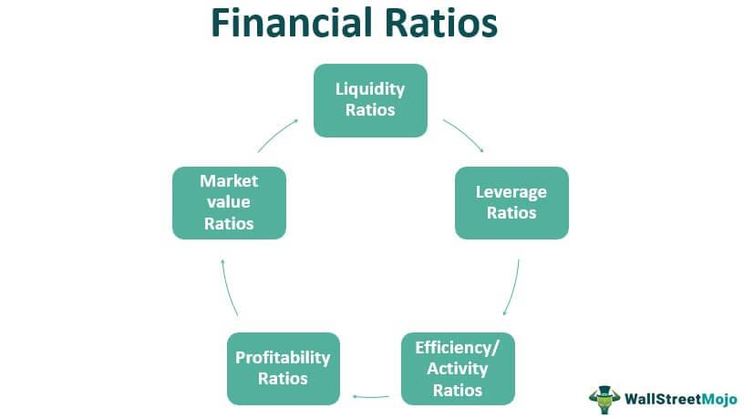

Investment banks hold a significant position in today's financial ecosystem, offering an array of services from managing mergers and acquisitions to underwriting initial public offerings. Their functions are essential for facilitating large-scale financial transactions and providing strategic advisory services. To effectively assess the performance of these institutions and anticipate market trends, financial experts leverage a mix of analytical techniques, prominently featuring financial ratios and algorithmic trading.

These tools enable a deeper understanding of an investment bank's operational efficiency and market positioning. Financial ratios, such as Return on Assets (ROA) and Return on Equity (ROE), provide quantitative measurements of profitability and asset utilization. Meanwhile, algorithmic trading uses software to automate trading strategies, employing large datasets to execute trades at speeds unimaginable through manual interventions.



This article aims to clarify the usage of these analytical tools within the context of investment banking, examining how they serve to optimize operations and support strategic decision-making processes. We will systematically explore the crucial financial ratios, their calculations, and implications on bank evaluations. Additionally, the article will address how algorithmic trading can enhance the competitive edge of investment banks, adapting to market demands efficiently and effectively.

## Table of Contents

## Investment Banks and Their Importance

Investment banks play a crucial role in the global financial system by acting as intermediaries in sizable and intricate financial transactions. Their primary functions include facilitating the raising of capital, providing expert advisory services in mergers and acquisitions (M&A), and managing assets for corporations and governments.

Raising capital is a fundamental service offered by investment banks. They employ various methods such as underwriting initial public offerings (IPOs), assisting in debt issuance, and structuring private placements. By facilitating access to public and private capital markets, investment banks enable companies to secure necessary funds to expand operations, invest in new projects, or restructure existing debts. These activities not only benefit the individual corporations but also contribute to the overall economic growth by promoting business expansion and innovation.

In addition to raising capital, investment banks provide critical advisory services for mergers and acquisitions. Their expertise in valuation, negotiation, and strategic planning helps companies identify suitable acquisition targets or potential buyers, assess the financial implications of deals, and navigate regulatory requirements. Through this advisory role, investment banks assist businesses in optimizing their strategic objectives and achieving synergistic gains, thereby enhancing corporate value.

Furthermore, asset management is another vital function of investment banks. They offer portfolio management services to a wide range of clients, including institutional investors, corporations, and high-net-worth individuals. By leveraging their expertise in financial markets and investment strategies, investment banks strive to maximize returns while managing risk, ensuring that their clients' investment goals are met efficiently.

Understanding the infrastructure and operations of investment banks is essential for evaluating their financial health and stability. This involves analyzing various aspects such as the bank's capital structure, risk management practices, and operational efficiency. A comprehensive evaluation helps stakeholders, including investors and regulators, make informed decisions regarding the bank's performance and future prospects.

In summary, investment banks are indispensable in facilitating capital movement, assisting corporate strategies, and managing assets effectively, which underscores their importance in maintaining a stable and robust financial ecosystem.

## Financial Ratios Used in Bank Analysis

Analyzing investment banks' performance requires the application of various financial ratios that provide valuable insights into their operational efficiency and financial health. These ratios help assess profitability, risk management, asset quality, and overall financial stability, enabling stakeholders to make informed decisions.

One of the essential ratios is Return on Assets (ROA), which measures how effectively a bank utilizes its assets to generate net income. Mathematically, ROA is calculated as:

$$
\text{ROA} = \frac{\text{Net Income}}{\text{Total Assets}}
$$

A higher ROA indicates efficient use of assets in [earning](/wiki/earning-announcement) revenue, which is a critical [factor](/wiki/factor-investing) for banks given their large asset bases.

Return on Equity (ROE) is another key metric, focusing on profitability relative to shareholders' equity. It provides insights into how well a bank uses investments from shareholders to generate earnings. The calculation of ROE is as follows:

$$
\text{ROE} = \frac{\text{Net Income}}{\text{Shareholders' Equity}}
$$

Investment banks seek a high ROE as it signifies robust financial performance and serves as an attractive signal for potential investors.

Debt to Total Capital ratio evaluates a bank's financial leverage and risk profile. It reflects the proportion of a bank's capital structure that is funded by debt versus equity, calculated as:

$$
\text{Debt to Total Capital} = \frac{\text{Total Debt}}{\text{Total Debt} + \text{Shareholders' Equity}}
$$

A lower ratio indicates lower financial risk, suggesting prudent management of borrowed funds.

The Price-to-Earnings (P/E) ratio offers a perspective on how the market values a bank's earnings relative to its share price. It is determined by:

$$
\text{P/E Ratio} = \frac{\text{Market Value per Share}}{\text{Earnings per Share}}
$$

This ratio helps investors assess whether a bank's stock is overvalued or undervalued, influencing investment decisions. Each of these ratios serves a distinct purpose, providing a multifaceted view of a bank's financial status. Employing these ratios in tandem allows for a comprehensive analysis, crucial for evaluating investment bank stability and potential growth.

## Understanding Key Financial Ratios

Return on Assets (ROA) is a critical financial ratio that evaluates how efficiently a bank utilizes its assets to generate profit. This ratio is calculated by dividing a bank's net income by its total assets, providing insights into the bank's operational efficiency. The formula for ROA is:

$$
\text{ROA} = \frac{\text{Net Income}}{\text{Total Assets}}
$$

A higher ROA value indicates more efficient asset use in generating earnings.

Return on Equity (ROE) measures a bank's profitability with respect to its shareholders' equity. It is a vital metric for potential investors, as it illustrates the return generated on their investments. The ROE formula is:

$$
\text{ROE} = \frac{\text{Net Income}}{\text{Shareholders' Equity}}
$$

This ratio aids investors in understanding how effectively their funds are being utilized to generate additional profits.

The Debt to Total Capital ratio signifies the extent of a bank’s financial leverage and risk. It assesses the proportion of a company's capital that comes from debt, helping to understand the financial structure and risk level. This ratio is given by:

$$
\text{Debt to Total Capital} = \frac{\text{Total Debt}}{\text{Total Debt + Shareholders' Equity}}
$$

A higher ratio may imply a riskier financial structure due to increased debt obligations.

The Price-to-Earnings (P/E) ratio is crucial for evaluating whether a stock is overvalued or undervalued compared to its earnings. This ratio represents the amount investors are willing to pay per dollar of earnings and is calculated as:

$$
\text{P/E Ratio} = \frac{\text{Market Value per Share}}{\text{Earnings per Share (EPS)}}
$$

A high P/E ratio might suggest that the stock is overvalued, or investors expect high future growth, while a low P/E may indicate undervaluation or weaker growth expectations.

Understanding these key financial ratios provides a comprehensive view of a bank’s efficiency, profitability, financial structure, and stock valuation, offering significant insights for investors and financial analysts.

## Algorithmic Trading in Investment Banks

Algorithmic trading employs sophisticated algorithms to automate and streamline trading operations, significantly enhancing the efficiency of trade execution. By analyzing vast datasets in real time, [algorithmic trading](/wiki/algorithmic-trading) systems can evaluate market conditions quickly and execute orders at speeds unachievable by human traders. This rapid processing capability ensures investment banks can respond to market fluctuations nearly instantaneously, granting them a competitive edge.

Investment banks harness algorithmic trading to optimize trading outcomes and manage risks effectively. These algorithms are designed to follow specific trading strategies, such as statistical [arbitrage](/wiki/arbitrage), market-making, or trend-following strategies. They analyze a multitude of data points, including price movements, trade volumes, and economic indicators, to identify profitable opportunities and execute trades automatically.

One of the key advantages of algorithmic trading is its ability to minimize transaction costs. By executing trades at optimal times and prices, algorithms reduce the impact of market [volatility](/wiki/volatility-trading-strategies) on trade outcomes. Additionally, algorithmic trading mitigates the risk of human error, which can be significant in high-stress trading environments.

Incorporating [machine learning](/wiki/machine-learning) techniques enhances the adaptability of algorithmic trading systems, allowing them to learn from historical data and improve decision-making over time. For instance, algorithms can be trained to recognize complex patterns in data that might be indicative of future price movements, thus enabling proactive trading strategies.

The reliance on algorithmic trading systems in investment banks also supports robust risk management practices. Algorithms can include risk assessment parameters that monitor real-time market developments, ensuring trades are executed within predefined risk thresholds. This automated oversight is crucial in volatile markets, where rapid changes can impact trading positions significantly.

To maintain competitiveness, investment banks continually update and refine their algorithmic trading systems. This ongoing optimization involves incorporating the latest advancements in data analytics and computation techniques, ensuring algorithms remain responsive to evolving market dynamics. Hence, while algorithmic trading provides substantial benefits, it also demands rigorous testing and constant refinement to ensure accuracy and efficiency in trading operations.

## Financial Ratios in Algorithmic Trading

Integrating financial ratios into trading algorithms can significantly enhance the precision and effectiveness of trading strategies employed by investment banks. Ratios such as Return on Equity (ROE) and debt metrics provide critical insights into a company's financial health and operational efficiency, which are essential for making informed trading decisions.

### Role of Financial Ratios in Algorithmic Trading

1. **Dynamic Decision-Making**: Financial ratios offer a snapshot of a company's financial position, enabling algorithms to make dynamic decisions. For instance, ROE, a measure of a company's profitability relative to its equity, helps algorithms assess whether a company is efficiently generating profits from shareholders' investments. High ROE values may indicate strong performance, prompting algorithms to adjust trading strategies in favor of such assets.

2. **Integration of Real-Time Data**: By incorporating financial ratios into trading algorithms, traders can access real-time data, facilitating timely responses to market changes. Consider the debt-to-equity ratio, which reflects a company's financial leverage. Algorithms can use this ratio to evaluate the risk level associated with a company’s financing structure and adjust trading actions accordingly.

3. **Predictive Analytics**: Analyzing financial ratios through algorithmic models allows traders to predict market trends and potential price movements. For example, a consistent increase in a company's P/E ratio might suggest overvaluation, prompting algorithms to trigger sell signals to capitalize on potential forthcoming declines in stock price.

### Implementation Example in Python

To illustrate, a Python-based algorithm might incorporate these ratios to drive trading actions. Below is a simplified example of how such an algorithm might evaluate ROE and debt metrics to determine trading decisions:

```python
def trading_decision(roe, debt_to_equity):
    # Threshold values for decision making
    roe_threshold = 15.0
    debt_threshold = 0.5

    if roe > roe_threshold and debt_to_equity < debt_threshold:
        return "Buy"
    elif roe < roe_threshold or debt_to_equity > debt_threshold:
        return "Sell"
    else:
        return "Hold"

# Example usage
roe = 16.5  # Example ROE value
debt_to_equity = 0.3  # Example debt-to-equity ratio

decision = trading_decision(roe, debt_to_equity)
print(f"Trading Decision: {decision}")
```

In this example, the algorithm evaluates whether to buy, sell, or hold a particular stock based on predefined thresholds for ROE and debt-to-equity ratios. By systematically integrating financial data, algorithms like this enable traders to fine-tune their strategies, responding swiftly to financial metrics.

### Strategic Adjustments and Outcomes

By utilizing financial ratios within algorithmic trading frameworks, traders can refine their strategies in response to shifting market conditions. Such integration ensures robust predictive capabilities and the flexibility to navigate volatile markets efficiently. This strategic alignment not only improves trading accuracy but also optimizes risk management processes, helping investment banks maintain a competitive edge.

## Challenges and Limitations

While financial ratios and algorithmic trading provide powerful tools for assessing investment banks and optimizing trading strategies, they present several significant challenges and limitations.

Financial ratios are inherently retrospective; they analyze past and current data to offer insights into a company’s performance and financial health. However, they do not inherently accommodate the volatility and unpredictability of future market conditions or economic shifts. For example, a high Return on Equity (ROE) might suggest effective management and profitability, but it offers no guarantees against potential downturns or disruptions that can adversely impact an institution's finances. Analysts must continuously integrate qualitative assessments and forward-looking indicators to bridge this gap, which can be inherently uncertain and subjective.

Algorithmic trading systems, which leverage financial ratios among other inputs, face challenges related to system robustness and adaptability. The financial markets are characterized by high speed and unpredictability, requiring algorithms to be both precise and highly adaptable. Developing these systems necessitates rigorous testing under varied simulated market conditions to ensure they can handle complex, real-world scenarios effectively. Moreover, these systems must be constantly updated to reflect new data, regulatory changes, and evolving market dynamics. Errors or outdated algorithms can lead to significant financial losses, emphasizing the need for extensive back-testing and validation processes.

Developers often use back-testing techniques in Python to evaluate algorithmic strategies. A simple back-testing framework might employ libraries like `pandas` and `numpy` to simulate past market conditions:

```python
import pandas as pd
import numpy as np

def backtest_strategy(strategy, data):
    data['signals'] = strategy(data)
    data['positions'] = data['signals'].diff()
    data['returns'] = data['price'].pct_change() * data['positions'].shift(1)
    cumulative_return = (1 + data['returns'].dropna()).prod() - 1
    return cumulative_return

def simple_moving_average_strategy(data, short_window=5, long_window=20):
    data['short_mavg'] = data['price'].rolling(window=short_window).mean()
    data['long_mavg'] = data['price'].rolling(window=long_window).mean()
    signals = np.where(data['short_mavg'] > data['long_mavg'], 1, 0)
    return signals
```

This code demonstrates the core principles of evaluating a basic moving average strategy, highlighting the necessity for constant strategy refinement and adaptation for real-world application. Analysts and traders must consider latency, transaction costs, and slippage—factors that can significantly affect the effectiveness of algorithmic systems in fast-paced markets.

In summary, while financial ratios and algorithmic trading significantly contribute to financial analysis and decision-making processes, their effectiveness depends on continuous refinement and the incorporation of broad, predictive insights alongside quantitative analysis.

## Conclusion

Investment banks hold a crucial position in the global financial landscape. Their performance assessment necessitates a sophisticated approach that fuses traditional financial ratio analysis with modern algorithmic trading methods. This dual strategy serves to enrich financial analysis and strategic planning by providing comprehensive insights into the banks' operational efficiency and market positioning.

Financial ratios, such as Return on Assets (ROA), Return on Equity (ROE), and the Price-to-Earnings (P/E) ratio, offer quantitative measures of a bank’s performance relative to its assets, equity, and earnings. When these metrics are integrated into algorithmic trading systems, the resulting synergy allows for dynamic data-driven decision-making processes. For instance, incorporating ROE into trading algorithms could enable the algorithms to assess profitability trends in real-time, adjusting trading strategies to optimize outcomes.

The continuous evolution of the financial sector underscores the necessity for ongoing improvement in analytical tools and methodologies. As banks face increasingly complex markets and regulatory environments, maintaining competitive and reliable operations becomes paramount. This requirement drives the advancement of combined analytical frameworks, ensuring they remain robust against emerging challenges and capable of delivering nuanced insights into financial activities.

To illustrate the integration of financial ratios into algorithmic processes, here's a simple Python example:

```python
def calculate_roe(net_income, shareholder_equity):
    return net_income / shareholder_equity

def trading_signal(roe, threshold=0.15):
    if roe > threshold:
        return "buy"
    elif roe < threshold:
        return "sell"
    else:
        return "hold"

# Example input
net_income = 500000
shareholder_equity = 3000000

roe = calculate_roe(net_income, shareholder_equity)
signal = trading_signal(roe)

print(f"ROE: {roe:.2f}, Trading Signal: {signal}")
```

In this code, a basic algorithm evaluates the Return on Equity to generate trading signals. Such a framework exemplifies how algorithmic methods can leverage financial ratios to support strategic decision-making. In conclusion, as the tools for financial analysis and algorithmic trading continue to advance, investment banks are better positioned to navigate the financial landscape with precision and foresight.

## References & Further Reading

[1]: Bodie, Z., Kane, A., & Marcus, A. J. (2013). ["Investments"](https://books.google.com/books/about/EBOOK_Investments_Global_edition.html?id=BMsvEAAAQBAJ). McGraw-Hill Education.

[2]: Fabozzi, F. J., & Peterson Drake, P. (2009). ["Finance: Capital Markets, Financial Management, and Investment Management"](https://books.google.com/books/about/Finance.html?id=mUBsAwAAQBAJ). Wiley.

[3]: ["Algorithmic Trading: Winning Strategies and Their Rationale"](https://www.amazon.com/Algorithmic-Trading-Winning-Strategies-Rationale-ebook/dp/B00CY5HC0U) by Ernie Chan

[4]: Ross, S. A., Westerfield, R., & Jordan, B. D. (2018). ["Fundamentals of Corporate Finance"](https://www.amazon.com/Fundamentals-Corporate-Modigliani-Professor-Financial/dp/0077861701). McGraw-Hill Education.

[5]: Hull, J. C. (2017). ["Options, Futures, and Other Derivatives"](https://www.semanticscholar.org/paper/Options%2C-Futures%2C-and-Other-Derivatives-Hull/89bdee500c8623864fc9eb7a471546aa713acc44). Pearson.