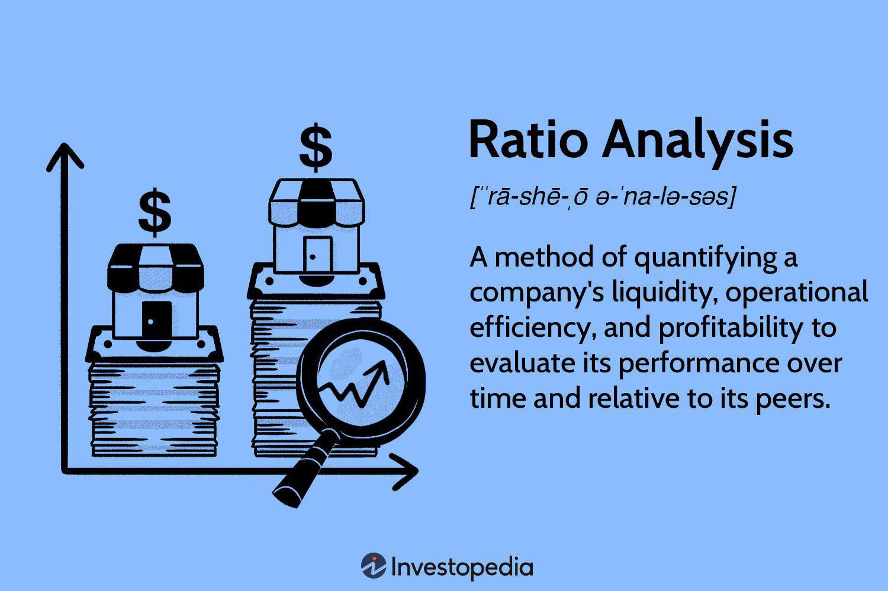

The retail industry is a vital and complex component of the global economy, influencing consumer trends and economic development worldwide. This sector encompasses a wide array of businesses, from small local shops to large multinational corporations, each playing a role in the distribution of goods and services to consumers.

Understanding financial ratios and the growing influence of algorithmic trading has become essential for stakeholders within the retail sector. Financial ratios offer critical insights into a retail company's performance by assessing various aspects such as liquidity, profitability, and efficiency. These metrics are crucial for stakeholders who need to evaluate a company's health and make informed investment decisions. Key financial ratios include the Current Ratio and Quick Ratio, which assess liquidity; the Gross Profit Margin, Inventory Turnover, and Return on Assets (ROA) for profitability and operational efficiency. Such metrics provide a comprehensive view of a company's financial status and potential for growth or risk.



Simultaneously, algorithmic trading—or algo trading—has emerged as a transformative force within the retail sector. By automating transactions, algo trading enhances market efficiency, reduces transaction costs, and improves liquidity. These systems operate using pre-programmed instructions based on market data, allowing them to execute trades with unmatched precision and speed, even in volatile conditions. The integration of algorithmic trading provides retail companies with advanced tools for market analysis and strategic decision-making, fostering better market operations.

In summary, the interplay of financial ratios and algorithmic trading is reshaping the landscape of retail finance. By leveraging these tools, investors and retail firms can gain a competitive edge, ensuring financial stability and adaptability in a continuously evolving market. As the retail sector progresses, staying informed about these financial practices is crucial for sustained success and navigating changes in consumer behavior and economic conditions.

## Table of Contents

## Key Financial Ratios in Retail Finance

Financial ratios are indispensable for evaluating a retail company's financial health and operational effectiveness. They offer a snapshot of various aspects of the business, enabling investors and stakeholders to gauge the company's performance, stability, and potential for growth.

The Current Ratio and Quick Ratio serve as crucial indicators of a retail company's liquidity, measuring its ability to meet short-term obligations. The Current Ratio is calculated as:

$$
\text{Current Ratio} = \frac{\text{Current Assets}}{\text{Current Liabilities}}
$$

The Quick Ratio, often referred to as the acid-test ratio, provides a more stringent measure by excluding inventory from current assets, calculated as:

$$
\text{Quick Ratio} = \frac{\text{Current Assets} - \text{Inventory}}{\text{Current Liabilities}}
$$

These ratios offer insights into the company's short-term financial health, with higher values indicating better [liquidity](/wiki/liquidity-risk-premium).

Profitability and operational efficiency are reflected in ratios like Gross Profit Margin, Inventory Turnover, and Return on Assets (ROA). Gross Profit Margin is derived from:

$$
\text{Gross Profit Margin} = \frac{\text{Revenue} - \text{Cost of Goods Sold}}{\text{Revenue}} \times 100
$$

This ratio highlights the proportion of money left over from revenues after accounting for the cost of goods sold, serving as a key indicator of a company's manufacturing efficiency and pricing strategy.

Inventory Turnover assesses how efficiently a company manages its inventory, calculated by:

$$
\text{Inventory Turnover} = \frac{\text{Cost of Goods Sold}}{\text{Average Inventory}}
$$

A higher turnover indicates efficient inventory management, minimizing holding costs and reducing the risk of obsolescence.

Return on Assets (ROA) measures how effectively a company uses its assets to generate profit:

$$
\text{ROA} = \frac{\text{Net Income}}{\text{Total Assets}}
$$

Higher ROA values signify better asset utilization, crucial for analyzing a retail company’s operational success.

The Interest Coverage Ratio and EBIT Margin are vital for assessing financial stability. The Interest Coverage Ratio, calculated as:

$$
\text{Interest Coverage Ratio} = \frac{\text{Earnings Before Interest and Taxes (EBIT)}}{\text{Interest Expense}}
$$

determines a company's ability to cover interest obligations, a key factor for financial resilience.

EBIT Margin, expressed as:

$$
\text{EBIT Margin} = \frac{\text{EBIT}}{\text{Revenue}} \times 100
$$

assesses the efficiency of profit generation before the deduction of interest and taxes. A higher EBIT Margin indicates effective control over operating expenses relative to revenue.

Investors frequently rely on these ratios to make well-informed decisions when considering investments in retail companies. By understanding these financial metrics, stakeholders can better evaluate a company’s performance, financial health, and potential growth trajectory.

## Algorithmic Trading and its Impact on Retail

Algorithmic trading, commonly referred to as algo trading, has significantly influenced the retail sector by automating transactions and enhancing market efficiency. This method leverages advanced algorithms and financial analytical techniques to streamline the trading process, thus improving liquidity and reducing transaction costs for retail companies.

At its core, algo trading involves executing trades based on a set of pre-programmed instructions that rely on various market data points, including historical data, real-time news, and financial ratios. These instructions enable rapid and accurate execution of trades, which is particularly advantageous in highly volatile markets where the speed of execution can determine profitability. For instance, a common approach uses moving averages as trading signals, where an algorithm might execute a buy order when a short-term moving average crosses above a long-term moving average, signaling an upward trend.

A practical implementation of an algorithm might look like this in Python:

```python
import pandas as pd
import numpy as np

# Sample DataFrame with stock prices
data = pd.DataFrame({'Price': [100, 102, 104, 101, 105, 107, 110]})
data['Short_MA'] = data['Price'].rolling(window=2).mean()
data['Long_MA'] = data['Price'].rolling(window=4).mean()

# Generate Buy/Sell signals
data['Signal'] = np.where(data['Short_MA'] > data['Long_MA'], 'Buy', 'Sell')

print(data)
```

This algorithm evaluates market data to direct trading activities efficiently. Retail companies harness the precision of algo trading to manage the rapid fluctuations in price that might occur in dynamic markets. By acting on precise triggers, these systems are designed to capitalize on market opportunities that might be missed in manual trading scenarios.

Despite its advantages, the adoption of [algorithmic trading](/wiki/algorithmic-trading) is not without challenges. The systems' technical complexity requires significant expertise, and ongoing regulatory changes demand that companies continuously adapt to ensure compliance. Furthermore, the sheer speed and [volume](/wiki/volume-trading-strategy) of trades executed by algo systems can exacerbate market [volatility](/wiki/volatility-trading-strategies), though they are also credited with contributing to market liquidity.

Overall, while algorithmic trading presents certain complexities, it nevertheless signifies a profound evolution in retail finance. Retail businesses can utilize these methods to maintain a competitive edge, benefiting from the enhanced efficiency and reduced transaction costs attributed to algo trading. In conclusion, as retail finance progresses, embracing algorithmic trading's potential can be pivotal for enhancing both market operations and stakeholder decision-making.

## Case Studies and Practical Applications

Real-world examples vividly demonstrate how the strategic use of key financial ratios and algorithmic trading can substantially impact retail market dynamics. A pivotal tool in the financial arsenal of both retail giants and smaller enterprises is the Price-to-Earnings (P/E) ratio. This ratio, calculated as $\text{P/E Ratio} = \frac{\text{Market Value per Share}}{\text{Earnings per Share}}$, serves as a cornerstone for guiding market valuations and investment strategies by providing insights into growth potential and investor sentiment.

For instance, prominent retail companies such as Walmart and Target utilize the P/E ratio to assess their valuation against industry benchmarks. Smaller retailers also leverage this ratio to attract investors by presenting a financially sound outlook compared to their larger counterparts.

The effective application of financial ratios like Gross Profit Margin and Inventory Turnover is evident in companies that have successfully optimized operations. For example, Costco's focus on maintaining a high Inventory Turnover – a metric calculated as $\text{Inventory Turnover} = \frac{\text{Cost of Goods Sold}}{\text{Average Inventory}}$ – has enhanced its operational efficiency, ensuring swift inventory movement and reduced holding costs. Such strategic use of financial ratios not only boosts operational efficiency but also translates to improved financial performance, creating favorable conditions for investment and growth.

Algorithmic trading (algo trading) has revolutionized how retail companies engage with and react to market fluctuations. Technological advancements in this domain have allowed firms to execute trades with unprecedented accuracy and speed, particularly during short-term market fluctuations. For example, algo trading frameworks enable companies like Amazon to monitor market trends in real time, executing trade decisions rapidly when predetermined conditions are met. This method, powered by pre-programmed instructions, significantly improves transaction speed and liquidity while reducing costs.

A practical example illustrating the power of algo trading is employed by major investment firms that manage retail and consumer-focused portfolios. By implementing algorithmic systems, firms can analyze massive data sets to identify short-term trading opportunities, leveraging tools such as the Moving Average Convergence Divergence (MACD) indicator to forecast price trends and adjust investment positions dynamically.

These practical applications offer profound insights for investors and businesses eager to refine their strategies within the retail sector. By harnessing the power of these financial tools, entities can enhance their decision-making capabilities, gaining a competitive edge in a fast-evolving market landscape. As these strategies continue to evolve, staying informed on best practices in financial ratios and algo trading remains crucial for optimizing retail portfolios and achieving sustainable success.

## Conclusion

Financial ratios and algorithmic trading are pivotal in redefining the landscape of retail finance. The strategic implementation of these tools provides a significant competitive advantage to both investors and retail entities. Key financial ratios, such as the Current Ratio, Quick Ratio, and Gross Profit Margin, offer essential insights into a company's liquidity and profitability. These metrics enable businesses to evaluate their financial health and make informed strategic decisions. For instance, a company with a high Current Ratio is more likely able to cover its short-term obligations, reflecting good liquidity conditions.

Algorithmic trading further enhances retail finance by automating transactions, which not only improves market liquidity but also minimizes transaction costs. The algorithms typically employ pre-defined parameters based on real-time market data to execute trades swiftly and accurately. This can be illustrated with Python code that reads market data and makes trading decisions based on the gross profit margin:

```python
def trade_decision(gross_profit_margin, threshold=30):
    # Assuming 'market_order' and 'fetch_market_data' are predefined functions
    market_data = fetch_market_data()
    if gross_profit_margin > threshold:
        market_order('buy', market_data)
    else:
        market_order('sell', market_data)
```

Staying informed about these financial practices is critical. The retail sector is constantly evolving due to shifts in consumer behavior and economic conditions. Understanding and adapting to these changes is essential for achieving financial stability and success. Algorithmic trading, despite its challenges such as technical complexity and regulatory hurdles, offers a way to navigate volatile markets with precision.

In conclusion, as the future of retail finance continues to be shaped by technological advancements and market dynamics, mastering financial ratios and algorithmic trading remains crucial. Companies and investors who leverage these financial tools effectively are better equipped to capitalize on opportunities and mitigate risks. This approach ensures not just survival but thriving in an ever-changing economic landscape.

## References & Further Reading

[1]: ["Ratio Analysis Fundamentals: How 17 Financial Ratios Can Allow You to Analyse Any Business on the Planet"](https://www.amazon.com/Ratio-Analysis-Fundamentals-Financial-Business/dp/1494922630) by Axel Tracy

[2]: Penman, S.H. (2013). ["Financial Statement Analysis and Security Valuation"](https://archive.org/details/financialstateme0000penm_m9z7_5thed) McGraw-Hill/Irwin.

[3]: ["Algorithmic Trading and DMA: An Introduction to Direct Access Trading Strategies"](https://www.amazon.com/Algorithmic-Trading-DMA-introduction-strategies/dp/0956399207) by Barry Johnson

[4]: Sharpe, W.F., Alexander, G.J., & Bailey, J.V. (1999). ["Investments"](https://archive.org/details/investments0000shar) Prentice Hall. 

[5]: ["High-Frequency Trading: A Practical Guide to Algorithmic Strategies and Trading Systems"](https://www.amazon.com/High-Frequency-Trading-Practical-Algorithmic-Strategies/dp/1118343506) by Irene Aldridge