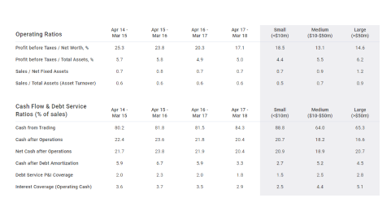

## Table of Contents

## What are financial ratios and why are they important in the retail industry?

Financial ratios are numbers that help you understand how a business is doing by comparing different parts of its financial information. They can show if a company is making money, how much debt it has, and how well it is using its resources. In the retail industry, these ratios are really important because they help store owners and managers see how their business is doing compared to others in the same field.

In the retail industry, financial ratios are used a lot to check things like how quickly products are selling, how much profit is being made on each sale, and how well the company is managing its money. For example, the inventory turnover ratio can tell a store owner if they are selling products fast enough or if they need to change their stock. Knowing these things helps retail businesses make better decisions about what to sell, how to price their products, and how to grow their business in a smart way.

## How do beginners calculate the Current Ratio for a retail business?

The Current Ratio is a simple way to see if a retail business can pay its short-term bills. To calculate it, you need two numbers from the company's balance sheet: the total current assets and the total current liabilities. Current assets are things like cash, money customers owe you (accounts receivable), and products you have in stock (inventory). Current liabilities are bills you need to pay soon, like money you owe to suppliers or short-term loans. To find the Current Ratio, you divide the total current assets by the total current liabilities. If the number you get is more than 1, it means the business has more assets than liabilities, which is good.

For example, let's say a retail store has $50,000 in current assets and $30,000 in current liabilities. To find the Current Ratio, you would divide $50,000 by $30,000. That gives you a Current Ratio of about 1.67. This means the store has $1.67 in assets for every $1 in liabilities, which suggests the business is in a good position to pay its short-term bills. By keeping an eye on this ratio, store owners can make sure they always have enough money to cover their costs and keep the business running smoothly.

## What does the Inventory Turnover Ratio indicate about a retail company's performance?

The Inventory Turnover Ratio shows how often a retail company sells and replaces its stock over a certain time, usually a year. It tells you how well the company is managing its products. A higher ratio means the company is selling its products quickly, which is good because it means they are not holding onto stock for too long. If the ratio is low, it might mean the company is having trouble selling its products, and they might be stuck with a lot of unsold items.

This ratio is important for retail businesses because it helps them understand if they are buying the right amount of products. If the ratio is too high, it might mean they are not buying enough stock to meet customer demand. If it's too low, they might be buying too much, which can lead to wasted money on storage and possibly having to sell products at a discount to get rid of them. By keeping an eye on the Inventory Turnover Ratio, retail companies can make better decisions about what to buy and how much to keep in stock, helping them run their business more efficiently.

## Can you explain the Gross Margin Ratio and its significance for retail businesses?

The Gross Margin Ratio tells you how much money a retail business makes after it pays for the products it sells. You find it by taking the total sales money and subtracting the cost of the products sold. Then, you divide that number by the total sales money and turn it into a percentage. A higher Gross Margin Ratio means the business keeps more money from each sale, which is good because it shows they can cover other costs like rent and employee salaries.

For retail businesses, knowing the Gross Margin Ratio is really important. It helps them see if they are pricing their products right and if they are buying products at a good price. If the ratio is low, it might mean they need to find cheaper suppliers or maybe raise their prices. If it's high, they might be doing well, but they should also check if their prices are too high and scaring customers away. By keeping an eye on this ratio, retail businesses can make smart choices to keep their profits healthy.

## How does the Debt-to-Equity Ratio help in assessing the financial health of a retail firm?

The Debt-to-Equity Ratio is a way to see how much a retail firm is relying on borrowed money compared to the money put in by its owners. You find this ratio by dividing the total debts of the company by the total equity, which is the value of the business that belongs to the owners. A high Debt-to-Equity Ratio means the company has a lot of debt compared to what the owners have put in, which can be risky. If the ratio is low, it shows the company is not relying too much on borrowed money, which is usually safer.

For retail businesses, this ratio is important because it helps them understand if they are using too much debt to grow or run their operations. If a retail firm has a high Debt-to-Equity Ratio, it might struggle to pay back its loans, especially if sales drop. On the other hand, a low ratio means the business is less risky because it has more of its own money to fall back on. By keeping an eye on this ratio, retail firms can make sure they are not taking on too much debt and can plan better for the future.

## What is the Return on Assets (ROA) and how is it applied in the retail sector?

The Return on Assets (ROA) tells you how good a retail business is at making money from the things it owns, like stores, inventory, and equipment. You find the ROA by taking the company's net income, which is the money left after all costs are paid, and dividing it by the total assets. The answer is usually turned into a percentage. A higher ROA means the business is using its assets well to make profits.

In the retail sector, ROA is really useful because it helps store owners see if they are making enough money from their stores and products. If the ROA is low, it might mean the business needs to sell more, cut costs, or maybe even close some stores that aren't doing well. A high ROA shows the business is doing a good job at turning its assets into profits, which is great for growth and keeping investors happy. By watching the ROA, retail businesses can make smarter choices about where to put their money and how to run their operations better.

## How can the Net Profit Margin be used to compare different retail companies?

The Net Profit Margin shows how much money a retail company keeps as profit after paying all its costs. It's found by taking the net income and dividing it by the total sales, then turning it into a percentage. When comparing different retail companies, the Net Profit Margin can tell you which one is better at turning sales into profit. If one company has a higher Net Profit Margin than another, it means they are doing a better job at managing costs and making money from their sales.

For example, if Retail Company A has a Net Profit Margin of 10% and Retail Company B has a Net Profit Margin of 5%, it means Company A keeps $10 out of every $100 in sales as profit, while Company B only keeps $5. This difference can help investors and managers see which company is more efficient and profitable. By looking at the Net Profit Margin, people can make better decisions about where to invest their money or which retail businesses are doing well compared to others.

## What insights can the Operating Margin provide for retail industry analysts?

The Operating Margin tells retail industry analysts how much profit a store makes from its main business activities, like selling products, after paying for things like employee salaries and rent. It is found by taking the operating income and dividing it by the total sales, then turning it into a percentage. A higher Operating Margin means the store is good at keeping costs down and making money from what it sells. Analysts use this number to see how well a retail business is doing compared to others in the same field.

By looking at the Operating Margin, analysts can spot trends and see if a retail company is getting better or worse at managing its costs. For example, if a store's Operating Margin goes up over time, it might mean they found a way to sell more or spend less. If it goes down, it could be a sign that costs are going up or sales are dropping. This information helps analysts make predictions about the future of the company and give advice on how to improve.

## How do advanced analysts use the Quick Ratio to evaluate liquidity in retail businesses?

Advanced analysts use the Quick Ratio to check how well a retail business can pay its short-term bills without relying on selling its inventory. The Quick Ratio, also called the acid-test ratio, is calculated by taking the total current assets, but not counting inventory, and dividing it by the total current liabilities. This gives analysts a quick snapshot of the company's liquidity, showing if it has enough cash and other liquid assets to cover its immediate debts. A Quick Ratio higher than 1 means the business should be able to pay its bills without selling any inventory, which is a good sign of financial health.

In the retail sector, where inventory turnover is crucial, the Quick Ratio is especially useful for analysts because it focuses on the most liquid assets. If a retail business has a low Quick Ratio, it might mean they are relying too much on selling inventory to pay bills, which can be risky if sales slow down. By comparing the Quick Ratio over time or against other retail companies, analysts can spot trends and make better judgments about the company's ability to handle short-term financial challenges. This helps them give more accurate advice on managing cash flow and planning for the future.

## Can you discuss the importance of the Sales to Working Capital Ratio in retail?

The Sales to Working Capital Ratio tells you how well a retail business is using its working capital to make sales. Working capital is the money a business has to run day-to-day operations, like paying for inventory and keeping the lights on. This ratio is found by dividing the total sales by the working capital. A higher ratio means the business is doing a good job at turning its working capital into sales, which is important because it shows the business is using its money efficiently.

For retail businesses, this ratio is really useful because it helps them see if they are managing their cash and inventory well. If the ratio is low, it might mean the business is holding onto too much cash or inventory that isn't selling, which can tie up money that could be used for other things. By keeping an eye on this ratio, retail owners can make better decisions about how much stock to keep and how to use their money to grow their business in a smart way.

## What are some industry-specific ratios unique to the retail sector and how are they calculated?

In the retail sector, one important industry-specific ratio is the Same-Store Sales Growth, which shows how well existing stores are doing without counting new stores. You find it by looking at the sales from stores that were open for the whole time you're measuring, usually a year, and comparing them to the sales from the same stores in the previous year. A positive number means the stores are doing better, which is a good sign that the business is growing. This ratio helps retail businesses see if their strategies are working and if customers keep coming back to their stores.

Another key ratio for retail is the Shrinkage Rate, which tells you how much inventory is lost due to things like theft, damage, or mistakes. You calculate it by taking the value of the lost inventory and dividing it by the total sales, then turning it into a percentage. A lower Shrinkage Rate means the business is doing a good job at keeping track of its products and preventing losses. By keeping an eye on this ratio, retail businesses can find ways to protect their stock and make sure they're not losing money on things they can't sell.

The third unique ratio is the Sell-Through Rate, which shows how quickly products are selling compared to how much stock the store has. You find it by dividing the number of items sold by the number of items received in stock over a certain time, like a season, and turning it into a percentage. A higher Sell-Through Rate means the products are popular and moving fast, which is great for making room for new stock and keeping the business profitable. Retail businesses use this ratio to decide which products to keep and which ones to stop buying.

## How can expert financial analysts use a combination of multiple ratios to forecast the future performance of retail companies?

Expert financial analysts can use a mix of different ratios to get a full picture of how a retail company might do in the future. By looking at ratios like the Gross Margin Ratio, Operating Margin, and Net Profit Margin together, analysts can see how well the company is making money from its sales and managing its costs. For example, if the Gross Margin Ratio is going up but the Net Profit Margin is going down, it might mean the company's costs are rising faster than its sales. By comparing these trends over time, analysts can predict if the company will be able to keep making profits or if it needs to change how it does business.

Another important part of forecasting is looking at ratios that show how the company uses its money, like the Inventory Turnover Ratio and the Sales to Working Capital Ratio. If the Inventory Turnover Ratio is high, it means the company is selling its products quickly, which is good for making room for new stock and keeping cash flowing. If the Sales to Working Capital Ratio is also high, it shows the company is using its money well to make sales. By combining these insights with other ratios like the Quick Ratio, which shows how well the company can pay its short-term bills, analysts can guess if the company will have enough cash to keep growing or if it might run into money problems. This helps them make better predictions and give smart advice to the company.

## What are the key financial ratios in retail finance?

Financial ratios are indispensable for evaluating a retail company's financial health and operational effectiveness. They offer a snapshot of various aspects of the business, enabling investors and stakeholders to gauge the company's performance, stability, and potential for growth.

The Current Ratio and Quick Ratio serve as crucial indicators of a retail company's liquidity, measuring its ability to meet short-term obligations. The Current Ratio is calculated as:

$$
\text{Current Ratio} = \frac{\text{Current Assets}}{\text{Current Liabilities}}
$$

The Quick Ratio, often referred to as the acid-test ratio, provides a more stringent measure by excluding inventory from current assets, calculated as:

$$
\text{Quick Ratio} = \frac{\text{Current Assets} - \text{Inventory}}{\text{Current Liabilities}}
$$

These ratios offer insights into the company's short-term financial health, with higher values indicating better [liquidity](/wiki/liquidity-risk-premium).

Profitability and operational efficiency are reflected in ratios like Gross Profit Margin, Inventory Turnover, and Return on Assets (ROA). Gross Profit Margin is derived from:

$$
\text{Gross Profit Margin} = \frac{\text{Revenue} - \text{Cost of Goods Sold}}{\text{Revenue}} \times 100
$$

This ratio highlights the proportion of money left over from revenues after accounting for the cost of goods sold, serving as a key indicator of a company's manufacturing efficiency and pricing strategy.

Inventory Turnover assesses how efficiently a company manages its inventory, calculated by:

$$
\text{Inventory Turnover} = \frac{\text{Cost of Goods Sold}}{\text{Average Inventory}}
$$

A higher turnover indicates efficient inventory management, minimizing holding costs and reducing the risk of obsolescence.

Return on Assets (ROA) measures how effectively a company uses its assets to generate profit:

$$
\text{ROA} = \frac{\text{Net Income}}{\text{Total Assets}}
$$

Higher ROA values signify better asset utilization, crucial for analyzing a retail company’s operational success.

The Interest Coverage Ratio and EBIT Margin are vital for assessing financial stability. The Interest Coverage Ratio, calculated as:

$$
\text{Interest Coverage Ratio} = \frac{\text{Earnings Before Interest and Taxes (EBIT)}}{\text{Interest Expense}}
$$

determines a company's ability to cover interest obligations, a key factor for financial resilience.

EBIT Margin, expressed as:

$$
\text{EBIT Margin} = \frac{\text{EBIT}}{\text{Revenue}} \times 100
$$

assesses the efficiency of profit generation before the deduction of interest and taxes. A higher EBIT Margin indicates effective control over operating expenses relative to revenue.

Investors frequently rely on these ratios to make well-informed decisions when considering investments in retail companies. By understanding these financial metrics, stakeholders can better evaluate a company’s performance, financial health, and potential growth trajectory.

## References & Further Reading

[1]: ["Ratio Analysis Fundamentals: How 17 Financial Ratios Can Allow You to Analyse Any Business on the Planet"](https://www.amazon.com/Ratio-Analysis-Fundamentals-Financial-Business/dp/1494922630) by Axel Tracy

[2]: Penman, S.H. (2013). ["Financial Statement Analysis and Security Valuation"](https://archive.org/details/financialstateme0000penm_m9z7_5thed) McGraw-Hill/Irwin.

[3]: ["Algorithmic Trading and DMA: An Introduction to Direct Access Trading Strategies"](https://www.amazon.com/Algorithmic-Trading-DMA-introduction-strategies/dp/0956399207) by Barry Johnson

[4]: Sharpe, W.F., Alexander, G.J., & Bailey, J.V. (1999). ["Investments"](https://archive.org/details/investments0000shar) Prentice Hall. 

[5]: ["High-Frequency Trading: A Practical Guide to Algorithmic Strategies and Trading Systems"](https://www.amazon.com/High-Frequency-Trading-Practical-Algorithmic-Strategies/dp/1118343506) by Irene Aldridge