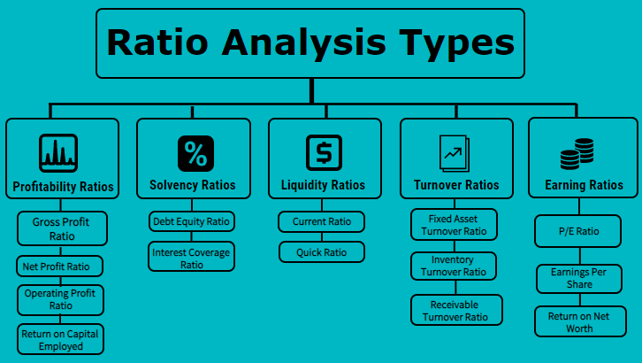

Investment analysis is a systematic approach used to assess the viability, stability, and profitability of an investment, typically using tools and techniques from both qualitative and quantitative schools of thought. It plays a crucial role in financial markets by guiding investors to make informed decisions, ultimately aiming to optimize returns while managing risk. In the context of healthcare stocks, investment analysis becomes particularly valuable due to the sector's unique characteristics, such as regulatory scrutiny, technological advancements, and demographic-driven demand.

Financial ratios serve as vital indicators when evaluating the financial health and performance of companies in the healthcare sector. These ratios, such as Profit Margin, Return on Equity (ROE), Debt-to-Equity Ratio, and Price-to-Earnings (P/E) Ratio, provide insights into a company’s operational efficiency, profitability, financial leverage, and market valuation. For instance, the Profit Margin ratio highlights a company's ability to convert sales into net income, while ROE measures how effectively management is using shareholders' equity to generate profits. By analyzing these metrics, investors can gauge the relative investment potential of different healthcare stocks, aiding strategic decision-making.



Algorithmic trading has grown substantially in modern stock markets, largely due to its capability for high-speed trading and data processing. By leveraging algorithms, traders can quickly execute trades based on predefined criteria, often capturing financial opportunities invisible to the naked eye in real-time. The integration of algorithmic trading is particularly beneficial in handling the vast datasets characteristic of financial markets, enabling greater efficiency and precision in executing trade strategies. However, it also accompanies challenges such as market volatility and technical failures, necessitating robust systems and risk management practices.

The central purpose of this article is to explore the synergy between financial ratios and algorithmic trading to optimize investment strategies specifically in healthcare stocks. By combining the traditional strengths of financial analysis with the computational prowess of algorithmic systems, investors can potentially unlock more accurate and efficient avenues for portfolio enhancement.

The article is structured as follows: It begins with a deeper exploration of investment analysis methods, followed by a detailed examination of key financial ratios pertinent to healthcare stocks. Subsequently, it investigates the role and implications of algorithmic trading, before discussing how these elements can be synergistically combined for investment improvements. It also outlines the challenges and considerations inherent in this process, with a concluding summary that reinforces the article’s insights and encourages investors to adopt a balanced approach.

## Table of Contents

## Understanding Investment Analysis

Investment analysis is an essential process in stock market investing that involves evaluating financial securities to determine their potential for profit and risk. This practice is critical for investors seeking to make informed decisions about where to allocate their capital. It serves as a guiding framework for assessing the intrinsic value of stocks and predicting their future performance based on a variety of methods.

### Methods of Investment Analysis

Investment analysis encompasses a range of approaches, primarily divided into two main categories: qualitative and quantitative analysis.

**Qualitative Analysis** focuses on non-numeric factors that can influence a company's performance and stock value. This approach examines aspects such as company management, brand strength, industry conditions, competitive positioning, and potential growth opportunities. Qualitative analysis helps investors understand the intangible elements that affect a company's long-term success.

**Quantitative Analysis**, on the other hand, relies on numerical data and mathematical models to evaluate a company's financial health and performance metrics. This method often involves the use of financial statements, ratios, and statistical techniques to assess variables such as earnings growth, profitability, and cash flow. Quantitative analysis provides a data-driven basis for investment decisions and is often perceived as more objective due to its reliance on verifiable figures.

### The Importance of Ongoing Analysis

In the ever-changing landscape of financial markets, ongoing investment analysis is vital. Volatile markets are characterized by rapid and unpredictable price movements, resulting from factors such as economic news, geopolitical events, and changes in government policy. Consequently, a one-time analysis may quickly become outdated. Regular monitoring and re-evaluation of investment positions allow investors to adapt to market conditions and make necessary adjustments to their portfolios in response to new information.

To remain competitive, investors must continuously incorporate fresh data and insights into their decision-making processes. This iterative approach not only mitigates risks associated with market [volatility](/wiki/volatility-trading-strategies) but also capitalizes on emerging opportunities. Using tools like [algorithmic trading](/wiki/algorithmic-trading) further enhances the ability to perform ongoing analysis by automating data collection and processing, facilitating quicker responses to changing market dynamics.

## Key Financial Ratios for Analyzing Healthcare Stocks

Financial ratios stand as fundamental tools in the assessment of a company’s fiscal health and performance, serving as pivotal indicators for investors looking to evaluate healthcare stocks. These ratios distill vast amounts of financial data into concise metrics, enabling informed decision-making regarding investment potential and company stability.

### Profit Margin

Profit margin gauges a company’s ability to convert sales into profit, reflecting operational efficiency. It is computed as follows:

$$
\text{Profit Margin} = \left( \frac{\text{Net Income}}{\text{Revenue}} \right) \times 100
$$

A higher profit margin indicates a more efficient company, capable of managing its costs effectively, thus being more resilient in facing operational challenges common in the healthcare sector. In healthcare, where costs can fluctuate due to regulatory changes and innovation demands, maintaining a robust profit margin is crucial for sustainable growth.

### Return on Equity (ROE)

Return on Equity measures a firm's profitability by revealing how much profit a company generates with the money shareholders have invested. It is expressed as:

$$
\text{ROE} = \left( \frac{\text{Net Income}}{\text{Shareholder's Equity}} \right) \times 100
$$

For healthcare companies, a high ROE signifies efficient use of equity capital, which is essential in an industry characterized by high levels of regulation and significant R&D expenses. Investors can gauge how well a company uses funds to generate growth and anticipate future performance based on these dynamics.

### Debt-to-Equity Ratio

The Debt-to-Equity Ratio reflects a company's financial leverage and is calculated as:

$$
\text{Debt-to-Equity Ratio} = \frac{\text{Total Liabilities}}{\text{Shareholder's Equity}}
$$

This ratio is particularly vital for assessing the risk profile of healthcare companies, which often grapple with debt due to substantial capital expenditures in technology, facilities, and compliance. A lower ratio suggests a company has less debt compared to its equity, which could signify a safer investment, whereas a higher ratio might indicate higher financial risk but potentially greater returns.

### Price-to-Earnings (P/E) Ratio

The P/E ratio is a measure of market valuation relative to earnings, calculated as:

$$
\text{P/E Ratio} = \frac{\text{Market Price per Share}}{\text{Earnings per Share (EPS)}}
$$

This ratio offers insights into market expectations about a company's future growth prospects. For healthcare firms, a high P/E ratio could suggest that investors expect high growth due to factors such as innovation pipelines or demographic trends favoring increased demand for healthcare services. Conversely, a low P/E might indicate undervaluation or potential challenges.

### Relevance of Financial Ratios in Evaluating Healthcare Stocks

In analyzing healthcare stocks, each of these financial ratios provides a different lens through which to assess the financial stability and potential of companies within this complex and rapidly evolving industry. Profit margins help in evaluating operational efficiency, ROE indicates effective capital use, the Debt-to-Equity Ratio assesses financial risk, and the P/E Ratio provides insight into growth expectations. Together, these ratios offer a comprehensive framework for evaluating healthcare stocks, essential for investors aiming to construct a balanced and well-informed investment portfolio.

## The Role of Algorithmic Trading

Algorithmic trading, commonly referred to as algo trading, involves utilizing computer algorithms to execute trading orders in financial markets. These algorithms follow a predefined set of instructions—such as timing, price, and quantity—to determine optimal trading opportunities. The application of algorithmic trading has revolutionized modern financial markets by significantly enhancing the speed and efficiency of trade execution.

One of the primary benefits of algorithmic trading is speed. Computers can react to market conditions and execute trades much faster than a human, often completing thousands of transactions in fractions of a second. This rapid execution allows traders to capitalize on minute price discrepancies and market trends, which are crucial in high-frequency trading environments.

Efficiency is another significant advantage of algo trading. By automating the trading process, algorithms reduce the need for manual intervention, thereby minimizing human error and increasing the precision of transactions. Moreover, algorithms can be programmed to monitor vast amounts of market data and identify complex patterns, something that would be infeasible for human traders working manually.

The capacity to handle large datasets is also a pivotal benefit of algorithmic trading. Advanced algorithms can process and analyze substantial amounts of historical and real-time market data. This capability allows for more informed decision-making, as the algorithms can consider a wide array of variables and conditions. For instance, [machine learning](/wiki/machine-learning) models can be trained on historical data to predict future price movements, thereby enhancing the algorithm's decision-making prowess.

Despite these benefits, algorithmic trading comes with its own set of challenges and risks. One major concern is market volatility, which can be exacerbated by high-speed trading. Algorithms that lack robust programmatic safeguards might react to market fluctuations in ways that intensify market instability, leading to events like the "flash crash" of 2010, where rapid sell-offs caused temporary [liquidity](/wiki/liquidity-risk-premium) shortages.

Technical failures represent another risk associated with algo trading. Algorithms are dependent on the underlying technology infrastructure, and any failures in hardware or software can result in incorrect trade executions or complete trading stoppages. It is essential for trading firms to have contingency plans and fail-safes in place to mitigate these risks.

In summary, while algorithmic trading offers unparalleled speed, efficiency, and data-processing capabilities, it also poses significant challenges related to market volatility and technical reliability. Traders employing these algorithms must ensure their systems are robust and adaptable to the fast-paced and ever-changing nature of financial markets.

## Combining Financial Ratios and Algo Trading for Optimized Investment

Financial ratios, fundamental tools for evaluating a company's performance and financial health, have found significant relevance in the development of algorithmic trading models. By quantitatively assessing a firm's financial data, these ratios offer a clear picture of a company’s fiscal conditions, which is crucial for constructing robust and informed trading algorithms. Integrating financial ratios into algorithmic models provides a systematic approach to stock selection and trade execution, enhancing decision-making accuracy and strategy efficiency.

### Integration of Financial Ratios into Algorithmic Models

Incorporating financial ratios into algorithmic trading involves the formulation of rules that rely on these ratios to generate buy, hold, or sell signals. For instance, consider the Price-to-Earnings (P/E) Ratio, which provides insights into a company's stock valuation by comparing its current share price to its per-share earnings. An algorithm might be designed to execute buy orders when the P/E ratio of a stock falls below a predefined threshold, signaling undervaluation.

Python, a preferred language for building trading algorithms due to its extensive libraries and ease of use, can effectively model these strategies. Here's a simplified Python snippet that integrates a financial ratio into a trading algorithm:

```python
import pandas as pd

# Fetch data: 'financial_data' is a DataFrame containing historical stock data with P/E ratio
financial_data = pd.read_csv('healthcare_stocks.csv')

# Define a P/E threshold
pe_threshold = 15

# Generate buy signals
buy_signals = financial_data[financial_data['P/E'] < pe_threshold]

# Simulate trade execution
def execute_trades(signal_df):
    for index, row in signal_df.iterrows():
        print(f"Buying {row['Stock']} at {row['Price']}")

execute_trades(buy_signals)
```

### Case Studies and Examples

The combination of financial ratios and algorithmic trading is not just theoretical; it has been successfully applied in practice. In recent years, healthcare stock trading firms have developed algorithms that leverage ratios such as Return on Equity (ROE) and Debt-to-Equity to filter companies with strong balance sheets, leading to more informed and profitable trading decisions. For example, by integrating these ratios, a healthcare-focused [hedge fund](/wiki/hedge-fund-trading-strategies) outperformed its benchmark by systematically identifying undervalued stocks that also indicated positive financial health.

### Improving Accuracy and Efficiency

The synergy between financial ratios and algorithmic trading offers numerous advantages, particularly in terms of accuracy and efficiency. By leveraging quantitative measures of financial health, algorithms can quickly adjust trades to reflect real-time financial metrics, enabling traders to capitalize on market movements with precision. Financial ratios provide a clear and objective basis for evaluating companies, reducing the likelihood of errors stemming from subjective judgments.

Moreover, the incorporation of financial ratios allows for a dynamic and responsive trading environment where algorithms are continuously optimized based on historical performance and evolving market conditions. This adaptability ensures that the strategies remain relevant and effective amidst the fast-paced nature of financial markets.

In conclusion, the integration of financial ratios into algorithmic trading models represents a powerful strategy for optimizing investment in healthcare stocks. By combining traditional analysis tools with modern trading technologies, investors can enhance their decision-making processes, improve trading efficiency, and achieve superior financial outcomes.

## Challenges and Considerations

Analyzing healthcare stocks using financial ratios and algorithmic trading presents distinct challenges, necessitating careful consideration of multiple factors. Financial ratios are essential in assessing a company's financial strength, but their effectiveness can be hindered by incomplete or inaccurate data. Algorithmic trading, while advantageous for its speed and efficiency, relies heavily on precise data inputs and advanced modeling techniques. Inaccurate or outdated data can lead to suboptimal trading decisions, making the importance of data quality paramount.

Precision in algorithm formulation is critical. Algorithms must be meticulously designed to process large volumes of financial data, extracting meaningful insights without succumbing to noise. This requires a balance between model complexity and interpretability, ensuring that the algorithmic strategies remain robust under diverse market conditions. Continuous monitoring systems are essential to detect anomalies and recalibrate strategies in response to shifting market dynamics.

Healthcare stocks introduce unique challenges that must be accounted for when applying financial ratios and algorithmic models. Regulatory impacts form a critical component, as healthcare companies are subject to frequent policy changes and compliance requirements. New regulations can dramatically alter a company’s operational landscape, impacting profitability and investment attractiveness. Thus, investors must integrate regulatory trend analysis to anticipate potential shifts in financial performance.

Sector-specific news events, such as clinical trial results or drug approval announcements, significantly influence healthcare stock valuations. These events can lead to rapid price fluctuations, posing risks to algorithmic trading systems that may not be tuned to react swiftly to such news. Algorithms need to incorporate real-time news sentiment analysis, enabling them to adjust trading strategies promptly in response to impactful developments.

In summary, the fusion of financial ratios and algorithmic trading in healthcare stock analysis demands a high degree of diligence concerning data integrity and algorithmic precision, alongside a keen awareness of regulatory and sector-specific news influences.

## Conclusion

Investment analysis is pivotal in evaluating healthcare stocks, given the sector's complexity and unique influences. The integration of financial ratios with algorithmic trading offers a promising strategy to optimize investment decisions. Financial ratios provide a fundamental assessment of a company's financial health, including its profitability, efficiency, and risk exposure. Ratios such as Profit Margin, Return on Equity (ROE), Debt-to-Equity Ratio, and Price-to-Earnings (P/E) Ratio equip investors with critical insights into the valuation and operational stability of healthcare firms. These metrics serve as a baseline for identifying potential investment opportunities and assessing the long-term viability of companies within the sector.

Algorithmic trading enhances this traditional analysis by leveraging computational power and sophisticated algorithms to process vast datasets swiftly and accurately. It offers the benefits of speed, precision, and the ability to adapt to real-time market changes. By incorporating financial ratios into algorithmic models, investors can develop automated strategies that react to market signals based on pre-defined financial criteria. This approach not only improves decision-making accuracy but also ensures a disciplined, consistent investment methodology.

Combining these methodologies in healthcare stock investment holds substantial potential. For instance, algorithmic systems can be programmed to initiate trades when a company's financial ratios meet specific thresholds, thereby automating the decision process. This integration amplifies the investor's ability to capitalize on rapidly evolving market conditions and emerging opportunities with minimal delay. Nonetheless, this synergy requires careful consideration of data quality, precision in algorithm design, and ongoing market monitoring.

Investors are encouraged to harness both traditional financial analysis techniques and modern algorithmic trading tools to refine their investment strategies. By doing so, they can achieve a comprehensive understanding of the market, enabling them to make informed, strategic decisions that enhance portfolio performance. Ultimately, the convergence of financial ratios and algorithmic trading not only advances investment analysis but also drives better outcomes in the competitive landscape of healthcare stocks.

## Additional Resources

## Additional Resources

To further understand financial ratios, algorithmic trading, and healthcare stock analysis, the following resources provide valuable insights:

1. **Financial Ratios:**
    - **"Financial Ratios for Financial Statement Analysis" by Thomas Ittelson**: This book offers an in-depth look at financial statement analysis, providing clarity on the application of financial ratios in evaluating a firm’s financial health.
    - **Investopedia's Guide to Financial Ratios**: A comprehensive online resource explaining various financial ratios, their calculation, and their interpretation ([Investopedia](https://www.investopedia.com/terms/f/financial-ratio.asp)).

2. **Algorithmic Trading:**
    - **"Algorithmic Trading: Winning Strategies and Their Rationale" by Ernest P. Chan**: This book explores different strategies for algorithmic trading, emphasizing quantitative finance methods.
    - **Coursera's "Algorithmic Trading & Quantitative Analysis" course by University of Illinois**: This online course provides foundational knowledge and practical skills in building algorithmic trading systems ([Coursera](https://www.coursera.org/learn/algorithmic-trading-quantitative-analysis)).

3. **Healthcare Stock Analysis:**
    - **"The Intelligent Investor" by Benjamin Graham**: While not specific to healthcare stocks, this classic investment book provides timeless principles that are applicable across various sectors.
    - **"Investing in Healthcare: How to Profit from the Healthcare Revolution" by Robert G. Yetman**: This book focuses on understanding and analyzing healthcare investments.
    - **Morningstar Healthcare Research**: Morningstar provides detailed analysis and insights into healthcare stocks, focusing on market trends and company performance ([Morningstar](https://www.morningstar.com/healthcare)).

4. **Algorithmic Trading Platforms:**
    - **Interactive Brokers Trader Workstation (TWS)**: A leading platform for professional traders offering various tools for algorithmic trading and extensive market data ([Interactive Brokers](https://www.interactivebrokers.com/en/trading/tws.php)).
    - **QuantConnect**: An open-source, cloud-based platform for algorithmic trading and quantitative research, offering a community and resources for learning and developing financial algorithms ([QuantConnect](https://www.quantconnect.com/)).
    - **QuantInsti’s Algorithmic Trading for Beginners**: This resource provides introductory courses and workshops on algorithmic trading, helping newcomers build skills in the field ([QuantInsti](https://www.quantinsti.com/)).

5. **Financial News Outlets and Publications:**
    - **Bloomberg Healthcare News**: Bloomberg provides extensive news coverage on the healthcare sector, including stocks, policy changes, and market dynamics ([Bloomberg Healthcare](https://www.bloomberg.com/health)).
    - **The Wall Street Journal Health Industry Articles**: Access insights and analysis from one of the leading publications on healthcare market trends ([WSJ Health](https://www.wsj.com/news/business/health-industry)).
    - **Stat News**: Specializes in news related to health, medicine, and innovations, offering relevant updates and analyses for healthcare investors ([Stat News](https://www.statnews.com/)).

These resources provide a mix of theoretical knowledge, practical experience, and up-to-date news, equipping investors with the necessary tools to optimize their investment strategies in healthcare stocks.

## References & Further Reading

[1]: Ittelson, T. (2009). ["Financial Ratios for Financial Statement Analysis"](https://www.amazon.com/Financial-Statements-Step-Step-Understanding/dp/1601630239). Career Press.

[2]: Chan, E. P. (2013). ["Algorithmic Trading: Winning Strategies and Their Rationale"](https://github.com/ftvision/quant_trading_echan_book). Wiley.

[3]: Graham, B. (2006). ["The Intelligent Investor: The Definitive Book on Value Investing"](https://www.amazon.com/Intelligent-Investor-Definitive-Investing-Essentials/dp/0060555661). Harper Business.

[4]: Yetman, R. G. (2013). ["Investing in Healthcare: How to Profit from the Healthcare Revolution"](https://hmpi.org/2024/06/19/review-of-key-case-studies-and-recommendations-for-effective-equitable-private-investment-in-healthcare/). FT Press.

[5]: Jansen, S. (2020). ["Machine Learning for Algorithmic Trading"](https://github.com/stefan-jansen/machine-learning-for-trading). Packt Publishing.

[6]: Lopez de Prado, M. (2018). ["Advances in Financial Machine Learning"](https://www.amazon.com/Advances-Financial-Machine-Learning-Marcos/dp/1119482089). Wiley.

[7]: Aronson, D. R. (2006). ["Evidence-Based Technical Analysis: Applying the Scientific Method and Statistical Inference to Trading Signals"](https://www.amazon.com/Evidence-Based-Technical-Analysis-Scientific-Statistical/dp/0470008741). Wiley.

[8]: QuantConnect. ["QuantConnect"](https://www.quantconnect.com/). An open-source algorithmic trading platform.

[9]: Interactive Brokers. ["Trader Workstation (TWS)"](https://www.interactivebrokers.com/en/trading/tws.php). A professional trading platform offering algorithmic trading tools and market data.

[10]: Stat News. ["Stat News"](https://www.statnews.com/). News focused on health, medicine, and innovations.

[11]: Coursera. ["Algorithmic Trading & Quantitative Analysis by University of Illinois"](https://www.coursera.org/courses?query=algorithmic%20trading). An online course offering foundational knowledge in algorithmic trading.