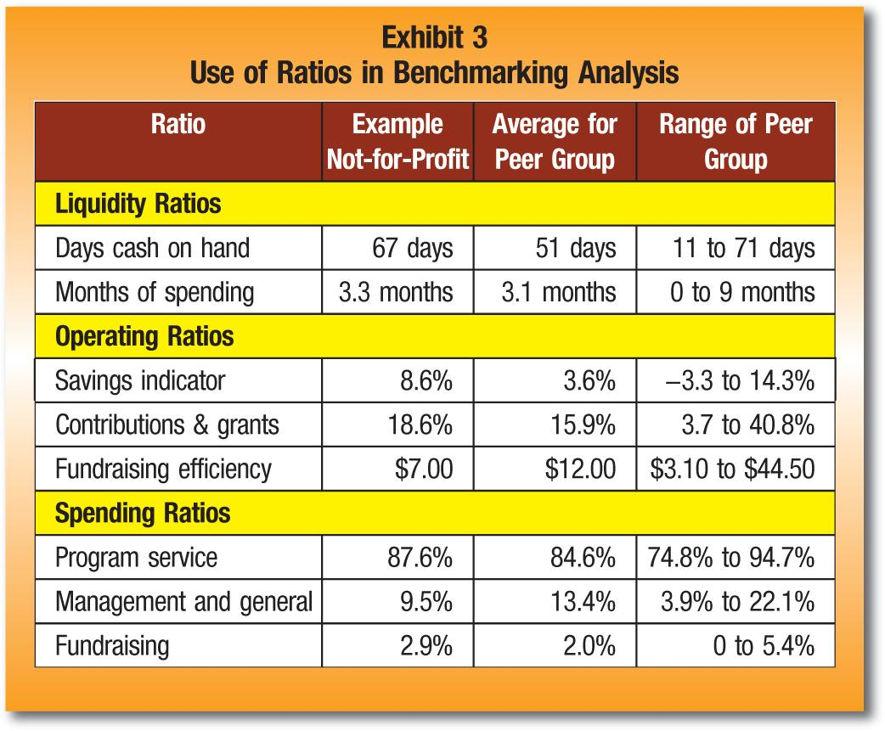

## Table of Contents

## What are financial ratios and why are they important for analyzing healthcare stocks?

Financial ratios are numbers that help people understand how a company is doing financially. They are calculated by comparing different numbers from a company's financial statements, like its income, expenses, assets, and liabilities. For example, a common financial ratio is the debt-to-equity ratio, which shows how much a company relies on borrowed money compared to money from its owners.

These ratios are important for analyzing healthcare stocks because they give investors a clear picture of a company's health and performance. By looking at ratios like the price-to-earnings ratio, investors can see if a healthcare stock is priced fairly compared to its earnings. Also, ratios like the return on equity can show how well a healthcare company is using the money its shareholders have invested. This helps investors make smarter decisions about which healthcare stocks to buy or sell.

## How do you calculate the Price-to-Earnings (P/E) ratio for healthcare companies?

To calculate the Price-to-Earnings (P/E) ratio for healthcare companies, you need two pieces of information: the stock price and the earnings per share (EPS). The stock price is how much one share of the company costs on the stock market. The EPS is found by dividing the company's total earnings by the number of shares it has. Once you have these numbers, you simply divide the stock price by the EPS. For example, if a healthcare company's stock price is $50 and its EPS is $2, the P/E ratio would be $50 divided by $2, which equals 25.

The P/E ratio is useful because it tells investors how much they are paying for each dollar of the company's earnings. A high P/E ratio might mean that investors expect the company to grow a lot in the future, so they are willing to pay more for its stock. On the other hand, a low P/E ratio could mean that the company is not expected to grow much, or that it might be undervalued. For healthcare companies, this ratio can help investors compare different companies within the industry to see which ones might be good investments.

## What does the Debt-to-Equity (D/E) ratio tell us about a healthcare company's financial health?

The Debt-to-Equity (D/E) ratio tells us how much a healthcare company relies on borrowed money compared to money from its owners. It is calculated by dividing the company's total debt by its total equity. A high D/E ratio means the company has a lot of debt compared to its equity, which can be risky because the company has to pay back that debt with interest. On the other hand, a low D/E ratio means the company is using less debt and more of its own money, which is usually seen as safer.

For healthcare companies, a high D/E ratio might mean they are taking on a lot of debt to grow or to invest in new projects, like building new hospitals or developing new medicines. While this can lead to growth, it also means they have to make enough money to pay back the debt. If they can't, it could lead to financial trouble. A low D/E ratio, however, shows that the healthcare company is more financially stable and less likely to face problems from not being able to pay back loans. Investors often look at the D/E ratio to see how risky it might be to invest in a healthcare company.

## How can the Return on Equity (ROE) ratio be used to assess healthcare stock performance?

The Return on Equity (ROE) ratio shows how well a healthcare company is using the money its shareholders have invested. To find the ROE, you divide the company's net income by its total equity. A high ROE means the company is good at turning the money from shareholders into profits. For example, if a healthcare company has an ROE of 15%, it means for every dollar shareholders have put in, the company is making 15 cents in profit. This can be really useful for investors looking at healthcare stocks because it helps them see which companies are using their money effectively.

When comparing healthcare companies, ROE can show which ones are better at making profits from the money they have. If one healthcare company has an ROE of 20% and another has an ROE of 10%, the first company is doing a better job at using its shareholders' money to make profits. But, it's also important to look at other things like how much debt the company has and what the industry average ROE is. This way, investors can get a full picture of how well a healthcare company is doing and decide if it's a good stock to invest in.

## What is the significance of the Current Ratio in evaluating the liquidity of healthcare firms?

The Current Ratio is an important number that helps people understand if a healthcare company can pay its short-term bills. It is found by dividing the company's current assets by its current liabilities. Current assets are things like cash, money other people owe the company, and things that can be sold quickly. Current liabilities are debts that need to be paid soon, like bills or loans that are due within a year. A good Current Ratio shows that the company has enough money to cover what it owes, which is important for keeping the business running smoothly.

For healthcare firms, having a strong Current Ratio is especially important because they often need to keep a lot of cash on hand. This is because they have to buy medicines, pay staff, and keep up with other costs that can change quickly. If a healthcare company's Current Ratio is low, it might mean they could have trouble paying their bills, which could affect their ability to provide care. Investors look at the Current Ratio to see if a healthcare company is managing its money well and if it's a safe investment.

## How does the Operating Margin ratio help in understanding the profitability of healthcare providers?

The Operating Margin ratio tells us how much profit a healthcare provider makes from its main business activities, like treating patients or selling medicines, before paying interest and taxes. You find it by taking the company's operating income and dividing it by its total revenue. A high Operating Margin means the healthcare provider is good at keeping costs low while making money from what they do every day. This is important because it shows how well the company is run and if it can make money even when things get tough.

For healthcare providers, the Operating Margin is really useful because their costs can change a lot. They have to pay for things like doctors, nurses, medicines, and equipment. If a healthcare provider has a high Operating Margin, it means they are doing a good job at managing these costs and making a profit. Investors look at this ratio to see if a healthcare company is a good investment. A low Operating Margin might mean the company is struggling to make money from its main work, which could be a warning sign for investors.

## What role does the Price-to-Book (P/B) ratio play in valuing healthcare stocks?

The Price-to-Book (P/B) ratio helps investors figure out if a healthcare stock is priced right compared to what the company is really worth. You find the P/B ratio by dividing the stock's market price by its book value per share. The book value is what's left if the company sold everything it owns and paid off all its debts. A low P/B ratio might mean the stock is a good deal because it's cheaper than the company's actual worth. A high P/B ratio could mean the stock is overpriced, or that investors think the company will grow a lot in the future.

For healthcare stocks, the P/B ratio is useful because it can show if a company's stock price makes sense based on its assets. Healthcare companies often have a lot of valuable things like hospitals, equipment, and medicines. If a healthcare company has a P/B ratio lower than other similar companies, it might be a good buy. But, investors should also look at other things like how much the company is growing and how much profit it makes. The P/B ratio is just one piece of the puzzle when deciding if a healthcare stock is a good investment.

## Can you explain how the Earnings Per Share (EPS) growth rate impacts healthcare stock valuation?

The Earnings Per Share (EPS) growth rate is a key number that shows how much a healthcare company's profits are growing over time. It's calculated by looking at how much the company's earnings per share have increased from one period to the next, usually a year. When a healthcare company's EPS is growing fast, it means they are making more money for each share of stock. This is good news for investors because it can mean the company is doing well and might keep growing in the future. A high EPS growth rate can make a healthcare stock more valuable because investors are willing to pay more for a company that's making more money.

On the other hand, if a healthcare company's EPS growth rate is slow or even negative, it might mean the company is not doing as well. This can make the stock less valuable because investors might not want to pay as much for a company that's not growing its profits. When valuing healthcare stocks, investors look at the EPS growth rate to see if the company is a good investment. A strong EPS growth rate can be a sign that the company is on the right track, making it more attractive to buy the stock.

## How do healthcare-specific ratios like Revenue Per Bed differ from general financial ratios?

Healthcare-specific ratios, like Revenue Per Bed, are numbers that help people understand how well a hospital or healthcare facility is doing. Revenue Per Bed is found by dividing the total revenue of a hospital by the number of beds it has. This ratio shows how much money each bed is bringing in. It's different from general financial ratios because it focuses on things that are important just to healthcare, like how well the hospital is using its space to make money. General financial ratios, like the Debt-to-Equity ratio or the Price-to-Earnings ratio, look at the overall financial health of any company, not just healthcare ones.

These healthcare-specific ratios are useful because they give a clearer picture of how well a healthcare business is run. For example, Revenue Per Bed can show if a hospital is making good use of its beds or if it needs to find ways to bring in more money. General financial ratios are good for comparing any company, but they don't tell you about the special challenges and opportunities in healthcare. By using both types of ratios, investors and managers can get a full view of a healthcare company's performance and make better decisions.

## What advanced metrics like EBITDA to Revenue ratio can provide deeper insights into healthcare stock analysis?

The EBITDA to Revenue ratio is a special number that helps people understand how well a healthcare company is making money before paying for things like interest, taxes, and big costs like buying new equipment. You find this ratio by dividing the company's EBITDA (which stands for Earnings Before Interest, Taxes, Depreciation, and Amortization) by its total revenue. A high EBITDA to Revenue ratio means the company is good at turning its sales into profit before those big costs. For healthcare companies, this can be really helpful because they often have a lot of big expenses, like building new hospitals or buying expensive machines. By looking at this ratio, investors can see if a healthcare company is doing a good job at making money from what it sells, even before it has to pay for all those big costs.

Using the EBITDA to Revenue ratio along with other numbers gives a fuller picture of a healthcare company's health. It's different from simple ratios like the Price-to-Earnings ratio because it looks at profits before some big costs. This can be really useful for comparing healthcare companies that might have different amounts of debt or different ways of paying for their equipment. Investors can use this ratio to see which healthcare companies are better at making money from their main work, which can help them decide if a stock is a good investment. By looking at both simple and advanced metrics, investors can make smarter choices about which healthcare stocks to buy or sell.

## How can the Free Cash Flow to Equity (FCFE) ratio be used to forecast future healthcare stock performance?

The Free Cash Flow to Equity (FCFE) ratio helps investors see how much money a healthcare company has left after paying for everything it needs to keep running and growing. You find the FCFE by taking the company's cash flow and subtracting money spent on things like new buildings or equipment, and then adding back any money the company borrows. A high FCFE means the company has a lot of extra money that it can use to pay dividends to shareholders or buy back its own stock, which can make the stock more valuable. For healthcare companies, having a strong FCFE is important because they often need a lot of money to invest in new technology or research.

Investors can use the FCFE ratio to guess how well a healthcare stock might do in the future. If a healthcare company has a high and growing FCFE, it might mean the company is doing well and can keep making money for its shareholders. This can make the stock more attractive to buy because investors like companies that can give them more money back. On the other hand, if the FCFE is low or shrinking, it might be a warning sign that the company is struggling to make enough money to cover its costs and grow. By looking at the FCFE along with other numbers, investors can make better guesses about which healthcare stocks might be good investments in the future.

## What are some limitations and potential pitfalls of using financial ratios for healthcare stock analysis?

Using financial ratios to look at healthcare stocks can be helpful, but it also has some problems. One big issue is that these ratios don't tell the whole story about a company. For example, a healthcare company might look good on paper because of a high Return on Equity, but it might not be doing well in other important areas like patient care or new medicine development. Also, different healthcare companies can have very different ways of making money, so comparing them using the same ratios might not be fair. A hospital, for instance, might have different costs and revenues than a company that makes medical equipment, even if they both have similar ratios.

Another problem is that financial ratios can be affected by things outside the company's control, like changes in healthcare laws or big events like a global health crisis. These things can make a company's numbers look better or worse than they really are. Plus, companies can sometimes make their financial ratios look better by doing things like selling off assets or cutting costs in ways that might not be good for the long term. So, while financial ratios are a useful tool, investors need to use them carefully and look at other information too to get a full picture of a healthcare company's health and future potential.

## What are the key financial ratios for analyzing healthcare stocks?

Financial ratios stand as fundamental tools in the assessment of a company’s fiscal health and performance, serving as pivotal indicators for investors looking to evaluate healthcare stocks. These ratios distill vast amounts of financial data into concise metrics, enabling informed decision-making regarding investment potential and company stability.

### Profit Margin

Profit margin gauges a company’s ability to convert sales into profit, reflecting operational efficiency. It is computed as follows:

$$
\text{Profit Margin} = \left( \frac{\text{Net Income}}{\text{Revenue}} \right) \times 100
$$

A higher profit margin indicates a more efficient company, capable of managing its costs effectively, thus being more resilient in facing operational challenges common in the healthcare sector. In healthcare, where costs can fluctuate due to regulatory changes and innovation demands, maintaining a robust profit margin is crucial for sustainable growth.

### Return on Equity (ROE)

Return on Equity measures a firm's profitability by revealing how much profit a company generates with the money shareholders have invested. It is expressed as:

$$
\text{ROE} = \left( \frac{\text{Net Income}}{\text{Shareholder's Equity}} \right) \times 100
$$

For healthcare companies, a high ROE signifies efficient use of equity capital, which is essential in an industry characterized by high levels of regulation and significant R&D expenses. Investors can gauge how well a company uses funds to generate growth and anticipate future performance based on these dynamics.

### Debt-to-Equity Ratio

The Debt-to-Equity Ratio reflects a company's financial leverage and is calculated as:

$$
\text{Debt-to-Equity Ratio} = \frac{\text{Total Liabilities}}{\text{Shareholder's Equity}}
$$

This ratio is particularly vital for assessing the risk profile of healthcare companies, which often grapple with debt due to substantial capital expenditures in technology, facilities, and compliance. A lower ratio suggests a company has less debt compared to its equity, which could signify a safer investment, whereas a higher ratio might indicate higher financial risk but potentially greater returns.

### Price-to-Earnings (P/E) Ratio

The P/E ratio is a measure of market valuation relative to earnings, calculated as:

$$
\text{P/E Ratio} = \frac{\text{Market Price per Share}}{\text{Earnings per Share (EPS)}}
$$

This ratio offers insights into market expectations about a company's future growth prospects. For healthcare firms, a high P/E ratio could suggest that investors expect high growth due to factors such as innovation pipelines or demographic trends favoring increased demand for healthcare services. Conversely, a low P/E might indicate undervaluation or potential challenges.

### Relevance of Financial Ratios in Evaluating Healthcare Stocks

In analyzing healthcare stocks, each of these financial ratios provides a different lens through which to assess the financial stability and potential of companies within this complex and rapidly evolving industry. Profit margins help in evaluating operational efficiency, ROE indicates effective capital use, the Debt-to-Equity Ratio assesses financial risk, and the P/E Ratio provides insight into growth expectations. Together, these ratios offer a comprehensive framework for evaluating healthcare stocks, essential for investors aiming to construct a balanced and well-informed investment portfolio.

## References & Further Reading

[1]: Ittelson, T. (2009). ["Financial Ratios for Financial Statement Analysis"](https://www.amazon.com/Financial-Statements-Step-Step-Understanding/dp/1601630239). Career Press.

[2]: Chan, E. P. (2013). ["Algorithmic Trading: Winning Strategies and Their Rationale"](https://github.com/ftvision/quant_trading_echan_book). Wiley.

[3]: Graham, B. (2006). ["The Intelligent Investor: The Definitive Book on Value Investing"](https://www.amazon.com/Intelligent-Investor-Definitive-Investing-Essentials/dp/0060555661). Harper Business.

[4]: Yetman, R. G. (2013). ["Investing in Healthcare: How to Profit from the Healthcare Revolution"](https://hmpi.org/2024/06/19/review-of-key-case-studies-and-recommendations-for-effective-equitable-private-investment-in-healthcare/). FT Press.

[5]: Jansen, S. (2020). ["Machine Learning for Algorithmic Trading"](https://github.com/stefan-jansen/machine-learning-for-trading). Packt Publishing.

[6]: Lopez de Prado, M. (2018). ["Advances in Financial Machine Learning"](https://www.amazon.com/Advances-Financial-Machine-Learning-Marcos/dp/1119482089). Wiley.

[7]: Aronson, D. R. (2006). ["Evidence-Based Technical Analysis: Applying the Scientific Method and Statistical Inference to Trading Signals"](https://www.amazon.com/Evidence-Based-Technical-Analysis-Scientific-Statistical/dp/0470008741). Wiley.

[8]: QuantConnect. ["QuantConnect"](https://www.quantconnect.com/). An open-source algorithmic trading platform.

[9]: Interactive Brokers. ["Trader Workstation (TWS)"](https://www.interactivebrokers.com/en/trading/tws.php). A professional trading platform offering algorithmic trading tools and market data.

[10]: Stat News. ["Stat News"](https://www.statnews.com/). News focused on health, medicine, and innovations.

[11]: Coursera. ["Algorithmic Trading & Quantitative Analysis by University of Illinois"](https://www.coursera.org/courses?query=algorithmic%20trading). An online course offering foundational knowledge in algorithmic trading.