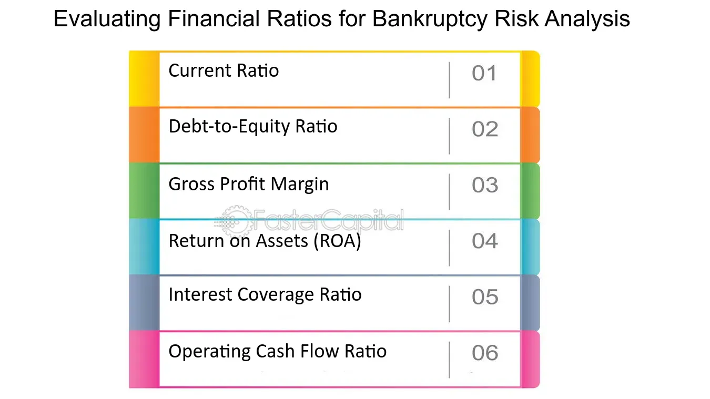

## Table of Contents

## What are financial ratios and why are they important for assessing a company's financial health?

Financial ratios are tools that help people understand a company's financial situation by comparing different numbers from its financial statements. These ratios can show how well a company is doing in areas like making money, managing debt, and using its assets. For example, a profitability ratio can tell you if a company is making enough profit from its sales, while a liquidity ratio can show if it has enough cash to pay its short-term bills.

These ratios are important because they give a quick and easy way to see how healthy a company is financially. Investors, creditors, and managers use them to make decisions. For instance, investors might look at a company's return on equity to decide if it's a good investment. Creditors might use debt ratios to see if a company can pay back its loans. By comparing these ratios over time or against other companies, you can get a clearer picture of a company's performance and potential risks.

## How can financial ratios help identify companies at risk of bankruptcy?

Financial ratios can help spot companies that might be in danger of going bankrupt by looking at how well they can pay their debts and how much money they are making. One important ratio is the debt-to-equity ratio, which shows how much a company relies on borrowed money compared to its own money. If this ratio is high, it means the company has a lot of debt, which can be risky if it can't pay it back. Another useful ratio is the interest coverage ratio, which tells us if a company's profits are enough to cover the interest on its loans. If this ratio is low, it might mean the company is struggling to make these payments, which could lead to bankruptcy.

Another set of ratios to look at are liquidity ratios, like the current ratio and the quick ratio. These ratios show if a company has enough short-term assets to pay its short-term debts. If these ratios are low, it might mean the company could have trouble paying its bills soon, increasing the risk of bankruptcy. Also, profitability ratios, such as return on assets (ROA) and return on equity (ROE), can show if a company is making enough profit to stay healthy. If these ratios are dropping over time, it could be a sign that the company is heading towards financial trouble. By keeping an eye on these ratios, people can get early warnings about a company's financial health and take action to avoid bankruptcy.

## What is the current ratio and how does it indicate liquidity risk?

The current ratio is a number that shows if a company can pay its short-term bills. You find it by dividing the company's current assets by its current liabilities. Current assets are things like cash, inventory, and money that people owe the company soon. Current liabilities are what the company needs to pay soon, like bills and short-term loans. If the current ratio is high, it means the company has a lot more assets than liabilities, which is good. If it's low, it means the company might not have enough money to pay its bills, which is bad.

A low current ratio can show that a company has a high liquidity risk. Liquidity risk means the chance that a company won't have enough cash to pay what it owes. If the current ratio is less than 1, it means the company's liabilities are more than its assets, which is very risky. Even if the ratio is a bit higher than 1, it might still be risky if a lot of the assets are things like inventory that can't be turned into cash quickly. So, a low current ratio can be a warning sign that a company might struggle to stay afloat in the short term.

## What is the quick ratio and why might it be a better indicator of short-term financial stability than the current ratio?

The quick ratio is another way to see if a company can pay its short-term bills. It's similar to the current ratio, but it's more strict. You find the quick ratio by taking the company's current assets, but you don't count inventory or other things that can't be turned into cash quickly. Then you divide that by the company's current liabilities. This gives you a better idea of how much cash or near-cash the company has to pay its bills right away.

The quick ratio might be a better indicator of short-term financial stability than the current ratio because it leaves out inventory. Inventory can be hard to sell quickly, especially if it's something that people don't need right away. If a company has a lot of inventory, its current ratio might look good, but it could still have trouble paying its bills if it can't sell that inventory fast enough. The quick ratio gives a clearer picture of a company's ability to pay its debts without relying on selling inventory, which makes it a more reliable measure of short-term financial health.

## How does the debt-to-equity ratio help in assessing a company's risk of bankruptcy?

The debt-to-equity ratio helps show how much a company depends on borrowed money compared to its own money. You find it by dividing the company's total debt by its total equity. A high debt-to-equity ratio means the company has a lot of debt. This can be risky because if the company can't pay back its loans, it might go bankrupt. When a company has a lot of debt, it has to pay a lot of interest, which can eat into its profits and make it harder to stay afloat.

If the debt-to-equity ratio is high, it's a warning sign that the company might be in trouble. Lenders and investors look at this ratio to see if the company is too risky to lend money to or invest in. A company with a high debt-to-equity ratio might struggle to get more loans or attract investors, which can make its financial situation even worse. By keeping an eye on this ratio, people can spot companies that might be at risk of bankruptcy before it's too late.

## What is the interest coverage ratio and how does it relate to a company's ability to meet its debt obligations?

The interest coverage ratio tells us if a company can pay the interest on its loans with the money it makes. You find it by dividing the company's earnings before interest and taxes (EBIT) by the interest it has to pay. If this ratio is high, it means the company is making enough money to easily cover its interest payments. If it's low, it means the company might have trouble paying the interest, which can be a big problem.

A low interest coverage ratio can be a warning sign that a company might not be able to meet its debt obligations. If a company can't pay the interest on its loans, it might default on those loans, which can lead to bankruptcy. By looking at this ratio, investors and lenders can see if a company is at risk of not being able to pay its debts. Keeping an eye on the interest coverage ratio helps people understand a company's financial health and make better decisions about lending or investing in it.

## Can you explain the Altman Z-score and its use in predicting bankruptcy?

The Altman Z-score is a way to predict if a company might go bankrupt. It was created by Edward Altman in the 1960s. The Z-score uses a mix of five different financial ratios to come up with one number that tells you about the company's financial health. If the Z-score is high, it means the company is likely to be okay. If it's low, it means the company might be in trouble and could go bankrupt soon.

The five ratios used in the Altman Z-score look at things like how well the company is making money, how much debt it has, how it's using its assets, and how liquid it is. By putting these ratios together in a special formula, the Z-score gives a quick way to see if a company is at risk. Companies with a Z-score below 1.8 are seen as being at high risk of bankruptcy, while those with a score above 3 are seen as safe. This tool helps investors, lenders, and managers make better decisions by spotting companies that might be in financial trouble before it's too late.

## How does the cash flow to debt ratio provide insights into a company's financial distress?

The cash flow to debt ratio tells us if a company can pay its debts with the money it's making. You find it by dividing the company's cash flow from operations by its total debt. A high ratio means the company is making enough money to easily pay its debts. A low ratio means the company might have trouble paying back what it owes, which can be a sign of financial distress.

If a company's cash flow to debt ratio is low, it might be struggling to bring in enough money to cover its loans. This can be a warning sign that the company could face financial problems soon. By looking at this ratio, people like investors and lenders can see if a company is at risk of not being able to pay its debts and possibly going bankrupt. Keeping an eye on this ratio helps them make better decisions about whether to invest in or lend money to the company.

## What role does the operating margin play in evaluating a company's operational efficiency and risk of bankruptcy?

The operating margin shows how much profit a company makes from its main business activities after paying for things like salaries and materials, but before paying taxes and interest. You find it by dividing the company's operating income by its revenue. A high operating margin means the company is good at making money from what it does every day. It's a sign that the company is running efficiently and has control over its costs. If the operating margin is low, it might mean the company is not doing well at managing its costs or making enough money from its products or services.

A low operating margin can be a warning sign that a company might be at risk of going bankrupt. If a company isn't making enough profit from its operations, it might struggle to pay its bills and debts. This can lead to financial problems and even bankruptcy if things don't improve. By looking at the operating margin, investors and managers can see how well the company is doing and whether it might face financial trouble in the future. Keeping an eye on this ratio helps them make better decisions about the company's future.

## How can the return on assets (ROA) ratio be used to assess a company's profitability and potential financial distress?

The return on assets (ROA) ratio shows how well a company is using its assets to make money. You find it by dividing the company's net income by its total assets. A high ROA means the company is good at turning its assets into profit. This is a sign that the company is doing well and is profitable. If the ROA is low, it might mean the company isn't making enough money from its assets. This could be because the company isn't selling enough, or because it's spending too much on things like buildings or machines.

A low ROA can be a warning sign that a company might be in financial trouble. If a company isn't making enough profit from its assets, it might struggle to pay its bills and debts. This can lead to financial distress and even bankruptcy if things don't get better. By looking at the ROA, investors and managers can see if the company is profitable and whether it might face money problems in the future. Keeping an eye on this ratio helps them make better decisions about the company's health and what to do next.

## What advanced financial ratios or models should be used for a more nuanced analysis of bankruptcy risk?

For a more detailed look at a company's risk of going bankrupt, people often use the Merton model. This model sees a company's equity as an option on its assets. It uses things like the company's debt, the value of its assets, and how much those assets might change in value to guess the chance of bankruptcy. If a company's assets are worth less than its debt, it might go bankrupt. The Merton model helps people understand this risk better by looking at these factors together.

Another useful tool is the Zmijewski's model, which uses three ratios to predict bankruptcy. These ratios look at how well the company is doing with its money, how much debt it has, and how its stock is doing. By putting these ratios into a special formula, the model gives a number that tells you if the company is at risk. A high number means the company is likely to be okay, but a low number means it might go bankrupt soon. This model helps people see the bigger picture and make better decisions about the company's future.

## How can a combination of multiple financial ratios improve the accuracy of predicting a company's risk of bankruptcy?

Using more than one financial ratio can help predict a company's risk of going bankrupt more accurately. When you look at just one ratio, you might miss important details about the company's financial health. For example, the debt-to-equity ratio might show that a company has a lot of debt, but it doesn't tell you if the company is making enough money to pay that debt. By combining ratios like the debt-to-equity ratio with the interest coverage ratio, you can see if the company's profits are enough to cover its interest payments. This gives a fuller picture of the company's ability to handle its debts and avoid bankruptcy.

Combining ratios like the current ratio, quick ratio, and cash flow to debt ratio can also help. The current ratio shows if a company can pay its short-term bills, but it includes inventory, which might not be easy to sell quickly. The quick ratio is stricter because it leaves out inventory, giving a clearer view of the company's immediate liquidity. When you add the cash flow to debt ratio, you see if the company is making enough cash to pay its debts over time. By looking at all these ratios together, you get a better idea of the company's short-term and long-term financial stability, helping you spot potential problems before they lead to bankruptcy.

## What is the role of financial ratios in predicting bankruptcy?

Financial ratios are pivotal in providing insights into a company's financial condition by summarizing complex financial information into simple numerical forms. These ratios assist investors and analysts in assessing a company's operational efficiency, liquidity, and overall financial stability, which are crucial for predicting bankruptcy.

**Key Financial Ratios for Bankruptcy Prediction**

1. **Current Ratio**: The Current Ratio is a liquidity measure that evaluates a company’s ability to cover its short-term liabilities with its short-term assets. It is calculated as:
$$
   \text{Current Ratio} = \frac{\text{Current Assets}}{\text{Current Liabilities}}

$$

   A higher ratio indicates greater short-term financial health, whereas a ratio below 1 suggests potential [liquidity](/wiki/liquidity-risk-premium) issues.

2. **Operating Cash Flow to Sales Ratio**: This ratio assesses how effectively a company can generate cash from its sales, providing insights into its operational efficiency. It is calculated as:
$$
   \text{Operating Cash Flow to Sales Ratio} = \frac{\text{Operating Cash Flow}}{\text{Net Sales}}

$$

   A higher ratio indicates a company’s strong ability to convert sales into cash, reducing bankruptcy risk.

3. **Debt/Equity Ratio**: The Debt/Equity Ratio measures a company's financial leverage by comparing its total liabilities to shareholder equity. It is expressed as:
$$
   \text{Debt/Equity Ratio} = \frac{\text{Total Debt}}{\text{Shareholders' Equity}}

$$

   A higher ratio implies greater dependence on debt financing, which can be risky if the company faces declining revenues.

4. **Cash Flow to Debt Ratio**: This ratio evaluates a company's ability to cover its total debt with its operational cash flow. It shows how many times over the company can pay its debt using its cash flow:
$$
   \text{Cash Flow to Debt Ratio} = \frac{\text{Operating Cash Flow}}{\text{Total Debt}}

$$

   A higher ratio indicates better debt-coverage capacity, implying lower bankruptcy risk.

These financial ratios are essential tools for analysts to evaluate a firm's financial health. They distill extensive financial data into key indicators that signal potential difficulties in meeting financial obligations. Accurate use and interpretation of these ratios are crucial for predicting a company’s bankruptcy risk and making informed investment decisions.

## What is the relationship between Algorithmic Trading and Company Analysis?

Algorithmic trading employs intricate algorithms to efficiently execute trading decisions, significantly reducing the need for human intervention. This approach leverages computational power to analyze large datasets and execute trades at speeds and frequencies impractical for human traders. One area where [algorithmic trading](/wiki/algorithmic-trading) can gain a strategic edge is by integrating financial ratios into its [machine learning](/wiki/machine-learning) models to augment the accuracy of predicting company performance and potential bankruptcy risks.

The integration begins with the collection and processing of financial data into relevant ratios, such as the Current Ratio, Debt/Equity Ratio, and Cash Flow to Debt Ratio, among others. These ratios serve as key inputs for machine learning models designed to assess the financial health and bankruptcy probability of firms. The process involves several steps:

1. **Data Collection and Preprocessing**: Gather historical financial data from sources such as financial statements, market reports, and databases. Clean and standardize the data to ensure accuracy and consistency. For example, normalize financial ratios to account for differences across industries.

2. **Feature Engineering**: Convert raw financial data into meaningful financial ratios. This step often involves computing ratios like:
$$
   \text{Current Ratio} = \frac{\text{Current Assets}}{\text{Current Liabilities}}

$$
$$
   \text{Debt/Equity Ratio} = \frac{\text{Total Debt}}{\text{Total Equity}}

$$
   These ratios provide distilled insights into a company’s liquidity, leverage, and operational efficiency.

3. **Model Training**: Employ machine learning algorithms such as Random Forest, Support Vector Machines, or Neural Networks. Training involves feeding the model with historical data to learn patterns and relationships that precede financial distress.

   ```python
   from sklearn.ensemble import RandomForestClassifier
   from sklearn.model_selection import train_test_split

   # Sample data preparation
   X = financial_ratios_dataframe  # DataFrame of financial ratios
   Y = bankruptcy_labels  # 0 for non-bankrupt, 1 for bankrupt

   # Splitting data
   X_train, X_test, Y_train, Y_test = train_test_split(X, Y, test_size=0.2, random_state=42)

   # Model instantiation and training
   model = RandomForestClassifier(n_estimators=100, random_state=42)
   model.fit(X_train, Y_train)
   ```

4. **Prediction and Decision Making**: Use the trained model to predict bankruptcy risks. The output can then inform trading strategies by highlighting firms with heightened financial risk, allowing traders to adjust their positions accordingly. These predictions enable a data-driven approach to manage risk and optimize investment portfolios effectively.

Moreover, real-time application of these models in trading platforms provides agility in responding to swiftly changing market conditions. With continuous updates and integration of new data, traders can maintain a competitive edge through timely insights and proactive strategy adjustments. 

The use of algorithmic trading combined with financial ratios and machine learning unlocks enhanced decision-making capabilities, offering a sophisticated framework for identifying viable investment opportunities and avoiding potential financial pitfalls.

## Question: What are some successful implementations of financial ratios and algorithmic trading as shown in case studies?

Several case studies illustrate the successful integration of financial ratios into algorithmic trading models, serving to mitigate bankruptcy risk and enhance investment decisions. A prominent example is the use of the Altman Z-Score Model. Originally developed in 1968 by Edward Altman, this model combines several financial ratios to predict the likelihood of bankruptcy for firms across different industries.

### Altman Z-Score Model

The Altman Z-Score is a multivariate formula expressed as:

$$
Z = 1.2 \times A + 1.4 \times B + 3.3 \times C + 0.6 \times D + 1.0 \times E
$$

where:
- $A = \frac{\text{Working Capital}}{\text{Total Assets}}$
- $B = \frac{\text{Retained Earnings}}{\text{Total Assets}}$
- $C = \frac{\text{Earnings Before Interest and Taxes (EBIT)}}{\text{Total Assets}}$
- $D = \frac{\text{Market Value of Equity}}{\text{Total Liabilities}}$
- $E = \frac{\text{Sales}}{\text{Total Assets}}$

This model has been tailored for various industries, demonstrating its wide applicability in predictive analytics. Studies have validated its effectiveness, with a high Z-Score indicating a lower risk of bankruptcy.

### Real-world Applications

Machine learning models trained on these financial ratios allow traders to filter out high-risk investments. For example, firms utilizing the Altman Z-Score within algorithmic models have successfully segregated distressed assets from more stable industry players. 

Consider this simplified Python example showing how such a model might be implemented, using historical financial data:

```python
import pandas as pd
from sklearn.ensemble import RandomForestClassifier
from sklearn.model_selection import train_test_split
from sklearn.metrics import classification_report

# Assume df is a pandas DataFrame with relevant financial data and a binary 'bankruptcy' target column
df = pd.read_csv('financial_data.csv')
features = ['working_capital_to_assets', 'retained_earnings_to_assets', 'EBIT_to_assets', 'market_value_to_liabilities', 'sales_to_assets']
X = df[features]
y = df['bankruptcy']

# Split the data
X_train, X_test, y_train, y_test = train_test_split(X, y, test_size=0.3, random_state=42)

# Train the model
model = RandomForestClassifier(n_estimators=100, random_state=42)
model.fit(X_train, y_train)

# Predict and evaluate
y_pred = model.predict(X_test)
print(classification_report(y_test, y_pred))
```

### Case Studies Analysis

Empirical evidence from these case studies indicates significant improvements in predictive accuracy and decision-making. Firms leveraging the Altman Z-Score and similar quantitative measures have effectively increased their return on investment by avoiding companies with high bankruptcy risks. Additionally, the integration of machine learning in these models has further enhanced the precision of risk assessments.

By continuously refining these models and incorporating new data, traders can maintain a competitive edge, potentially increasing profitability while managing risk effectively. The systematic use of financial ratios in algorithmic trading provides a data-driven foundation for making informed investment choices.

## References & Further Reading

[1]: Altman, E. I. (1968). ["Financial Ratios, Discriminant Analysis and the Prediction of Corporate Bankruptcy."](https://onlinelibrary.wiley.com/doi/abs/10.1111/j.1540-6261.1968.tb00843.x) The Journal of Finance, 23(4), 589-609.

[2]: ["Advances in Financial Machine Learning"](https://www.amazon.com/Advances-Financial-Machine-Learning-Marcos/dp/1119482089) by Marcos Lopez de Prado

[3]: ["Machine Learning for Asset Managers"](https://github.com/emoen/Machine-Learning-for-Asset-Managers) by Marcos Lopez de Prado

[4]: ["Algorithmic Trading: Winning Strategies and Their Rationale"](https://www.amazon.com/Algorithmic-Trading-Winning-Strategies-Rationale-ebook/dp/B00CY5HC0U) by Ernie Chan

[5]: Fama, E. F. (1980). ["Agency Problems and the Theory of the Firm."](https://www.jstor.org/stable/1837292) Journal of Political Economy, 88(2), 288-307.