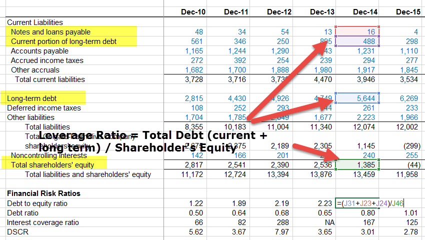

In today's volatile financial markets, predicting corporate bankruptcy is more crucial than ever. The ability to foresee financial distress can mitigate risks and enhance investment outcomes, making it an essential skill for investors and financial analysts. Financial ratios play a fundamental role in this process, providing snapshots of a company's financial health by distilling complex financial data into easily interpretable metrics. Key ratios like the Current Ratio, Debt/Equity Ratio, and Cash Flow to Debt Ratio enable investors to assess liquidity, leverage, and cash flow adequacy, potentially signaling looming financial difficulties before they manifest.

This article explores how these financial ratios can be harnessed in company analysis to anticipate bankruptcy risks. By examining a company's financial statements through the lens of these ratios, investors can gain a clearer picture of a firm's operational efficiency, debt management, and liquidity position. Such insights are invaluable for making informed investment decisions and avoiding high-risk ventures.



Incorporating these ratios with algorithmic trading strategies opens new avenues for leveraging data-driven decision-making. Algorithmic trading, which relies on sophisticated algorithms to execute trades with minimal human intervention, can be augmented by integrating financial ratios into its predictive models. This integration can enhance the accuracy of predictions related to company performance and bankruptcy risks, leading to more robust investment strategies.

Through a detailed analysis, this article aims to provide insights into how financial ratios, when wisely combined with algorithmic trading techniques, can offer a strategic edge in financial markets. As investors seek more efficient and effective means to navigate market uncertainties, understanding the role of financial ratios in predicting corporate bankruptcy becomes increasingly vital for smarter investment decisions.

## Table of Contents

## Understanding Financial Ratios for Bankruptcy Prediction

Financial ratios are pivotal in providing insights into a company's financial condition by summarizing complex financial information into simple numerical forms. These ratios assist investors and analysts in assessing a company's operational efficiency, liquidity, and overall financial stability, which are crucial for predicting bankruptcy.

**Key Financial Ratios for Bankruptcy Prediction**

1. **Current Ratio**: The Current Ratio is a liquidity measure that evaluates a company’s ability to cover its short-term liabilities with its short-term assets. It is calculated as:
$$
   \text{Current Ratio} = \frac{\text{Current Assets}}{\text{Current Liabilities}}

$$

   A higher ratio indicates greater short-term financial health, whereas a ratio below 1 suggests potential [liquidity](/wiki/liquidity-risk-premium) issues.

2. **Operating Cash Flow to Sales Ratio**: This ratio assesses how effectively a company can generate cash from its sales, providing insights into its operational efficiency. It is calculated as:
$$
   \text{Operating Cash Flow to Sales Ratio} = \frac{\text{Operating Cash Flow}}{\text{Net Sales}}

$$

   A higher ratio indicates a company’s strong ability to convert sales into cash, reducing bankruptcy risk.

3. **Debt/Equity Ratio**: The Debt/Equity Ratio measures a company's financial leverage by comparing its total liabilities to shareholder equity. It is expressed as:
$$
   \text{Debt/Equity Ratio} = \frac{\text{Total Debt}}{\text{Shareholders' Equity}}

$$

   A higher ratio implies greater dependence on debt financing, which can be risky if the company faces declining revenues.

4. **Cash Flow to Debt Ratio**: This ratio evaluates a company's ability to cover its total debt with its operational cash flow. It shows how many times over the company can pay its debt using its cash flow:
$$
   \text{Cash Flow to Debt Ratio} = \frac{\text{Operating Cash Flow}}{\text{Total Debt}}

$$

   A higher ratio indicates better debt-coverage capacity, implying lower bankruptcy risk.

These financial ratios are essential tools for analysts to evaluate a firm's financial health. They distill extensive financial data into key indicators that signal potential difficulties in meeting financial obligations. Accurate use and interpretation of these ratios are crucial for predicting a company’s bankruptcy risk and making informed investment decisions.

## Algorithmic Trading and Company Analysis

Algorithmic trading employs intricate algorithms to efficiently execute trading decisions, significantly reducing the need for human intervention. This approach leverages computational power to analyze large datasets and execute trades at speeds and frequencies impractical for human traders. One area where [algorithmic trading](/wiki/algorithmic-trading) can gain a strategic edge is by integrating financial ratios into its [machine learning](/wiki/machine-learning) models to augment the accuracy of predicting company performance and potential bankruptcy risks.

The integration begins with the collection and processing of financial data into relevant ratios, such as the Current Ratio, Debt/Equity Ratio, and Cash Flow to Debt Ratio, among others. These ratios serve as key inputs for machine learning models designed to assess the financial health and bankruptcy probability of firms. The process involves several steps:

1. **Data Collection and Preprocessing**: Gather historical financial data from sources such as financial statements, market reports, and databases. Clean and standardize the data to ensure accuracy and consistency. For example, normalize financial ratios to account for differences across industries.

2. **Feature Engineering**: Convert raw financial data into meaningful financial ratios. This step often involves computing ratios like:
$$
   \text{Current Ratio} = \frac{\text{Current Assets}}{\text{Current Liabilities}}

$$
$$
   \text{Debt/Equity Ratio} = \frac{\text{Total Debt}}{\text{Total Equity}}

$$
   These ratios provide distilled insights into a company’s liquidity, leverage, and operational efficiency.

3. **Model Training**: Employ machine learning algorithms such as Random Forest, Support Vector Machines, or Neural Networks. Training involves feeding the model with historical data to learn patterns and relationships that precede financial distress.

   ```python
   from sklearn.ensemble import RandomForestClassifier
   from sklearn.model_selection import train_test_split

   # Sample data preparation
   X = financial_ratios_dataframe  # DataFrame of financial ratios
   Y = bankruptcy_labels  # 0 for non-bankrupt, 1 for bankrupt

   # Splitting data
   X_train, X_test, Y_train, Y_test = train_test_split(X, Y, test_size=0.2, random_state=42)

   # Model instantiation and training
   model = RandomForestClassifier(n_estimators=100, random_state=42)
   model.fit(X_train, Y_train)
   ```

4. **Prediction and Decision Making**: Use the trained model to predict bankruptcy risks. The output can then inform trading strategies by highlighting firms with heightened financial risk, allowing traders to adjust their positions accordingly. These predictions enable a data-driven approach to manage risk and optimize investment portfolios effectively.

Moreover, real-time application of these models in trading platforms provides agility in responding to swiftly changing market conditions. With continuous updates and integration of new data, traders can maintain a competitive edge through timely insights and proactive strategy adjustments. 

The use of algorithmic trading combined with financial ratios and machine learning unlocks enhanced decision-making capabilities, offering a sophisticated framework for identifying viable investment opportunities and avoiding potential financial pitfalls.

## Case Studies: Successful Implementation of Financial Ratios and Algorithmic Trading

Several case studies illustrate the successful integration of financial ratios into algorithmic trading models, serving to mitigate bankruptcy risk and enhance investment decisions. A prominent example is the use of the Altman Z-Score Model. Originally developed in 1968 by Edward Altman, this model combines several financial ratios to predict the likelihood of bankruptcy for firms across different industries.

### Altman Z-Score Model

The Altman Z-Score is a multivariate formula expressed as:

$$
Z = 1.2 \times A + 1.4 \times B + 3.3 \times C + 0.6 \times D + 1.0 \times E
$$

where:
- $A = \frac{\text{Working Capital}}{\text{Total Assets}}$
- $B = \frac{\text{Retained Earnings}}{\text{Total Assets}}$
- $C = \frac{\text{Earnings Before Interest and Taxes (EBIT)}}{\text{Total Assets}}$
- $D = \frac{\text{Market Value of Equity}}{\text{Total Liabilities}}$
- $E = \frac{\text{Sales}}{\text{Total Assets}}$

This model has been tailored for various industries, demonstrating its wide applicability in predictive analytics. Studies have validated its effectiveness, with a high Z-Score indicating a lower risk of bankruptcy.

### Real-world Applications

Machine learning models trained on these financial ratios allow traders to filter out high-risk investments. For example, firms utilizing the Altman Z-Score within algorithmic models have successfully segregated distressed assets from more stable industry players. 

Consider this simplified Python example showing how such a model might be implemented, using historical financial data:

```python
import pandas as pd
from sklearn.ensemble import RandomForestClassifier
from sklearn.model_selection import train_test_split
from sklearn.metrics import classification_report

# Assume df is a pandas DataFrame with relevant financial data and a binary 'bankruptcy' target column
df = pd.read_csv('financial_data.csv')
features = ['working_capital_to_assets', 'retained_earnings_to_assets', 'EBIT_to_assets', 'market_value_to_liabilities', 'sales_to_assets']
X = df[features]
y = df['bankruptcy']

# Split the data
X_train, X_test, y_train, y_test = train_test_split(X, y, test_size=0.3, random_state=42)

# Train the model
model = RandomForestClassifier(n_estimators=100, random_state=42)
model.fit(X_train, y_train)

# Predict and evaluate
y_pred = model.predict(X_test)
print(classification_report(y_test, y_pred))
```

### Case Studies Analysis

Empirical evidence from these case studies indicates significant improvements in predictive accuracy and decision-making. Firms leveraging the Altman Z-Score and similar quantitative measures have effectively increased their return on investment by avoiding companies with high bankruptcy risks. Additionally, the integration of machine learning in these models has further enhanced the precision of risk assessments.

By continuously refining these models and incorporating new data, traders can maintain a competitive edge, potentially increasing profitability while managing risk effectively. The systematic use of financial ratios in algorithmic trading provides a data-driven foundation for making informed investment choices.

## Limitations and Considerations

Financial ratios serve as important indicators of a company's financial stability, but they come with inherent limitations that traders and analysts must acknowledge. One of the primary limitations is that financial ratios primarily rely on quantitative data from financial statements. This reliance means they often exclude qualitative factors such as the quality of management, competitive positioning, and broader market conditions, all of which can substantially influence a company's financial health. For example, a company might have a strong current ratio or low debt/equity ratio, but if it lacks effective management or faces unfavorable market dynamics, its overall risk profile may still be negative.

To enhance the predictive power of financial ratios, it is crucial to use them alongside other analytical tools and expert insights. Combining quantitative analysis with qualitative assessments can offer a more holistic view of a company's financial position. For instance, integrating financial ratios with insights from market analysis reports or management evaluations can improve the accuracy of bankruptcy predictions.

Additionally, careful data selection and model tuning are critical to reducing false positives in bankruptcy prediction. Financial data can often be noisy or subject to accounting anomalies, which could lead to misleading ratios. Anomalous values, such as a temporary spike in debt due to a strategic acquisition, may not necessarily indicate financial distress. Therefore, meticulous data cleaning and preprocessing are essential steps in preparing accurate inputs for predictive models. Moreover, model tuning—such as selecting the appropriate algorithms and adjusting parameters to fit the specific context—can further enhance prediction accuracy.

For instance, consider the use of Python to ingest and preprocess financial data, maintaining precision in numerical calculations, and ensuring data integrity:

```python
import pandas as pd
from sklearn.preprocessing import StandardScaler

# Load financial data
data = pd.read_csv('financial_data.csv')

# Preprocess data by scaling
scaler = StandardScaler()
scaled_data = scaler.fit_transform(data[['Current_Ratio', 'Debt_Equity_Ratio']])

# Example of filtering data: remove entries where Current Ratio is abnormally high
filtered_data = data[data['Current_Ratio'] < data['Current_Ratio'].quantile(0.95)]
```

By following these practices, traders and analysts can mitigate some of the limitations associated with financial ratios, ultimately enhancing their ability to forecast financial distress and make informed investment decisions. Conclusively, while financial ratios are indispensable for analyzing company viability, it is essential to approach them with a comprehensive strategy that acknowledges their limitations and integrates multifaceted analysis techniques.

## The Future of Financial Ratios in Algorithmic Trading

Advancements in [artificial intelligence](/wiki/ai-artificial-intelligence) (AI) and machine learning are catalyzing significant changes in the integration of financial ratios within algorithmic trading systems. These technological innovations enable the design of trading algorithms that are increasingly sophisticated, capable of processing a broader spectrum of data inputs beyond traditional financial ratios.

Current trends in algorithmic trading suggest a shift towards incorporating [alternative data](/wiki/best-alternative-data) sources, such as social media sentiment, macroeconomic indicators, and real-time market data. These additional inputs offer a more comprehensive view of market conditions, thereby improving the predictive accuracy of financial models. As a result, traders can develop algorithms that not only consider historical financial ratios but also adapt dynamically to current market environments.

One promising development is the emergence of real-time monitoring systems for financial ratios. Such systems can provide immediate insights into a company’s financial health, potentially identifying signs of distress or risk before they manifest in more conventional financial metrics. By leveraging real-time data analytics, traders can respond swiftly to changing market contexts, reducing latency in decision-making processes and optimizing investment strategies accordingly.

Ongoing research in AI and machine learning continues to improve the accuracy and functionality of these tools. For instance, unsupervised learning techniques, such as clustering and anomaly detection, can uncover latent patterns in financial data that may signal impending risks. By refining machine learning models through continual learning and model updates, traders can minimize prediction errors and false positives concerning bankruptcy risks.

Furthermore, advancements in natural language processing (NLP) empower the analysis of qualitative data—such as news articles and earnings calls—integrating these insights with quantitative financial ratios. This multidimensional approach allows for more nuanced investment strategies that consider both numerical data and qualitative market sentiment.

In summary, the future of financial ratios in algorithmic trading is characterized by their enhanced integration into complex, data-rich environments fostered by AI and machine learning. With ongoing innovation, these tools promise to advance risk management and decision-making capabilities, ultimately leading to more robust and profitable trading strategies.

## Conclusion

Financial ratios play a critical role in evaluating a company's financial health and predicting potential bankruptcy. As quantitative measures, these ratios distill complex financial data into formats that can be easily analyzed and interpreted. When integrated with algorithmic trading, financial ratios offer a strategic advantage by enabling more informed and timely trading decisions in the financial markets. 

Algorithmic trading systems equipped with models that utilize financial ratios can react quickly to market changes, implementing strategies that mitigate risk and capitalize on opportunities. For example, algorithms can incorporate ratios such as the Current Ratio, Debt/Equity Ratio, and Operating Cash Flow to Sales Ratio to assess liquidity, leverage, and cash flow efficiency. These ratios help determine the viability of a company and identify potential warning signs of financial distress.

Continual refinement and validation of these models ensure their effectiveness in real-world scenarios. By leveraging machine learning and advanced statistical techniques, traders can enhance the predictive power of these models, which may lead to improved investment decisions. For instance, machine learning algorithms can be trained to recognize patterns in financial ratios that predict bankruptcy risks, further guiding investment strategies.

As technology evolves, incorporating emerging methodologies and maintaining an up-to-date understanding of financial analytics is crucial for investors and traders. Innovations in artificial intelligence and computational techniques promise more accurate and efficient integration of financial ratios into trading algorithms. This rapid evolution underscores the importance of continuous learning and adaptation to new tools and strategies, enabling market participants to maintain a competitive edge in a dynamic financial environment.

Overall, the integration of financial ratios with algorithmic trading represents a powerful approach to investing, promising enhanced decision-making capabilities and strategic insights. It is essential for those engaged in financial markets to stay informed about developments in this area to best harness these tools' potential.

## References & Further Reading

[1]: Altman, E. I. (1968). ["Financial Ratios, Discriminant Analysis and the Prediction of Corporate Bankruptcy."](https://onlinelibrary.wiley.com/doi/abs/10.1111/j.1540-6261.1968.tb00843.x) The Journal of Finance, 23(4), 589-609.

[2]: ["Advances in Financial Machine Learning"](https://www.amazon.com/Advances-Financial-Machine-Learning-Marcos/dp/1119482089) by Marcos Lopez de Prado

[3]: ["Machine Learning for Asset Managers"](https://github.com/emoen/Machine-Learning-for-Asset-Managers) by Marcos Lopez de Prado

[4]: ["Algorithmic Trading: Winning Strategies and Their Rationale"](https://www.amazon.com/Algorithmic-Trading-Winning-Strategies-Rationale-ebook/dp/B00CY5HC0U) by Ernie Chan

[5]: Fama, E. F. (1980). ["Agency Problems and the Theory of the Firm."](https://www.jstor.org/stable/1837292) Journal of Political Economy, 88(2), 288-307.