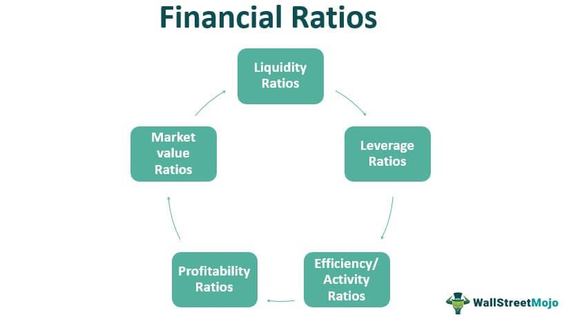

In today's fast-paced financial world, the ability to analyze complex data efficiently plays a crucial role in making informed investment decisions. With the vast amounts of information generated every second, investors must be adept at deciphering and utilizing these data to gain competitive advantages. Financial insights, ratios, investment analysis, and algorithmic trading form the cornerstone of this analytical approach.

Financial ratios offer quantifiable metrics that reveal the underlying health and performance of a company. Key indicators such as the working capital ratio, price-to-earnings (P/E) ratio, and return on equity (ROE) help investors assess operational efficiency, profitability, and risk. By scrutinizing these ratios, investors can identify potential opportunities and pitfalls, which is crucial for making strategic investment decisions.



In tandem with financial ratios, advanced investment analysis techniques, such as intrinsic value assessment and discounted cash flow models, facilitate a deeper understanding of a security's worth. These methods enable investors to compare a company's market valuation with its calculated fair value, thus guiding better investment choices.

Algorithmic trading represents a transformative shift in how investments are executed, utilizing sophisticated computer algorithms to perform trades at high speed and volume. By leveraging historical data and patterns, algorithmic trading ensures more efficient and precise executions. The integration of artificial intelligence and machine learning further refines these trading strategies, opening new frontiers in the pursuit of profit and risk management.

This article explores the intersections of these key financial concepts and their practical applications in modern investment strategies, offering insights into how they collectively contribute to optimizing portfolio performance and achieving financial goals. As the financial landscape continues to evolve, mastering these elements becomes increasingly essential for investors aiming to maintain a competitive edge.

## Table of Contents

## The Importance of Financial Ratios in Investment Analysis

Financial ratios are indispensable tools for assessing a company's financial condition, offering clear insights into its performance, liquidity, and operational efficiency. By providing a quantitative foundation, these ratios enable investors to make informed judgments about potential investments.

**Key Financial Ratios:**

1. **Working Capital Ratio (Current Ratio):** This ratio, defined as $\text{Current Assets} / \text{Current Liabilities}$, measures a company's capacity to fulfill short-term obligations. A ratio above 1 indicates that the company can cover its liabilities, suggesting healthy liquidity and operational stability.

2. **Quick Ratio (Acid-Test Ratio):** A stricter measure of liquidity than the current ratio, the quick ratio excludes inventories from current assets: $\text{(Current Assets - Inventories)} / \text{Current Liabilities}$. This ratio evaluates a company’s ability to meet its short-term obligations using its most liquid assets.

3. **Earnings Per Share (EPS):** EPS is a crucial indicator of a company's profitability, calculated as $\text{(Net Income - Dividends on Preferred Stock)} / \text{Average Outstanding Shares}$. A higher EPS suggests greater profitability and can attract more investors.

4. **Price-to-Earnings (P/E) Ratio:** This ratio assesses a company's current share price relative to its per-share earnings: $\text{Market Value per Share} / \text{Earnings per Share (EPS)}$. A lower P/E may indicate that a stock is undervalued relative to its earnings, while a higher P/E might suggest overvaluation.

5. **Debt-to-Equity (D/E) Ratio:** The D/E ratio evaluates a company’s financial leverage, given by $\text{Total Liabilities} / \text{Shareholders' Equity}$. A high D/E ratio may signal increased risk, as the company is primarily financed by debt, while a lower ratio indicates more conservative financing with a stronger equity base.

6. **Return on Equity (ROE):** ROE measures a corporation's profitability in relation to shareholders' equity: $\text{Net Income} / \text{Shareholders' Equity}$. A higher ROE indicates efficient use of equity capital to generate profits, which is attractive to investors.

**Application and Benefits:**

Understanding and effectively applying these financial ratios helps investors identify undervalued stocks with potential for significant returns. Ratios such as the P/E and ROE provide a relative valuation framework, allowing comparisons within industry standards or against the broader market. Moreover, [liquidity](/wiki/liquidity-risk-premium) ratios like the working capital ratio and quick ratio enable the assessment of a firm's operational risk and liquidity position, thus helping to manage investment risk effectively.

By using these ratios, investors gain critical insights into a company's financial structure and performance metrics, enabling more strategic and informed decision-making in their investment pursuits. Such meticulous analysis can uncover opportunities for competitive advantages in stock selection and risk mitigation, fostering a more robust investment portfolio.

## Advanced Investment Analysis Techniques

Advanced investment analysis techniques play an integral role in evaluating securities beyond basic financial ratios. These methodologies enhance investors’ ability to appraise a security's fair market value compared to its trading price, thereby supporting more informed investment decisions.

**Intrinsic Value Assessment**

Intrinsic value assessment pertains to evaluating an asset's true worth based on [fundamental analysis](/wiki/fundamental-analysis), independent of market valuations. This technique often employs the concept that the intrinsic value equates to the present value of anticipated future cash flows generated by the asset. The Discounted Cash Flow (DCF) model is a preferred method for this evaluation, encapsulating expected cash flows with adjustments for time value and risk. The formula involves:

$$

\text{DCF} = \sum \frac{CF_t}{(1 + r)^t} 
$$

where $CF_t$ represents the expected cash flows at time $t$, and $r$ is the discount rate reflecting the risk-adjusted rate of return.

**Discounted Cash Flow Models**

DCF models serve as a critical tool in estimating the future value of an investment, adjusted for its present value. They enable investors to discern the intrinsic worth of a security by forecasting free cash flows and applying an appropriate discount rate. The accuracy of DCF models rests on the robustness of cash flow projections and the rational derivation of discount rates, usually derived from the Weighted Average Cost of Capital (WACC).

**Relative Valuation Techniques**

Relative valuation operates by comparing a company's financial metrics with those of its peers. Commonly, it leverages multiples such as Price-to-Earnings (P/E), Price-to-Book (P/B), and Enterprise Value-to-EBITDA (EV/EBITDA). These ratios help investors evaluate whether a security is overvalued or undervalued relative to its market contemporaries. For instance, a low P/E ratio might suggest a stock is undervalued if the company's growth prospects align with or exceed industry norms.

**Combining Fundamental Analysis with Ratio Evaluation**

Integrating fundamental analysis with financial ratio evaluation supplies investors with a holistic view. While fundamental analysis scrutinizes a company’s financial statements, management, and market conditions, financial ratios provide a quantitative benchmark for comparing firms. This comprehensive approach optimizes identification of investment potentials and risk management. 

For instance, applying the Gordon Growth Model, a dividend discount model, illustrates how fundamental metrics, including stable growth rates and expected dividends, collaborate with intrinsic value calculations to evaluate equity pricing:

$$

P = \frac{D_1}{r - g} 
$$

where $P$ is the price, $D_1$ the expected dividend next year, $r$ the cost of equity, and $g$ the growth rate.

In conclusion, advanced investment analysis techniques empower investors to detail the underlying value of potential investments against their market prices. By converging comprehensive fundamental analyses and precise financial ratios, investors can exercise superior decision-making prowess, ensuring an accurate reflection of intrinsic asset value and optimizing portfolio strategies.

## Algorithmic Trading: Transforming Investment Practices

Algorithmic trading employs sophisticated computer algorithms to automate and execute trading orders at both high speed and large volumes, significantly enhancing the efficiency and accuracy of trading operations. This method of trading has become prevalent due to its ability to capitalize on minute market fluctuations that are often missed by human traders. Algorithmic trading is driven by strategies rooted in quantitative analysis and data-driven insights, allowing traders to make rapid decisions based on pre-defined criteria.

Among the popular algorithmic strategies, [trend following](/wiki/trend-following) is one of the most well-known. This strategy involves identifying and capitalizing on the [momentum](/wiki/momentum) of asset prices; it assumes that prices will continue moving in their current direction until a definitive reversal point is reached. Statistical [arbitrage](/wiki/arbitrage), another common strategy, relies on the simultaneous buying and selling of correlated securities to exploit pricing inefficiencies. It often employs pairs trading, where two related assets are traded to take advantage of relative valuation differences.

Mean reversion is also a prevalent [algorithmic trading](/wiki/algorithmic-trading) strategy based on the theory that asset prices will eventually revert to their long-term averages. Traders utilizing this approach look for deviations from mean prices and predict a retraction to these average levels, thus capitalizing on the expected price movement. High-frequency trading ([HFT](/wiki/high-frequency-trading-strategies)) represents an aggressive and technologically advanced approach that leverages powerful computers to execute thousands of trades per second, capitalizing on small price differentials with extreme precision.

The incorporation of [artificial intelligence](/wiki/ai-artificial-intelligence) (AI) and [machine learning](/wiki/machine-learning) (ML) into algorithmic trading further transforms its landscape. Machine learning algorithms can analyze immense datasets, recognize complex patterns, and adapt to changing market conditions without human intervention. AI techniques, such as [deep learning](/wiki/deep-learning) and neural networks, provide traders with predictive models that continuously improve upon themselves, facilitating more accurate forecasting and dynamic decision-making.

However, the evolution of algorithmic trading brought new opportunities alongside potential risks. The speed and [volume](/wiki/volume-trading-strategy) at which these systems operate can sometimes result in unprecedented [volatility](/wiki/volatility-trading-strategies) and market anomalies, as seen in occurrences like the "Flash Crash" of 2010. Moreover, the reliance on sophisticated algorithms increases the potential for systemic risks where a technical glitch or erroneous algorithm can lead to substantial financial losses.

Thus, while algorithmic trading offers enhanced trading capabilities and new opportunities for profit, it requires rigorous oversight, robust risk management, and continuous optimization to navigate the complexities of today’s financial markets effectively.

## Analyzing Algorithmic Trading Performance

Evaluating the success of algorithmic trading strategies involves the meticulous consideration of performance metrics, each playing a critical role in understanding the strategy's effectiveness and risk profile. The Sharpe Ratio is a widely-used measure, defined as the average return earned in excess of the risk-free rate per unit of volatility or total risk. It is mathematically expressed as:

$$
\text{Sharpe Ratio} = \frac{E[R] - R_f}{\sigma_R}
$$

where $E[R]$ is the expected return of the portfolio, $R_f$ is the risk-free rate, and $\sigma_R$ is the standard deviation of the portfolio's return. A higher Sharpe Ratio indicates a more attractive risk-adjusted return, providing insights into the risk/reward balance.

Another vital metric is the maximum drawdown, which measures the largest peak-to-trough decline in portfolio value before a new peak is achieved. This indicator helps traders and investors gauge the potential risks associated with a strategy, accounting for the largest potential loss. 

Win rate, or success rate, represents the percentage of trades that result in a profit. While a high win rate is desirable, it must be considered in conjunction with other metrics, as it does not account for the magnitude of wins relative to losses.

The profit [factor](/wiki/factor-investing) is calculated as the ratio between the sum of profits and the sum of losses. A profit factor greater than one suggests that the strategy generates more profit than loss, indicating an overall positive return. Mathematically, it is expressed as:

$$
\text{Profit Factor} = \frac{\text{Sum of Profits}}{\text{Sum of Losses}}
$$

Average trade describes the mean profit or loss per trade over a specific period. It provides a straightforward measure of the strategy’s typical performance over individual transactions.

Regular evaluation of these metrics is crucial to ensure that algorithmic strategies remain aligned with current market conditions. Adapting strategies based on performance assessments helps manage risks effectively, allowing traders to refine their approaches for improved outcomes. Performance evaluation serves as a feedback loop, guiding continuous enhancement of algorithmic strategies for sustained trading success.

## The Synergy Between Financial Ratios and Algorithmic Trading

Integrating financial ratios with algorithmic trading enhances the efficacy of investment strategies by leveraging both fundamental analysis and automated execution capabilities. Financial ratios, such as the price-to-earnings (P/E) ratio, return on equity (ROE), and debt-to-equity (D/E) ratio, provide critical insights into a company's financial health, serving as valuable indicators for identifying promising trading candidates. By assessing these ratios, investors can determine whether a stock is undervalued or has growth potential, paving the way for more informed decision-making in selecting securities for trading algorithms.

Algorithmic trading systems capitalize on these insights by executing trades rapidly and efficiently based on predefined criteria. This speed of execution is crucial in modern markets, where the ability to act on information swiftly can significantly impact profitability. For example, an algorithm could be programmed to buy a stock whenever its P/E ratio falls below a certain threshold and sell when it exceeds another, optimizing trades based on historical performance and market conditions.

Consider the following simple Python example of an algorithm that initiates trades based on P/E ratio:

```python
def evaluate_trade(pe_ratio, lower_threshold, upper_threshold):
    if pe_ratio < lower_threshold:
        return "Buy"
    elif pe_ratio > upper_threshold:
        return "Sell"
    else:
        return "Hold"

# Example usage
current_pe = 15
buy_threshold = 10
sell_threshold = 20
trade_decision = evaluate_trade(current_pe, buy_threshold, sell_threshold)
print(f"Trade decision: {trade_decision}")
```

This code snippet demonstrates how a basic algorithm can be structured to make trading decisions based on financial ratios, facilitating swift and objective responses to market dynamics.

The synergy between financial ratios and algorithmic trading systems extends to risk management and portfolio optimization. By leveraging quantitative data and rapid computation, investors can manage risks more effectively, balancing potential returns with volatility. Algorithmic strategies can incorporate various risk metrics, ensuring that trading remains aligned with predefined risk tolerance levels, thus safeguarding investment objectives.

Moreover, this integrated approach allows for continuous monitoring and adjustment of trading strategies in response to changing market conditions. Algorithms can be updated with new financial data and trends, ensuring that trades are executed with the latest insights, minimizing human error and bias. This dynamic interplay between financial analysis and technology not only enhances returns but also offers a disciplined framework for executing complex investment strategies.

## Conclusion

Financial insights, ratios, investment analysis, and algorithmic trading collectively form the foundational pillars of modern investment strategies. Their integration enables investors to navigate the complexities of financial markets with enhanced precision and confidence. By effectively combining these elements, investors can unlock a comprehensive understanding of market dynamics, thereby improving their ability to identify lucrative opportunities and mitigate associated risks.

Harnessing financial ratios provides a critical lens through which the financial health and performance of potential investments can be assessed. These ratios, when used in conjunction with advanced investment analysis techniques such as intrinsic value assessment and relative valuation, allow investors to make informed decisions about asset selection. Algorithmic trading adds another layer of sophistication, facilitating high-speed trade execution that capitalizes on transient market inefficiencies.

The synergy achieved through the convergence of these disciplines empowers investors to formulate robust strategies that are both data-driven and efficient. As the financial environment evolves, continuous learning and adaptation in these domains are paramount. Staying informed about technological advancements in algorithmic trading, changing market conditions, and new analytical methodologies is essential for maintaining a competitive edge.

In conclusion, integrating financial insights, ratios, investment analysis, and algorithmic trading offers a multidimensional approach to investment strategies, increasing the potential for sustained success. Investors who embrace these tools and continuously refine their knowledge and skills are better positioned to capitalize on market opportunities and enhance portfolio performance in an ever-competitive financial landscape.

## References & Further Reading

[1]: Peters, Z. S. (2015). ["Financial Ratio Analysis: A Guide to Tracking Growth, Profitability, and Risk."](https://link.springer.com/chapter/10.1007/978-3-030-44711-3_17) Self-published.

[2]: ["The Intelligent Investor: The Definitive Book on Value Investing."](https://www.amazon.com/Intelligent-Investor-Third-Definitive-Investing/dp/0063423537) by Benjamin Graham

[3]: ["Fundamentals of Financial Management"](https://faculty.cengage.com/titles/9781337902571) by Eugene F. Brigham and Joel F. Houston

[4]: Sharpe, William F. (1994). ["The Sharpe Ratio."](https://web.stanford.edu/~wfsharpe/art/sr/SR.htm) The Journal of Portfolio Management, 21(1), 49-58.

[5]: ["Algorithmic Trading and DMA: An Introduction to Direct Access Trading Strategies"](https://archive.org/details/algorithmictradi0000john) by Barry Johnson