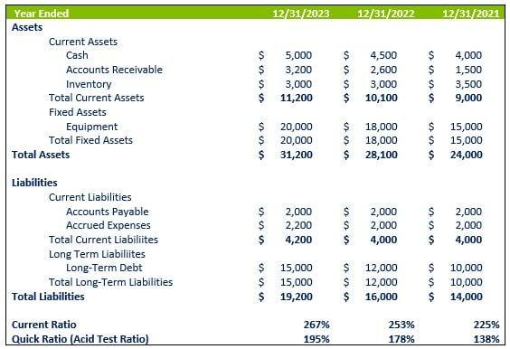

## Table of Contents

## What are financial ratios and why are they important in manufacturing?

Financial ratios are tools that help businesses understand their financial health by comparing different numbers from their financial statements. They show how well a company is doing in areas like making money, managing debt, and using its assets. For example, a ratio might tell you how much profit a company makes for every dollar it earns in sales, or how quickly it can pay off its debts.

In manufacturing, financial ratios are very important because they help managers and investors see how efficiently the company is running. Manufacturing involves a lot of money spent on machines, materials, and labor, so it's crucial to know if these investments are paying off. Ratios can show if a company is using its machines and materials well, if it's making enough profit to cover its costs, and if it's in a good position to grow or borrow money. By keeping an eye on these ratios, manufacturing companies can make better decisions to improve their operations and stay competitive.

## How do financial ratios help in assessing the financial health of a manufacturing company?

Financial ratios help assess the financial health of a manufacturing company by showing how well it is managing its money and resources. For example, the current ratio tells if the company has enough money and assets to pay its short-term bills. If this ratio is high, it means the company can easily cover its debts, which is a good sign of financial health. Another important ratio is the inventory turnover ratio, which shows how quickly the company is selling its products. A high turnover means the company is efficient at turning its inventory into sales, which is crucial for a manufacturing business.

Another set of ratios that are key for manufacturing companies are those related to profitability, like the gross profit margin and net profit margin. These ratios tell us how much money the company keeps after paying for the costs of making its products and running the business. A healthy profit margin means the company is good at controlling its costs and making money from its sales. Lastly, the return on assets (ROA) ratio shows how well the company is using its machines and equipment to make a profit. A high ROA means the company is using its assets efficiently, which is vital for a manufacturing company where a lot of money is tied up in machinery and equipment.

## What are the key financial ratios used specifically in the manufacturing industry?

In the manufacturing industry, several key financial ratios help to assess how well a company is doing. One important ratio is the inventory turnover ratio, which shows how fast a company sells its products. A high number means the company is good at turning its stock into sales, which is very important in manufacturing because it shows the company is not holding onto products for too long. Another useful ratio is the gross profit margin, which tells us how much money the company makes after paying for the costs of making its products. A high gross profit margin means the company is good at controlling its production costs and making money from its sales.

Another key ratio is the return on assets (ROA), which shows how well the company is using its machines and equipment to make a profit. A high ROA means the company is using its assets efficiently, which is crucial in manufacturing where a lot of money is spent on machinery. The current ratio is also important because it shows if the company has enough money and assets to pay its short-term bills. A high current ratio means the company can easily cover its debts, which is a good sign of financial health. These ratios together give a clear picture of how well a manufacturing company is managing its money and resources.

## How do you calculate the Current Ratio and what does it indicate about a manufacturing firm's liquidity?

The Current Ratio is calculated by dividing a company's current assets by its current liabilities. Current assets include things like cash, inventory, and accounts receivable, which are things the company expects to turn into cash within a year. Current liabilities are the company's debts that it needs to pay within a year, like bills and short-term loans. So, if a manufacturing firm has $500,000 in current assets and $250,000 in current liabilities, its Current Ratio would be $500,000 divided by $250,000, which equals 2. This means the company has twice as many current assets as current liabilities.

The Current Ratio tells us about a manufacturing firm's [liquidity](/wiki/liquidity-risk-premium), or its ability to pay its short-term debts. A higher Current Ratio means the company has more assets that it can quickly turn into cash to pay off its bills. For a manufacturing firm, a Current Ratio of 2 or higher is often seen as a good sign because it shows the company can easily cover its short-term debts. But if the ratio is too high, it might mean the company is not using its assets efficiently. On the other hand, a low Current Ratio might mean the company could struggle to pay its bills on time, which could be a warning sign for investors and managers.

## What is the Debt-to-Equity Ratio and how does it apply to manufacturing businesses?

The Debt-to-Equity Ratio is a way to see how much a company is borrowing compared to what the owners have put into the business. You find it by dividing the company's total debts by the total equity, which is the money from the owners and the profits kept in the business. A high Debt-to-Equity Ratio means the company is using a lot of borrowed money, which can be risky because it has to pay back those loans with interest. A low ratio means the company is using less debt and more of its own money, which is usually safer.

For manufacturing businesses, the Debt-to-Equity Ratio is important because these companies often need a lot of money to buy machines and materials. If a manufacturing company has a high Debt-to-Equity Ratio, it might mean it's taking big risks to grow or keep running. This can be okay if the company is making enough money to pay back the loans, but it's risky if things go wrong. On the other hand, a low ratio might mean the company is being careful and not taking on too much debt, which can be good for long-term stability but might slow down growth if the company doesn't have enough money to invest in new projects or equipment.

## How can the Inventory Turnover Ratio be used to improve efficiency in manufacturing?

The Inventory Turnover Ratio helps manufacturing companies see how fast they are selling their products. You find it by dividing the cost of goods sold by the average inventory. If this number is high, it means the company is good at turning its stock into sales, which is important in manufacturing because it shows the company is not holding onto products for too long. This can help the company use its money better because it's not tied up in unsold products.

By looking at the Inventory Turnover Ratio, a manufacturing company can find ways to improve how it works. If the ratio is low, it might mean the company is making too much of a product that isn't selling well. The company can then change what it makes or how much it makes to match what customers want. This can help the company save money and work more efficiently. Keeping an eye on this ratio helps the company make smart decisions about what to produce and when, leading to better use of resources and more profit.

## What does the Gross Profit Margin tell us about a manufacturing company's profitability?

The Gross Profit Margin tells us how much money a manufacturing company makes after paying for the costs of making its products. It is calculated by subtracting the cost of goods sold from the total revenue and then dividing that number by the total revenue. A high Gross Profit Margin means the company is good at controlling its production costs and making money from its sales. For example, if a company sells a product for $100 and it costs $60 to make, the gross profit is $40, and the Gross Profit Margin is 40%.

For a manufacturing company, having a healthy Gross Profit Margin is important because it shows how well the company is doing at making money from what it produces. If the margin is low, it might mean the company is spending too much on making its products or not charging enough for them. By keeping an eye on the Gross Profit Margin, the company can make changes to improve its profitability, like finding cheaper materials, making the production process more efficient, or adjusting the prices of its products.

## How does the Return on Assets (ROA) ratio help in evaluating a manufacturing company's performance?

The Return on Assets (ROA) ratio helps a manufacturing company see how well it is using its machines and other stuff to make money. You find the ROA by dividing the company's profit by how much all its stuff is worth. A high ROA means the company is good at turning its machines and equipment into profits. This is really important for a manufacturing company because they spend a lot of money on big machines and tools.

If a manufacturing company has a high ROA, it shows that the company is using its money wisely. It means the company is making good choices about what machines to buy and how to use them to make products that people want to buy. On the other hand, if the ROA is low, it might mean the company needs to think about how it can use its machines better or maybe even buy different ones to make more money. Keeping an eye on the ROA helps the company make smart decisions to keep growing and making profits.

## What advanced financial ratios should manufacturing executives monitor for strategic decision-making?

Manufacturing executives should keep an eye on the Operating Margin to see how well the company is managing its day-to-day costs. This ratio is found by taking the operating income and dividing it by the total revenue. A high Operating Margin means the company is good at controlling its costs and making money from its operations. This can help executives decide if they need to cut costs or maybe even invest more in new projects. It's like checking if the company's daily work is paying off.

Another important ratio is the Asset Turnover Ratio, which shows how well the company is using its machines and equipment to make sales. You find this by dividing the total sales by the total assets. A high Asset Turnover Ratio means the company is using its stuff efficiently to make money. This can help executives decide if they should buy more machines or maybe sell some if they're not being used well. It's all about making sure the company's big investments are working hard to bring in sales.

Lastly, the Debt Service Coverage Ratio (DSCR) is crucial for understanding if the company can handle its debt payments. You calculate this by dividing the company's net operating income by its total debt service. A high DSCR means the company can easily pay its debts, which is important for planning future borrowing or investments. It helps executives decide if it's safe to take on more debt for growth or if they need to focus on paying down what they already owe.

## How can financial ratios be used to benchmark a manufacturing company against its competitors?

Financial ratios can help a manufacturing company see how it's doing compared to other companies in the same business. By looking at ratios like the Gross Profit Margin, a company can find out if it's making more or less money from its sales than its competitors. If the company's Gross Profit Margin is lower, it might mean it's spending too much to make its products or not charging enough for them. This can help the company decide if it needs to change its prices or find cheaper ways to make things.

Another way to use financial ratios for benchmarking is by looking at the Return on Assets (ROA). This ratio shows how well a company is using its machines and equipment to make a profit. If a company's ROA is lower than its competitors, it might mean it's not using its stuff as well as it could. This can help the company figure out if it needs to buy better machines or use the ones it has more efficiently. By comparing these ratios, a manufacturing company can see where it stands and make smart choices to do better than its competitors.

## What are the limitations of using financial ratios in the manufacturing sector, and how can these be mitigated?

Using financial ratios in the manufacturing sector can have some limitations. One big problem is that ratios only give a snapshot of the company's financial health at a certain time. They don't show changes over time or give the full story of why things are the way they are. Also, different companies might calculate ratios differently, which can make it hard to compare them fairly. Plus, ratios don't take into account things like new technology or changes in the market that can affect a company's performance.

To make up for these limitations, manufacturing companies can use financial ratios along with other ways of looking at their business. For example, they can look at trends over time, not just one moment, to see how things are changing. They can also use industry standards to make sure they're comparing apples to apples when looking at other companies. And by keeping an eye on the bigger picture, like what's happening in the market or with new technology, they can get a better idea of their overall performance and make smarter decisions.

## How can predictive analytics be integrated with financial ratios to forecast future performance in manufacturing?

Predictive analytics can be a powerful tool when used with financial ratios to help manufacturing companies guess what might happen in the future. By looking at past data, predictive analytics can spot patterns and trends that might not be clear just from looking at financial ratios alone. For example, if a company's inventory turnover ratio has been going up over time, predictive analytics can use this trend to guess what the ratio might be in the next few months or years. This can help the company plan better for how much to make and when to make it, so they don't have too much stuff sitting around that they can't sell.

Using predictive analytics with financial ratios can also help manufacturing companies see risks and chances to do better. If the debt-to-equity ratio is getting higher, predictive analytics can look at other data, like market trends or how the economy is doing, to guess if this trend will keep going and what it might mean for the company's future. By understanding these patterns, the company can make smart choices about borrowing money or paying off debts. This way, they can be ready for what might happen and take steps to keep their business strong and growing.

## What are the key financial ratios to understand in manufacturing?

Financial ratios are quantitative tools used universally in business analysis to evaluate a company's financial health and operational efficiency. They distill complex financial statements into comprehensible metrics, providing insights that facilitate comparisons across time periods and industry standards. In the context of manufacturing, specific financial ratios are crucial for comprehensively understanding productivity, cost management, and profitability.

### Key Ratios for Manufacturing Companies

**Inventory Turnover Ratio**  

Inventory Turnover is a vital metric for manufacturing firms, indicating how frequently the company sells and replaces its inventory over a certain period. This ratio is calculated as:

$$
\text{Inventory Turnover} = \frac{\text{Cost of Goods Sold (COGS)}}{\text{Average Inventory}}
$$

A high turnover ratio implies efficient inventory management, signifying that the firm is proficient in converting inventory into sales. Conversely, a low turnover might suggest overstocking or possible obsolescence, tying up capital that could be used elsewhere in the business.

**Maintenance Costs to Total Expenses**

This ratio measures the proportion of total expenses dedicated to maintaining machinery, underscoring the efficiency of machinery asset management. It is calculated by:

$$
\text{Maintenance Costs to Total Expenses} = \frac{\text{Total Maintenance Costs}}{\text{Total Expenses}}
$$

A lower ratio is typically favorable, indicating reduced machinery downtime and efficient asset utilization. Such efficiency can lead to cost savings and improved production timelines.

**Revenue Per Employee**

The Revenue Per Employee ratio evaluates workforce productivity, linking revenue generation directly to workforce size. It is expressed as:

$$
\text{Revenue Per Employee} = \frac{\text{Total Revenue}}{\text{Number of Employees}}
$$

Higher revenue per employee indicates effective workforce deployment and operational efficiency, reflecting well on management's ability to maximize employee output.

**Manufacturing Costs to Total Expenses**

This ratio portrays the allocation of expenses towards manufacturing operations relative to overall expenditures. It is expressed as:

$$
\text{Manufacturing Costs to Total Expenses} = \frac{\text{Total Manufacturing Costs}}{\text{Total Expenses}}
$$

Analyzing this ratio helps understand the cost structure of the manufacturing process and identify potential areas for cost optimization.

### Contribution to Efficiency, Profitability, and Financial Health

These ratios collectively provide a comprehensive snapshot of a manufacturing entity's efficiency, profitability, and overall financial health. Inventory turnover offers insights into operational efficiency and working capital management, while maintenance costs highlight the effectiveness of machinery use. Revenue per employee centers on human capital productivity, and manufacturing costs give a direct view of cost management strategies. Together, they form an interconnected web of insights crucial for strategic decision-making.

### Empowering Investors and Traders

For investors and traders, these financial ratios serve as foundational elements in building well-informed investment strategies. High inventory turnover and efficient maintenance management may signal strong operational health, making a company an attractive investment. Conversely, frequent fluctuations in these ratios could warrant caution, indicating underlying operational inefficiencies or market challenges.

Financial ratios are indispensable in the manufacturing industry, providing a quantitative basis that aids investors and traders in discerning patterns, forecasting future performance, and constructing [algorithmic trading](/wiki/algorithmic-trading) models.

## What are the key ratios for manufacturing companies that one should explore in a deep dive?

Inventory turnover is a critical ratio for evaluating how efficiently a manufacturing company manages its inventory. It is calculated as the cost of goods sold (COGS) divided by the average inventory during a period. The formula is:

$$
\text{Inventory Turnover} = \frac{\text{Cost of Goods Sold}}{\text{Average Inventory}}
$$

A high inventory turnover ratio indicates that a company is effectively managing its inventory levels and minimizing holding costs. This efficiency can lead to improved cash flow and reduced risk of obsolete stock. Conversely, a low ratio may suggest overstocking or inefficiencies in sales or production processes.

### Maintenance Costs to Total Expenses

This ratio gauges machinery efficiency and strategic asset management by comparing maintenance expenses to the total operating expenses. The formula is:

$$
\text{Maintenance Costs to Total Expenses} = \frac{\text{Maintenance Costs}}{\text{Total Operating Expenses}}
$$

Lower ratios suggest effective maintenance strategies and well-maintained equipment, leading to fewer breakdowns and improved productivity. Conversely, higher ratios may indicate excessive maintenance spending or aging equipment requiring frequent repairs. Efficient maintenance strategies not only optimize operating expenses but also extend the lifespan of critical assets.

### Revenue Per Employee Ratio

The Revenue Per Employee Ratio provides insight into workforce productivity and equipment utilization, calculated by dividing a company's total revenue by its number of employees:

$$
\text{Revenue Per Employee} = \frac{\text{Total Revenue}}{\text{Number of Employees}}
$$

Higher values suggest that the company leverages its workforce efficiently, potentially benefiting from effective staff training, technology utilization, or process optimization. This ratio can be particularly beneficial in assessing how well a company uses its human resources in conjunction with its equipment to generate revenue.

### Manufacturing Costs to Total Expenses

Examining the proportion of manufacturing costs in the context of total expenses helps analyze cost structures and optimize operational expenses. The ratio can be expressed mathematically as:

$$
\text{Manufacturing Costs to Total Expenses} = \frac{\text{Manufacturing Costs}}{\text{Total Operating Expenses}}
$$

This ratio identifies the extent to which manufacturing costs contribute to overall expenses, assisting in pinpointing areas where cost efficiencies can be realized. By targeting reductions in manufacturing costs, a company can enhance its competitiveness and profitability.

Together, these key financial ratios offer insights into various facets of a manufacturing company's operations, guiding strategic decision-making and operational improvements.

## References & Further Reading

[1]: ["Financial Ratio Analysis: Definition, Types, Examples"](https://www.investopedia.com/terms/r/ratioanalysis.asp) by Investopedia.

[2]: ["Advances in Financial Machine Learning"](https://www.amazon.com/Advances-Financial-Machine-Learning-Marcos/dp/1119482089) by Marcos Lopez de Prado

[3]: ["Quantitative Trading: How to Build Your Own Algorithmic Trading Business"](https://www.amazon.com/Quantitative-Trading-Build-Algorithmic-Business/dp/1119800064) by Ernest P. Chan

[4]: Sharpe, W. F. (1994). ["The Sharpe Ratio."](https://web.stanford.edu/~wfsharpe/art/sr/SR.htm) The Journal of Portfolio Management, 21(1), 49-58.

[5]: ["Machine Learning for Algorithmic Trading"](https://github.com/stefan-jansen/machine-learning-for-trading) by Stefan Jansen.

[6]: Porter, M. E. (1998). ["Competitive Advantage: Creating and Sustaining Superior Performance."](https://www.hbs.edu/faculty/Pages/item.aspx?num=193) Free Press.

[7]: ["Financial Ratios"](https://corporatefinanceinstitute.com/resources/accounting/financial-ratios/) by CFA Institute.