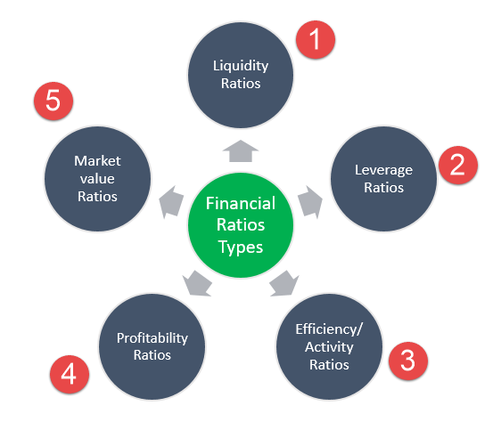

Financial analysis plays a pivotal role in the manufacturing industry, offering critical insights into operational efficiency, financial health, and overall performance. The manufacturing sector, characterized by complex supply chains, significant capital investments, and substantial variable costs, relies heavily on rigorous financial analysis to maintain competitiveness and sustainability. Key financial metrics and ratios serve as indispensable tools for executives and stakeholders, enabling them to evaluate and enhance operational processes, cost management, and profitability.

Financial ratios, such as Inventory Turnover, Maintenance Costs to Total Expenses, and Revenue Per Employee, are essential for assessing various aspects of manufacturing performance. These ratios provide quantitative measurements that help in understanding the effectiveness of inventory management, cost structure efficiency, and workforce productivity. For instance, the Inventory Turnover ratio, calculated as the cost of goods sold divided by average inventory, helps businesses understand how effectively inventory is being managed. High turnover rates indicate efficient inventory management, reducing holding costs and minimizing obsolescence risks.



Algorithmic trading, a technique that uses computer algorithms to automate trading decisions, intersects significantly with financial analysis. By leveraging financial ratios and metrics, algorithmic trading models can make well-informed and timely investment decisions. These models utilize historical and real-time financial data to predict future market trends, optimizing the execution of trades in the manufacturing sector. The quantitative nature of financial ratios makes them ideal for integration into these algorithmic systems, enhancing the precision and effectiveness of trading strategies.

The purpose of this article is to explore critical financial ratios, their importance in evaluating manufacturing industry performance, and their application within algorithmic trading contexts. By understanding these ratios, investors and traders can develop more nuanced and data-driven investment strategies, ultimately aiming for improved decision-making processes in both the financial and manufacturing landscapes.

## Table of Contents

## Understanding Key Financial Ratios in Manufacturing

Financial ratios are quantitative tools used universally in business analysis to evaluate a company's financial health and operational efficiency. They distill complex financial statements into comprehensible metrics, providing insights that facilitate comparisons across time periods and industry standards. In the context of manufacturing, specific financial ratios are crucial for comprehensively understanding productivity, cost management, and profitability.

### Key Ratios for Manufacturing Companies

**Inventory Turnover Ratio**  

Inventory Turnover is a vital metric for manufacturing firms, indicating how frequently the company sells and replaces its inventory over a certain period. This ratio is calculated as:

$$
\text{Inventory Turnover} = \frac{\text{Cost of Goods Sold (COGS)}}{\text{Average Inventory}}
$$

A high turnover ratio implies efficient inventory management, signifying that the firm is proficient in converting inventory into sales. Conversely, a low turnover might suggest overstocking or possible obsolescence, tying up capital that could be used elsewhere in the business.

**Maintenance Costs to Total Expenses**

This ratio measures the proportion of total expenses dedicated to maintaining machinery, underscoring the efficiency of machinery asset management. It is calculated by:

$$
\text{Maintenance Costs to Total Expenses} = \frac{\text{Total Maintenance Costs}}{\text{Total Expenses}}
$$

A lower ratio is typically favorable, indicating reduced machinery downtime and efficient asset utilization. Such efficiency can lead to cost savings and improved production timelines.

**Revenue Per Employee**

The Revenue Per Employee ratio evaluates workforce productivity, linking revenue generation directly to workforce size. It is expressed as:

$$
\text{Revenue Per Employee} = \frac{\text{Total Revenue}}{\text{Number of Employees}}
$$

Higher revenue per employee indicates effective workforce deployment and operational efficiency, reflecting well on management's ability to maximize employee output.

**Manufacturing Costs to Total Expenses**

This ratio portrays the allocation of expenses towards manufacturing operations relative to overall expenditures. It is expressed as:

$$
\text{Manufacturing Costs to Total Expenses} = \frac{\text{Total Manufacturing Costs}}{\text{Total Expenses}}
$$

Analyzing this ratio helps understand the cost structure of the manufacturing process and identify potential areas for cost optimization.

### Contribution to Efficiency, Profitability, and Financial Health

These ratios collectively provide a comprehensive snapshot of a manufacturing entity's efficiency, profitability, and overall financial health. Inventory turnover offers insights into operational efficiency and working capital management, while maintenance costs highlight the effectiveness of machinery use. Revenue per employee centers on human capital productivity, and manufacturing costs give a direct view of cost management strategies. Together, they form an interconnected web of insights crucial for strategic decision-making.

### Empowering Investors and Traders

For investors and traders, these financial ratios serve as foundational elements in building well-informed investment strategies. High inventory turnover and efficient maintenance management may signal strong operational health, making a company an attractive investment. Conversely, frequent fluctuations in these ratios could warrant caution, indicating underlying operational inefficiencies or market challenges.

Financial ratios are indispensable in the manufacturing industry, providing a quantitative basis that aids investors and traders in discerning patterns, forecasting future performance, and constructing [algorithmic trading](/wiki/algorithmic-trading) models.

## Deep Dive: Key Ratios for Manufacturing Companies

Inventory turnover is a critical ratio for evaluating how efficiently a manufacturing company manages its inventory. It is calculated as the cost of goods sold (COGS) divided by the average inventory during a period. The formula is:

$$
\text{Inventory Turnover} = \frac{\text{Cost of Goods Sold}}{\text{Average Inventory}}
$$

A high inventory turnover ratio indicates that a company is effectively managing its inventory levels and minimizing holding costs. This efficiency can lead to improved cash flow and reduced risk of obsolete stock. Conversely, a low ratio may suggest overstocking or inefficiencies in sales or production processes.

### Maintenance Costs to Total Expenses

This ratio gauges machinery efficiency and strategic asset management by comparing maintenance expenses to the total operating expenses. The formula is:

$$
\text{Maintenance Costs to Total Expenses} = \frac{\text{Maintenance Costs}}{\text{Total Operating Expenses}}
$$

Lower ratios suggest effective maintenance strategies and well-maintained equipment, leading to fewer breakdowns and improved productivity. Conversely, higher ratios may indicate excessive maintenance spending or aging equipment requiring frequent repairs. Efficient maintenance strategies not only optimize operating expenses but also extend the lifespan of critical assets.

### Revenue Per Employee Ratio

The Revenue Per Employee Ratio provides insight into workforce productivity and equipment utilization, calculated by dividing a company's total revenue by its number of employees:

$$
\text{Revenue Per Employee} = \frac{\text{Total Revenue}}{\text{Number of Employees}}
$$

Higher values suggest that the company leverages its workforce efficiently, potentially benefiting from effective staff training, technology utilization, or process optimization. This ratio can be particularly beneficial in assessing how well a company uses its human resources in conjunction with its equipment to generate revenue.

### Manufacturing Costs to Total Expenses

Examining the proportion of manufacturing costs in the context of total expenses helps analyze cost structures and optimize operational expenses. The ratio can be expressed mathematically as:

$$
\text{Manufacturing Costs to Total Expenses} = \frac{\text{Manufacturing Costs}}{\text{Total Operating Expenses}}
$$

This ratio identifies the extent to which manufacturing costs contribute to overall expenses, assisting in pinpointing areas where cost efficiencies can be realized. By targeting reductions in manufacturing costs, a company can enhance its competitiveness and profitability.

Together, these key financial ratios offer insights into various facets of a manufacturing company's operations, guiding strategic decision-making and operational improvements.

## Application of Financial Ratios in Algorithmic Trading

Financial ratios serve as essential metrics in the creation of algorithmic trading strategies, offering quantifiable insights that are crucial for understanding market conditions and making informed investment decisions. By analyzing key financial ratios, investors can assess a company's performance, particularly in the manufacturing sector, providing a data-driven foundation for algorithmic models.

**Integration of Financial Ratios in Predictive Modeling and Trend Analysis**

Financial ratios can be integrated into predictive models to forecast future price movements and market trends. Ratios such as Inventory Turnover and Revenue Per Employee provide a snapshot of operational efficiency and can be used to develop financial models that predict stock performance. For example, a decreasing Inventory Turnover may indicate overstocking or declining sales, potentially forecasting a dip in stock value. By feeding historical ratio data into [machine learning](/wiki/machine-learning) algorithms, traders can train models to detect patterns that precede stock price changes.

```python
import pandas as pd
from sklearn.model_selection import train_test_split
from sklearn.ensemble import RandomForestRegressor
from sklearn.metrics import mean_squared_error

# Load financial data
data = pd.read_csv('financial_ratios.csv')

# Features and target variable
X = data[['Inventory Turnover', 'Revenue Per Employee', 'Maintenance Costs to Total Expenses']]
y = data['Future Stock Price']

# Split the data
X_train, X_test, y_train, y_test = train_test_split(X, y, test_size=0.2, random_state=42)

# Train a RandomForest model
model = RandomForestRegressor(n_estimators=100, random_state=42)
model.fit(X_train, y_train)

# Predict and evaluate
y_pred = model.predict(X_test)
print(f'Mean Squared Error: {mean_squared_error(y_test, y_pred)}')
```

**Automating Investment Decisions Based on Manufacturing Sector Forecasts**

With algorithmic trading, investment decisions can be automated by utilizing a set of predefined rules and strategies based on financial ratios. For instance, if a model predicts a favorable trend in a company's Revenue Per Employee ratio, the algorithm can automatically trigger buy orders. On the other hand, a rising trend in the Maintenance Costs to Total Expenses ratio might signal increasing operational inefficiencies, prompting the algorithm to execute sell orders.

**Case Study: Implementing a Trading Strategy Using Manufacturing Financial Ratios**

Consider a trading strategy focused on the manufacturing sector, using financial ratios as key indicators. This strategy would involve continuously monitoring selected ratios and their changes over time. If a company reports an improvement in its Inventory Turnover ratio for several consecutive periods, the algorithm could signal a buy opportunity, assuming this reflects enhanced demand for products or improved inventory management.

```python
def trading_strategy(inventory_turnover, revenue_per_employee, maintenance_costs_ratio):
    # Example trading strategy based on financial ratios
    if inventory_turnover > 5.0 and revenue_per_employee > 70000:
        return 'Buy'
    elif maintenance_costs_ratio > 0.2:
        return 'Sell'
    else:
        return 'Hold'

# Example usage
decision = trading_strategy(inventory_turnover=6.5, revenue_per_employee=75000, maintenance_costs_ratio=0.15)
print(decision)  # Output: 'Buy'
```

By incorporating these metrics, traders not only enhance the precision of their trading decisions but also leverage the extensive analysis of financial health obtainable through these ratios. As the manufacturing landscape evolves, these strategies provide an adaptive edge in navigating complex financial markets.

## Limitations and Challenges

Financial ratios are indispensable tools in evaluating the performance of manufacturing companies; however, they come with inherent limitations. One significant limitation is that financial ratios primarily focus on quantitative data, often neglecting qualitative factors such as market conditions. For instance, a company may have favorable financial ratios, yet still face challenges due to external factors like changes in consumer preferences, regulatory shifts, or technological advancements. These qualitative aspects can significantly impact a company's future performance and are not captured by financial ratios alone.

Another critical limitation of financial ratio analysis is the reliance on historical data. Financial ratios are typically calculated using past financial statements, which may not accurately reflect current or future market dynamics. Markets are inherently dynamic, influenced by various factors such as economic cycles, geopolitical events, and innovations. Consequently, relying solely on historical data can lead to erroneous conclusions and suboptimal decision-making. For example, high inventory turnover might suggest efficient inventory management historically, but might overlook impending supply chain disruptions that could alter this metric drastically.

In addition to the challenges posed by the nature of the data, there are practical difficulties in the data collection process that can affect the accuracy of financial information. Financial data collection requires meticulous attention to detail and consistency. Inconsistencies in accounting practices, variations in cost allocation, and timing differences can lead to inaccurate or misleading ratios. Particularly for global manufacturing firms, variations in accounting standards and practices across different jurisdictions can add layers of complexity, making it challenging to draw reliable comparisons.

Addressing these limitations involves incorporating qualitative factors into analysis and ensuring rigorous data collection methodologies. By doing so, analysts can mitigate some of these challenges and use financial ratios more effectively in evaluating manufacturing companies.

## Future Directions and Best Practices

To effectively utilize financial ratios in the manufacturing industry, several best practices and future advancements should be considered.

### Best Practices for Using Financial Ratios

1. **Comprehensive Ratio Analysis**: Manufacturing companies should employ a broad spectrum of financial ratios to gain a holistic view of their operational and financial health. This approach includes not only common ratios like Inventory Turnover and Revenue Per Employee but also sector-specific ratios that address the unique challenges of manufacturing, such as Maintenance Costs to Total Expenses.

2. **Customization and Benchmarking**: Tailor financial ratio analysis to specific organizational needs and industry standards. Benchmark these ratios against competitors and industry leaders to identify strengths and areas for improvement.

3. **Continuous Monitoring and Adjustment**: Financial ratios should be monitored continuously rather than periodically. This ongoing analysis allows for real-time insights and quicker response times to financial or operational issues.

4. **Integrating Qualitative Insights**: While financial ratios provide quantitative data, they should be complemented with qualitative insights such as market trends, regulatory changes, and technological advancements.

5. **Data Quality and Integrity**: Ensure accuracy in financial data collection and maintenance. Reliable data is the foundation for valid ratio analysis and subsequent decision-making.

### Advancements in Technology

1. **Artificial Intelligence and Machine Learning**: AI and machine learning are revolutionizing financial analysis by automating traditional tasks such as data entry, reconciliation, and preliminary analysis. These technologies can identify patterns and anomalies in financial data, enhance the predictive accuracy of financial models, and facilitate real-time decision-making.

   - **Example Python Code**:
     ```python
     from sklearn.ensemble import RandomForestRegressor
     from sklearn.model_selection import train_test_split
     from sklearn.metrics import mean_squared_error

     # Sample data and labels
     X, y = manufacturing_data.drop('target', axis=1), manufacturing_data['target']

     # Train-test split
     X_train, X_test, y_train, y_test = train_test_split(X, y, test_size=0.2, random_state=42)

     # Implementing RandomForest for predictive analysis
     model = RandomForestRegressor(n_estimators=100, random_state=42)
     model.fit(X_train, y_train)
     predictions = model.predict(X_test)

     # Evaluate model
     mse = mean_squared_error(y_test, predictions)
     print(f'Mean Squared Error: {mse}')
     ```

2. **Blockchain and Data Security**: Blockchain technology can ensure the accuracy and security of financial data, providing an immutable ledger that enhances trust and transparency in financial reporting.

3. **Advanced Data Analytics Tools**: Bespoke analytics platforms equipped with advanced capabilities such as natural language processing can handle vast amounts of unstructured data, providing insights into market sentiment and competitor strategy.

### Future of Integrating Financial Analytics with Algorithmic Trading

1. **Dynamic Trading Models**: The integration of financial ratios with algorithmic trading strategies is expected to become more sophisticated, incorporating machine learning models that adapt to evolving market conditions and manufacturing sector changes.

2. **Predictive Analytics**: By integrating comprehensive financial analytics with real-time data streams, companies can forecast market trends, production cycles, and resource allocations more accurately, enhancing trading strategy precision.

3. **Collaborative Platforms**: Emerging platforms that combine financial ratio analysis with collaborative tools allow teams to work across departments, blending financial insights with strategic operations and supply chain management, further enriching algorithmic trading insights.

The future of financial ratio application in manufacturing is bright, driven by technological advancements that offer more refined, real-time, and predictive insights, empowering data-driven decision-making and trading strategies.

## Conclusion

Key financial ratios are indispensable tools for assessing manufacturing efficiency and profitability. They allow stakeholders to evaluate how well a manufacturing company manages its assets, controls costs, and maximizes productivity. Metrics such as Inventory Turnover and Revenue Per Employee serve as benchmarks that reflect operational performance and financial health. By closely monitoring these ratios, companies can identify areas for improvement and make data-driven decisions to optimize their manufacturing processes.

In algorithmic trading models, these financial ratios provide essential quantitative insights that aid in predicting market trends and automating investment decisions. They empower traders to construct sophisticated algorithms that react dynamically to economic indicators from the manufacturing sector, thereby enhancing the precision and reliability of trading strategies.

As technology progresses, continuous learning and adaptation of new tools are necessary for maintaining a competitive edge in both financial analysis and trading. The integration of [artificial intelligence](/wiki/ai-artificial-intelligence) and machine learning is particularly promising, as these technologies can refine predictive models and bring deeper insights into financial data. Embracing these advancements will ensure that stakeholders stay informed and agile in a rapidly evolving market landscape.

## References & Further Reading

[1]: ["Financial Ratio Analysis: Definition, Types, Examples"](https://www.investopedia.com/terms/r/ratioanalysis.asp) by Investopedia.

[2]: ["Advances in Financial Machine Learning"](https://www.amazon.com/Advances-Financial-Machine-Learning-Marcos/dp/1119482089) by Marcos Lopez de Prado

[3]: ["Quantitative Trading: How to Build Your Own Algorithmic Trading Business"](https://www.amazon.com/Quantitative-Trading-Build-Algorithmic-Business/dp/1119800064) by Ernest P. Chan

[4]: Sharpe, W. F. (1994). ["The Sharpe Ratio."](https://web.stanford.edu/~wfsharpe/art/sr/SR.htm) The Journal of Portfolio Management, 21(1), 49-58.

[5]: ["Machine Learning for Algorithmic Trading"](https://github.com/stefan-jansen/machine-learning-for-trading) by Stefan Jansen.

[6]: Porter, M. E. (1998). ["Competitive Advantage: Creating and Sustaining Superior Performance."](https://www.hbs.edu/faculty/Pages/item.aspx?num=193) Free Press.

[7]: ["Financial Ratios"](https://corporatefinanceinstitute.com/resources/accounting/financial-ratios/) by CFA Institute.