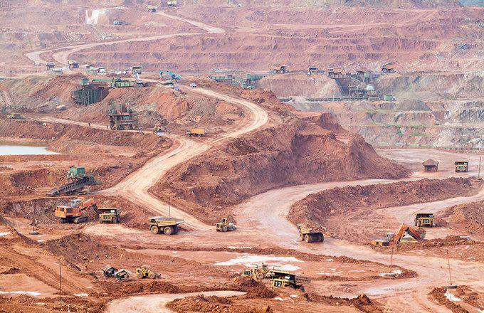

The mining industry serves as a cornerstone of the global economy, providing essential raw materials that are integral to various sectors, including construction, technology, energy, and manufacturing. From ancient civilizations utilizing rudimentary techniques to modern operations employing advanced technologies, mining has persistently contributed to economic growth and development. Renowned for its capability to spur economic activity, the industry remains a magnet for investors seeking opportunities for significant returns, propelled by the continuous demand for resources vital to technological and infrastructural advancements.

However, the financial health of mining companies is inherently tied to several variables, necessitating a comprehensive understanding of certain financial ratios. These ratios serve as critical tools for evaluating a company's operational efficiency, profitability, and overall financial stability. Among these, key indicators such as liquidity ratios, profitability margins, and return on investment metrics offer valuable insights into a company's economic viability. 



In recent years, integrating algorithmic trading has revolutionized how investors approach mining stocks. This sophisticated method employs computer algorithms to analyze large datasets, capturing market trends and identifying opportune moments for trading. This combination of traditional financial analysis and modern algorithmic strategies has enhanced the precision and effectiveness of investment decision-making in the mining industry.

This article examines the intricate financial landscape of the mining industry, focusing on the significant financial ratios essential for economic evaluation. It also explores the burgeoning role of algorithmic trading in enhancing investment strategies, ensuring informed decision-making in this dynamic sector.

## Table of Contents

## Understanding the Mining Industry

The mining industry plays a crucial role in the global economy by providing key raw materials essential for a wide range of industries. It can be primarily categorized into three segments: precious metals, industrial and base metals, and nonmetal mining. Precious metals include gold, silver, and platinum, which are highly valued for both industrial applications and investment purposes. Industrial and base metals such as copper, aluminum, and nickel are fundamental in manufacturing and construction. Nonmetal mining focuses on minerals like coal, phosphates, and limestone, which are vital for energy production and agriculture.

Mining operations take place across various continents, with significant activities in Africa, Australia, China, and North and South America. Each region presents its unique set of opportunities and challenges. For instance, Africa is rich in mineral resources but often grapples with political instability and infrastructural concerns. Australia and China benefit from advanced mining technologies and strong economic frameworks, while the Americas provide a diverse range of mineral deposits.

The market is dominated by major players such as BHP Group and Rio Tinto, which are large, well-established companies with extensive mining operations worldwide. These corporations benefit from economies of scale, allowing them to manage costs effectively and remain competitive. In contrast, junior miners, typically smaller companies, focus primarily on exploration and the identification of new mining opportunities. These junior entities, while not as financially robust as their larger counterparts, are vital for discovering new reserves and contributing to future production.

Despite its significance, the mining industry faces several challenges. Fluctuating commodity prices greatly impact the profitability and operational strategies of mining companies. Prices are influenced by factors like global economic conditions, technological changes, and shifts in supply and demand. Environmental regulations also present challenges by imposing constraints on mining practices to reduce environmental impact, potentially increasing operational costs. These challenges necessitate a strategic approach to production and financial management in order to achieve sustainable profitability in the mining sector.

## Key Financial Ratios in Mining

Financial ratios serve as indispensable tools for assessing the economic viability of mining companies. These ratios provide insights into the financial health and operational efficiency of such entities, guiding investors and stakeholders in their decision-making processes.

### Quick Ratio

The Quick Ratio is a measure of a company's [liquidity](/wiki/liquidity-risk-premium), which reflects its ability to meet its short-term obligations using its most liquid assets. This ratio is crucial for mining companies due to the industry's inherent [volatility](/wiki/volatility-trading-strategies) and cyclical nature.

$$
\text{Quick Ratio} = \frac{\text{Current Assets} - \text{Inventory}}{\text{Current Liabilities}}
$$

For mining companies, maintaining a strong Quick Ratio is pivotal, especially during periods of low commodity prices when cash flow may be constrained. It ensures that the company can cover its immediate liabilities without having to liquidate inventory at a loss.

### Operating Profit Margin

The Operating Profit Margin is a key indicator of cost management efficiency and profitability in mining operations. It measures the proportion of revenue that remains after covering operating expenses, excluding taxes and interest.

$$
\text{Operating Profit Margin} = \left( \frac{\text{Operating Profit}}{\text{Revenue}} \right) \times 100
$$

This ratio enables stakeholders to understand how well a mining company manages its operating costs in relation to its sales. Given the fluctuating nature of commodity prices, a higher Operating Profit Margin indicates effective control over production costs and a greater cushion against price volatility.

### Return on Equity (ROE)

Return on Equity (ROE) offers insights into a mining company's efficiency in generating returns from shareholders' equity. It evaluates the company’s capability to convert the invested equity into net income.

$$
\text{ROE} = \left( \frac{\text{Net Income}}{\text{Shareholders' Equity}} \right) \times 100
$$

For mining industry investors, a high ROE suggests that the company is adept at utilizing its equity base to produce profits, which is a positive signal of potential growth. It's crucial for mining companies, where capital investments are substantial, to demonstrate that their equity is effectively contributing to profit generation.

Together, these financial ratios provide a comprehensive view of a mining company's operational strengths and weaknesses, enabling investors to make well-informed decisions.

## Economic Assessment in Mining

Economic assessment in mining involves a comprehensive evaluation of investment risks and profitability prospects. Financial ratios are indispensable tools for investors aiming to understand a company’s financial stability and growth potential in this sector.

Financial ratios provide a snapshot of a company’s financial health. They help identify strengths, weaknesses, and opportunities within a company's financial statements. In the mining industry, where operations are capital-intensive and subject to fluctuations in commodity prices, these ratios are particularly important. Understanding key ratios such as liquidity ratios (like the Quick Ratio), profitability ratios (such as Operating Profit Margin), and leverage ratios (like Debt-to-Equity) can offer insights into a company’s ability to weather economic variations.

Investors utilize financial ratios to make informed decisions concerning mining investments. Liquidity ratios, for instance, are crucial in assessing a company's ability to meet short-term obligations, which is particularly significant in the cyclical mining sector. Meanwhile, profitability ratios can offer insights into cost management efficiency and the inherent profitability of mining operations, even when production levels change. 

An effective economic assessment must also consider the Return on Equity (ROE), which reflects a company’s efficiency in generating profits from its shareholders' equity. ROE is particularly valuable for investors looking to gauge how well a mining company is using investments to generate earnings growth.

Balancing capital expenditures against expected returns is a critical aspect of mining investment strategies. The capital intensity of the mining industry necessitates substantial upfront investment in equipment and infrastructure, with a delayed return phase as resources are gradually extracted and sold. An accurate assessment of profitability prospects enables investors to determine the viability of these capital expenditures, aligning investment decisions with anticipated market conditions and commodity price trends.

The integration of financial ratios into mining investment analysis allows investors to identify potential risks and rewards with greater precision. By employing these financial tools, investors can better navigate the complexities of the mining industry, improving their decision-making processes regarding capital allocation and risk management.

## Algorithmic Trading in Mining Investments

Algorithmic trading employs advanced computer algorithms to execute trades based on predefined criteria, enhancing efficiency and precision in investment strategies. In the mining sector, where market dynamics are volatile and data-heavy, these algorithms provide a significant advantage. They analyze vast and complex datasets to spot trading opportunities whose patterns may not be discernible through manual analysis.

Algorithms in mining investments integrate various financial ratios, such as the Quick Ratio, Operating Profit Margin, and Return on Equity, along with real-time market trends. This multifaceted approach allows for a nuanced understanding of a mining company's financial health and market position.

For example, consider a Python-based algorithm that uses the Return on Equity (ROE) to evaluate mining stocks. The algorithm might look like this:

```python
import pandas as pd

# Sample data for mining companies
data = {
    'Company': ['Company A', 'Company B', 'Company C'],
    'Net Income': [500000, 600000, 700000],
    'Shareholder Equity': [5000000, 4000000, 3500000]
}

# Create a DataFrame
df = pd.DataFrame(data)

# Calculate ROE for each company
df['ROE'] = df['Net Income'] / df['Shareholder Equity']

# Define a threshold for ROE to identify strong performers
roe_threshold = 0.15 

# Function to determine if a stock is a good investment
def is_good_investment(roe):
    return roe > roe_threshold

# Apply the function to determine investment worthiness
df['Investment Worthy'] = df['ROE'].apply(is_good_investment)

print(df)
```

This algorithm evaluates a mining company's potential by calculating the ROE from its financial data. By setting a threshold, it categorizes stocks into those worth investing in and those that might be riskier prospects. Incorporating streaming market data, these algorithms can also continuously update their evaluations and optimize entry and [exit](/wiki/exit-strategy) points for trades, minimizing risks posed by market fluctuations.

Algorithmic trading also reduces human errors and bias, offering more disciplined execution of trades. By deploying automated systems, investors can swiftly respond to market opportunities and threats, which is critical in an industry where commodity prices can be highly volatile and influenced by a plethora of variables.

Overall, the integration of [algorithmic trading](/wiki/algorithmic-trading) in mining investments provides an evolved toolkit for investors, enabling them to harness the power of data analytics and computational models to improve decision-making and achieve better investment outcomes.

## Conclusion

The mining industry remains an integral component of global economic development and investment strategies. Its influence is not only characterized by its historical significance but also by its current role in supplying indispensable raw materials critical for technological and industrial advancement. The financial health and potential of mining companies can be effectively gauged through the application of key financial ratios. These ratios, such as the Quick Ratio, Operating Profit Margin, and Return on Equity (ROE), offer insightful metrics that reflect the companies' liquidity, cost management efficiency, and profitability, respectively. By evaluating these indicators, stakeholders can discern the economic viability and strategic positioning of mining enterprises within the competitive market landscape.

Moreover, the advent of algorithmic trading has revolutionized investment approaches within the mining sector. By leveraging sophisticated algorithms, investors and portfolio managers are now capable of processing extensive datasets to identify optimal trading opportunities. Algorithmic systems can integrate financial ratios along with market trends to enhance the precision of strategic decisions regarding entry and exit points for mining stocks. This synthesis of traditional analytical methods with advanced computational strategies ensures a robust framework for navigating the complexities of mining investments. Consequently, a combined analytical approach empowers investors to capitalize on dynamic shifts in the industry, optimizing returns while mitigating exposure to risk.

## References & Further Reading

[1]: Bergstra, J., Bardenet, R., Bengio, Y., & Kégl, B. (2011). ["Algorithms for Hyper-Parameter Optimization."](https://proceedings.neurips.cc/paper/2011/file/86e8f7ab32cfd12577bc2619bc635690-Paper.pdf) Advances in Neural Information Processing Systems 24.

[2]: ["Advances in Financial Machine Learning"](https://www.amazon.com/Advances-Financial-Machine-Learning-Marcos/dp/1119482089) by Marcos Lopez de Prado

[3]: ["Evidence-Based Technical Analysis: Applying the Scientific Method and Statistical Inference to Trading Signals"](https://www.amazon.com/Evidence-Based-Technical-Analysis-Scientific-Statistical/dp/0470008741) by David Aronson

[4]: ["Machine Learning for Algorithmic Trading"](https://github.com/PacktPublishing/Machine-Learning-for-Algorithmic-Trading-Second-Edition) by Stefan Jansen

[5]: ["Quantitative Trading: How to Build Your Own Algorithmic Trading Business"](https://books.google.com/books/about/Quantitative_Trading.html?id=j70yEAAAQBAJ) by Ernest P. Chan