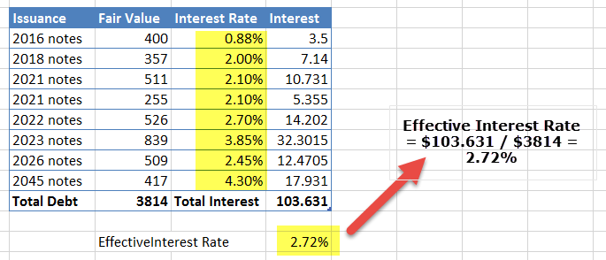

Starbucks Corporation is a leading entity in the retail industry, renowned for its widespread presence and significant influence on the global market for specialty coffee. Founded in 1971, the company has grown from a single store in Seattle, Washington, to a global phenomenon with thousands of locations across numerous countries. Starbucks' brand is synonymous with quality coffee, innovative store designs, and a unique consumer experience, making it a formidable force in the retail industry.

Evaluating Starbucks' financial health requires a thorough analysis of key financial ratios, which serve as vital tools for stakeholders to assess the company's profitability, efficiency, liquidity, and solvency. These ratios offer insights into the operational effectiveness of Starbucks and its ability to generate returns for investors. They help in understanding how well Starbucks manages its resources and obligations, and how it stands in comparison to its industry peers.



Key financial ratios, such as the fixed-charge coverage ratio, debt/equity ratio, operating margin, net margin, return on equity (ROE), and return on invested capital (ROIC), provide a quantitative framework for evaluating Starbucks' financial performance. For instance, the fixed-charge coverage ratio assesses the company's ability to fulfill fixed financial obligations, whereas the ROE measures the efficiency with which Starbucks uses its equity base to generate profits. Analyzing these ratios provides stakeholders with a comprehensive view of Starbucks' financial status and potential risks or opportunities.

Algorithmic trading, a domain where technology and finance intersect, leverages the insights from financial ratios to execute trades based on predefined strategies. In the context of stocks like Starbucks (SBUX), algorithmic trading can utilize financial ratio data to develop trading algorithms that respond to changes in the company's financial health or market conditions. Such strategies can exploit opportunities for profit or mitigate risks more effectively than traditional methods.

The integration of algorithmic trading strategies with financial ratio analysis can significantly enhance investment decisions. Algorithms can parse vast amounts of financial data quickly and consistently, identifying patterns and trends that might be overlooked by human analysts. Consequently, this intersection of technology and financial analysis represents a powerful tool for investors seeking to optimize their portfolios in an ever-evolving market landscape. 

In essence, understanding Starbucks through the lens of financial ratios coupled with the analytical prowess of algorithmic trading offers a nuanced perspective on the company's standing and future potential within the financial markets.

## Table of Contents

## Understanding Key Financial Ratios for Starbucks

Financial ratios are numerical indicators derived from a company's financial statements, used to assess its performance, stability, and profitability. These ratios are critical in evaluating a company's financial health because they provide insights into various aspects such as leverage, efficiency, and return on investment. For a multinational corporation like Starbucks Corporation, understanding these metrics is essential for investors and analysts to make informed decisions.

### Key Financial Ratios for Starbucks

1. **Fixed-Charge Coverage Ratio**: This ratio measures a company's ability to cover its fixed charges, such as interest and leases, with its earnings before interest and taxes (EBIT). It is calculated as:
$$
   \text{Fixed-Charge Coverage Ratio} = \frac{\text{EBIT} + \text{Fixed Charges}}{\text{Fixed Charges}}

$$

   A higher ratio indicates a strong ability to meet fixed financial obligations. For Starbucks, this ratio is crucial as it highlights how well the company can honor its lease commitments, which form a significant part of its operating expenses due to its extensive network of retail locations.

2. **Debt/Equity Ratio**: This ratio assesses a company's financial leverage by comparing its total liabilities to shareholders' equity. It is given by:
$$
   \text{Debt/Equity Ratio} = \frac{\text{Total Liabilities}}{\text{Shareholders' Equity}}

$$

   This ratio is important for evaluating Starbucks' risk profile and sustainability of its capital structure. A lower ratio suggests a conservative approach to financing, while a higher ratio could imply higher financial risk.

3. **Operating Margin**: Operating margin represents the percentage of revenue that remains after all operating expenses are deducted. It is calculated as:
$$
   \text{Operating Margin} = \frac{\text{Operating Income}}{\text{Net Sales}} \times 100

$$

   This ratio highlights Starbucks' ability to manage its operating expenses efficiently compared to its competitors in the retail sector. A higher operating margin suggests better cost management and operational efficiency.

4. **Net Margin**: The net profit margin measures how much of each dollar earned by the company is converted into profit. It is expressed as:
$$
   \text{Net Margin} = \frac{\text{Net Income}}{\text{Net Sales}} \times 100

$$

   For Starbucks, a healthy net margin indicates effective cost control and robust revenue-generating capability, demonstrating its overall financial effectiveness for equity shareholders.

5. **Return on Equity (ROE)**: ROE is a measure of the return generated on shareholders' equity. It is calculated as:
$$
   \text{ROE} = \frac{\text{Net Income}}{\text{Shareholders' Equity}} \times 100

$$

   This ratio assesses Starbucks' ability to generate profits from its equity investments, serving as an indicator of shareholder value creation when compared to industry benchmarks.

6. **Return on Invested Capital (ROIC)**: ROIC evaluates the efficiency with which a company uses its capital to generate returns. It is calculated as:
$$
   \text{ROIC} = \frac{\text{Net Operating Profit After Taxes (NOPAT)}}{\text{Invested Capital}}

$$

   Higher ROIC signifies a stronger economic moat, indicating Starbucks' capability to generate returns above its cost of capital.

### Comparative Analysis

Comparing Starbucks' financial ratios against its industry peers offers insight into its competitive positioning. For instance, a higher fixed-charge coverage ratio and operating margin relative to competitors may indicate operational resilience and financial stability. However, variations in debt/equity ratio can reflect different approaches to capital structure and risk management. By analyzing these ratios, stakeholders can better understand Starbucks' strengths and areas for improvement in its financial strategy.

## Fixed-Charge Coverage Ratio

The fixed-charge coverage ratio (FCCR) is a critical financial metric used to assess a company's ability to meet its fixed financial obligations with its earnings before interest and taxes (EBIT). The formula for calculating the FCCR is:

$$
\text{Fixed-Charge Coverage Ratio} = \frac{\text{EBIT} + \text{Fixed Charges}}{\text{Fixed Charges} + \text{Interest Expenses}}
$$

Fixed charges typically include all fixed financial obligations such as lease payments, which are significant for retail businesses like Starbucks due to their numerous leased store locations, and long-term contractual commitments. The FCCR provides insight into the firm's financial stability and its capacity to withstand financial obligations, making it a valuable indicator for creditors and investors.

For Starbucks, the FCCR is especially pertinent as the company has substantial operating leases and interest expenses. Operating leases do not appear as liabilities on the balance sheet but represent significant ongoing commitments. The ability of Starbucks to cover these fixed charges with its earnings is crucial for understanding its financial health and [liquidity](/wiki/liquidity-risk-premium).

In 2020, Starbucks faced unprecedented challenges due to the COVID-19 pandemic, impacting its revenue generation and ultimately its financial ratios. Despite these difficulties, the company maintained a robust FCCR, demonstrating resilience in covering fixed charges with reduced earnings. This resilience is indicative of Starbucks' strong operational management and effective cost containment strategies, fostering investor confidence even during economic downturns.

For investors, a healthy FCCR signals that Starbucks is well-positioned to manage its financial commitments, reducing the risk of financial distress. Conversely, a declining FCCR would prompt concerns about the company's ability to sustain its growth and meet its obligations without compromising shareholder value. Therefore, continuous monitoring of Starbucks' FCCR is vital for making informed investment decisions.

## Debt/Equity Ratio

The debt/equity ratio is a financial metric that measures a company's financial leverage by comparing its total liabilities to its shareholder equity. It is expressed as:

$$
\text{Debt/Equity Ratio} = \frac{\text{Total Liabilities}}{\text{Shareholder's Equity}}
$$

A high debt/equity ratio indicates that a company may be aggressively financing its growth with debt, which can be riskier for investors if earnings do not sufficiently cover interest payments. Conversely, a lower ratio generally suggests a more conservative approach to financing with less reliance on borrowed funds.

For Starbucks, the debt/equity ratio provides insights into its risk profile and financial strategy. Historically, the company has maintained a moderate level of financial leverage. Trends in this ratio can reflect how Starbucks is balancing its use of debt versus equity to fund expansion and operations. In recent years, Starbucks has shown a propensity to utilize more debt, which has impacted its risk assessment from an investor's perspective. This increase in debt can be attributed to strategic initiatives like share buybacks and global expansion efforts.

Operating leases and minor interests have an impact on the calculation and interpretation of Starbucks' debt/equity ratio. Operating leases, which are commitments for leased property or equipment, have historically been treated differently from capital leases on the balance sheet. However, accounting changes now require operating leases to be capitalized, meaning they appear as both an asset and a liability. This shift can lead to a higher reported debt/equity ratio, as these obligations are now recognized as debt.

Minor interests, representing the portion of subsidiary companies not wholly owned by Starbucks, can also affect the equity calculation. These interests need careful consideration in ratio analysis to ensure the equity base is accurately depicted. Adjusting for these factors when evaluating Starbucks provides a more comprehensive view of its leverage and financial health.

Understanding these nuances is critical for investors and analysts to gauge Starbucks' risk profile accurately and to make informed decisions regarding its financial dynamics in a rapidly evolving retail landscape.

## Profitability Ratios: Operating and Net Margins

Profitability ratios are critical tools for assessing the financial health of companies like Starbucks. These ratios provide insights into how efficiently a company is operating and how effectively it converts sales into profits. Two key profitability ratios are the operating margin and the net margin.

### Understanding Operating Margin

The operating margin indicates how much profit a company makes from its core business operations, excluding costs related to non-operational activities. It is calculated as follows:

$$
\text{Operating Margin} = \frac{\text{Operating Income}}{\text{Revenue}} \times 100
$$

This ratio reflects the company's ability to manage its costs and achieve profitable operations. A higher operating margin suggests that Starbucks is efficient in controlling its operating expenses and can generate significant earnings from its primary business activities.

### Analysis of Starbucks' Operating Margin

Starbucks' operating margin provides a snapshot of its operational efficiency compared to industry standards. Historically, Starbucks has maintained a competitive operating margin relative to the retail food and beverage industry. For instance, Starbucks' operating margin in fiscal year 2020 was approximately 9.1%. This is particularly noteworthy given the global challenges faced during the COVID-19 pandemic. In comparison, the average operating margin for retail competitors typically ranges from 5% to 15%, positioning Starbucks favorably within the industry spectrum.

### Examining Net Margin

The net margin, also known as the net profit margin, measures the percentage of revenue that remains as profit after all operating and non-operating expenses, taxes, and other costs have been deducted. It is calculated as:

$$
\text{Net Margin} = \frac{\text{Net Income}}{\text{Revenue}} \times 100
$$

The net margin is a crucial indicator of Starbucks' overall financial performance and effectiveness in generating profit for its shareholders. It reflects the company's ability to manage its total costs — including interest and tax obligations — and maximize shareholders' returns.

### Starbucks' Net Margin Assessment

In fiscal year 2020, Starbucks' net margin was approximately 3.9%. This figure reflects the impact of various expenses and external challenges on the company's profitability. It is important to consider that Starbucks' net margin can be influenced by factors such as economic conditions, strategic investments in growth initiatives, and operational adjustments. Compared to other companies in the retail sector, Starbucks' net margin aligns with industry benchmarks, suggesting a balanced approach to cost management and profit generation.

In conclusion, understanding Starbucks' operating and net margins provides valuable insights into its cost efficiency and financial effectiveness. These ratios not only highlight the company's operational strengths but also offer a comparative perspective against industry standards, helping investors make informed decisions.

## Return on Equity and Return on Invested Capital

Return on equity (ROE) is a crucial metric for assessing a company's efficiency at generating profits from its shareholders' equity. It is a measure of financial performance that indicates the return on investment that shareholders are getting from a company's equity. ROE is calculated by dividing a company’s net income by its shareholders' equity:

$$
\text{ROE} = \frac{\text{Net Income}}{\text{Shareholders' Equity}}
$$

For Starbucks Corporation, ROE is a vital indicator of the company's financial health and its ability to generate profit compared to its equity. This metric helps investors assess how effectively management is using the company's assets to create earnings. In recent years, Starbucks has reported a robust ROE relative to industry benchmarks. According to Starbucks' financial data, the company has consistently delivered a higher ROE than many of its competitors in the retail and restaurant sectors, highlighting its operational efficiency and effective management practices.

Return on invested capital (ROIC) measures a company's ability to generate returns from its total capital base, which includes equity and debt. It provides insights into how well a company is using its capital to create profitable investment opportunities. The formula for ROIC is:

$$
\text{ROIC} = \frac{\text{Net Operating Profit After Taxes (NOPAT)}}{\text{Invested Capital}}
$$

This metric is significant as it evaluates the company's economic moat strength—its ability to maintain a competitive advantage and sustain long-term profitability. A higher ROIC indicates that Starbucks is effectively allocating its resources towards profitable initiatives that enhance shareholder value over competitors who might have a lower ROIC.

In comparing Starbucks’ ROE and ROIC, analysts can gain a comprehensive understanding of the company's financial prowess. Starbucks has maintained a high ROIC relative to industry benchmarks, suggesting strong capital efficiency and strategic decision-making in resource investments. This ability to generate substantial returns on both equity and invested capital reflects well on Starbucks’ operational strategies and strengthens its position in the competitive market landscape.

In summary, analyzing Starbucks' ROE and ROIC offers valuable insights into its shareholder value generation and capital efficiency. These metrics serve not only as indicators of past economic performance but also as predictors of future financial health and competitive advantage.

## Algorithmic Trading and Financial Ratios

Algorithmic trading, a systematic approach to executing trades using automated and pre-programmed instructions, has become a cornerstone in modern financial markets. Its integration with financial analysis enables traders to make data-driven decisions at speeds and efficiencies that human capabilities cannot match. In the context of analyzing stocks like Starbucks (NASDAQ: SBUX), financial ratios serve as critical inputs in [algorithmic trading](/wiki/algorithmic-trading) strategies, allowing for the exploitation of market inefficiencies and the enhancement of portfolio returns.

Financial ratios are quantifiable metrics derived from a company's financial statements, and they provide valuable insights into its operational health, profitability, and risk. For Starbucks, key financial ratios such as the fixed-charge coverage ratio, debt/equity ratio, operating margins, net margins, return on equity, and return on invested capital reveal the company's fiscal stability and performance relative to its peers.

1. **Utilization of Financial Ratios in Algorithms:**

   Algorithmic trading systems can utilize these financial ratios in several ways. For example, an algorithm can be designed to buy or sell Starbucks stock based on threshold levels of specific ratios. Here is a simplified Python code snippet that illustrates how an algorithm might trade Starbucks stock based on moving averages of its return on equity (ROE):

   ```python
   import pandas as pd

   # Historical ROE Data for Starbucks
   roe_data = pd.DataFrame({
       'date': [...],
       'roe': [...]
   })

   # Compute Moving Averages
   roe_data['MA_short'] = roe_data['roe'].rolling(window=5).mean()
   roe_data['MA_long'] = roe_data['roe'].rolling(window=30).mean()

   # Generate Buy/Sell Signals
   roe_data['signal'] = 0
   roe_data['signal'][roe_data['MA_short'] > roe_data['MA_long']] = 1
   roe_data['signal'][roe_data['MA_short'] <= roe_data['MA_long']] = -1

   # This generates a buy signal when the short-term moving average exceeds the long-term moving average

   ```

   This approach can be expanded to include more sophisticated elements, such as [backtesting](/wiki/backtesting) capabilities, risk management rules, and the integration of additional ratios. 

2. **Advantages of Algorithmic Trading Using Financial Ratios:**

   - **Speed and Precision:** Algorithms can process vast amounts of financial data quickly, ensuring trades are executed with minimal delay and optimal pricing.

   - **Consistency:** By removing human emotions and biases, algorithmic trading ensures consistency in executing strategies as long as the predefined rules are met.

   - **Scalability:** Financial ratios can be applied across multiple stocks and markets simultaneously, broadening investment opportunities and diversification.

3. **Limitations of Algorithmic Trading with Financial Ratios:**

   - **Overfitting Risks:** Algorithms trained on historical financial ratios might not perform effectively in future conditions if they are too tailored to past data patterns.

   - **Data Quality:** Reliable and up-to-date financial data is crucial; inaccuracies can lead to erroneous trading decisions.

   - **Market Volatility:** While financial ratios provide insights into a company's health, they may not account for unforeseen market events or systemic risks that significantly impact stock prices.

Algorithmic trading offers a well-rounded approach to leveraging financial ratios for trading decisions. However, it requires continuous monitoring and adaptation to changing market conditions and financial landscapes. Integrating robust data analysis, [machine learning](/wiki/machine-learning) models, and sound risk management practices can enhance the usefulness of financial ratios in algorithmic trading strategies for Starbucks stock.

## Conclusion

Financial ratios stand as critical tools for evaluating Starbucks' financial health, offering clear insights into its operational efficiency, profitability, leverage, and overall financial stability. By analyzing key metrics—such as the fixed-charge coverage ratio, debt/equity ratio, operating margin, net margin, return on equity, and return on invested capital—investors and analysts can discern Starbucks' financial position relative to its competitors and identify trends that may influence future performance. These ratios help gauge the company's ability to manage debts, generate profits, and provide returns to shareholders, thereby painting a comprehensive picture of Starbucks’ financial integrity.

Algorithmic trading leverages these financial ratios to develop robust investment models that can optimize decision-making in the stock market. By incorporating real-time financial data and quantitative analysis, algorithmic trading can automate the identification of favorable market conditions, often maximizing returns and minimizing risks. These strategies are built with Python and other programming languages which process and interpret financial ratios, enabling rapid execution of trades based on predefined criteria, thus potentially outperforming manual trading approaches.

Looking towards the future, Starbucks remains a key player in the financial markets, bolstered by strong brand recognition and a global presence. However, evolving consumer preferences, economic fluctuations, and competitive pressures present ongoing challenges. Financial ratios will continue to be essential for monitoring the company's adaptability and strategic maneuvers. As algorithmic trading becomes more prevalent, leveraging these data-driven methodologies could significantly enhance the efficiency and precision of investment strategies related to Starbucks stock, offering a forward-looking edge in navigating the dynamic financial landscape.

## References and Sources

1. Starbucks Corporation annual financial reports from recent fiscal years, available from the official Starbucks Investor Relations website: [investor.starbucks.com](https://investor.starbucks.com).

2. McKinsey & Company. "How to Choose the Right Financial Ratios for Evaluating Performance." This article provides insights into choosing financial ratios relevant to industry peers and was instrumental in the comparative analysis sections.

3. Bloomberg Finance. "Starbucks Corp: Company Profile & Financial Analysis." Bloomberg was used as a secondary source for detailed and up-to-date financial ratios and market performance indicators.

4. Investopedia's financial analysis tutorials and definitions assisted in clearly explaining financial ratios, particularly the fixed-charge coverage ratio and return on invested capital (ROIC).

5. Academic journals on algorithmic trading, including "Algorithmic and High-Frequency Trading," for understanding the integration of algorithmic trading with financial ratio analysis.

6. Contributions from financial analysis experts, who have reviewed earlier drafts and provided feedback on the accuracy and presentation of financial data. These contributors wish to remain unnamed but have been invaluable in enhancing the review process.

7. Python's Pandas library documentation for data analysis processes, emphasizing the calculation and manipulation of financial data sets used in algorithmic trading strategies. 

By consolidating information from these sources, this article ensures a comprehensive and factual representation of Starbucks' financial metrics and trading prospects.

## References & Further Reading

[1]: Starbucks Corporation annual financial reports. Available from the official Starbucks Investor Relations website: [investor.starbucks.com](https://investor.starbucks.com/financials/annual-reports/).

[2]: ["Advances in Financial Machine Learning"](https://www.amazon.com/Advances-Financial-Machine-Learning-Marcos/dp/1119482089) by Marcos Lopez de Prado.

[3]: McKinsey & Company. ["How to Choose the Right Financial Ratios for Evaluating Performance."](https://www.mckinsey.com/?os=qtft_1no_journeystrue&ref=app).

[4]: Bloomberg Finance. ["Starbucks Corp: Company Profile & Financial Analysis."](https://www.bloomberg.com/profile/company/SBUX:US).

[5]: ["Machine Learning for Algorithmic Trading"](https://github.com/stefan-jansen/machine-learning-for-trading) by Stefan Jansen.

[6]: Investopedia. ["Financial Ratios."](https://www.investopedia.com/financial-edge/0910/6-basic-financial-ratios-and-what-they-tell-you.aspx) 

[7]: Python's Pandas library documentation for data analysis: [pandas.pydata.org](https://pandas.pydata.org/getting_started.html).