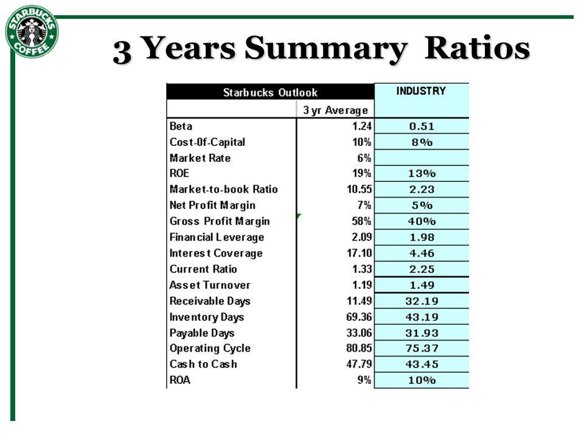

## Table of Contents

## What are financial ratios and why are they important for analyzing Starbucks?

Financial ratios are tools that help people understand a company's financial health by comparing different numbers from its financial statements. They give a quick way to see how well a company is doing in areas like making money, managing debt, and using its resources. For example, ratios can show if a company is good at turning its sales into profits or if it has too much debt compared to what it owns.

For Starbucks, financial ratios are really important because they help investors and managers see how the company is doing compared to other coffee shops or businesses. By looking at ratios like profit margins, Starbucks can see if it's making enough money from each cup of coffee it sells. Also, ratios like debt-to-equity can tell if Starbucks is using too much borrowed money, which could be risky. This helps Starbucks make better decisions about where to open new stores, how to price their products, and how to manage their money overall.

## How do you calculate Starbucks' current ratio and what does it indicate about the company's liquidity?

To calculate Starbucks' current ratio, you take the company's current assets and divide them by its current liabilities. Current assets are things like cash, inventory, and money that customers owe Starbucks but haven't paid yet. Current liabilities are what Starbucks owes and needs to pay within a year, like bills and short-term loans. So, if Starbucks has $10 billion in current assets and $8 billion in current liabilities, the current ratio would be $10 billion divided by $8 billion, which equals 1.25.

The current ratio tells us about Starbucks' liquidity, which means how easily the company can pay its short-term bills. A current ratio of 1.25 means Starbucks has $1.25 in current assets for every $1 in current liabilities. Generally, a ratio above 1 is good because it shows the company can cover its short-term debts. But if the ratio is too high, it might mean Starbucks is not using its assets efficiently. So, a current ratio of 1.25 suggests Starbucks is in a pretty good spot to handle its short-term financial obligations without any major issues.

## What is Starbucks' debt-to-equity ratio and how does it reflect the company's financial structure?

Starbucks' debt-to-equity ratio is calculated by dividing its total liabilities by its total shareholders' equity. This ratio shows how much debt Starbucks is using to finance its operations compared to the money invested by its owners. If Starbucks has $15 billion in total liabilities and $5 billion in total equity, the debt-to-equity ratio would be $15 billion divided by $5 billion, which equals 3. This means for every dollar of equity, Starbucks has $3 of debt.

The debt-to-equity ratio helps us understand Starbucks' financial structure and how it balances debt and equity. A higher ratio, like 3, means Starbucks is using more debt to grow its business, which can be riskier because it has to pay back that debt with interest. But it can also mean Starbucks is using debt smartly to expand and make more profit. A lower ratio would show Starbucks is relying more on money from its owners, which is less risky but might limit how fast it can grow. So, a ratio of 3 tells us Starbucks is leaning more on debt, but it's important to compare this with other companies in the same industry to see if it's a normal or high level of debt.

## Can you explain Starbucks' return on equity (ROE) and its significance for investors?

Starbucks' return on equity (ROE) is a way to see how well the company is using the money that its owners have put into the business. You find it by taking the company's net income and dividing it by the shareholders' equity. If Starbucks made $3 billion in profit last year and had $5 billion in equity, the ROE would be $3 billion divided by $5 billion, which comes out to 60%. This percentage tells us that for every dollar the owners have invested, Starbucks is making 60 cents in profit.

ROE is really important for investors because it shows how good Starbucks is at turning the money from its owners into more money. A high ROE, like 60%, can be a good sign that Starbucks is doing a great job at making profits with the money it has. But investors should also look at what other companies in the coffee business are doing. If Starbucks' ROE is higher than most other coffee companies, it might mean Starbucks is a better place to invest your money. But if it's lower, investors might want to think about putting their money somewhere else.

## How does Starbucks' gross profit margin compare to industry standards, and what does this suggest about its pricing strategy?

Starbucks' gross profit margin is the percentage of money left after paying for the costs to make and sell their products, like coffee beans and cups. If Starbucks has a gross profit margin of around 25%, it means for every dollar they make in sales, they keep 25 cents after paying for those direct costs. When we compare this to the industry standard for coffee shops, which might be around 20% to 22%, Starbucks is doing a bit better. This suggests that Starbucks is good at keeping costs down or charging more for their products than other coffee shops.

This higher gross profit margin can tell us something about Starbucks' pricing strategy. It seems like Starbucks is able to charge a bit more for their coffee and other items than their competitors. This could be because people think Starbucks' coffee is better or because Starbucks has a strong brand that people are willing to pay more for. By keeping their costs under control and charging a bit more, Starbucks can make more profit from each sale, which is good for their business.

## What insights can we gain from Starbucks' inventory turnover ratio, and how does it impact operational efficiency?

Starbucks' inventory turnover ratio shows how quickly the company sells and replaces its inventory, like coffee beans and pastries. To find this ratio, you divide the cost of goods sold by the average inventory. A high inventory turnover ratio means Starbucks is selling its products fast, which is good because it shows that customers are buying what Starbucks is offering. If Starbucks has a high turnover ratio compared to other coffee shops, it could mean they are doing a better job at managing their stock and meeting customer demand.

A high inventory turnover ratio can help Starbucks be more operationally efficient. When inventory moves quickly, Starbucks doesn't have to keep a lot of products sitting around, which saves them money on storage and reduces the chance that items will go bad before they're sold. This can also help Starbucks plan better for how much to order and when, making sure they always have fresh products for customers. So, a good inventory turnover ratio can show that Starbucks is running its business smoothly and efficiently.

## How has Starbucks' operating margin evolved over the past five years, and what factors have influenced these changes?

Over the past five years, Starbucks' operating margin has shown some ups and downs but has generally stayed strong. In 2019, Starbucks had an operating margin around 15%, which means they made 15 cents of profit for every dollar of sales after paying for the costs to run their stores. By 2021, this number dropped a bit to around 13% because of the challenges from the global health crisis, which made fewer people come into their stores. But as things got better, Starbucks worked hard to get their operating margin back up. By 2023, it was back to around 15%, showing they were doing well again.

Several factors have influenced these changes in Starbucks' operating margin. The big drop in 2021 was mainly because of lower sales during the health crisis, but Starbucks also had to spend more on safety measures and digital tools to help with online orders. As things improved, Starbucks focused on cutting costs and finding new ways to make money, like expanding their menu and improving their loyalty program. These efforts helped them bring their operating margin back up. Also, Starbucks has been working on growing in new markets around the world, which has helped keep their profits strong even when things are tough in one area.

## What is the significance of Starbucks' price-to-earnings (P/E) ratio for potential investors?

Starbucks' price-to-earnings (P/E) ratio tells investors how much they are paying for each dollar of the company's earnings. If Starbucks has a P/E ratio of 30, it means investors are willing to pay $30 for every $1 of Starbucks' earnings. This ratio is important because it helps investors see if Starbucks' stock is a good deal compared to other companies. A high P/E ratio might mean investors think Starbucks will grow a lot in the future, so they're willing to pay more now. But if the P/E ratio is too high compared to other coffee shops, it might mean the stock is overvalued and could be risky.

Looking at Starbucks' P/E ratio over time and comparing it to other companies in the same industry can give investors a better idea of whether it's a good time to buy the stock. If Starbucks' P/E ratio is lower than usual or lower than other coffee shops, it might be a good time to invest because the stock could be undervalued. But if it's much higher, investors might want to be careful because the stock could be too expensive. By understanding the P/E ratio, investors can make smarter choices about whether to buy, sell, or hold onto Starbucks' stock.

## How does Starbucks' return on assets (ROA) compare to its competitors, and what does this indicate about asset utilization?

Starbucks' return on assets (ROA) shows how well the company is using its assets, like stores and equipment, to make money. If Starbucks has an ROA of about 10%, it means for every dollar they have in assets, they are making 10 cents in profit. When we compare this to other coffee shops, Starbucks often does better than many of its competitors. For example, a smaller coffee chain might have an ROA of around 5%. This suggests that Starbucks is really good at using its assets to make more money than other coffee companies.

This higher ROA indicates that Starbucks is efficient in how it uses its resources. They might have better ways to manage their stores, or they could be getting more sales out of each location than their competitors. This efficiency can help Starbucks keep growing and making profits, which is good news for the company and its investors. By keeping their ROA high, Starbucks shows it's not just about having a lot of assets, but about using them smartly to stay ahead in the coffee business.

## Can you analyze Starbucks' cash conversion cycle and discuss its implications for cash flow management?

Starbucks' cash conversion cycle shows how quickly the company turns its inventory into cash. It's calculated by adding the days it takes to sell inventory and the days it takes to collect payments from customers, then subtracting the days Starbucks takes to pay its suppliers. If Starbucks has a shorter cash conversion cycle compared to other coffee shops, it means they're good at managing their cash flow. They can quickly sell their coffee and snacks, get paid by customers, and still take their time to pay suppliers, which helps keep more money in their pockets.

Having a shorter cash conversion cycle is great for Starbucks because it means they can use their cash more efficiently. Instead of having money tied up in inventory or waiting for customers to pay, Starbucks can use that cash to open new stores, improve their products, or even give money back to investors. This efficient cash flow management helps Starbucks stay strong and keep growing, even when the economy is tough. It shows they're smart about how they handle their money, which is important for any big company.

## What does Starbucks' times interest earned ratio tell us about its ability to meet debt obligations?

Starbucks' times interest earned ratio shows how easily the company can pay the interest on its debts. You find it by dividing Starbucks' earnings before interest and taxes (EBIT) by the interest expenses they have to pay. If Starbucks has an EBIT of $5 billion and interest expenses of $500 million, their times interest earned ratio would be 10. This means Starbucks earns 10 times more than what they need to pay in interest, which is a good sign. It shows that Starbucks can comfortably handle its debt payments because they're making a lot more money than what they owe in interest.

A high times interest earned ratio like Starbucks' suggests they are in a strong position to meet their debt obligations. Even if something unexpected happens and their earnings drop a bit, Starbucks still has plenty of money to cover their interest payments. This makes lenders feel more confident about lending money to Starbucks, and it also makes investors feel good because it shows the company is financially healthy. So, Starbucks' times interest earned ratio is an important number that tells us they're good at managing their debts and keeping their business running smoothly.

## How do advanced financial ratios like the Altman Z-score apply to Starbucks, and what do they predict about the company's financial health?

The Altman Z-score is a way to predict if a company might go bankrupt. It uses a bunch of financial numbers to come up with a score that tells you if a company is doing well or if it's in trouble. For Starbucks, the Altman Z-score would look at things like how much profit they're making, how much debt they have, and how well they're using their money. If Starbucks has a high Altman Z-score, it means they're in a good spot and not likely to go bankrupt. But if the score is low, it could mean Starbucks is at risk and might need to be careful with their money.

Right now, Starbucks has a pretty good Altman Z-score, which shows that they're financially healthy. This means Starbucks is making enough money, managing their debts well, and using their assets smartly. So, investors and people who lend money to Starbucks can feel pretty confident that the company is strong and not likely to run into big financial problems anytime soon.

## What are the key financial ratios for understanding Starbucks' financial performance?

Financial ratios are numerical indicators derived from a company's financial statements, used to assess its performance, stability, and profitability. These ratios are critical in evaluating a company's financial health because they provide insights into various aspects such as leverage, efficiency, and return on investment. For a multinational corporation like Starbucks Corporation, understanding these metrics is essential for investors and analysts to make informed decisions.

### Key Financial Ratios for Starbucks

1. **Fixed-Charge Coverage Ratio**: This ratio measures a company's ability to cover its fixed charges, such as interest and leases, with its earnings before interest and taxes (EBIT). It is calculated as:
$$
   \text{Fixed-Charge Coverage Ratio} = \frac{\text{EBIT} + \text{Fixed Charges}}{\text{Fixed Charges}}

$$

   A higher ratio indicates a strong ability to meet fixed financial obligations. For Starbucks, this ratio is crucial as it highlights how well the company can honor its lease commitments, which form a significant part of its operating expenses due to its extensive network of retail locations.

2. **Debt/Equity Ratio**: This ratio assesses a company's financial leverage by comparing its total liabilities to shareholders' equity. It is given by:
$$
   \text{Debt/Equity Ratio} = \frac{\text{Total Liabilities}}{\text{Shareholders' Equity}}

$$

   This ratio is important for evaluating Starbucks' risk profile and sustainability of its capital structure. A lower ratio suggests a conservative approach to financing, while a higher ratio could imply higher financial risk.

3. **Operating Margin**: Operating margin represents the percentage of revenue that remains after all operating expenses are deducted. It is calculated as:
$$
   \text{Operating Margin} = \frac{\text{Operating Income}}{\text{Net Sales}} \times 100

$$

   This ratio highlights Starbucks' ability to manage its operating expenses efficiently compared to its competitors in the retail sector. A higher operating margin suggests better cost management and operational efficiency.

4. **Net Margin**: The net profit margin measures how much of each dollar earned by the company is converted into profit. It is expressed as:
$$
   \text{Net Margin} = \frac{\text{Net Income}}{\text{Net Sales}} \times 100

$$

   For Starbucks, a healthy net margin indicates effective cost control and robust revenue-generating capability, demonstrating its overall financial effectiveness for equity shareholders.

5. **Return on Equity (ROE)**: ROE is a measure of the return generated on shareholders' equity. It is calculated as:
$$
   \text{ROE} = \frac{\text{Net Income}}{\text{Shareholders' Equity}} \times 100

$$

   This ratio assesses Starbucks' ability to generate profits from its equity investments, serving as an indicator of shareholder value creation when compared to industry benchmarks.

6. **Return on Invested Capital (ROIC)**: ROIC evaluates the efficiency with which a company uses its capital to generate returns. It is calculated as:
$$
   \text{ROIC} = \frac{\text{Net Operating Profit After Taxes (NOPAT)}}{\text{Invested Capital}}

$$

   Higher ROIC signifies a stronger economic moat, indicating Starbucks' capability to generate returns above its cost of capital.

### Comparative Analysis

Comparing Starbucks' financial ratios against its industry peers offers insight into its competitive positioning. For instance, a higher fixed-charge coverage ratio and operating margin relative to competitors may indicate operational resilience and financial stability. However, variations in debt/equity ratio can reflect different approaches to capital structure and risk management. By analyzing these ratios, stakeholders can better understand Starbucks' strengths and areas for improvement in its financial strategy.

## What is the Fixed-Charge Coverage Ratio?

The fixed-charge coverage ratio (FCCR) is a critical financial metric used to assess a company's ability to meet its fixed financial obligations with its earnings before interest and taxes (EBIT). The formula for calculating the FCCR is:

$$
\text{Fixed-Charge Coverage Ratio} = \frac{\text{EBIT} + \text{Fixed Charges}}{\text{Fixed Charges} + \text{Interest Expenses}}
$$

Fixed charges typically include all fixed financial obligations such as lease payments, which are significant for retail businesses like Starbucks due to their numerous leased store locations, and long-term contractual commitments. The FCCR provides insight into the firm's financial stability and its capacity to withstand financial obligations, making it a valuable indicator for creditors and investors.

For Starbucks, the FCCR is especially pertinent as the company has substantial operating leases and interest expenses. Operating leases do not appear as liabilities on the balance sheet but represent significant ongoing commitments. The ability of Starbucks to cover these fixed charges with its earnings is crucial for understanding its financial health and [liquidity](/wiki/liquidity-risk-premium).

In 2020, Starbucks faced unprecedented challenges due to the COVID-19 pandemic, impacting its revenue generation and ultimately its financial ratios. Despite these difficulties, the company maintained a robust FCCR, demonstrating resilience in covering fixed charges with reduced earnings. This resilience is indicative of Starbucks' strong operational management and effective cost containment strategies, fostering investor confidence even during economic downturns.

For investors, a healthy FCCR signals that Starbucks is well-positioned to manage its financial commitments, reducing the risk of financial distress. Conversely, a declining FCCR would prompt concerns about the company's ability to sustain its growth and meet its obligations without compromising shareholder value. Therefore, continuous monitoring of Starbucks' FCCR is vital for making informed investment decisions.

## What is the Debt/Equity Ratio?

The debt/equity ratio is a financial metric that measures a company's financial leverage by comparing its total liabilities to its shareholder equity. It is expressed as:

$$
\text{Debt/Equity Ratio} = \frac{\text{Total Liabilities}}{\text{Shareholder's Equity}}
$$

A high debt/equity ratio indicates that a company may be aggressively financing its growth with debt, which can be riskier for investors if earnings do not sufficiently cover interest payments. Conversely, a lower ratio generally suggests a more conservative approach to financing with less reliance on borrowed funds.

For Starbucks, the debt/equity ratio provides insights into its risk profile and financial strategy. Historically, the company has maintained a moderate level of financial leverage. Trends in this ratio can reflect how Starbucks is balancing its use of debt versus equity to fund expansion and operations. In recent years, Starbucks has shown a propensity to utilize more debt, which has impacted its risk assessment from an investor's perspective. This increase in debt can be attributed to strategic initiatives like share buybacks and global expansion efforts.

Operating leases and minor interests have an impact on the calculation and interpretation of Starbucks' debt/equity ratio. Operating leases, which are commitments for leased property or equipment, have historically been treated differently from capital leases on the balance sheet. However, accounting changes now require operating leases to be capitalized, meaning they appear as both an asset and a liability. This shift can lead to a higher reported debt/equity ratio, as these obligations are now recognized as debt.

Minor interests, representing the portion of subsidiary companies not wholly owned by Starbucks, can also affect the equity calculation. These interests need careful consideration in ratio analysis to ensure the equity base is accurately depicted. Adjusting for these factors when evaluating Starbucks provides a more comprehensive view of its leverage and financial health.

Understanding these nuances is critical for investors and analysts to gauge Starbucks' risk profile accurately and to make informed decisions regarding its financial dynamics in a rapidly evolving retail landscape.

## What are Profitability Ratios: Operating and Net Margins?

Profitability ratios are critical tools for assessing the financial health of companies like Starbucks. These ratios provide insights into how efficiently a company is operating and how effectively it converts sales into profits. Two key profitability ratios are the operating margin and the net margin.

### Understanding Operating Margin

The operating margin indicates how much profit a company makes from its core business operations, excluding costs related to non-operational activities. It is calculated as follows:

$$
\text{Operating Margin} = \frac{\text{Operating Income}}{\text{Revenue}} \times 100
$$

This ratio reflects the company's ability to manage its costs and achieve profitable operations. A higher operating margin suggests that Starbucks is efficient in controlling its operating expenses and can generate significant earnings from its primary business activities.

### Analysis of Starbucks' Operating Margin

Starbucks' operating margin provides a snapshot of its operational efficiency compared to industry standards. Historically, Starbucks has maintained a competitive operating margin relative to the retail food and beverage industry. For instance, Starbucks' operating margin in fiscal year 2020 was approximately 9.1%. This is particularly noteworthy given the global challenges faced during the COVID-19 pandemic. In comparison, the average operating margin for retail competitors typically ranges from 5% to 15%, positioning Starbucks favorably within the industry spectrum.

### Examining Net Margin

The net margin, also known as the net profit margin, measures the percentage of revenue that remains as profit after all operating and non-operating expenses, taxes, and other costs have been deducted. It is calculated as:

$$
\text{Net Margin} = \frac{\text{Net Income}}{\text{Revenue}} \times 100
$$

The net margin is a crucial indicator of Starbucks' overall financial performance and effectiveness in generating profit for its shareholders. It reflects the company's ability to manage its total costs — including interest and tax obligations — and maximize shareholders' returns.

### Starbucks' Net Margin Assessment

In fiscal year 2020, Starbucks' net margin was approximately 3.9%. This figure reflects the impact of various expenses and external challenges on the company's profitability. It is important to consider that Starbucks' net margin can be influenced by factors such as economic conditions, strategic investments in growth initiatives, and operational adjustments. Compared to other companies in the retail sector, Starbucks' net margin aligns with industry benchmarks, suggesting a balanced approach to cost management and profit generation.

In conclusion, understanding Starbucks' operating and net margins provides valuable insights into its cost efficiency and financial effectiveness. These ratios not only highlight the company's operational strengths but also offer a comparative perspective against industry standards, helping investors make informed decisions.

## What is the relationship between Return on Equity and Return on Invested Capital?

Return on equity (ROE) is a crucial metric for assessing a company's efficiency at generating profits from its shareholders' equity. It is a measure of financial performance that indicates the return on investment that shareholders are getting from a company's equity. ROE is calculated by dividing a company’s net income by its shareholders' equity:

$$
\text{ROE} = \frac{\text{Net Income}}{\text{Shareholders' Equity}}
$$

For Starbucks Corporation, ROE is a vital indicator of the company's financial health and its ability to generate profit compared to its equity. This metric helps investors assess how effectively management is using the company's assets to create earnings. In recent years, Starbucks has reported a robust ROE relative to industry benchmarks. According to Starbucks' financial data, the company has consistently delivered a higher ROE than many of its competitors in the retail and restaurant sectors, highlighting its operational efficiency and effective management practices.

Return on invested capital (ROIC) measures a company's ability to generate returns from its total capital base, which includes equity and debt. It provides insights into how well a company is using its capital to create profitable investment opportunities. The formula for ROIC is:

$$
\text{ROIC} = \frac{\text{Net Operating Profit After Taxes (NOPAT)}}{\text{Invested Capital}}
$$

This metric is significant as it evaluates the company's economic moat strength—its ability to maintain a competitive advantage and sustain long-term profitability. A higher ROIC indicates that Starbucks is effectively allocating its resources towards profitable initiatives that enhance shareholder value over competitors who might have a lower ROIC.

In comparing Starbucks’ ROE and ROIC, analysts can gain a comprehensive understanding of the company's financial prowess. Starbucks has maintained a high ROIC relative to industry benchmarks, suggesting strong capital efficiency and strategic decision-making in resource investments. This ability to generate substantial returns on both equity and invested capital reflects well on Starbucks’ operational strategies and strengthens its position in the competitive market landscape.

In summary, analyzing Starbucks' ROE and ROIC offers valuable insights into its shareholder value generation and capital efficiency. These metrics serve not only as indicators of past economic performance but also as predictors of future financial health and competitive advantage.

## References & Further Reading

[1]: Starbucks Corporation annual financial reports. Available from the official Starbucks Investor Relations website: [investor.starbucks.com](https://investor.starbucks.com/financials/annual-reports/).

[2]: ["Advances in Financial Machine Learning"](https://www.amazon.com/Advances-Financial-Machine-Learning-Marcos/dp/1119482089) by Marcos Lopez de Prado.

[3]: McKinsey & Company. ["How to Choose the Right Financial Ratios for Evaluating Performance."](https://www.mckinsey.com/?os=qtft_1no_journeystrue&ref=app).

[4]: Bloomberg Finance. ["Starbucks Corp: Company Profile & Financial Analysis."](https://www.bloomberg.com/profile/company/SBUX:US).

[5]: ["Machine Learning for Algorithmic Trading"](https://github.com/stefan-jansen/machine-learning-for-trading) by Stefan Jansen.

[6]: Investopedia. ["Financial Ratios."](https://www.investopedia.com/financial-edge/0910/6-basic-financial-ratios-and-what-they-tell-you.aspx) 

[7]: Python's Pandas library documentation for data analysis: [pandas.pydata.org](https://pandas.pydata.org/getting_started.html).