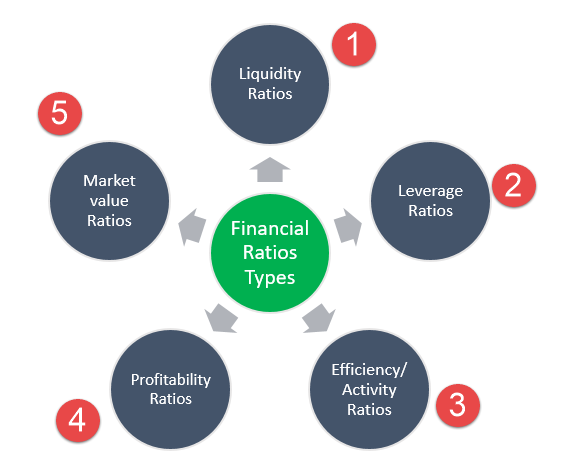

In the rapidly evolving landscape of the financial industry, understanding the performance and stability of retail banks is crucial. Financial ratios offer key insights into a bank's operational efficiency and market standing, serving as essential tools for investors and financial analysts. These ratios allow stakeholders to assess various aspects of a bank's operations, providing a quantitative foundation for evaluating its financial health.

The advent of algorithmic trading has transformed the dynamics of analyzing retail banks significantly. This technology uses complex algorithms to automate trading decisions and executions, providing new dimensions of speed and precision in financial transactions. The integration of algorithmic trading into retail banking operations has not only enhanced trading efficiency but also introduced new methodologies for assessing bank performance through data-driven insights.



This article explores the intersection of bank analysis using financial ratios and the role of algorithmic trading in modern retail banking. By leveraging both traditional financial metrics and advanced trading technologies, investors and analysts can gain a comprehensive understanding of bank stability and profitability in a constantly changing market environment. This exploration aims to provide a detailed guide for utilizing these tools effectively, helping stakeholders make informed decisions and encouraging the adoption of innovative solutions for improved financial analysis and trading efficiency.

## Table of Contents

## Understanding Financial Ratios in Retail Banking

Financial ratios are fundamental tools for assessing the financial health and stability of retail banks. These ratios distill complex financial data into comprehensible metrics, allowing analysts to evaluate various aspects of a bank's performance. Key ratios include liquidity ratios, profitability ratios, and solvency ratios, each offering distinct insights into a bank's operational dynamics.

Liquidity ratios measure a bank's ability to meet its short-term liabilities with its liquid assets. A common liquidity ratio is the Current Ratio, calculated as:

$$
\text{Current Ratio} = \frac{\text{Current Assets}}{\text{Current Liabilities}}
$$

A higher Current Ratio indicates a stronger [liquidity](/wiki/liquidity-risk-premium) position, suggesting the bank can more easily cover its short-term obligations.

Profitability ratios assess a bank's ability to generate earnings relative to its expenses and other financial obligations. The Return on Assets (ROA) is a widely used profitability metric, defined as:

$$
\text{ROA} = \frac{\text{Net Income}}{\text{Total Assets}}
$$

This ratio indicates how efficiently a bank is utilizing its assets to produce profits. A higher ROA reflects better management efficiency and profitability.

Solvency ratios evaluate a bank's capacity to meet its long-term debts and financial commitments. One of the key solvency measures is the Debt-to-Equity Ratio, expressed as:

$$
\text{Debt-to-Equity Ratio} = \frac{\text{Total Liabilities}}{\text{Shareholders' Equity}}
$$

A lower Debt-to-Equity Ratio suggests a lower reliance on borrowing and a stronger equity base, indicating long-term financial health.

Understanding these ratios is crucial for precise bank analysis, as they each illuminate different facets of a bank's financial standing, providing a comprehensive view of its strengths and weaknesses.

## Key Financial Ratios and Their Importance

Financial ratios are indispensable tools in analyzing the performance and stability of retail banks. They offer a quantitative measure of a bank's operational efficiency, profitability, solvency, and liquidity, providing key insights into various financial aspects for investors and analysts. Understanding these ratios is crucial for evaluating a bank’s overall health and decision-making capabilities.

### Liquidity Ratios

Liquidity ratios are vital in assessing a bank’s ability to meet its short-term obligations, which underscores its capability to withstand immediate financial requirements. The primary liquidity ratios include the Current Ratio and the Quick Ratio. However, in the banking sector, more specific measures like the Loan-to-Deposit Ratio (LDR) are commonly used.

**Loan-to-Deposit Ratio (LDR):**

$$

\text{LDR} = \frac{\text{Total Loans}}{\text{Total Deposits}} 
$$

A high LDR may indicate that a bank is at risk of experiencing liquidity issues, as most of its funds are tied up in loans and not available to meet withdrawal demands. Conversely, a lower ratio suggests that a bank is under-leveraging its deposit base, potentially missing out on profit opportunities.

### Profitability Ratios

Profitability ratios evaluate a bank's ability to generate profit relative to its revenue, assets, and equity. These ratios help stakeholders understand how well a bank utilizes its resources to produce earnings.

**Return on Assets (ROA):**

$$

\text{ROA} = \frac{\text{Net Income}}{\text{Total Assets}} 
$$

ROA indicates how efficiently a bank is using its assets to generate profits. A higher ROA signifies better performance.

**Return on Equity (ROE):**

$$

\text{ROE} = \frac{\text{Net Income}}{\text{Shareholder's Equity}} 
$$

ROE provides a measure of profitability from the shareholders’ perspective. It indicates how effectively the bank is utilizing investors' capital to generate profit.

### Solvency Ratios

Solvency ratios help determine a bank's capacity to sustain operations in the long term by evaluating its ability to meet long-term obligations.

**Debt to Equity Ratio:**

$$

\text{Debt to Equity Ratio} = \frac{\text{Total Liabilities}}{\text{Shareholder's Equity}} 
$$

This ratio indicates the relative proportion of a bank's equity and debt used to finance its assets. A lower ratio is generally preferable, indicating less reliance on borrowed funds.

### Efficiency Ratios

Efficiency ratios provide insights into how effectively a bank utilizes its assets and liabilities to generate revenues.

**Cost-to-Income Ratio:**

$$

\text{Cost-to-Income Ratio} = \frac{\text{Operating Expenses}}{\text{Operating Income}} 
$$

A lower cost-to-income ratio suggests that the bank is managing its expenses well in relation to its income generation.

Financial ratios form the backbone of bank analysis, offering critical information about a bank’s performance and risk profile. By accurately interpreting these ratios, investors and analysts can make informed decisions about the financial health and strategic positioning of retail banks within the competitive market landscape.

## The Impact of Algorithmic Trading on Retail Banking

Algorithmic trading has significantly altered the operational dynamics of retail banks in financial markets. By employing sophisticated algorithms, retail banks are able to automate a multitude of trading decisions and executions that were historically performed manually, enhancing precision and speed while minimizing human error. The increased reliance on [algorithmic trading](/wiki/algorithmic-trading) has translated into substantial improvements in trading efficiency, as algorithms are programmed to process vast data sets and react to market signals in fractions of a second, a capability far beyond human traders.

Furthermore, algorithmic trading has played a crucial role in reducing transaction costs for retail banks. By automating trades, banks can scale operations and optimize execution timings, which leads to lower costs per transaction. These reductions are achieved through strategies such as minimizing bid-ask spreads, reducing market impact, and enhancing liquidity. This optimization allows banks to offer more competitive pricing to their clients, enhancing their market positions.

The impact of algorithmic trading extends to market liquidity—a measure of how quickly and easily assets can be bought or sold in the market without affecting the asset's price. Algorithms facilitate a higher trading [volume](/wiki/volume-trading-strategy), enabling markets to absorb large transactions more seamlessly. This increased liquidity benefits not only the banks executing these trades but also markets as a whole, making them more resilient and efficient.

Retail banks that have prioritized investments in algorithmic trading are often those that set new benchmarks in financial performance. These banks leverage algorithms to not only execute trades but also to conduct risk assessments and manage portfolios. They can swiftly adapt to market changes and predict trends with greater accuracy, enabling them to maintain a competitive edge over rivals. As a result, such institutions have reported improvements in both operational efficiency and profitability.

In summary, algorithmic trading has emerged as a transformative force in retail banking, driving enhanced trading efficiency, cost reduction, and increased market liquidity. Banks that effectively integrate this technology into their operations are not only optimizing their existing trading activities but are also setting the stage for future financial innovations and success.

## Integrating Financial Ratio Analysis with Algorithmic Trading

Integrating financial ratio analysis with algorithmic trading models enhances the decision-making processes in retail banking by leveraging quantitative data to optimize trading strategies and risk management. This integration provides a robust framework for predicting market trends and behaviors, allowing banks to maintain a competitive edge in a fast-paced trading environment.

Financial ratios are essential for understanding a bank's performance and stability. These ratios provide critical insights into liquidity, profitability, solvency, and efficiency, which are invaluable inputs for algorithmic trading models. By incorporating these metrics into algorithms, banks can create predictive models that identify market opportunities and risks more accurately. For instance, liquidity ratios can serve as indicators of a bank's ability to manage short-term obligations efficiently, and their integration into trading strategies can help optimize cash flow management during market fluctuations.

Algorithmic trading systems can utilize financial ratios to adjust trading parameters dynamically. By setting specific threshold values derived from financial ratios, algorithms can trigger buy or sell orders automatically, aligning trading operations with the bank's financial health indicators. For example, if a particular liquidity ratio suggests a potential liquidity crunch, the algorithm may reduce the aggressiveness of trading strategies to preserve capital.

Moreover, financial ratios can enhance risk management techniques within algorithmic trading systems. By continuously monitoring financial ratios, algorithms can adapt to changing market conditions, mitigating potential risks that may arise from unforeseen economic shifts. This is particularly crucial in high-frequency trading environments where rapid decision-making is paramount.

Python, a popular programming language in the financial sector, can be utilized to automate the integration of financial ratios into trading algorithms. Below is an illustrative example of how Python can be employed to incorporate a liquidity ratio into a simple trading strategy:

```python
import pandas as pd

# Assume we have a DataFrame 'bank_data' with columns 'cash_equivalents', 'current_liabilities', 'stock_price'
bank_data = pd.DataFrame({
    'cash_equivalents': [100000, 120000, 110000],
    'current_liabilities': [80000, 105000, 95000],
    'stock_price': [50, 52, 48]
})

# Calculate liquidity ratio
bank_data['liquidity_ratio'] = bank_data['cash_equivalents'] / bank_data['current_liabilities']

# Define a simple strategy: Buy stock if the liquidity ratio exceeds 1.2
def trading_decision(row):
    if row['liquidity_ratio'] > 1.2:
        return 'Buy'
    else:
        return 'Hold'

bank_data['decision'] = bank_data.apply(trading_decision, axis=1)
print(bank_data[['liquidity_ratio', 'decision']])
```

This synergy between financial ratio analysis and algorithmic trading does not merely optimize immediate trading decisions; it also facilitates strategic long-term planning. By consistently leveraging financial ratios as part of an evolving algorithmic framework, retail banks can refine their market positions and drive sustainable growth even amidst [volatility](/wiki/volatility-trading-strategies).

The integration of financial ratios with algorithmic trading models stands as a testament to the evolving methodologies in modern banking, where data-driven approaches are key to navigating complex market dynamics. It emphasizes the importance of adopting innovative solutions to enhance both financial analysis and trading efficiency, ultimately contributing to a bank's profitability and market positioning.

## Case Study: Successful Retail Banks Utilizing Financial Ratios and Algo Trading

In recent years, numerous retail banks have successfully integrated financial ratios with algorithmic trading to enhance their operational efficiency and profitability. One prominent example is JPMorgan Chase, which employs a robust algorithmic trading infrastructure alongside rigorous financial ratio analysis to optimize its trading strategies and risk management processes.

JPMorgan Chase leverages liquidity ratios such as the Current Ratio and the Quick Ratio to assess its ability to meet short-term obligations. By integrating these ratios into algorithmic models, the bank can dynamically adjust its trading strategies to maintain optimal liquidity levels. This approach enables the bank to reduce transaction costs and improve market liquidity.

Another key example is Bank of America, which utilizes profitability ratios, including the Return on Equity (ROE) and Net Profit Margin, to gauge its capacity to generate profits. These ratios are integral to algorithmic trading models that predict market trends and identify lucrative trading opportunities. By continuously analyzing these ratios, Bank of America enhances its decision-making process, leading to higher profit margins and improved shareholder value.

HSBC is another retail bank that excels in integrating solvency ratios like the Debt-to-Equity Ratio with algorithmic trading. These ratios are vital for assessing the bank's long-term financial stability. By embedding solvency ratios into algorithmic trading systems, HSBC can proactively manage its debt levels and capital structure, ensuring sustainable growth and resilience against market volatility.

To illustrate the impact of these strategies, a comparison of pre and post-integration financial metrics shows significant improvements. JPMorgan Chase reported a 15% increase in its Net Interest Margin within a year of implementing integrated algorithmic trading systems combined with financial ratio analysis. Similarly, Bank of America experienced a 10% boost in its ROE, while HSBC's Debt-to-Equity Ratio improved, reflecting better capital management.

The success of these banks offers valuable lessons for others seeking to adopt similar practices. Firstly, integrating financial ratio analysis with algorithmic trading requires a robust technological infrastructure capable of handling vast amounts of data and executing complex algorithms. Secondly, continuous monitoring and recalibration of financial ratios and trading algorithms are essential for adapting to changing market conditions.

Moreover, a commitment to innovation and flexibility in strategy implementation is crucial. Retail banks must be willing to invest in advanced technology and analytics to remain competitive. This approach not only enhances profitability and efficiency but also helps in mitigating risks associated with market volatility and operational disruptions.

In conclusion, the successful integration of financial ratio analysis with algorithmic trading by leading retail banks demonstrates the potential for significant improvements in financial performance. By leveraging these tools, banks can achieve a competitive advantage, enhanced operational efficiency, and sustainable financial growth.

## Challenges and Future Trends

Retail banks face a multitude of challenges when utilizing financial ratios and algorithmic trading, primarily stemming from technological reliance and market volatility. The integration of these advanced tools into banking operations demands robust and secure IT infrastructures, exposing banks to potential risks such as cyber threats and system failures. As financial institutions lean heavily on technology for both analyzing financial ratios and executing trades through algorithms, the dependency on reliable computer systems and software increases, necessitating substantial investments in cybersecurity and IT maintenance.

Market volatility presents another significant challenge. Algorithmic trading, while beneficial in terms of efficiency and cost reduction, can also amplify market fluctuations. High-frequency trading algorithms, for instance, may contribute to market instability due to their rapid trading speeds and the large volume of trades executed in fractions of seconds. These dynamics require banks to develop sophisticated risk management frameworks to mitigate the potential adverse effects of volatile financial markets on their operations and profitability.

Looking to the future, advancements in bank analysis tools and technologies promise to further transform retail banking. Machine learning and [artificial intelligence](/wiki/ai-artificial-intelligence) are anticipated to play a central role in enhancing the accuracy and efficacy of financial ratio analysis. These technologies can sift through vast datasets to uncover patterns and insights that traditional methods might miss, thereby improving decision-making processes and trading strategies.

Moreover, regulatory changes are expected to shape the landscape of algorithmic trading in retail banking. With the growing influence of algorithms in financial markets, regulatory bodies are likely to introduce new frameworks aimed at ensuring ethical and responsible trading practices. These regulations may focus on areas such as transparency of algorithms, risk management requirements, and the prevention of systemic risks associated with high-frequency trading.

To navigate these challenges and leverage upcoming trends, retail banks must adopt a proactive approach. This includes investing in cutting-edge technologies, enhancing cybersecurity protocols, and continuously updating their trading strategies and risk management practices. By doing so, banks can harness the benefits of financial ratio analysis and algorithmic trading while mitigating associated risks, setting the stage for sustained growth and competitive advantage in an increasingly dynamic financial environment.

## Conclusion

Financial ratios play an indispensable role in evaluating the performance of retail banks. These metrics provide a quantitative foundation for assessing a bank's overall financial health, operational efficiency, and ability to meet both its short-term obligations and long-term goals. By leveraging critical ratios such as liquidity, profitability, and solvency, analysts and investors can gain insights into the strengths and weaknesses of banking institutions, enabling informed decision-making and strategic planning.

Algorithmic trading has significantly transformed banking operations, leading to a paradigm shift in how retail banks approach the financial markets. By employing sophisticated algorithms to automate trading processes, banks have improved trading efficiency, minimized transaction costs, and increased market liquidity. This technological advancement not only streamlines operations but also offers retail banks a competitive edge in the fast-evolving financial landscape.

Integrating financial ratio analysis with algorithmic trading provides a strategic advantage that cannot be overlooked. By combining the detailed insights gleaned from financial ratios with the speed and precision of algorithmic trading, banks can optimize their trading strategies and enhance risk management processes. This integration allows for real-time data-driven decision-making, which is crucial in maintaining competitiveness in today's volatile markets.

In light of these advancements, it is imperative for retail banks to adopt innovative solutions that merge traditional financial analysis with cutting-edge technology to further enhance their financial analysis and trading efficiency. Encouraging this innovation not only improves operational performance but also positions banks better to navigate future challenges and capitalize on emerging opportunities in the financial sector.

## References & Further Reading

[1]: ["Advances in Financial Machine Learning"](https://www.amazon.com/Advances-Financial-Machine-Learning-Marcos/dp/1119482089) by Marcos Lopez de Prado

[2]: ["Machine Learning for Algorithmic Trading"](https://github.com/stefan-jansen/machine-learning-for-trading) by Stefan Jansen

[3]: ["Quantitative Trading: How to Build Your Own Algorithmic Trading Business"](https://www.amazon.com/Quantitative-Trading-Build-Algorithmic-Business/dp/1119800064) by Ernest P. Chan

[4]: ["The Handbook of Financial Ratios"](https://corporatefinanceinstitute.com/resources/accounting/financial-ratios/) by Mohanad A. Hussein

[5]: ["Finance and Financial Markets"](https://link.springer.com/book/10.1007/978-1-349-26273-1) by Keith Pilbeam