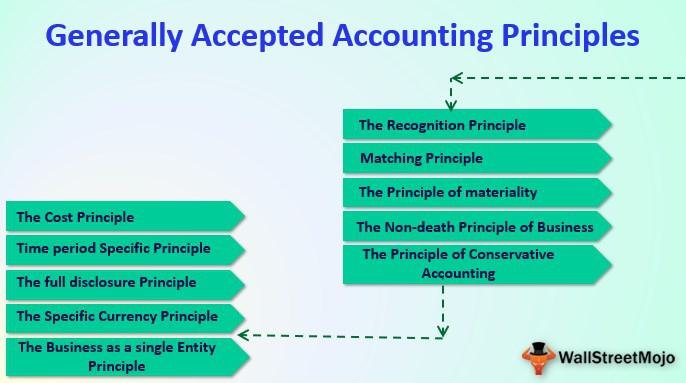

The integration of financial reporting standards such as Generally Accepted Accounting Principles (GAAP) with algorithmic trading marks a pivotal advancement within the financial industry. GAAP plays an essential role in ensuring transparency and consistency across financial documentation, which is vital for maintaining investor confidence and aiding informed decision-making. As trading environments evolve, incorporating robust reporting standards has become increasingly important to uphold the integrity of financial statements.

Algorithmic trading, characterized by the application of complex algorithms to automate trading processes, dramatically enhances the speed and accuracy of trade execution. By bypassing the limitations inherent in manual trading, algorithmic systems execute trades at velocities unattainable by human traders, thereby optimizing market efficiency and liquidity. This approach not only boosts performance but also imposes rigorous demands on data accuracy and consistency, which underscores the necessity for standardized accounting practices.



The convergence of GAAP with algorithmic trading forms a complex interplay that significantly influences contemporary financial markets. This interrelationship necessitates a holistic understanding of both components to evaluate their combined impact on market dynamics and trading performance effectively. The synergy between rigorous financial reporting standards and high-frequency trading strategies is critical for ensuring that financial data is both timely and reliable, supporting the strategic objectives of institutions engaged in algorithmic trading.

As financial markets continue to advance, the collaboration between accounting standards and emerging trading technologies will be instrumental in shaping future market practices. This discussion aims to provide insight into how GAAP and algorithmic trading collectively drive innovation, efficiency, and transparency within the global financial ecosystem.

## Table of Contents

## Understanding GAAP and Accounting Standards

Understanding Generally Accepted Accounting Principles (GAAP) and accounting standards is fundamental to ensuring consistency and transparency in financial reporting within the United States. GAAP offers a comprehensive framework designed to provide uniformity in the presentation of financial statements, which is indispensable for businesses, accountants, and investors. This framework facilitates comparability across different organizations, allowing stakeholders to make informed decisions based on reliable financial data.

The Financial Accounting Standards Board (FASB) holds the responsibility of establishing and periodically updating GAAP standards. This ensures that financial reporting remains both relevant and reliable, addressing the evolving needs of the market and incorporating contemporary best practices. Through these updates, FASB aims to enhance the accuracy and integrity of financial disclosures, fostering trust and credibility among market participants.

The rapid advancement of [algorithmic trading](/wiki/algorithmic-trading) presents unique challenges in maintaining the accuracy and timeliness of financial reports under the GAAP framework. Algorithmic trading requires financial data to be processed and analyzed at unprecedented speeds, which can put pressure on traditional accounting practices. It becomes increasingly important for financial professionals to reconcile GAAP standards with the fast-paced nature of algorithmic environments, ensuring that financial reporting does not lag behind market activities.

To address these challenges, financial professionals must engage thoroughly with GAAP principles. A deep understanding of these standards is crucial for those responsible for ensuring that financial data is reported precisely and in compliance with regulatory requirements. This engagement involves staying informed about updates to the standards, understanding their implications, and applying them diligently to maintain the integrity of financial documentation.

By adhering to GAAP, organizations can achieve uniformity in their financial reports, providing stakeholders with a consistent basis for evaluation. This consistency is vital for fostering investor confidence, facilitating access to capital markets, and supporting the overall stability and efficiency of the financial system. As businesses increasingly integrate technological advancements into their operations, the role of GAAP in maintaining clarity and accountability in financial reporting becomes ever more essential.

## Algorithmic Trading: An Overview

Algorithmic trading, a sophisticated method of executing trades using pre-programmed and complex algorithms, has revolutionized financial markets by enabling transaction speeds that far exceed human capabilities. This method leverages mathematical models and computational power to analyze market data, identify trading opportunities, and execute orders, often within microseconds. The rapid pace of algorithmic trading is particularly beneficial in highly liquid markets, where speed and accuracy can significantly impact profitability.

High-frequency trading ([HFT](/wiki/high-frequency-trading-strategies)) represents a subset of algorithmic trading that underscores the importance of real-time accuracy in financial data. HFT strategies involve executing a large number of orders at incredibly fast speeds—sometimes thousands of trades per second—while capitalizing on minute price differentials. The success of HFT relies heavily on robust datasets and advanced trading algorithms, which are continuously optimized to respond to fleeting market conditions. Essential to this process is the integration of real-time data analytics, allowing firms to adapt strategies instantaneously in response to market changes.

The efficiency and speed of algorithmic trading depend on the seamless integration with standardized accounting practices. Accurate and timely data inputs are critical, as any discrepancies can lead to erroneous trades and substantial financial losses. Accounting standards such as GAAP ensure that financial data used in trading algorithms is consistent, reliable, and transparent, thus supporting high-precision trading activities.

Understanding the infrastructure of algorithmic trading is crucial for aligning it with accounting standards. This includes a comprehensive grasp of the trading platforms, data feeds, execution protocols, and risk management systems involved. The technological backbone of algorithmic trading consists of powerful servers, sophisticated software, and high-speed networks capable of processing vast amounts of data in real time. Ensuring that this infrastructure meets the rigorous demands of accounting accuracy is fundamental to maintaining the integrity of trading operations.

The scalability of algorithmic trading greatly enhances market efficiency. By automating trade executions, firms can capitalize on a broader array of market opportunities while reducing transaction costs and the potential for human error. This scalability not only offers a competitive advantage to firms that effectively implement algorithmic strategies but also contributes to overall market [liquidity](/wiki/liquidity-risk-premium) and price discovery. In an increasingly digital trading landscape, the ability to scale operations efficiently remains a key driver of success in the financial industry.

## Impact of Algorithmic Trading on Financial Reporting

Algorithmic trading, characterized by its rapid execution and reliance on large datasets, imposes significant demands on financial reporting systems. This trading method requires accurate and timely financial data, pushing the boundaries of conventional accounting processes. 

To accommodate the swift nature of algorithmic trading, enhancements in accounting systems are vital. Traditional reporting cycles, which often span weeks or months, must be adapted to meet the immediate data requirements essential for effective algorithmic trading. This necessitates real-time data analytics, allowing for faster decision-making and responsiveness to market movements.

The harmonization of rapid data processing with established financial reporting practices is crucial. Algorithmic trading systems must consistently process and integrate data to provide a seamless flow from trade execution to financial reporting, ensuring coherence and accuracy. This integration aids in bridging the gap between swift trading environments and slower, more deliberate financial reporting cycles.

Aligning trading platforms with financial reporting frameworks ensures both precision and compliance. This alignment requires synchronization of accounting standards with technological advancements, fostering an environment where financial data is both reliable and rapidly accessible. Such measures are essential for firms aiming to maintain transparency and regulatory adherence while leveraging the efficiencies of algorithmic trading. 

Furthermore, addressing these challenges involves not only technological solutions but also strategic adjustments in financial reporting. Emphasizing consistency in data processing and real-time capabilities can enhance the connectivity between algorithmic trading platforms and financial reporting mechanisms, supporting both strategic decision-making and regulatory compliance.

## Integration Challenges and Solutions

Standardizing accounting practices with algorithmic trading is fraught with challenges, primarily due to the disparate demands of data processing speed and maintaining consistency in financial reporting. The high-speed environment of algorithmic trading thrives on real-time data analysis, yet traditional financial accounting frameworks, such as GAAP and IFRS, often work on periodic reporting schedules.

### Regulatory Differences and Consistency

One fundamental challenge arises from the regulatory discrepancies between GAAP (Generally Accepted Accounting Principles) and IFRS (International Financial Reporting Standards). These two systems have varied approaches to financial data, leading to inconsistencies, particularly when trading systems operate across international borders. For instance, IFRS is more principles-based, allowing flexibility in interpretation, while GAAP is more rules-based, providing specific guidelines. These differences can result in varying financial metrics and valuations, affecting the uniformity necessary for algorithmic models that operate cross-border.

### Technological Solutions for Real-Time Processing

Addressing the speed at which data must be processed in algorithmic trading involves adopting technological innovations. In-memory databases and AI-driven data management systems offer the capability to handle large data volumes with the requisite speed and accuracy needed. In-memory databases store data directly in the RAM, reducing latency significantly and enhancing the ability to execute trades based on real-time information.

For example, a Python implementation utilizing Pandas for data processing can be optimized with a library such as Dask or Vaex, which parallelizes operations and efficiently handles large datasets.

```python
import dask.dataframe as dd
# Load data into a Dask DataFrame
df = dd.read_csv('large_data.csv')
# Perform operations across the dataset efficiently
result = df.groupby('stock_symbol').agg({'trade_volume': 'sum', 'trade_value': 'mean'}).compute()
```

### Inventory Valuation Methods

Consistent inventory valuation methods, such as FIFO (First In, First Out) or LIFO (Last In, First Out), are essential for reducing discrepancies in financial reporting. These accounting methods directly impact the cost of goods sold and inventory valuation on balance sheets, thereby influencing financial statements used by algorithmic trading systems. As these systems often depend on accurate financial metrics for strategy formulation, harmonizing valuation methods can mitigate misinterpretations.

### Strategic Reporting Adjustments

The integration of accounting standards with algorithmic trading systems also necessitates strategic changes in financial reporting. This involves refining traditional accounting practices to accommodate the rapid data cycles fundamental to trading algorithms. Adjustments can include more frequent interim reports, real-time data feeds, and enhanced collaboration between financial reporting teams and trading system developers.

### Conclusion

In summary, the integration of algorithmic trading with standardized accounting practices demands advancements in both technology and regulatory frameworks. Overcoming these challenges requires a concerted effort to align disparate systems, employing innovative data processing solutions and strategic adaptations to reporting requirements. As the financial industry evolves, bridging the gap between high-speed trading environments and traditional accounting standards remains a critical focus for achieving seamless data accuracy and regulatory compliance.

## Future Trends and Convergence Efforts

Future financial reporting is progressively steering towards harmonization of Generally Accepted Accounting Principles (GAAP) and International Financial Reporting Standards (IFRS), with pivotal focus on inventory valuation and Net Realizable Value (NRV) definitions. The discrepancies in accounting for inventory, often a significant asset on the balance sheet, can lead to substantial variations in financial reporting outcomes. Bridging these differences is crucial to ensure that financial statements provide a consistent basis for comparison, thereby fostering improved investor understanding and decision-making.

Technological advancements play a formidable role in this transformation, particularly automation and real-time analytics, which are poised to significantly reshape financial reporting processes. Automation facilitates the expeditious handling of vast datasets, which is fundamental in algorithmic trading environments where speed and precision are paramount. Real-time analytics empowers organizations to generate up-to-the-minute financial reports, thereby aligning financial documentation with the rapid transactions typical of algorithmic trading.

The implementation of real-time reporting systems is essential for supporting algorithmic trading, necessitating considerable enhancements in data processing speed and precision. Technological innovations, such as cloud-based financial systems, [machine learning](/wiki/machine-learning) algorithms, and [artificial intelligence](/wiki/ai-artificial-intelligence) integration, are instrumental in facilitating these advancements. For example, machine learning models can predict inventory requirements or recognize patterns that necessitate real-time reporting adjustments, thereby heightening both accuracy and efficiency.

Convergence efforts between GAAP and IFRS aim to eliminate existing disparities and elevate the transparency and comparability of financial statements. By mitigating the differences in financial reporting standards, these efforts enhance the clarity and reliability of financial information disseminated to stakeholders worldwide. As stakeholders navigate the complexities of a global market, such convergence not only bolsters financial reporting accuracy but also strengthens investor confidence across diverse jurisdictions.

Adapting to technological changes and convergence initiatives is vital for stakeholders to maintain competitiveness and ensure compliance. Stakeholders must remain vigilant and flexible, updating practices and systems to align with evolving standards and technological capabilities. This adaptability is critical for attracting investment, as transparent and comparable financial reports are integral to fostering trust among investors and regulators alike.

## Conclusion

The convergence of accounting standards like Generally Accepted Accounting Principles (GAAP) with algorithmic trading represents a crucial intersection in modern financial management. This integration is not merely about coexistence but demands a harmonization that ensures both systems enhance each other's effectiveness. Aligning GAAP with advanced trading technologies is instrumental in achieving robust financial reporting and improved trading performance. This alignment facilitates the accurate and timely processing of financial data, which is essential for algorithmic systems that rely on precision and speed. Such synchronization can lead to improved investor confidence and a more efficient marketplace.

Adapting to the rapid technological advancements in the financial sector requires continuous learning and an adaptable mindset. The financial landscape is constantly evolving with innovations in trading technologies and updates in accounting methodologies. Professionals in finance must remain agile and informed to effectively manage these changes. This adaptability helps organizations to not only comply with current standards but also to anticipate and integrate future developments.

Investing in training and education for finance professionals is imperative. By equipping individuals with the necessary skills and knowledge, organizations can better manage the complexities associated with the integration of GAAP and algorithmic trading. This empowerment enables professionals to contribute significantly to market stability, thus fostering an environment conducive to innovation and growth.

The strategic integration of accounting standards with algorithmic trading technologies is foundational to financial management and innovation on a global scale. It supports strategic decision-making and ensures that financial reporting is both transparent and reliable. As organizations navigate this integration, they pave the way for a future where financial markets are characterized by increased transparency, efficiency, and competitiveness.

## References & Further Reading

1. **Generally Accepted Accounting Principles (GAAP)** by Financial Accounting Standards Board - This resource provides comprehensive guidelines on financial accounting and reporting standards in the U.S., crucial for ensuring transparency, consistency, and accuracy in financial documentation. Access it at the [Financial Accounting Standards Board (FASB) website](https://www.fasb.org/).

2. **Advances in Financial Machine Learning** by Marcos Lopez de Prado - This book investigates into the application of machine learning techniques in finance, offering insights into algorithmic trading strategies and predictive analytics. Available on [Wiley Online Library](https://www.wiley.com/en-us/Advances+in+Financial+Machine+Learning-p-9781119482086).

3. **Quantitative Trading: How to Build Your Own Algorithmic Trading Business** by Ernest P. Chan - A practical guide for those interested in creating algorithmic trading systems, covering strategy development and implementation. Find it on [Amazon](https://www.amazon.com/Quantitative-Trading-Build-Algorithmic-Business/dp/1119800069).

4. **Handbook of High-Frequency Trading** edited by Greg N. Gregoriou - This handbook provides an exploration of high-frequency trading, encompassing its techniques, challenges, and regulatory aspects. Check it out on [Wiley Online Library](https://www.wiley.com/en-us/Handbook+of+High+Frequency+Trading-p-9781119941791).

5. **International Financial Reporting Standards (IFRS)** by IFRS Foundation - Essential for understanding global accounting standards, IFRS provides a framework for preparing and presenting financial statements. More information is available at the [IFRS Foundation website](https://www.ifrs.org/).

