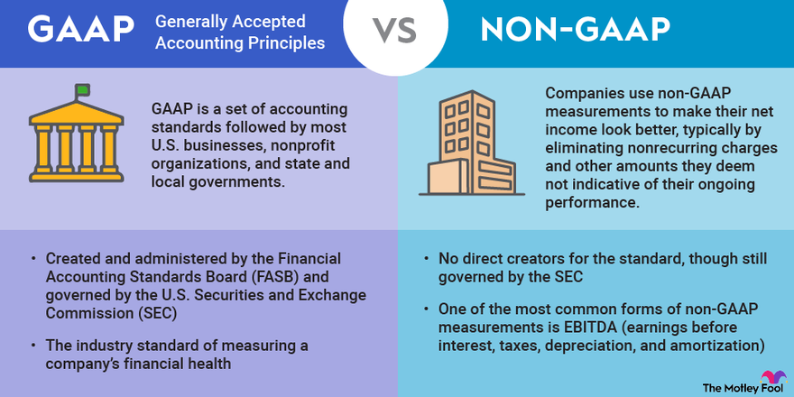

## Table of Contents

## What is GAAP and why is it important for financial reporting?

GAAP stands for Generally Accepted Accounting Principles. It is a set of rules and standards that companies in the United States must follow when they prepare their financial statements. These rules make sure that the financial information a company shares is clear, consistent, and easy to understand. This helps people like investors, creditors, and others who look at the financial statements to make good decisions.

GAAP is important because it helps everyone trust the financial information that companies share. When all companies follow the same rules, it's easier to compare their financial statements. This is really helpful for investors who want to see which companies are doing well and which ones might be struggling. Without GAAP, each company could use different ways to report their finances, which would make it hard to know if the information is accurate or if companies are being fair.

## What are the basic principles of GAAP that businesses must follow?

GAAP has several basic principles that businesses must follow. One key principle is the revenue recognition principle, which says that a company should record revenue when it is earned, not necessarily when the money is received. This helps make sure that the financial statements show a true picture of the company's performance over time. Another important principle is the matching principle, which means that expenses should be recorded in the same period as the revenues they help to generate. This helps to accurately show how profitable the company is during a specific time.

Another principle is the full disclosure principle, which requires companies to include all important information in their financial statements that could affect the decisions of users. This means being open about any risks or uncertainties that might impact the company's financial health. The cost principle is also crucial, stating that assets should be recorded at their original cost, not their current market value. This helps keep the financial statements consistent and reliable. Finally, the principle of consistency means that once a company chooses an accounting method, it should stick with it from one period to the next, unless there's a good reason to change. This makes it easier for people to compare financial statements over time.

## Who is required to follow GAAP in their financial reporting?

In the United States, companies that are publicly traded on a stock exchange, like those listed on the New York Stock Exchange or NASDAQ, must follow GAAP in their financial reporting. This is because the Securities and Exchange Commission (SEC) requires it. The SEC is the government agency that makes sure companies follow the rules when they sell stocks to the public. By using GAAP, these companies make sure their financial statements are clear and easy to understand for everyone who might want to invest in them.

Not just public companies, but also many private companies choose to follow GAAP. This is because it helps them look more trustworthy to banks, investors, and other people they do business with. Even though private companies don't have to follow GAAP by law, using these standards can make it easier for them to get loans or attract investors. In the end, following GAAP helps all kinds of businesses show that they are honest and reliable with their financial information.

## What are the main financial statements required under GAAP?

Under GAAP, companies need to prepare four main financial statements. The first one is the income statement, which shows how much money the company made and spent over a certain time, like a year or a quarter. It tells you if the company made a profit or a loss by showing the difference between its revenues and expenses. The second statement is the balance sheet, which gives a snapshot of what the company owns and owes at a specific point in time. It lists the company's assets, like cash and equipment, and its liabilities, like loans and bills, along with the owners' equity, which is what's left over for the owners after paying off all the debts.

The third main statement is the statement of cash flows, which tracks the actual cash coming in and going out of the business. It's divided into three parts: operating activities, which show cash from the company's main business; investing activities, which show cash used for buying or selling assets; and financing activities, which show cash from loans or payments to investors. The fourth statement is the statement of changes in equity, which explains how the owners' equity changed over the period. It includes things like profits or losses, dividends paid to shareholders, and any new investments or withdrawals by the owners. Together, these statements give a complete picture of the company's financial health and performance.

## How does GAAP affect the preparation of an income statement?

GAAP affects the preparation of an income statement by setting rules on how to recognize revenue and match expenses. The revenue recognition principle says that a company should record revenue when it's earned, not when the money comes in. For example, if a company sells a product in December but doesn't get paid until January, it should still show that revenue in December's income statement. The matching principle helps too, by saying that expenses should be recorded in the same period as the revenues they helped to create. So, if a company spends money on making a product in November, but sells it in December, those costs should be in December's income statement.

These rules make the income statement more accurate and useful. By following GAAP, the income statement shows a true picture of how well the company did over a certain time. It helps investors and others see if the company made a profit or a loss, and understand what drove those results. Without GAAP, companies might report their income in different ways, making it hard to compare them or trust the numbers. So, GAAP helps keep things clear, consistent, and fair for everyone looking at the income statement.

## What specific requirements does GAAP impose on the balance sheet?

GAAP sets specific rules for what goes on a balance sheet and how it should be shown. The balance sheet has to list all the company's assets, like cash, buildings, and equipment, at their original cost, not what they might be worth now. This is called the cost principle. The balance sheet also needs to show all the company's liabilities, like loans and bills, and the owners' equity, which is what's left over for the owners after paying off all the debts. Everything on the balance sheet has to be clear and easy to understand, so people can see what the company owns and owes at a specific time.

GAAP also says that the balance sheet should be prepared using the same accounting methods from one period to the next, unless there's a good reason to change. This is the principle of consistency, which helps people compare the balance sheets over time to see how the company is doing. The full disclosure principle is important too, meaning the company has to tell everything that might affect the decisions of people looking at the balance sheet. This makes sure the balance sheet gives a true and fair view of the company's financial health.

## How should revenue recognition be handled according to GAAP?

According to GAAP, revenue should be recognized when it is earned and when it is realized or realizable. This means a company should record revenue in its financial statements when it has done what it promised to do for the customer, and when the company is sure it will get paid. For example, if a company sells a product in December but doesn't get paid until January, it should still show that revenue in December's financial statements because the sale was made in December.

The idea behind this rule is to make sure the financial statements show a true picture of the company's performance over time. If a company only recorded revenue when it got paid, the financial statements might not show the real results of its work. By following this rule, the financial statements are more accurate and helpful for investors and others who want to know how well the company is doing.

## What are the GAAP rules concerning the reporting of leases?

GAAP has special rules for how companies should report leases. There are two main types of leases: operating leases and finance leases. For operating leases, like renting an office space, the company doesn't show the lease as an asset or a liability on the balance sheet. Instead, it records the lease payments as an expense on the income statement over the lease term. For finance leases, which are more like buying something with a loan, the company does show the leased asset and the lease obligation as a liability on the balance sheet. The company also records interest expense on the lease and depreciation on the leased asset over time.

These rules help make sure that the financial statements give a clear picture of the company's situation. For operating leases, not showing them on the balance sheet can make the company look like it has fewer debts. But, GAAP now requires companies to give more information about their operating leases in the notes to the financial statements. This helps investors and others understand the company's lease commitments better. For finance leases, showing them on the balance sheet is important because it shows the true amount of assets and debts the company has, which is helpful for people trying to understand the company's financial health.

## How does GAAP address the treatment of inventory?

GAAP has rules for how companies should handle their inventory, which are the goods they have to sell or use in their business. One big rule is called the lower of cost or market (LCM) rule. This means that a company has to look at its inventory and see if it's worth less now than when they bought it. If it is, they have to show it at the lower price on their financial statements. This makes sure the inventory value is realistic and not too high.

Another rule is about how to figure out the cost of inventory. GAAP says companies can use different methods like FIFO (First In, First Out) or LIFO (Last In, First Out) to keep track of their inventory costs. FIFO means the first items bought are the first ones sold, while LIFO means the last items bought are the first ones sold. Companies have to pick one method and stick with it, so their financial statements are consistent and easy to compare over time. This helps investors and others understand how the company is doing with its inventory.

## What are the differences between GAAP and IFRS in financial reporting?

GAAP and IFRS are two different sets of rules for financial reporting. GAAP, which stands for Generally Accepted Accounting Principles, is used mainly in the United States. IFRS, which stands for International Financial Reporting Standards, is used in many other countries around the world. One big difference is how they treat inventory. GAAP allows companies to use LIFO (Last In, First Out) to figure out the cost of their inventory, but IFRS does not allow LIFO. This means that under GAAP, a company might show a different cost for its inventory than it would under IFRS.

Another difference is how they handle the balance sheet. GAAP requires companies to show their assets and liabilities in a specific order, usually with current items first and then long-term items. IFRS is more flexible and lets companies choose how to order things on the balance sheet. Also, GAAP and IFRS have different rules for how to recognize revenue. GAAP has detailed rules for when to record revenue, while IFRS uses more general principles. This can lead to different timing for when revenue is shown on financial statements, making it harder to compare companies that use different standards.

## How do complex financial instruments need to be reported under GAAP?

Under GAAP, complex financial instruments like derivatives need to be reported carefully to give a clear picture of a company's financial situation. These instruments, which can include things like futures, options, and swaps, are often used to manage risks or invest. GAAP says that these instruments should be shown on the balance sheet at their fair value, which is what they would be worth if sold today. This helps everyone see how much these instruments are worth and how they might affect the company's finances.

GAAP also requires companies to tell everyone about the risks and possible effects of these complex financial instruments. This means they have to write down in the notes to their financial statements things like how much the value of the instruments could change, and what might happen if the market goes up or down. By doing this, GAAP makes sure that people who look at the financial statements, like investors, can understand the full picture and make smart decisions.

## What are the latest updates or changes to GAAP standards that impact financial reporting?

Recently, the Financial Accounting Standards Board (FASB), which makes the rules for GAAP, has made some important changes. One big change is about how companies show leases on their financial statements. Before, companies could keep some leases off their balance sheets, but now they have to show them as both an asset and a liability if the lease is long-term. This makes it easier for people to see how much a company is committed to paying for things like buildings or equipment.

Another change is about how companies report revenue. The new rule, called ASC 606, says that companies should recognize revenue when they transfer goods or services to a customer, in an amount that reflects what the company expects to get paid. This rule makes the process of showing revenue more consistent across different industries and helps people understand better when and how much money a company is making. These updates aim to make financial statements clearer and more useful for everyone who looks at them.

## References & Further Reading

1. **Generally Accepted Accounting Principles (GAAP)** by Financial Accounting Standards Board - This resource provides comprehensive guidelines on financial accounting and reporting standards in the U.S., crucial for ensuring transparency, consistency, and accuracy in financial documentation. Access it at the [Financial Accounting Standards Board (FASB) website](https://www.fasb.org/).

2. **Advances in Financial Machine Learning** by Marcos Lopez de Prado - This book investigates into the application of machine learning techniques in finance, offering insights into algorithmic trading strategies and predictive analytics. Available on [Wiley Online Library](https://www.wiley.com/en-us/Advances+in+Financial+Machine+Learning-p-9781119482086).

3. **Quantitative Trading: How to Build Your Own Algorithmic Trading Business** by Ernest P. Chan - A practical guide for those interested in creating algorithmic trading systems, covering strategy development and implementation. Find it on [Amazon](https://www.amazon.com/Quantitative-Trading-Build-Algorithmic-Business/dp/1119800069).

4. **Handbook of High-Frequency Trading** edited by Greg N. Gregoriou - This handbook provides an exploration of high-frequency trading, encompassing its techniques, challenges, and regulatory aspects. Check it out on [Wiley Online Library](https://www.wiley.com/en-us/Handbook+of+High+Frequency+Trading-p-9781119941791).

5. **International Financial Reporting Standards (IFRS)** by IFRS Foundation - Essential for understanding global accounting standards, IFRS provides a framework for preparing and presenting financial statements. More information is available at the [IFRS Foundation website](https://www.ifrs.org/).

