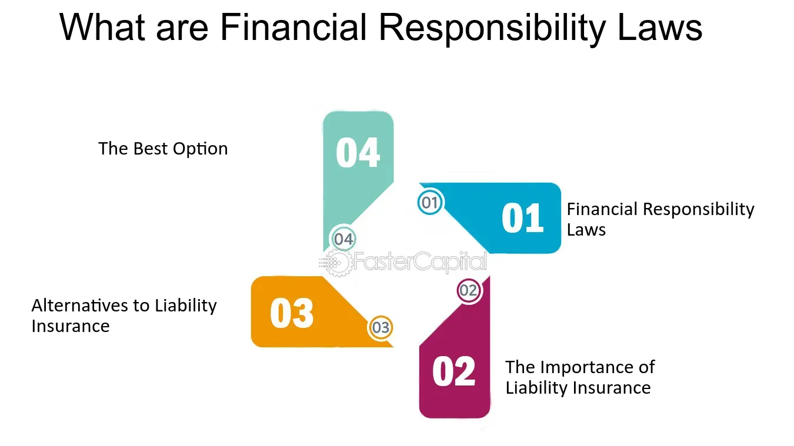

## Table of Contents

## What is the Financial Responsibility Law?

The Financial Responsibility Law is a set of rules that make sure people can pay for damages if they cause an accident. In many places, this law means that drivers must have car insurance. This insurance helps pay for repairs or medical bills if the driver causes a crash. The idea is to make sure that people who are hurt or have their property damaged can get help, even if the person who caused the accident doesn't have enough money.

These laws can be different in different places, but they usually require drivers to show proof of insurance when they register their car or if they get into an accident. If a driver doesn't have insurance, they might have to pay a fine or lose their driving license. The goal of these laws is to protect everyone on the road by making sure that there's a way to cover the costs of accidents.

## Why was the Financial Responsibility Law created?

The Financial Responsibility Law was created to make sure that people who cause accidents can pay for the damages. Before these laws, if someone got into an accident and didn't have money, the people who were hurt or had their property damaged might not get any help. This was a big problem because it left many people without the resources to fix their cars or pay for medical bills. The law was made to solve this by requiring drivers to have insurance, so there would always be money available to cover the costs of accidents.

These laws also help to encourage safer driving. Knowing that they have to pay for damages out of their own pocket if they cause an accident, drivers might be more careful on the road. This can lead to fewer accidents and safer roads for everyone. By making insurance a requirement, the Financial Responsibility Law aims to protect all road users and make sure that the financial burden of accidents is managed fairly.

## Which countries or states have a Financial Responsibility Law?

Many places in the United States have Financial Responsibility Laws. Almost all states require drivers to have car insurance. Some states let you put money in a special account instead of buying insurance. If you don't follow these laws, you might get a fine or lose your driving license. The rules can be different in each state, but the main idea is the same: make sure drivers can pay for accidents they cause.

In other countries, the rules can be different. For example, in Canada, each province has its own rules about car insurance. Some places, like Ontario, have strict rules that make sure drivers have insurance. In Europe, many countries have similar laws that require drivers to have insurance. These laws help make sure that if there's an accident, there's money to help pay for damages.

Overall, Financial Responsibility Laws are common in many parts of the world. They help protect people by making sure there's a way to cover the costs of accidents. Whether it's through insurance or other means, the goal is to make sure everyone on the road is safe and taken care of if something goes wrong.

## How does the Financial Responsibility Law affect drivers?

The Financial Responsibility Law affects drivers by making them get car insurance. This means drivers have to pay for insurance, which can cost money every month. If a driver causes an accident, their insurance will help pay for the damage. This helps protect other people on the road. If a driver doesn't have insurance, they might get a fine or lose their license. This can be a big problem because it can make it hard for them to drive legally.

These laws also make drivers think more about safety. Knowing they might have to pay a lot if they cause an accident, drivers might drive more carefully. This can help make roads safer for everyone. The laws are different in each place, but they all want to make sure drivers can pay for accidents they cause. This helps everyone feel safer on the road because they know there's a way to cover the costs if something bad happens.

## What are the penalties for not complying with the Financial Responsibility Law?

If you don't follow the Financial Responsibility Law, you can get in big trouble. In many places, if you get caught driving without insurance, you might have to pay a fine. The fine can be a lot of money, depending on where you live. Sometimes, the fine is more if you've been caught before. This can be hard because it means you have to pay money you might not have.

Not only might you have to pay a fine, but you could also lose your driving license. If you lose your license, you can't drive legally anymore. This can make it hard to get to work or take your kids to school. In some places, they might even take your car away if you keep driving without insurance. The penalties are there to make sure everyone follows the law and keeps the roads safe.

## How can one prove financial responsibility under this law?

To prove financial responsibility under the Financial Responsibility Law, you usually need to show that you have car insurance. This means you need to have an insurance policy that covers the costs if you cause an accident. When you register your car or if you get into an accident, you might need to show your insurance card or a letter from your insurance company. This card or letter proves that you have insurance and can pay for damages if something bad happens.

In some places, instead of insurance, you can put money into a special account. This account is called a self-insurance bond or a surety bond. By putting money into this account, you show that you have enough money to cover the costs of an accident. If you don't have insurance or a bond, you might need to show that you have other ways to pay for damages, like a big savings account. The main thing is to show that you can take care of the costs if you cause an accident.

## What are the minimum insurance requirements under the Financial Responsibility Law?

The minimum insurance requirements under the Financial Responsibility Law can be different in each place. In the United States, most states say you need to have at least a certain amount of liability insurance. This means your insurance has to cover a certain amount of money for injuries to other people and damage to their property if you cause an accident. For example, a common requirement might be $25,000 for injuries to one person, $50,000 for injuries to more than one person, and $10,000 for property damage. These numbers can be different in each state, but they help make sure there's enough money to help people if you cause an accident.

Some places might also say you need other types of insurance. For example, some states want you to have uninsured motorist coverage. This helps you if you get into an accident with someone who doesn't have insurance. Other places might say you need personal injury protection, which helps pay for your medical bills if you're hurt in an accident. The main idea is to make sure there's enough money to cover the costs of accidents, no matter what happens.

## How does the Financial Responsibility Law impact uninsured motorists?

The Financial Responsibility Law makes things hard for people who drive without insurance. If you get caught driving without insurance, you might have to pay a fine. The fine can be a lot of money, and it can be even more if you've been caught before. This can be tough because it means you have to come up with money you might not have. Also, if you don't have insurance and you cause an accident, you might have to pay for the damages out of your own pocket. This can be a big problem because accidents can be very expensive.

Not only might you have to pay a fine, but you could also lose your driving license if you don't have insurance. If you lose your license, you can't drive legally anymore. This can make it hard to get to work or take your kids to school. In some places, they might even take your car away if you keep driving without insurance. The penalties are there to make sure everyone follows the law and keeps the roads safe. The Financial Responsibility Law wants to make sure that if you cause an accident, there's a way to help pay for the damages, so it's important for everyone to have insurance.

## Can the Financial Responsibility Law requirements be satisfied through means other than insurance?

Yes, the Financial Responsibility Law requirements can be met in ways other than insurance. One way is by putting money into a special account called a self-insurance bond or a surety bond. This means you show that you have enough money to pay for damages if you cause an accident. This option is often used by people who have a lot of money and don't want to buy insurance.

Another way to satisfy the law is by showing that you have other ways to pay for damages, like a big savings account. Some places might let you use a bond or a deposit to prove you can cover the costs of an accident. The main thing is to show that you can take care of the costs if something bad happens, even if you don't have insurance.

## What are the differences between the Financial Responsibility Law and compulsory insurance laws?

The Financial Responsibility Law and compulsory insurance laws both want to make sure drivers can pay for accidents they cause, but they work a bit differently. The Financial Responsibility Law says that if you cause an accident, you have to show that you can pay for the damages. This can be done with insurance, but it can also be done with a bond or by showing you have enough money in a savings account. The idea is to make sure there's always a way to cover the costs of accidents, no matter how you do it.

Compulsory insurance laws, on the other hand, are more strict. These laws say that you must have car insurance to drive legally. There's no other option like a bond or savings account. If you get caught driving without insurance, you might get a fine or lose your license. The main difference is that compulsory insurance laws don't give you a choice—you have to have insurance, while the Financial Responsibility Law lets you choose how you show you can pay for damages.

## How have courts interpreted the Financial Responsibility Law in key cases?

Courts have looked at the Financial Responsibility Law in many cases to decide how it should work. In one important case, a driver didn't have insurance and caused an accident. The court said the driver had to pay for the damages because the law says you need to show you can pay if you cause an accident. The court made it clear that having insurance is one way to do this, but if you don't have insurance, you still have to find a way to pay for the damages.

In another case, a person used a bond instead of insurance to show they could pay for damages. The court said this was okay because the Financial Responsibility Law lets you use different ways to prove you can pay. The court wanted to make sure that the law's main goal was met, which is to make sure there's always a way to cover the costs of accidents. These cases show that courts want to make sure the law is followed, but they also understand that there can be different ways to meet the law's requirements.

## What are the ongoing debates and proposed reforms regarding the Financial Responsibility Law?

There are a lot of debates about the Financial Responsibility Law. Some people think it should be stricter and make everyone have insurance, no matter what. They say this would make the roads safer because everyone would be sure to have insurance. But others think the law is good the way it is because it lets people choose how they show they can pay for accidents. They say things like bonds or savings accounts should still be options for people who don't want to buy insurance. There's also talk about making the minimum insurance amounts higher so they cover more of the costs if there's an accident.

Another big debate is about what happens to people who can't afford insurance. Some people want to help them by making insurance cheaper or giving them other options. They say it's not fair to punish people who are poor with big fines or taking away their license. Others think the law should stay the same and everyone should have to follow it, no matter what. There are ideas to change the law to make it easier for everyone to follow, like having lower fines for first-time offenders or giving more time to get insurance after an accident. These debates show that people want the law to be fair and help keep the roads safe, but they have different ideas about how to do it.

## References & Further Reading

[1]: Markowitz, H. (1952). ["Portfolio Selection"](https://onlinelibrary.wiley.com/doi/abs/10.1111/j.1540-6261.1952.tb01525.x). The Journal of Finance, 7(1), 77-91. This foundational paper introduces the concept of portfolio optimization, which is crucial for risk management in trading.

[2]: Cartea, Á., Jaimungal, S., & Penalva, J. (2015). ["Algorithmic and High-Frequency Trading"](https://assets.cambridge.org/97811070/91146/frontmatter/9781107091146_frontmatter.pdf). Cambridge University Press. This book provides a comprehensive analysis of algorithmic trading and the associated risks.

[3]: Allen, F., & Carletti, E. (2006). ["Credit risk transfer and contagion"](https://www.sciencedirect.com/science/article/pii/S0304393205001492). Journal of Monetary Economics, 53(1), 89-111. This paper discusses the transfer of credit risk through various financial instruments, an important aspect of financial markets.

[4]: Hendershott, T., Jones, C. M., & Menkveld, A. J. (2011). ["Does Algorithmic Trading Improve Liquidity?"](https://onlinelibrary.wiley.com/doi/full/10.1111/j.1540-6261.2010.01624.x) The American Economic Review, 101(5), 3568–3594. This article examines the implications of algorithmic trading for market liquidity.

[5]: U.S. Commodity Futures Trading Commission. (2015). ["Regulation Automated Trading (Reg AT)"](https://www.cftc.gov/PressRoom/PressReleases/7283-15) [Press release]. This document provides details about the CFTC’s proposals related to algorithmic trading.

[6]: Securities and Exchange Commission. (2010). ["Market Access Rule (Rule 15c3-5)"](https://www.sec.gov/files/rules/final/2010/34-63241.pdf). A document detailing the SEC’s regulatory measures to manage the risk of automated trading activities.