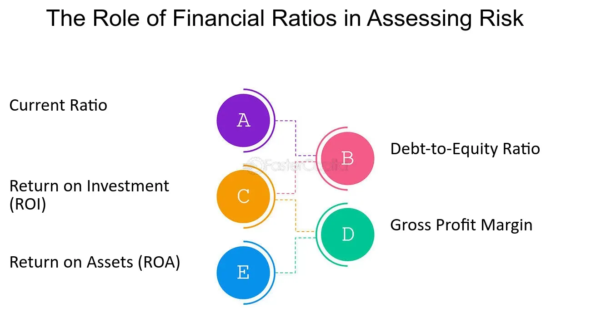

## Table of Contents

## What are financial risk ratios?

Financial risk ratios are tools that help people understand how risky a company's finances are. They look at things like how much debt a company has compared to its assets or how easily it can pay its bills. By using these ratios, investors and managers can see if a company might have trouble in the future because of its financial choices.

There are different types of financial risk ratios, but some common ones include the debt-to-equity ratio, which shows how much the company relies on borrowed money versus money from owners. Another is the interest coverage ratio, which tells you if a company makes enough profit to pay the interest on its loans. These ratios give a quick snapshot of a company's financial health and help in making smart decisions about investing or managing the business.

## Why are financial risk ratios important in risk assessment?

Financial risk ratios are important in risk assessment because they help people see how safe or risky a company's money situation is. These ratios give a clear picture of whether a company is using too much borrowed money or if it can easily pay its bills. By looking at these numbers, investors and managers can figure out if a company might run into money problems down the road. This is really helpful for deciding if it's a good idea to invest in the company or if the company needs to change how it handles its money.

Using financial risk ratios also makes it easier to compare different companies. For example, if you're trying to decide between two companies to invest in, these ratios can show which one is in a better financial position. This way, you can make smarter choices based on hard numbers instead of just guessing. Overall, financial risk ratios are a key tool for understanding and managing the risks that come with running or investing in a business.

## Can you list some common financial risk ratios?

Financial risk ratios are numbers that help us see if a company is in a good or bad money situation. One common ratio is the debt-to-equity ratio. This tells us how much money the company has borrowed compared to the money from its owners. A high debt-to-equity ratio might mean the company is risky because it relies a lot on loans. Another important ratio is the interest coverage ratio. This shows if the company makes enough money to pay the interest on its loans. If this ratio is low, it could mean the company might struggle to pay its bills.

Another ratio to know about is the current ratio. This one tells us if the company can pay its short-term bills with the money and things it has right now. A good current ratio means the company is in a safe spot to handle its debts. The quick ratio is similar but only looks at the most liquid assets, like cash and money that can be quickly turned into cash. This gives a stricter view of the company's ability to pay bills right away. Lastly, the debt ratio shows how much of the company's assets are paid for with borrowed money. A high debt ratio can be a red flag that the company might be too risky.

## How do you calculate the debt-to-equity ratio?

The debt-to-equity ratio is a way to see how much a company relies on borrowed money compared to the money from its owners. To calculate it, you take the total amount of debt the company has and divide it by the total amount of equity, which is the money from owners. The formula looks like this: Debt-to-Equity Ratio = Total Debt / Total Equity. If a company has $100,000 in debt and $50,000 in equity, the debt-to-equity ratio would be $100,000 / $50,000 = 2. This means the company has twice as much debt as equity.

This ratio is important because it tells us about the financial health of a company. A high debt-to-equity ratio might mean the company is risky because it depends a lot on loans. This could make it hard for the company to pay back what it owes if things don't go well. On the other hand, a low debt-to-equity ratio usually shows that the company is more stable because it's not borrowing too much. Investors and managers use this ratio to decide if a company is a good or bad investment, or if it needs to change how it handles its money.

## What does the interest coverage ratio tell us about a company's financial health?

The interest coverage ratio tells us if a company can easily pay the interest on its loans. It's like checking if someone can afford their monthly credit card payments. To find this ratio, you take the company's earnings before interest and taxes (EBIT) and divide it by the interest expenses. A high interest coverage ratio means the company makes enough money to cover its interest payments easily, which is a good sign. It shows the company is financially healthy and not likely to struggle with its debts.

On the other hand, a low interest coverage ratio is a warning sign. It means the company might not make enough money to pay the interest on its loans, which can be risky. If the ratio is too low, it could mean the company might have trouble paying its bills on time, which could lead to bigger financial problems. Investors and managers look at this ratio to see if a company is a safe bet or if it needs to cut back on borrowing to stay financially stable.

## How can the current ratio help assess short-term financial risk?

The current ratio helps us see if a company can pay its short-term bills with what it has right now. It's like checking if you have enough money in your pocket to pay for your monthly expenses. You find the current ratio by dividing the company's current assets by its current liabilities. Current assets are things like cash, money people owe you, and stuff you can sell quickly. Current liabilities are bills you need to pay soon, like loans or money you owe to others. A good current ratio, usually around 2 or higher, means the company has enough to cover its short-term debts and is in a safe spot.

If the current ratio is low, it's a warning sign that the company might struggle to pay its bills on time. This could mean the company is at risk of running into money problems soon. For example, if the current ratio is less than 1, it means the company doesn't have enough assets to pay what it owes right away. Investors and managers look at this ratio to decide if a company is doing well financially or if it needs to be careful with its money. It's a quick way to check the short-term financial health of a business.

## What is the significance of the quick ratio in liquidity risk assessment?

The quick ratio is a way to see if a company can pay its short-term bills without selling its inventory. It's like checking if you have enough money in your wallet to pay for something without needing to sell your stuff first. To find the quick ratio, you take the company's current assets, but you don't count inventory, and then you divide that by the current liabilities. A good quick ratio, usually around 1 or higher, means the company can easily pay its bills right away. This is important because it shows the company is in a strong position to handle its debts without relying on selling goods.

If the quick ratio is low, it's a warning that the company might have trouble paying its bills on time. This could mean the company is at risk of running into money problems soon. For example, if the quick ratio is less than 1, it means the company doesn't have enough quick assets to cover what it owes right away. Investors and managers look at this ratio to decide if a company is doing well financially or if it needs to be careful with its money. It's a quick way to check the short-term financial health of a business and see how liquid it is, meaning how easily it can turn its assets into cash.

## How does the leverage ratio impact a company's risk profile?

The leverage ratio tells us how much a company is using borrowed money to grow or run its business. It's like checking if someone is using a lot of credit cards to pay for things. A high leverage ratio means the company has a lot of debt compared to its own money. This can make the company riskier because if things don't go well, it might be hard for them to pay back what they owe. On the other hand, if a company uses debt wisely, it can help them grow faster and make more money.

A low leverage ratio means the company isn't relying too much on borrowed money. This usually makes the company safer because it's not as likely to have trouble paying its bills. Investors and managers look at the leverage ratio to see if a company is taking on too much risk or if it's being smart with its money. A good balance of debt and equity can help a company be successful without putting it in danger of financial trouble.

## What advanced financial risk ratios should be used for a more detailed risk analysis?

For a more detailed risk analysis, you can use the Altman Z-Score, which helps predict if a company might go bankrupt. It looks at five different parts of a company's financials, like how well it's doing with its money, how much debt it has, and how it's using its assets. By putting these numbers into a special formula, you get a score that tells you if the company is at risk of failing. A low score means the company is in danger, while a high score means it's probably safe. This is really helpful for investors and managers who want to understand the deeper risks a company might face.

Another advanced ratio is the cash flow to debt ratio, which tells you if a company can pay its debts with the money it's making. It's calculated by taking the company's operating cash flow and dividing it by its total debt. A high ratio means the company is generating enough cash to cover its debts easily, which is a good sign. A low ratio, on the other hand, could mean the company might struggle to pay what it owes. This ratio gives a clearer picture of a company's ability to manage its debt over time, making it a valuable tool for a more thorough risk analysis.

## How do financial risk ratios vary across different industries?

Financial risk ratios can be different for companies in different industries because each industry has its own way of working and using money. For example, industries like utilities and telecom often need a lot of money to build things like power plants or networks, so they might have higher debt-to-equity ratios. This is normal for them because they can predict their income well and use the money they make to pay back their loans. On the other hand, tech companies might have lower debt-to-equity ratios because they grow quickly and don't need as much money to start up. They might use more of their own money or money from investors instead of borrowing.

Another thing to think about is how quickly companies in different industries can turn their stuff into cash. Retail companies might have lower quick ratios because they have a lot of inventory, like clothes or electronics, that they need to sell before they can use the money. But service companies, like consulting firms, might have higher quick ratios because they don't have much inventory; they mostly have cash and money people owe them. So, when looking at financial risk ratios, it's important to compare companies within the same industry to get a fair idea of their financial health.

## What are the limitations of using financial risk ratios in risk assessment?

Financial risk ratios are helpful, but they have some problems. They only give a quick look at a company's money situation at one moment. They don't show how the company is doing over time or if things are getting better or worse. Also, these ratios can be different for companies in different industries. What's a good ratio for one type of business might not be good for another. So, you need to be careful when comparing companies from different industries using these ratios.

Another issue is that financial risk ratios don't tell the whole story. They don't consider things like how good the company's leaders are, if there are new laws that could affect the business, or what's happening in the world that could change things. Sometimes, companies can even change their numbers to make their ratios look better, which can be misleading. So, while financial risk ratios are useful, they should be used with other information to get a full picture of a company's risk.

## How can financial risk ratios be integrated into a comprehensive risk management strategy?

Financial risk ratios are important tools that can be included in a company's overall plan to manage risks. They give a quick snapshot of the company's financial health, showing things like how much debt the company has compared to its own money, if it can pay its bills easily, and how well it's doing with its cash flow. By regularly checking these ratios, a company can keep an eye on its financial stability and spot any problems early. This helps managers make better decisions about borrowing money, investing, or changing how the company handles its finances to reduce risks.

However, financial risk ratios are just one part of a complete risk management strategy. They need to be used along with other information, like looking at how the company is doing over time, understanding the industry it's in, and keeping up with what's happening in the world that could affect the business. By combining financial risk ratios with other risk assessment tools, like stress tests and scenario planning, a company can get a fuller picture of its risks. This helps them make smarter choices and be ready for whatever might happen in the future.

## What is an overview of Financial Risk Ratios?

Financial risk ratios are crucial metrics that provide insights into the financial health and risk exposure of investments or portfolios. They offer quantitative assessments that enable investors and traders to make informed decisions regarding risk management and portfolio optimization.

### Types of Financial Risk Ratios

1. **Liquidity Ratios:**
   - Liquidity ratios measure an organization's ability to meet its short-term obligations using its most liquid assets. Key ratios include:
     - **Current Ratio:** 
$$
       \text{Current Ratio} = \frac{\text{Current Assets}}{\text{Current Liabilities}}

$$
       This ratio assesses a company's ability to pay its short-term liabilities with its short-term assets. A higher ratio indicates better [liquidity](/wiki/liquidity-risk-premium).
     - **Quick Ratio:** Also known as the acid-test ratio, it excludes inventories from current assets to provide a stricter test of liquidity.
$$
       \text{Quick Ratio} = \frac{\text{Current Assets} - \text{Inventories}}{\text{Current Liabilities}}

$$

2. **Solvency Ratios:**
   - Solvency ratios evaluate an organization's long-term ability to meet its obligations and provide insight into its capital structure. Key ratios include:
     - **Debt-to-Equity Ratio:** 
$$
       \text{Debt-to-Equity Ratio} = \frac{\text{Total Liabilities}}{\text{Shareholder's Equity}}

$$
       This measures the degree of financial leverage used by a company, comparing its total liabilities to shareholders' equity. A lower ratio generally indicates lower risk.
     - **Interest Coverage Ratio:** Indicates how well a company can cover its interest obligations.
$$
       \text{Interest Coverage Ratio} = \frac{\text{EBIT}}{\text{Interest Expense}}

$$

3. **Profitability Ratios:**
   - Profitability ratios assess a company's ability to generate earnings relative to its revenue, assets, equity, and other financial metrics. Key ratios include:
     - **Return on Equity (ROE):** 
$$
       \text{ROE} = \frac{\text{Net Income}}{\text{Shareholder's Equity}}

$$
       This ratio evaluates a company’s efficiency at generating profits from shareholders’ equity. Higher ROE indicates more efficient use of equity.
     - **Net Profit Margin:** Indicates the percentage of revenue that becomes profit.
$$
       \text{Net Profit Margin} = \frac{\text{Net Income}}{\text{Revenue}}

$$

### Understanding Risk Profiles with Ratios

Financial risk ratios serve as fundamental tools for traders to assess the risk profile of different assets. By interpreting these ratios, traders can identify potential red flags or opportunities within their portfolios. For example, a high debt-to-equity ratio might suggest that a company is over-leveraged, posing higher financial risk, whereas a strong current ratio could indicate robust liquidity.

### Integration into Risk Management Strategies

Incorporating financial risk ratios into a comprehensive risk management strategy is essential. These ratios not only provide immediate insights into the financial condition of investments but also enable ongoing monitoring and adjustment of risk exposures. Effective integration involves regularly updating ratio analyses with the latest financial data, using them to inform trading decisions, and combining them with other risk assessment tools to ensure a holistic view of potential risks and returns. By doing so, traders can better align their strategies with their risk tolerance and market objectives, optimizing their approaches to managing [volatility](/wiki/volatility-trading-strategies) and safeguarding their investments.

## References & Further Reading

[1]: Bergstra, J., Bardenet, R., Bengio, Y., & Kégl, B. (2011). ["Algorithms for Hyper-Parameter Optimization."](https://papers.nips.cc/paper/4443-algorithms-for-hyper-parameter-optimization) Advances in Neural Information Processing Systems 24.

[2]: ["Advances in Financial Machine Learning"](https://www.amazon.com/Advances-Financial-Machine-Learning-Marcos/dp/1119482089) by Marcos Lopez de Prado

[3]: ["Evidence-Based Technical Analysis: Applying the Scientific Method and Statistical Inference to Trading Signals"](https://www.amazon.com/Evidence-Based-Technical-Analysis-Scientific-Statistical/dp/0470008741) by David Aronson

[4]: ["Machine Learning for Algorithmic Trading"](https://github.com/stefan-jansen/machine-learning-for-trading) by Stefan Jansen

[5]: ["Quantitative Trading: How to Build Your Own Algorithmic Trading Business"](https://www.amazon.com/Quantitative-Trading-Build-Algorithmic-Business/dp/1119800064) by Ernest P. Chan 

[6]: Damodaran, A. (2008). ["Measuring Company Exposure to Country Risk: Theory and Practice"](https://people.stern.nyu.edu/adamodar/pdfiles/papers/CountryRisk.pdf). 

[7]: Murphy, J. J. (1999). ["Technical Analysis of Financial Markets: A Comprehensive Guide to Trading Methods and Applications"](https://archive.org/details/technicalanalysi0000murp) by John J. Murphy

[8]: Fabozzi, F. J., Focardi, S. M., & Kolm, P. N. (2010). ["Quantitative Equity Investing: Techniques and Strategies"](https://www.semanticscholar.org/paper/Quantitative-Equity-Investing%3A-Techniques-and-Fabozzi-Focardi/1c49a2a53919f7e65cb96f16691b8ff726fd3cd7)