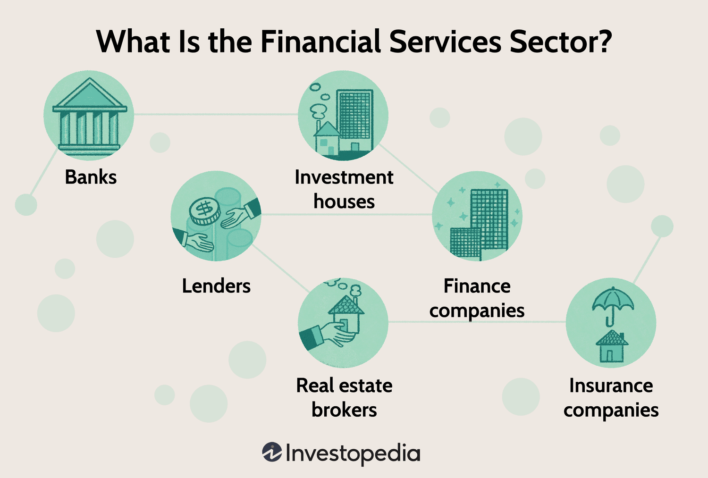

## Table of Contents

## What is the financial sector?

The financial sector is a part of the economy that includes banks, insurance companies, and other businesses that deal with money. It helps people and businesses manage their money by offering services like saving accounts, loans, and insurance. This sector is important because it makes sure money moves around the economy smoothly.

The financial sector also helps businesses grow by giving them the money they need to start or expand. For example, a company might borrow money from a bank to build a new factory. This helps create jobs and can make the economy stronger. Without the financial sector, it would be hard for businesses to get the money they need to operate and grow.

## What are the main components of the financial sector?

The financial sector has several main parts that work together to help people and businesses manage their money. One big part is banks. Banks let people save their money in accounts and also give out loans. When someone needs money to buy a house or start a business, they can borrow it from a bank. Banks are important because they keep money safe and help it move around the economy.

Another part of the financial sector is insurance companies. These companies help people protect themselves from big, unexpected costs. For example, if someone's house burns down, their insurance company might pay to fix it. This gives people peace of mind and helps them plan for the future. Insurance companies collect money from lots of people in small payments, called premiums, and use that money to help those who need it.

Investment firms are also a key part of the financial sector. These firms help people and businesses grow their money by investing it in things like stocks, bonds, and real estate. When people invest their money, they hope it will grow over time. Investment firms use their knowledge to pick good investments and manage them for their clients. This part of the financial sector is important for helping the economy grow because it encourages people to save and invest their money.

## How does the financial sector contribute to economic growth?

The financial sector helps the economy grow by making it easier for people and businesses to use their money in smart ways. When banks give loans to businesses, those businesses can start new projects or expand. This creates jobs and helps the economy get bigger. For example, a business might borrow money to build a new factory, which means more people can work and earn money. This money then gets spent in the economy, making it stronger.

Investment firms also play a big role in growing the economy. They help people save and invest their money in things like stocks and real estate. When people invest, their money can grow over time, which encourages them to save more. This extra money can then be used by businesses to grow even more. Plus, when people feel confident about their investments, they are more likely to spend money, which helps the economy keep moving.

Insurance companies contribute too, by helping people feel safe about their future. When people know they are protected against big, unexpected costs, they are more likely to spend and invest. This confidence helps keep the economy stable and growing. All these parts of the financial sector work together to make sure money is used in ways that help the whole economy.

## What is the role of banks in the financial sector?

Banks are very important in the financial sector. They help people and businesses manage their money. People can put their money in a bank to keep it safe. This is called a savings account. Banks also give out loans. When someone wants to buy a house or start a business, they can borrow money from the bank. This helps people and businesses do things they couldn't do without that money.

Banks also help the economy grow. When banks give loans to businesses, those businesses can start new projects or expand. This creates jobs and makes the economy bigger. For example, a business might borrow money to build a new factory. More people can work at the factory and earn money. This money then gets spent in the economy, helping it grow even more. Banks make sure money moves around the economy smoothly, which is good for everyone.

## How do financial markets function within the economy?

Financial markets are places where people and businesses can buy and sell things like stocks, bonds, and other investments. These markets help the economy by letting people put their money into companies and projects. When someone buys a stock, they are buying a small piece of a company. This gives the company money to grow and do new things. If the company does well, the value of the stock can go up, and the person who bought it can make money.

Financial markets also help businesses borrow money. They can do this by selling bonds. When someone buys a bond, they are lending money to the business. The business promises to pay back the money with interest over time. This helps businesses start new projects or expand without having to borrow from a bank. Financial markets make it easier for money to move around the economy, helping it grow and stay strong.

## What is the importance of financial regulation?

Financial regulation is really important because it helps keep the financial sector safe and fair for everyone. Without rules, banks and other financial businesses might take big risks that could hurt the economy. Regulators make sure banks have enough money to cover their loans and that they are not doing anything sneaky or unfair. This helps keep people's savings safe and makes sure that the financial system works well.

Regulations also help protect people from being tricked or treated unfairly. For example, they make sure that when someone buys a stock or a bond, they get all the important information they need to make a good choice. This keeps the financial markets honest and helps people trust them. When people trust the financial system, they are more likely to save and invest their money, which helps the whole economy grow.

## How does the financial sector facilitate investment and savings?

The financial sector helps people save their money by offering different types of accounts where they can keep their money safe. Banks, for example, provide savings accounts where people can put their money and earn a little interest over time. This encourages people to save because they know their money will grow slowly. Investment firms also help by offering ways for people to invest their savings in things like stocks and bonds. When people invest, they hope their money will grow more than it would in a regular savings account. This makes people more likely to save and invest, which is good for the economy.

The financial sector also makes it easier for people to invest their money in ways that can help businesses grow. Investment firms and stock markets let people buy stocks, which means they own a small part of a company. This gives companies money they can use to start new projects or expand. When businesses do well, the value of the stocks can go up, and people who invested can make money. This cycle of saving and investing helps the economy grow because it means more money is available for businesses to use.

## What are the differences between commercial and investment banking?

Commercial banking and investment banking are two different parts of the financial sector. Commercial banks are the ones most people think of when they hear "bank." They help people and businesses by offering services like savings accounts, checking accounts, and loans. If someone wants to buy a house or start a small business, they might go to a commercial bank to get a loan. These banks make money by charging interest on the loans they give out and by offering other services like credit cards.

Investment banking, on the other hand, helps businesses and governments raise money in different ways. They help companies sell stocks and bonds to investors. When a company wants to grow, it might work with an investment bank to sell stocks, which means people can buy a piece of the company. Investment banks also help with big financial deals like mergers and acquisitions, where one company buys another. They make money by charging fees for their services and by helping companies and governments with these big financial moves.

Both types of banking are important for the economy, but they do different things. Commercial banks focus on helping everyday people and small businesses manage their money, while investment banks work more with big companies and governments to help them raise money and grow.

## How do financial crises impact the economy and the financial sector?

Financial crises can hurt the economy a lot. When a crisis happens, people and businesses might lose trust in banks and other financial places. They might start taking their money out of banks because they're worried it's not safe. This can make it hard for banks to give out loans, which businesses need to grow and create jobs. Without loans, businesses might have to stop their projects or even close down. This can lead to fewer jobs and less money being spent in the economy, which makes the whole economy weaker.

The financial sector also feels the impact of a crisis. During a financial crisis, the value of stocks and other investments can drop a lot. This means people who invested their money can lose a lot, which makes them less likely to invest again. Investment banks and other financial businesses might also lose money and could even go out of business. This makes it harder for the financial sector to help the economy grow because they have less money to lend and invest. Governments and regulators often step in during a crisis to try to fix things and make the financial sector stronger, but it can take a long time for the economy to recover.

## What is the role of central banks in managing the financial sector?

Central banks are really important for managing the financial sector. They help keep the economy stable by controlling things like interest rates. When central banks change interest rates, it can make it easier or harder for people and businesses to borrow money. If they lower interest rates, borrowing becomes cheaper, and people might take out more loans. This can help the economy grow because businesses can start new projects and create jobs. But if the economy is growing too fast, central banks might raise interest rates to slow things down and keep inflation under control.

Central banks also make sure that the financial system is safe and works well. They watch over banks and other financial businesses to make sure they are not taking too many risks. If a bank is in trouble, the central bank might step in to help fix things and stop the problem from spreading to other banks. This helps keep people's money safe and makes sure the financial sector can keep helping the economy grow. By doing all these things, central banks play a big role in making sure the economy stays strong and stable.

## How does globalization affect the financial sector?

Globalization has made the financial sector bigger and more connected. Now, money can move around the world quickly and easily. This means that people and businesses can invest and borrow money from other countries. For example, a business in the United States might get a loan from a bank in Japan. This helps businesses grow because they can get money from more places. But it also means that if something bad happens in one country's economy, it can affect other countries too. This is called a "global financial crisis."

Because of globalization, financial rules have also changed. Countries work together to make sure their financial systems are safe and fair. They share information and make agreements to stop big problems from happening. This helps keep the global economy stable. But it can be hard because different countries have different rules and ways of doing things. So, they have to work together carefully to make sure everyone follows the same basic rules. This helps the financial sector work better and helps the whole world's economy grow.

## What are the future trends and challenges facing the financial sector?

The financial sector is changing a lot because of new technology. One big trend is the use of digital banking and fintech. More people are using their phones and computers to do banking, like paying bills or investing money. This makes things easier and faster. But it also means banks have to keep their technology safe from hackers. Another trend is the use of [artificial intelligence](/wiki/ai-artificial-intelligence) (AI) and big data. Banks use AI to help them make better decisions and find new ways to help their customers. But they have to be careful to use this technology in a fair way and not hurt people's privacy.

There are also big challenges for the financial sector. One challenge is keeping the economy stable. If there's a big problem, like a financial crisis, it can hurt a lot of people and businesses. Banks and governments have to work together to stop these problems from happening. Another challenge is making sure everyone can use financial services. Some people, especially in poor countries, don't have easy access to banks or other financial help. This is called financial inclusion, and it's important for making the world's economy stronger. The financial sector has to find ways to help everyone, not just rich people or big businesses.

## References & Further Reading

[1]: Bergstra, J., Bardenet, R., Bengio, Y., & Kégl, B. (2011). ["Algorithms for Hyper-Parameter Optimization."](https://papers.nips.cc/paper/4443-algorithms-for-hyper-parameter-optimization) Advances in Neural Information Processing Systems 24.

[2]: ["Advances in Financial Machine Learning"](https://www.amazon.com/Advances-Financial-Machine-Learning-Marcos/dp/1119482089) by Marcos Lopez de Prado

[3]: ["Evidence-Based Technical Analysis: Applying the Scientific Method and Statistical Inference to Trading Signals"](https://www.amazon.com/Evidence-Based-Technical-Analysis-Scientific-Statistical/dp/0470008741) by David Aronson

[4]: ["Machine Learning for Algorithmic Trading"](https://github.com/PacktPublishing/Machine-Learning-for-Algorithmic-Trading-Second-Edition) by Stefan Jansen

[5]: ["Quantitative Trading: How to Build Your Own Algorithmic Trading Business"](https://books.google.com/books/about/Quantitative_Trading.html?id=j70yEAAAQBAJ) by Ernest P. Chan