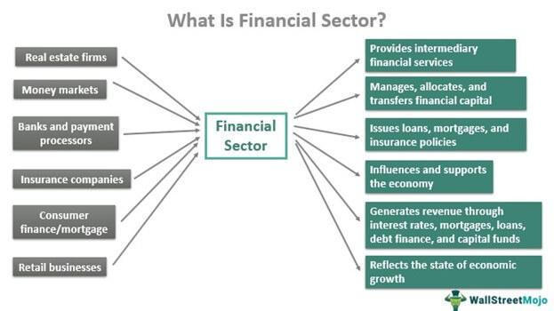

Algorithmic trading, commonly referred to as algo trading, has significantly transformed the financial sector by leveraging computer algorithms for automatically executing trades. These algorithms follow predefined strategies that allow for the execution of high-speed, high-volume trading, thereby enhancing the efficiency of trade executions. By minimizing human intervention in the trading process, algo trading reduces the emotional bias and errors that can influence traditional trading methods. This shift has not only accelerated the trading process but also improved liquidity and reduced transaction costs, which is particularly beneficial in the fast-paced modern market environments.

In examining the importance of algorithmic trading within the financial sector, it becomes clear that its influence extends across multiple dimensions. Algo trading has fostered a more competitive market landscape by enabling diverse strategies ranging from simple rule-based programs to complex models incorporating artificial intelligence and machine learning. These developments are reshaping how trades are executed and how financial data is processed, analyzed, and utilized for investment decisions. The implications of these changes resonate beyond individual traders and firms, affecting the overall dynamics of financial markets and economic systems.



Moreover, by understanding the integration of algorithmic trading into the broader financial ecosystem, stakeholders can identify potential areas for technological innovation and regulatory improvements. This comprehension also provides valuable insights into the future trajectory of financial markets, highlighting opportunities that new tools and technologies can unlock for market participants. As financial markets continue to evolve, algorithmic trading remains at the forefront of driving efficiency and fostering innovation, necessitating a comprehensive understanding of its mechanisms and effects for future growth and stability in the financial realm.

## Table of Contents

## Understanding the Financial Sector

The financial sector constitutes a vital part of any economy and includes a diverse array of industries such as banks, insurance companies, investment firms, and other financial service providers. Each of these entities plays a significant role in supplying essential services that facilitate the functioning of economies worldwide. 

A robust financial sector contributes significantly to economic stability through various channels. It facilitates transactions by providing the infrastructure and mechanisms needed for the movement of money between parties. For instance, commercial banks offer payment processing systems that enable individuals and businesses to conduct transactions efficiently and securely.

Moreover, the financial sector is instrumental in offering credit, which supports economic growth by allowing businesses to expand operations and consumers to make large purchases or invest in education. Investment firms, on the other hand, manage capital for clients, seeking returns through diverse portfolios that include assets such as stocks, bonds, and real estate.

Risk management is another critical service provided by the financial sector. Insurance companies mitigate potential losses from unforeseen events, providing a safety net for individuals and corporations. This protection encourages economic activity by reducing the perceived financial risks associated with investment and spending.

Furthermore, the sector enables savings and investment by offering various financial instruments through which individuals and institutions can deploy capital for future use or income generation. Savings accounts, pension funds, and investment vehicles like mutual funds or ETFs are examples of how the financial sector supports wealth accumulation and retirement planning.

The health of the financial sector is closely tied to the overall economic health, exerting a significant influence on the growth and stability of broader markets. Economic indicators often mirror the performance of this sector; strong financial firms can bolster investor confidence and stimulate economic expansion, whereas disruptions within financial institutions can lead to broader economic challenges. For instance, the 2008 financial crisis, initiated by shortcomings within the financial sector, had profound and far-reaching effects on global economies, underscoring the interconnectivity between financial stability and economic prosperity. 

In conclusion, the financial sector's ability to provide these essential services effectively determines its contribution to economic health and highlights the importance of maintaining a resilient and well-regulated financial environment.

## Role of Algorithmic Trading in the Financial Sector

Algorithmic trading is a foundational element of modern financial markets, driving the industry's transformation. By replacing human intervention with sophisticated computer programs, [algorithmic trading](/wiki/algorithmic-trading) allows for rapid and high-[volume](/wiki/volume-trading-strategy) transactions. This technological advancement enhances market efficiency in several critical ways.

Firstly, algorithmic trading significantly boosts market [liquidity](/wiki/liquidity-risk-premium). Liquidity refers to the ease with which assets can be bought or sold in a market without affecting the asset's price. By automating the trading process, algorithms continuously place small orders in the market, thereby tightening the bid-ask spread and increasing the overall market depth. This ensures that even large trades can be carried out with minimal price impact, stabilizing the market and reducing [volatility](/wiki/volatility-trading-strategies).

Secondly, the use of algorithms reduces transaction costs. Automated systems can process trades at much higher speeds and frequencies than human traders. This capability allows market participants to capitalize on even minute price discrepancies, leading to cost savings. Automation also reduces the need for large trading floors and extensive human resources, further cutting operational costs. Moreover, the precision of algorithmic systems minimizes slippage, or the difference between expected and actual transaction prices, improving execution quality.

Furthermore, algorithmic trading eliminates human error and emotional biases. Human traders are susceptible to fatigue, stress, and cognitive biases that can lead to suboptimal decision-making. Algorithms, on the other hand, are purely data-driven and execute trades based on predefined criteria, ensuring consistency and discipline in trading strategies. This objectivity is invaluable, especially in volatile markets where emotions can cloud judgment.

In the financial ecosystem, algorithmic trading is utilized by a diverse group of participants. Institutional investors, such as pension funds and mutual funds, employ algorithmic strategies to manage large volumes of trades efficiently. Hedge funds often leverage advanced algorithms to implement complex strategies that involve rapid execution and real-time analysis. These strategies range from simple order optimization to intricate quantitative models that predict market movements.

For example, consider the implementation of a simple moving average crossover strategy in Python:

```python
def moving_average(data, window_size):
    return data.rolling(window=window_size).mean()

def backtest_strategy(data, short_window, long_window):
    short_ma = moving_average(data['Close'], short_window)
    long_ma = moving_average(data['Close'], long_window)

    data['Signal'] = 0
    data['Signal'][short_window:] = np.where(short_ma[short_window:] > long_ma[short_window:], 1, 0)
    data['Position'] = data['Signal'].diff()

    return data

# Assuming 'data' is a DataFrame with a 'Close' column of stock prices.
result = backtest_strategy(data, short_window=40, long_window=100)
```

This example illustrates a fundamental strategy where trades are executed when a shorter-term moving average crosses a longer-term moving average, indicating a potential shift in trend. Such algorithmic strategies ensure timely and disciplined responses to market conditions, which would be challenging to achieve manually.

In summary, algorithmic trading is indispensable to the financial sector. Its capacity to enhance liquidity, reduce costs, and provide bias-free trading opportunities bolsters the efficiency and integrity of financial markets. This technological innovation continuously shapes the strategies employed by various market players, emphasizing its critical role in the ongoing evolution of global finance.

## Examples of Algorithmic Trading Strategies

Algorithmic trading strategies are essential tools for traders and investors who seek to maximize returns and manage risks effectively. Among these strategies, trend-following, [arbitrage](/wiki/arbitrage), and mean reversion are widely employed due to their distinct approaches and capabilities.

### Trend-Following Strategies

Trend-following strategies are based on the premise that securities tend to move in trends, which can be upward or downward. The core idea is to identify and capitalize on these trends once confirmed. These strategies often utilize technical indicators like moving averages. For instance, a simple moving average (SMA) is calculated by taking the average price of a security over a specific number of periods. A common technique is to use two moving averages: a short-term average and a long-term average. A buy signal might be triggered when the short-term average crosses above the long-term average, indicating an upward trend. Conversely, a sell signal might be activated when the short-term average crosses below the long-term average. The moving average crossover provides a lagged indication of trend direction, aiming to capture the middle portion of a trend.

### Arbitrage Strategies

Arbitrage strategies are designed to exploit price discrepancies of the same asset across different markets or platforms. The fundamental principle is the notion of risk-free profit, as traders buy the asset at a lower price in one market and simultaneously sell it at a higher price in another. An example is the classic "triangular arbitrage" in currency markets, where discrepancies in exchange rates among three currencies are used to generate profit with minimal risk. For implementation, these strategies require sophisticated algorithms capable of detecting small inconsistencies in prices and executing orders rapidly across different exchanges before the market corrects itself.

### Mean Reversion Strategies

Mean reversion strategies operate on the assumption that asset prices will tend to return to their historical mean or average value over time. This strategy identifies and exploits deviations from this mean, assuming that such deviations are temporary anomalies. When the current price is significantly above the average, a sell position might be initiated with the expectation that the price will decrease toward the average. Conversely, when the price is below the mean, a buy position might be initiated anticipating an increase. Statistical measures such as standard deviation or Bollinger Bands are often employed to quantify the extent of price deviation from the mean. This approach is particularly effective in range-bound markets where prices oscillate around a stable average.

In conclusion, algorithmic trading strategies like trend-following, arbitrage, and mean reversion demonstrate the diverse methodologies used to approach financial markets systematically. Each strategy requires precise implementation, supported by refined algorithms capable of navigating the complexities and rapid movements typical of modern trading environments.

## Technical Requirements and Challenges

To implement algorithmic trading strategies effectively, several technical requirements must be met. At the core, traders require a profound understanding of programming languages such as Python, C++, or Java. These languages are crucial for developing, testing, and executing complex trading algorithms. Besides programming skills, selecting a reliable trading platform is essential for seamless order execution. Such platforms should offer robust connectivity to exchanges, facilitating real-time transactions with minimal latency.

A significant aspect of algorithmic trading is access to fast, high-quality market data. These data feeds should provide comprehensive information on price, volume, and other market indicators with minimal delays. Traders often rely on APIs (Application Programming Interfaces) from data providers like Bloomberg or Reuters to ingest these data streams efficiently. The speed at which this data can be processed and acted upon can be a decisive [factor](/wiki/factor-investing) in the success of an algorithmic trading strategy.

Algo trading is fraught with various challenges that traders must navigate successfully. System failures pose a substantial risk; any downtime in trading infrastructure can result in missed opportunities or unintended market positions. Traders must implement robust failover mechanisms and system redundancies to mitigate such risks. For example, using cloud services with auto-scaling features can provide greater resilience against unexpected system loads.

Unexpected market volatility is another challenge that can significantly impact algorithmic trading. Algorithms must be tested against a range of market conditions to ensure they can handle rapid price changes without deviating from their intended strategies. One method to achieve this is through stress testing algorithms with historical data during periods of known volatility.

Regulatory compliance remains a paramount concern in algorithmic trading. Traders need to ensure that their strategies comply with the regulations set by bodies such as the Securities and Exchange Commission (SEC) or the Financial Conduct Authority (FCA). This often involves maintaining detailed logs of trading activities and implementing mechanisms for risk management and order thresholds to avoid triggering market disruptions.

An essential preparatory step in deploying algorithmic strategies is effective [backtesting](/wiki/backtesting). By simulating trades using historical market data, traders can assess the potential performance of their algorithms without financial risk. In Python, libraries such as `pandas` and `[backtrader](/wiki/backtrader)` are widely used for this purpose. For instance:

```python
import backtrader as bt

# Define a basic strategy
class TestStrategy(bt.SignalStrategy):
    def __init__(self):
        self.signal_add(bt.SIGNAL_LONG, self.data.close > self.data.close(-1))

# Create a cerebro instance
cerebro = bt.Cerebro()
cerebro.addstrategy(TestStrategy)

# Fetch historical data
data = bt.feeds.YahooFinanceData(dataname='AAPL', fromdate=datetime(2020, 1, 1), todate=datetime(2021, 1, 1))
cerebro.adddata(data)

# Run the backtest
cerebro.run()
cerebro.plot()
```

This simple example demonstrates how traders can backtest strategies with historical price data to evaluate their effectiveness. By understanding and addressing these technical requirements and challenges, traders can better position themselves to leverage the potential of algorithmic trading in modern financial markets.

## Impact on the Economy

Algorithmic trading has a profound impact on the economy, primarily by enhancing market efficiency. By enabling high-frequency trading, algo trading helps reduce bid-ask spreads, which lowers the cost of executing trades. This increased liquidity can be attributed to the ability of algorithms to process and execute large volumes of trades at speeds unattainable by human traders. As a result, the markets become more efficient, as prices more accurately reflect available information.

Additionally, algorithmic trading significantly reduces trading costs. Automation eliminates many of the manual processes and associated errors, thus decreasing operational costs. Institutional investors and hedge funds can execute complex strategies with lower transaction costs, making it more economical to participate in the market. This, in turn, provides more investment opportunities for a broad range of market participants, from small retail investors to large institutional entities.

Despite these benefits, algorithmic trading poses several risks. One of the primary concerns is increased market volatility. The sheer speed and volume of automated trades can exacerbate price fluctuations, leading to potential market instability. Events like the "flash crash" of May 6, 2010, provide historical examples where algorithmic trading contributed to extreme market volatility.

There are also systemic risks stemming from the interconnected nature of modern financial markets. A failure in an algorithm or trading system can cascade through the market, impacting other participants and potentially leading to broader systemic issues. This interconnectedness necessitates robust risk management systems to identify and mitigate these risks proactively.

Balancing regulation and innovation is crucial to mitigate these risks. While regulation ensures that trading practices are fair and transparent, fostering innovation in algorithm development and deployment can enhance the positive impacts of algo trading. Regulatory frameworks need to evolve with technological advancements to ensure that the benefits of algorithmic trading are maximized while minimizing associated risks.

In conclusion, while algorithmic trading provides significant economic benefits by improving market efficiency and reducing costs, it requires careful management of inherent risks. With appropriate regulatory oversight and technological innovation, algo trading can continue to make positive contributions to economic growth.

## Conclusion

The integration of algorithmic trading into the financial sector reflects the continuously changing dynamics of global markets and the relentless pace of technological advancement. This innovative trading mechanism offers numerous benefits, including enhanced market efficiency and reduced transaction costs. However, it also necessitates ongoing vigilance to manage its inherent risks effectively. Potential pitfalls such as increased market volatility and systemic risks due to the interconnected nature of automated systems underscore the importance of regulatory oversight and strategic risk management.

Understanding algorithmic trading's role and impact allows stakeholders to better navigate the opportunities and challenges it presents. Key to this understanding is recognizing the balance between leveraging algorithm-driven efficiencies and ensuring financial stability. As stakeholders, ranging from regulators to market participants, engage with algorithmic trading, they must prioritize robust risk mitigation strategies. By doing so, they can harness its full potential to contribute positively to economic growth, ensuring that the benefits outweigh the risks associated with this complex and evolving system.

## References & Further Reading

[1]: Bergstra, J., Bardenet, R., Bengio, Y., & Kégl, B. (2011). ["Algorithms for Hyper-Parameter Optimization."](https://papers.nips.cc/paper/4443-algorithms-for-hyper-parameter-optimization) Advances in Neural Information Processing Systems 24.

[2]: ["Advances in Financial Machine Learning"](https://www.amazon.com/Advances-Financial-Machine-Learning-Marcos/dp/1119482089) by Marcos Lopez de Prado

[3]: ["Evidence-Based Technical Analysis: Applying the Scientific Method and Statistical Inference to Trading Signals"](https://www.amazon.com/Evidence-Based-Technical-Analysis-Scientific-Statistical/dp/0470008741) by David Aronson

[4]: ["Machine Learning for Algorithmic Trading"](https://github.com/PacktPublishing/Machine-Learning-for-Algorithmic-Trading-Second-Edition) by Stefan Jansen

[5]: ["Quantitative Trading: How to Build Your Own Algorithmic Trading Business"](https://books.google.com/books/about/Quantitative_Trading.html?id=j70yEAAAQBAJ) by Ernest P. Chan