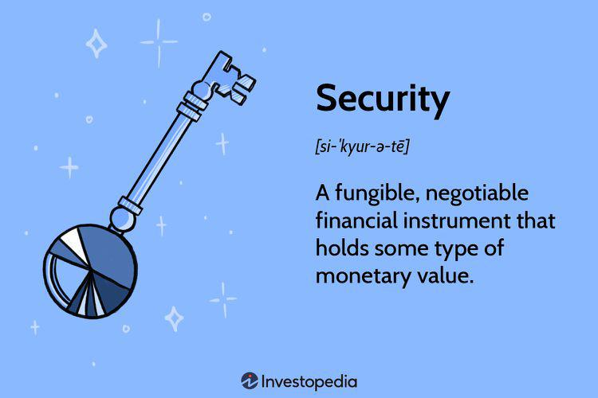

## Table of Contents

## What are financial securities?

Financial securities are like pieces of paper or digital records that show you own a part of something valuable. They can be stocks, which are shares in a company, or bonds, which are loans you give to a company or government. People buy these securities to make money, either by selling them for more than they paid or by getting regular payments from them.

These securities are traded in places called markets, like the stock market. When you buy a security, you are hoping its value will go up so you can sell it for a profit later. But, there's always a risk that the value might go down instead. That's why it's important to understand what you're buying and to be careful with your money.

## What are the most common types of financial securities?

The most common types of financial securities are stocks, bonds, and mutual funds. Stocks are pieces of ownership in a company. When you buy a stock, you're buying a little part of that company. If the company does well, the value of your stock can go up, and you might get dividends, which are like little bonuses from the company's profits. Bonds are like loans you give to a company or the government. They promise to pay you back the money you lent them, plus some extra as a thank you, called interest. 

Mutual funds are another popular type of security. They're like big baskets where lots of different stocks, bonds, or other securities are put together. When you buy into a mutual fund, you're buying a small piece of that whole basket. This can be a good way to spread out your risk because if one thing in the basket doesn't do well, the other things might still be okay. Each type of security has its own way of helping you grow your money, but they also come with different levels of risk and reward.

## Can you provide examples of equity securities?

Equity securities are like pieces of a company that you can buy. The most common type of equity security is a stock. For example, if you buy a stock in Apple, you own a tiny part of Apple. The price of the stock can go up or down depending on how well Apple is doing. If Apple does well, the stock price might go up, and you could sell it for more money than you paid. Another example is buying stock in Coca-Cola. If you own Coca-Cola stock, you're a part-owner of the company, and you might get dividends, which are like small payments from the company's profits.

Another type of equity security is a share in a mutual fund that invests in stocks. For instance, if you invest in a mutual fund that focuses on technology companies, you're buying into a basket of different tech stocks. This means you own a small piece of many tech companies, like Google, Microsoft, and others. It's a way to spread your risk because if one company doesn't do well, the others might still be okay. So, equity securities can be individual stocks or shares in funds that hold many stocks, and they give you a chance to be part of a company's success.

## What are debt securities and how do they work?

Debt securities are like IOUs. When you buy a debt security, you're lending money to a company or the government. In return, they promise to pay you back the money you lent them, plus a little extra as a thank you. This extra is called interest. The most common type of debt security is a bond. For example, if you buy a government bond, you're lending money to the government, and they'll pay you back with interest over time.

Debt securities work by having a set time when they'll be paid back, called the maturity date. Until that date, you'll get regular interest payments. If you need your money back before the bond matures, you can sell the bond to someone else. The price you get for it can go up or down depending on how much people want to buy it and how the economy is doing. Debt securities are usually seen as safer than stocks because you're more likely to get your money back, but they usually offer less chance for big profits.

## How do derivative securities function?

Derivative securities are like bets on something else. They get their value from something else, like a stock, bond, or even things like oil prices or interest rates. For example, if you buy a derivative that's based on the price of gold, you're betting on whether the price of gold will go up or down. You don't actually own the gold, but you can make or lose money based on what happens to the price of gold.

These derivatives can be used to protect against risk or to try to make money. For instance, a farmer might use a derivative to lock in the price of their crops ahead of time, so they know how much money they'll get no matter what happens to the market. On the other hand, someone might buy a derivative hoping to make a quick profit if they think they can guess the right direction of a stock's price. But derivatives can be tricky and risky because they can be very complicated, and if you guess wrong, you could lose a lot of money.

## What role do financial securities play in the economy?

Financial securities are like the building blocks of the economy. They help money move around and grow. When people buy stocks, they're giving money to companies that can use it to grow and create jobs. When people buy bonds, they're lending money to companies or governments that can use it to build things like roads or hospitals. This flow of money helps the economy keep going and getting bigger.

Financial securities also help people save and plan for the future. If you put your money into a stock or a bond, you're hoping it will grow over time. This means you might have more money when you retire or need it for something big. But, because financial securities can go up or down in value, they also help spread risk around. If everyone's money was in one place and that place failed, it would be a big problem. But with financial securities, money is spread out, so the economy can handle bumps better.

## How are financial securities regulated?

Financial securities are watched over by different groups to make sure everything is fair and safe. In the United States, the main group is called the Securities and Exchange Commission (SEC). They make rules that companies have to follow when they sell stocks or bonds. These rules help stop people from cheating or lying about how well a company is doing. Other countries have their own groups that do the same thing, like the Financial Conduct Authority (FCA) in the UK.

These groups also keep an eye on the markets where securities are bought and sold. They check to make sure that the prices are fair and that no one is trying to trick others. If someone breaks the rules, these groups can punish them. This helps keep the markets trustworthy so people feel safe putting their money into securities. By having these rules and watching over things, the groups help make sure the economy stays strong and people can save and invest with confidence.

## What are the key differences between stocks and bonds?

Stocks and bonds are both ways to invest your money, but they work differently. When you buy a stock, you're buying a little piece of a company. If the company does well, the value of your stock can go up, and you might get dividends, which are like small payments from the company's profits. Stocks can be risky because their value can go up and down a lot, but they also have the chance to make you a lot of money if the company does really well.

Bonds are like loans you give to a company or the government. When you buy a bond, they promise to pay you back the money you lent them, plus some extra as a thank you, called interest. Bonds are usually safer than stocks because you're more likely to get your money back, but they usually don't grow as much in value. They're good if you want a steady income and less risk, but you won't see the big jumps in value that you might with stocks.

In short, stocks give you a chance to own part of a company and possibly make big profits, but they're riskier. Bonds are like loans that give you steady interest payments and are safer, but they won't grow as much. Choosing between them depends on how much risk you're willing to take and what you want your money to do for you.

## What are the risks associated with investing in financial securities?

Investing in financial securities can be risky because their value can go up and down. When you buy a stock, its price can change a lot depending on how the company is doing. If the company does badly, the stock price can drop, and you might lose money. Even if the company does well, other things like the economy or world events can make the stock price go down. This is called market risk, and it's something every investor has to think about.

Bonds are usually safer than stocks, but they still have risks. One risk is that the company or government you lent money to might not be able to pay you back. This is called default risk. Another risk is that if interest rates go up, the value of your bond can go down because new bonds will offer higher interest rates. This is called [interest rate](/wiki/interest-rate-trading-strategies) risk. So, even with bonds, you need to be careful and understand what you're getting into.

Even though financial securities can help you grow your money, it's important to know the risks. You might lose money if things don't go as planned. That's why it's a good idea to spread your money around in different types of securities and to only invest money you can afford to lose. By understanding the risks, you can make smarter choices and feel more confident about your investments.

## How can one start investing in financial securities?

To start investing in financial securities, you first need to open a brokerage account. A brokerage account is like a special bank account where you can buy and sell stocks, bonds, and other securities. You can open one online with a company like Robinhood, E*TRADE, or Fidelity. They will ask you for some personal information and might need you to put some money into the account to get started. Once your account is set up, you can start looking at different securities to invest in. It's a good idea to do some research or talk to a financial advisor to understand which securities might be right for you.

After you've picked out some securities you want to buy, you can place an order through your brokerage account. You'll need to decide how much you want to invest and at what price you're willing to buy. Once you've bought your securities, it's important to keep an eye on them. Their value can go up and down, so you might want to sell them if they do well or hold onto them if you think they'll keep growing. Remember, investing can be risky, so it's wise to only invest money you can afford to lose and to spread your investments across different types of securities to reduce your risk.

## What advanced strategies can be used when trading financial securities?

When trading financial securities, one advanced strategy is called "dollar-cost averaging." This means you invest a fixed amount of money at regular times, like every month, no matter what the market is doing. By doing this, you buy more shares when prices are low and fewer when prices are high, which can help you pay less on average over time. It's a good way to reduce the risk of putting all your money in at the wrong time. Another strategy is "stop-loss orders," where you set a price at which you'll automatically sell a security if it drops to that level. This can help limit your losses if the market suddenly goes down.

Another advanced strategy is "short selling," where you borrow securities and sell them, hoping to buy them back later at a lower price to make a profit. This is riskier because if the price goes up instead of down, you could lose a lot of money. "Options trading" is another strategy where you buy the right to buy or sell a security at a certain price by a certain date. Options can be used to bet on whether a security's price will go up or down, or to protect other investments. These strategies can help experienced traders make money or protect their investments, but they need a good understanding of the market and come with higher risks.

## How do global markets and regulations impact the trading of financial securities?

Global markets and regulations play a big role in how people trade financial securities. When you trade securities, you're not just dealing with your own country's market. You're part of a big, worldwide system where what happens in one place can affect prices and opportunities everywhere. For example, if a big company in another country does well, its stock might go up, and that can make other related stocks go up too. Also, if there's a big event like a political change or a natural disaster in one part of the world, it can shake up markets everywhere. So, when you're trading, you need to keep an eye on what's happening around the world.

Regulations are the rules that different countries set up to make sure trading is fair and safe. Each country has its own rules, but they all work together to keep the global market running smoothly. For example, the U.S. has the Securities and Exchange Commission (SEC), and other countries have their own groups that do similar things. These rules help stop people from cheating or lying about investments. But sometimes, these different rules can make trading harder because you have to follow different sets of rules depending on where you're trading. So, understanding global markets and regulations is important for anyone who wants to trade financial securities successfully.

## References & Further Reading

[1]: Lo, A. W., & Hasanhodzic, J. (2010). ["The Evolution of Technical Analysis: Financial Prediction from Babylonian Tablets to Bloomberg Terminals."](https://archive.org/details/evolutionoftechn0000loan) Princeton University Press.

[2]: Shleifer, A. (2000). ["Inefficient Markets: An Introduction to Behavioral Finance."](https://academic.oup.com/book/27761) Clarendon Lectures in Economics.

[3]: Hendershott, T., Jones, C. M., & Menkveld, A. J. (2011). ["Does Algorithmic Trading Improve Liquidity?"](https://onlinelibrary.wiley.com/doi/full/10.1111/j.1540-6261.2010.01624.x) The Review of Financial Studies, 24(5).

[4]: Black, F., & Scholes, M. (1973). ["The Pricing of Options and Corporate Liabilities."](https://www.cs.princeton.edu/courses/archive/fall09/cos323/papers/black_scholes73.pdf) Journal of Political Economy, 81(3), 637-654.

[5]: Harris, L. (2003). ["Trading and Exchanges: Market Microstructure for Practitioners."](https://academic.oup.com/book/52292) Oxford University Press.