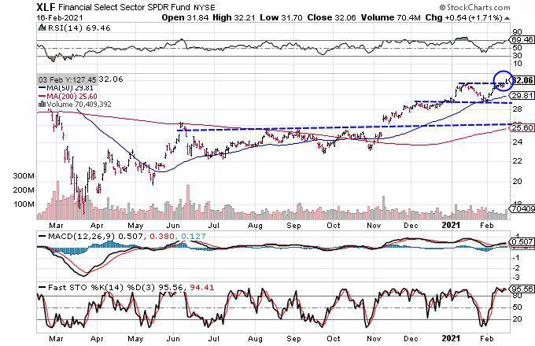

In today's fast-paced financial markets, algorithmic trading plays a pivotal role in helping investors optimize their returns. This article focuses on the XLF Financial Select Sector SPDR Fund, highlighting its importance in algorithmic trading. By applying sophisticated algorithms to this fund, traders aim to improve execution speed, efficiency, and leverage quantitative insights. We will explore the potential benefits and risks associated with these algorithmic strategies.

The XLF ETF, which stands as a benchmark for the financial sector, provides exposure to a diverse range of companies, including banks, insurance enterprises, and real estate firms. Understanding XLF's structure and performance dynamics is crucial for both retail and institutional investors who are keen on the financial sector's intricacies. Such comprehension is vital as it sets the stage for exploring how algorithmic trading can be strategically applied to this fund, aiming for enhanced decision-making and superior investment outcomes.



## Table of Contents

## Understanding XLF Financial Select Sector SPDR Fund

The XLF Financial Select Sector SPDR Fund is a prominent exchange-traded fund (ETF) managed by State Street Global Advisors. This ETF is designed to deliver investment results that correspond to the price and yield performance of the Financial Select Sector Index, which is a key benchmark index that tracks the financial sector within the S&P 500. 

The XLF [ETF](/wiki/etf-trading-strategies) encompasses a diverse range of companies within the financial services sector. These include major banks, insurance firms, real estate companies, and other financial service providers. As such, it represents a broad spectrum of the financial industry, offering investors an efficient mechanism to gain exposure to this crucial segment of the economy.

Several factors can significantly impact the performance of XLF. Interest rates are a primary driver, as they affect the profitability of banks and financial institutions, influencing their lending activities and income from interest. Regulatory changes also play a critical role, as new policies or reforms can alter operational landscapes and compliance costs for financial companies, leading to shifts in market valuations. Furthermore, economic cycles, including periods of growth or recession, affect the demand for financial services and products, impacting overall sector performance.

Investors are often drawn to XLF due to its diversified exposure to the financial sector. This diversification helps mitigate risks associated with investing in individual securities while providing opportunities for capital growth. The potential for capital appreciation, along with income generation through dividends from constituent companies, makes XLF an appealing choice for both retail and institutional investors seeking to capitalize on the financial sector's performance.

## The Rise of Algorithmic Trading

Algorithmic trading, often referred to as algo trading, involves the use of computer programs to execute trades at speeds and frequencies beyond human capability. This type of trading relies on technology-driven techniques to automate the decision-making process. The algorithms are structured around predefined criteria and quantitative models, which analyze vast amounts of market data to identify trading opportunities and make rapid trading decisions.

The rise of [algorithmic trading](/wiki/algorithmic-trading) is closely tied to technological advancements and the increasing availability of market data. As computational power has grown exponentially, so too has the ability to process and analyze data in real time. This has enabled the development of complex models capable of executing trades swiftly and efficiently. The underlying principle of many algorithms is to leverage historical and real-time market data to predict future price movements and capitalize on even the smallest inefficiencies in stock prices.

One of the significant advantages of algorithmic trading is its contribution to market efficiency and [liquidity](/wiki/liquidity-risk-premium). By engaging in high-frequency trading, algorithms can execute a large [volume](/wiki/volume-trading-strategy) of trades in milliseconds, which can improve the liquidity of financial markets. Enhanced liquidity often results in tighter bid-ask spreads, benefiting all market participants, including retail investors. Additionally, algorithms can operate across multiple markets and asset classes simultaneously, further contributing to a more interconnected and efficient market system.

Despite these benefits, algorithmic trading also introduces specific challenges. One significant concern is the potential for increased market [volatility](/wiki/volatility-trading-strategies). Automated strategies, particularly those involving high-speed trading, can exacerbate price fluctuations, leading to periods of heightened instability. This is evident in phenomena such as "flash crashes," where rapid, automated selling leads to sudden, steep market declines, followed by an equally quick recovery. These incidents highlight the need for robust safeguards and circuit breakers in trading systems to prevent undue volatility.

In conclusion, while algorithmic trading has transformed the financial trading landscape by enhancing speed and efficiency, it also presents challenges that require careful management. The complexity and power of modern trading algorithms necessitate an ongoing evaluation of their impact on markets and the implementation of measures to mitigate associated risks.

## Algo Trading Strategies for XLF

Various algorithmic trading strategies can be effectively utilized when trading the XLF Financial Select Sector SPDR Fund. These strategies leverage statistical and mathematical models to forecast market movements and optimize trade execution.

Mean reversion strategies are one of the commonly employed techniques. The fundamental premise of mean reversion is that asset prices and historical returns tend to revert to their long-term mean or average level. Traders employing this strategy monitor the deviation of prices from the mean and initiate trades with the expectation that prices will revert to their average. A simple model could use the z-score of price deviations to generate buy or sell signals. For instance, a z-score formula can be expressed as:

$$
Z = \frac{(P_t - \mu)}{\sigma}
$$

where $P_t$ is the current price, $\mu$ is the mean price over a specified period, and $\sigma$ is the standard deviation of the price over that period. When the z-score exceeds a certain threshold, it may indicate potential mean reversion.

Momentum strategies, in contrast, capitalize on trends in market prices, based on the belief that assets which exhibit a strong performance will continue to do so in the future. Traders identify and ride price trends by establishing long or short positions. Indicators such as Moving Average Convergence Divergence (MACD) or Relative Strength Index (RSI) are frequently used to detect potential entry and [exit](/wiki/exit-strategy) points.

Pair trading involves exploiting the relative price movements of two correlated securities by taking a long position in one and a short position in the other. The principle behind this is that correlated securities will move together, and any temporary divergence in their relative movements presents an opportunity. A pairs trading algorithm might involve:

```python
import numpy as np

def pairs_trading_signal(price_series_1, price_series_2):
    ratio = np.log(price_series_1) - np.log(price_series_2)
    mean_ratio = np.mean(ratio)
    std_ratio = np.std(ratio)

    z_score = (ratio[-1] - mean_ratio) / std_ratio
    return z_score
```

By utilizing historical price data and developing sophisticated algorithms, traders can refine these strategies for enhanced performance in XLF. Careful [backtesting](/wiki/backtesting) and optimization are essential to ensure robustness and effectiveness in dynamic market conditions.

## Benefits and Risks of Algo Trading XLF

Algorithmic trading, often referred to as algo trading, offers numerous benefits when applied to the XLF Financial Select Sector SPDR Fund. One of the primary advantages is the enhancement of execution speed. Algorithms can process and execute orders in milliseconds, a speed unmatched by human traders. This rapid execution allows traders to capitalize on fleeting [arbitrage](/wiki/arbitrage) opportunities and market inefficiencies, thus potentially increasing profit margins. Automation further reduces the likelihood of human errors, ensuring trades are executed as intended and according to pre-defined criteria. 

For instance, by applying mean reversion or [momentum](/wiki/momentum) strategies, traders can potentially exploit price discrepancies with high precision. Algo trading also supports cost reduction by minimizing the need for manual intervention, which in turn can lower transaction costs. Furthermore, automated systems typically provide improved accuracy and consistency in trade execution, which can lead to better overall portfolio performance.

Despite these advantages, algo trading carries inherent risks. Technical glitches, such as software bugs or system failures, can result in erroneous trades or missed opportunities, impacting profitability. Market over-reliance on algorithms can exacerbate volatility, as seen in past flash crashes where automated programs rapidly bought and sold large quantities of stocks. The failure of these systems to recognize or react appropriately to market anomalies can amplify such events.

Algorithm failures can also occur due to unforeseen changes in market conditions or the incorrect parameterization of the trading model. Therefore, robust risk management practices are essential. Traders should implement comprehensive testing and regular monitoring of algorithms to ensure they operate effectively under dynamic market conditions. Understanding and mitigating these risks is crucial to maximizing the potential of algo trading in XLF and safeguarding against adverse outcomes.

## Conclusion

The XLF Financial Select Sector SPDR Fund presents significant opportunities for implementing algorithmic trading strategies effectively. Investors leveraging these strategies can gain substantial benefits due to the efficiencies and rapid execution speeds that algorithmic systems offer. By automating trading decisions, algos can exploit market inefficiencies and react to price movements far quicker than traditional human traders. This speed not only enhances the potential for capturing favorable market conditions but also reduces the likelihood of human error, hence optimizing the execution quality.

However, as with any advanced technological application, there are associated risks that require careful management. Technical issues, such as software glitches or connectivity problems, can disrupt trading operations and cause unintended outcomes. Additionally, there's the potential for over-reliance on algorithms, which might lead to unforeseen vulnerabilities, particularly during periods of unexpected market turbulence. Ensuring robust risk management protocols and regular system audits can help mitigate these risks and enhance the reliability of trading algorithms.

The financial landscape is continuously evolving, making it imperative for investors to stay educated on emerging technologies and strategies. Algorithmic trading's increasing prevalence indicates its integral role in shaping future trading practices, especially within financial ETFs like the XLF. As the sector continues to grow, the ability to adapt and integrate such innovations effectively will be crucial for maintaining a competitive edge.

While the rewards of incorporating algorithmic trading into investment strategies can be substantial, investors must remain vigilant about the potential pitfalls. A balanced approach that includes the benefits of high-speed execution and systematic risk management will be vital for maximizing the potential returns offered by funds like the XLF Financial Select Sector SPDR Fund.

## References & Further Reading

[1]: Bergstra, J., Bardenet, R., Bengio, Y., & Kégl, B. (2011). ["Algorithms for Hyper-Parameter Optimization."](https://papers.nips.cc/paper/4443-algorithms-for-hyper-parameter-optimization) Advances in Neural Information Processing Systems 24.

[2]: ["Advances in Financial Machine Learning"](https://www.amazon.com/Advances-Financial-Machine-Learning-Marcos/dp/1119482089) by Marcos Lopez de Prado

[3]: ["Evidence-Based Technical Analysis: Applying the Scientific Method and Statistical Inference to Trading Signals"](https://www.amazon.com/Evidence-Based-Technical-Analysis-Scientific-Statistical/dp/0470008741) by David Aronson

[4]: ["Machine Learning for Algorithmic Trading"](https://github.com/stefan-jansen/machine-learning-for-trading) by Stefan Jansen

[5]: ["Quantitative Trading: How to Build Your Own Algorithmic Trading Business"](https://www.amazon.com/Quantitative-Trading-Build-Algorithmic-Business/dp/1119800064) by Ernest P. Chan