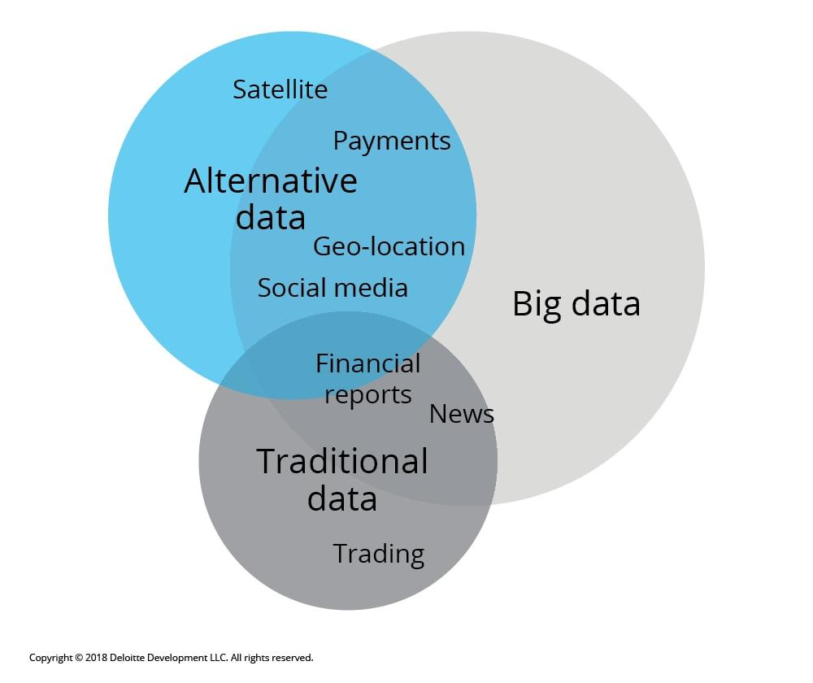

## Table of Contents

## What is alternative data in the context of financial services?

Alternative data refers to information used in financial services that comes from non-traditional sources, outside of common data like stock prices or financial statements. This can include data from social media, satellite images, or even credit card transactions. Financial analysts and investors use this data to get a better understanding of a company's performance or to predict market trends that might not be visible through traditional data sources.

For example, by analyzing satellite images of parking lots at retail stores, investors can estimate how busy a store is and predict its sales. Similarly, tracking social media sentiment can give insights into public opinion about a brand or product, which can influence stock prices. Alternative data helps investors make more informed decisions by providing a more complete picture of the market and economy.

## How does alternative data differ from traditional financial data?

Alternative data and traditional financial data are different in where they come from and what they tell us. Traditional financial data is the usual stuff that investors look at, like a company's earnings reports, stock prices, and economic statistics. This data comes from official sources like government reports or a company's own financial statements. It helps investors understand how a company is doing based on numbers that everyone can see.

On the other hand, [alternative data](/wiki/best-alternative-data) comes from places you might not think of right away. It can be things like how many people are talking about a product on social media, how full a store's parking lot looks from a satellite picture, or even how much people are spending on their credit cards. This kind of data can give investors a sneak peek into what's happening before it shows up in traditional reports. It's like getting a behind-the-scenes look at what might happen next in the market.

Using alternative data can be tricky because it's not always easy to understand or use correctly. But when done right, it can give investors an edge by showing them things that traditional data might miss. For example, if a lot of people suddenly start tweeting about a new product, it might mean the product will do well, even if the company's last earnings report didn't show that yet.

## What are some common sources of alternative data used in financial services?

Alternative data in financial services comes from many different places. Some common sources are social media platforms like Twitter and Instagram. By looking at what people are saying and sharing online, investors can get a sense of how people feel about a company or its products. Another source is satellite imagery, which can show how busy a store or factory is by counting cars in parking lots or tracking changes in a company's operations. Credit card transaction data is also used a lot. This data can show how much people are spending and where, which can help predict how well a company might do in the future.

Other sources of alternative data include web traffic data, which shows how many people are visiting a company's website, and mobile app usage data, which can tell investors how often people are using a company's app. Even data from sensors and the Internet of Things (IoT) can be useful. For example, sensors in stores can track how many people walk through the doors, and IoT devices can give information about how much energy a factory is using. All these different kinds of data help investors see things that traditional financial reports might not show.

## How can financial institutions benefit from using alternative data?

Financial institutions can benefit a lot from using alternative data. It helps them see things that they might miss with just traditional data. For example, by looking at social media, they can see what people think about a company or its products before it shows up in financial reports. This can help them make better guesses about how a company will do in the future. Also, satellite images can show how busy a store is, which can help predict sales before the company shares its numbers.

Using alternative data can also give financial institutions an edge over others. If they can spot trends or changes before everyone else, they can make smarter investment choices. For instance, if credit card data shows people are spending more on a certain type of product, a bank might decide to invest in companies that make those products. This can lead to better returns for their clients and help the institution stand out in a crowded market.

## What are the challenges associated with collecting and analyzing alternative data?

Collecting and analyzing alternative data can be tricky. One big challenge is figuring out if the data is good and useful. Not all data is the same, and some might be messy or not tell you much. It can take a lot of work to clean up the data and make sure it's right before you can use it. Also, getting the data can be hard. Sometimes you need special permission or it can be expensive to buy the data from companies that collect it.

Another challenge is understanding what the data means. Alternative data can be complicated and it's not always clear how it connects to what's happening in the market. You need smart people who know how to look at the data and figure out what it's saying. Plus, there are rules about what data you can use and how you can use it. Financial institutions have to be careful to follow these rules so they don't get in trouble.

Overall, while alternative data can give you a lot of useful information, it's not easy to work with. It takes time, money, and know-how to collect it, clean it up, and make sense of it. But if you can do it right, it can help you make better decisions and stay ahead of the game.

## Can you explain how alternative data is used in investment strategies?

Alternative data is used in investment strategies to help investors make smarter choices by looking at information that traditional data might miss. For example, if an investor wants to know how well a new product is doing, they might look at social media to see what people are saying about it. If a lot of people are talking about the product and seem to like it, the investor might think the company will do well and decide to buy its stock. This can help the investor get ahead of the market by acting on information before it shows up in official reports.

Another way alternative data is used is by looking at things like satellite images or credit card data. Satellite images can show how busy a store's parking lot is, which can give clues about how much the store is selling. If the parking lot is always full, it might mean the store is doing well, and the investor might decide to invest in the company that owns the store. Credit card data can show where people are spending their money, which can help predict which types of businesses might grow. By using this kind of data, investors can find opportunities that others might not see and make better investment decisions.

## What ethical considerations should be taken into account when using alternative data?

When using alternative data, it's important to think about privacy. A lot of this data comes from people's everyday lives, like what they buy or what they post online. It's not right to use this information without making sure it's okay with the people it's about. Financial institutions need to follow rules about data privacy and make sure they're not spying on people or using their information in ways that could hurt them.

Another thing to consider is fairness. Alternative data can be expensive to get and hard to understand. This means that only big companies with a lot of money might be able to use it. That's not fair to smaller investors who can't afford it. Also, if the data is used to make decisions about loans or investments, it's important to make sure it's not being used in a way that treats some people unfairly, like because of their race or where they live. Using alternative data in a way that's fair and respects everyone's rights is something financial institutions need to think about carefully.

## How does alternative data impact risk management in financial services?

Alternative data can help financial services manage risk better by giving them more information to work with. For example, if a bank wants to know if a company might have trouble paying back a loan, they can look at things like how busy the company's stores are using satellite images. If the parking lots are empty, it might mean the company is not doing well, and the bank can be more careful about lending money to them. By using this kind of data, banks and other financial institutions can see risks that they might miss with just traditional data, and make better decisions about who to lend money to or invest in.

However, using alternative data for risk management also comes with challenges. One big challenge is making sure the data is good and reliable. If the data is wrong or hard to understand, it can lead to bad decisions. Also, there are rules about how data can be used, and financial institutions need to be careful not to break these rules. If they use data in a way that's not fair or that hurts people's privacy, they could get in trouble. So, while alternative data can help manage risk, it's important to use it carefully and responsibly.

## What technologies are essential for processing and analyzing large volumes of alternative data?

To handle and make sense of a lot of alternative data, you need strong technology. Big data platforms like Hadoop and Apache Spark are really important. They can store and process huge amounts of data quickly. Also, [machine learning](/wiki/machine-learning) and [artificial intelligence](/wiki/ai-artificial-intelligence) (AI) are key. These technologies can find patterns in the data that people might miss. They help turn raw data into useful information that investors can use to make decisions.

Another important technology is data visualization tools. These tools, like Tableau or Power BI, help turn complex data into easy-to-understand pictures and charts. This makes it simpler for people to see what the data is saying. Cloud computing is also essential because it lets you store and process data without needing a lot of expensive equipment. It's flexible and can grow as you need more space or power to handle more data.

## How is regulatory compliance managed when using alternative data in financial services?

When financial services use alternative data, they have to make sure they follow the rules. There are laws about privacy and how data can be used. For example, they need to be careful not to use people's personal information in a way that breaks privacy laws. They also need to make sure they're not treating anyone unfairly when they use the data to make decisions about loans or investments. To do this, they often have special teams or departments that check all the data they use and how they use it to make sure it's okay.

Keeping up with these rules can be hard because they can change and be different in different places. Financial institutions use special software and tools to help them stay compliant. These tools can keep track of where the data comes from, how it's used, and who has access to it. They also train their staff to understand the rules and make sure everyone knows how to use data the right way. By doing all this, they can use alternative data to help them make better decisions while still following the law.

## What are some case studies where alternative data significantly influenced financial decision-making?

One famous case where alternative data made a big difference was when investors used satellite images to look at parking lots of car dealerships. By counting the number of cars in the lots, they could guess how many cars were being sold. This helped them see that car sales were going up before the companies reported their numbers. Investors who used this information made money by buying stocks in car companies before everyone else knew about the good sales.

Another example is how hedge funds used social media data to understand what people thought about different products. They looked at what people were saying about new movies on Twitter and Instagram. If a lot of people were excited about a movie, the hedge funds guessed it would do well at the box office. This helped them decide to invest in movie companies or buy stocks in companies that made products people were talking about a lot. By using social media data, they could make smart choices before the official numbers came out.

## What future trends are expected in the use of alternative data within financial services?

In the future, more and more financial services will use alternative data to make decisions. As technology gets better, it will be easier to collect and understand all kinds of new data, like from smart devices or social media. This will help investors see what's happening in the market faster and make better guesses about what will happen next. Also, as more people use the internet and share information online, there will be even more data to look at. This means financial services will need to keep up with new ways to use this data to stay ahead.

Another trend is that rules about using data will probably get stricter. As people become more worried about privacy, governments will make new laws to protect it. Financial services will have to find ways to use alternative data while still following these rules. They might use special tools and train their staff to make sure they're doing things the right way. Even with these challenges, the use of alternative data will keep growing because it can give such a big advantage in understanding the market.

## References & Further Reading

[1]: Bergstra, J., Bardenet, R., Bengio, Y., & Kégl, B. (2011). ["Algorithms for Hyper-Parameter Optimization."](https://papers.nips.cc/paper/4443-algorithms-for-hyper-parameter-optimization) Advances in Neural Information Processing Systems 24.

[2]: ["Advances in Financial Machine Learning"](https://www.amazon.com/Advances-Financial-Machine-Learning-Marcos/dp/1119482089) by Marcos Lopez de Prado

[3]: ["Evidence-Based Technical Analysis: Applying the Scientific Method and Statistical Inference to Trading Signals"](https://www.amazon.com/Evidence-Based-Technical-Analysis-Scientific-Statistical/dp/0470008741) by David Aronson

[4]: ["Machine Learning for Algorithmic Trading"](https://github.com/stefan-jansen/machine-learning-for-trading) by Stefan Jansen

[5]: ["Quantitative Trading: How to Build Your Own Algorithmic Trading Business"](https://books.google.com/books/about/Quantitative_Trading.html?id=j70yEAAAQBAJ) by Ernest P. Chan

[6]: Alexander, C. (2005). ["The Handbook of Financial Risk Management: Simulations and Case Studies"](https://onlinelibrary.wiley.com/doi/book/10.1002/9781118573570). Wiley.

[7]: Hirshleifer, D., & Teoh, S. H. (2013). ["Social Media and Capital Markets."](https://www.semanticscholar.org/paper/Herd-Behaviour-and-Cascading-in-Capital-Markets%3A-A-Hirshleifer-Teoh/5dd7f8a4b517a91a5c6d4986ac73d34efefa5d98) Annual Review of Financial Economics, 5, 133-151.