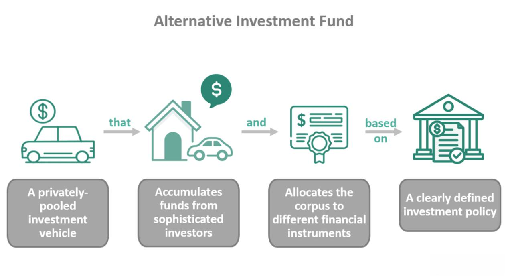

In the fast-paced world of financial markets, gaining a competitive advantage is key to successful trading. As traders strive to outperform their peers, traditional financial metrics such as earnings reports, balance sheets, and market news have long been the cornerstone of investment strategies. However, these conventional data sources have become increasingly ubiquitous, often offering limited scope for differentiation among market participants. Consequently, savvy traders are seeking novel ways to gain unique insights that can enable them to make more informed decisions.

In recent years, the integration of alternative data into algorithmic trading has emerged as a potential game-changer. Alternative data encompasses a diverse array of non-traditional data sources, ranging from social media sentiment to satellite imagery, offering a fresh perspective on market dynamics. This innovative approach allows traders to capture previously inaccessible information, providing real-time insights that extend beyond standard financial analysis.

Algorithmic trading, which relies on automated systems to execute trades based on predefined criteria, stands to benefit significantly from alternative data. By incorporating these unconventional datasets into their algorithms, traders can enhance their models with additional layers of information, potentially unlocking new patterns and trends that are not readily apparent through traditional analysis.

This article explores the role of alternative data in algorithmic trading and evaluates its impact on financial strategies. By examining the different sources of alternative data and their applications, we aim to provide a comprehensive understanding of how this evolving field is reshaping the landscape of trading. The integration of alternative data presents both opportunities and challenges, and its proper application can offer traders a distinct edge in an increasingly competitive market.

## Table of Contents

## What is Alternative Data?

Alternative data refers to information derived from sources that are unconventional when compared to traditional financial data. These sources extend beyond the typical financial statements and market data, offering novel insights that can influence trading and investment decisions. Alternative data encompasses a wide array of sources, including but not limited to social media activity, credit card transaction records, satellite images, web traffic, and sensor data. 

Social media platforms, such as Twitter, provide a wealth of information through sentiment analysis. By analyzing public opinions and discussions, traders can gauge market sentiment regarding particular stocks or economic events, potentially revealing trends before they are reflected in the market. This sentiment can be quantified and analyzed using various natural language processing (NLP) techniques to predict market movements.

Credit card transaction data presents another valuable source of alternative information. It offers a real-time glimpse into consumer behavior and spending patterns, which can be aggregated to predict the performance of specific sectors or companies. For example, a surge in credit card spending at a retail chain can indicate higher sales, thereby influencing stock price projections.

Satellite imagery provides insights into industrial activity, such as the operational status of factories, transportation logistics, and agricultural productivity. By analyzing satellite images, traders can monitor global supply chain movements and detect economic trends across different regions, thus providing critical information on a macroeconomic level. For instance, counting the number of cars in retail parking lots or observing cargo ship movements can offer clues about economic activity.

Unlike traditional data, [alternative data](/wiki/best-alternative-data) often offers real-time insights that enable traders to respond quickly to emerging trends. The integration of such data into financial models allows for a broader view, encompassing variables that may not be evident through standard financial reports. As a result, alternative data can enhance the decision-making process by providing a more comprehensive understanding of the factors driving market changes.

## The Role of Alternative Data in Algo Trading

Algorithmic trading relies extensively on both the precision and timeliness of data to make informed decisions. This approach utilizes computer algorithms to execute trades at speeds and frequencies that are impossible for human traders to match. Conventionally, these algorithms have depended on traditional financial metrics, such as stock prices, trading volumes, and economic indicators. However, traditional financial data often lacks the real-time insights necessary for predicting sudden market movements or capturing short-lived trading opportunities.

In recent times, the inclusion of alternative data has begun to transform [algorithmic trading](/wiki/algorithmic-trading) strategies. Alternative data encompasses a variety of non-traditional data sources, such as social media posts, credit card transactions, geolocation information, and satellite imagery. These datasets provide additional layers of information, offering insights that conventional datasets might miss. For example, analyzing social media sentiment can reveal shifts in public perception towards a company much faster than quarterly earnings reports. Similarly, examining geolocation data from smartphones can indicate an increase or decrease in foot traffic to retail outlets, offering early signals about a company's sales performance.

By incorporating alternative data, traders can gain a more comprehensive view of market activities. This enriched data landscape allows for the identification of patterns and trends that might otherwise go unnoticed. For instance, recognizing a correlation between rising social media mentions of a product and an increase in its company's stock price could present a lucrative trading opportunity. Additionally, satellite imagery, capable of monitoring industrial activity in real-time, can offer clues about economic changes, enabling proactive trading decisions.

The potential of alternative data lies in its ability to provide unique insights that complement traditional data sources. When effectively integrated into algorithmic models, these insights can lead to the development of more robust trading strategies, potentially resulting in more profitable trades. As these datasets become increasingly sophisticated, their role in shaping the future of algorithmic trading is set to expand, offering traders the opportunity to achieve a competitive advantage in an ever-evolving financial landscape.

## Examples of Alternative Data in Action

Geo-location data is a prominent example of alternative data utilized in algorithmic trading. By analyzing geo-location information, traders can estimate the foot traffic near retail stores, which is a potential indicator of sales performance. For instance, increased foot traffic may correlate with higher sales figures, thus allowing traders to make predictions about a retailer’s earnings before traditional financial data is available. Companies specializing in geo-location data provide processed and anonymized datasets that allow traders to integrate these insights into their models, potentially leading to early investment opportunities.

Social sentiment analysis is another application of alternative data, where information from social media platforms, such as Twitter, is used to gauge public opinion about specific stocks or market trends. Sentiment analysis involves processing textual data to determine the overall sentiment expressed by users, often classified as positive, negative, or neutral. Advanced natural language processing (NLP) techniques are employed to analyze large volumes of text data in real-time, thereby offering traders an immediate view of market sentiment. This can be instrumental in predicting stock price movements based on the public’s collective mood or reaction to news and events.

Satellite imagery provides a unique perspective by allowing traders to observe and analyze physical activities on the earth’s surface. For example, the tracking of shipping routes and the monitoring of manufacturing plant activity through satellite images can offer early indications of changes in economic patterns. Satellite data companies use [machine learning](/wiki/machine-learning) algorithms to process images, identifying significant activities such as the number of containers at a shipping port or the intensity of factory operations. These insights help traders anticipate supply chain disruptions or industrial production changes, thus enabling more informed trading decisions.

These examples illustrate how alternative data sources empower traders to uncover insights beyond traditional datasets, offering timely and potentially profitable trading opportunities.

## Evaluating the Effectiveness of Alternative Data

Evaluating the effectiveness of alternative data in algorithmic trading is a pivotal step in determining its value within trading strategies. Not all datasets possess equal significance; therefore, a rigorous assessment based on specific criteria is essential to maximize their potential. 

One of the primary factors in evaluating alternative data is its uniqueness. This characteristic determines whether the data provides insights that are not readily available through traditional financial data sources. Unique datasets have the potential to uncover hidden patterns and trends, which can lead to a competitive advantage. Additionally, the uniqueness of data often correlates with its scarcity, potentially increasing its value if it is exclusive or less accessible to the broader market. 

Accuracy plays an equally crucial role. Data that is not reliable or precise may lead to erroneous conclusions, compromising trading strategies. Accuracy involves the correctness of the data but also encompasses the timeliness, completeness, and minimal presence of errors. Data validation processes become vital in ensuring that the information feeding into the algorithms is trustworthy.

Moreover, the potential of alternative data to provide an edge in the market is a critical determinant of its effectiveness. This potential is often measured by the ability of the data to improve the decision-making process and generate alpha, which is the excess return on investment relative to a benchmark index. Quantitative [backtesting](/wiki/backtesting) and simulation play a crucial role in assessing this potential. Algorithmic models can be tested on historical alternative data to check if they consistently produce better trading outcomes.

Sometimes, the incorporation of alternative data necessitates considerable investments in both technology and human resources. Advanced data processing tools and infrastructure are required to manage and analyze large datasets effectively. Consequently, integrating such data often involves high-performance computing resources and sophisticated software solutions. In tandem, skilled personnel with expertise in data science, machine learning, and financial markets are essential to interpret the data accurately and leverage it within trading algorithms.

In conclusion, while alternative data holds promise, its evaluation must be stringent and systematic to ascertain its true value. By focusing on uniqueness, accuracy, and market advantage, traders can harness its full potential, but only if supported by the appropriate technological and human capital investments.

## Challenges and Opportunities

Alternative data offers a wealth of opportunities for enhancing algorithmic trading strategies, but it also presents several challenges that must be carefully managed. A primary concern when incorporating alternative data into trading models is data privacy. As traders and firms increasingly turn to sources like social media or geo-location data, issues related to the collection, storage, and usage of personal information must be addressed to comply with regulatory standards, such as the General Data Protection Regulation (GDPR) in the European Union.

In addition to privacy concerns, the integration of alternative data requires a robust data architecture. This involves implementing sophisticated systems capable of handling large volumes of diverse data types, ensuring data quality, and maintaining the speed necessary for real-time trading decisions. The technical infrastructure must be scalable to adapt to the continuously growing datasets while maintaining data integrity and low latency for competitive trading performance.

Another challenge lies in the potential risks associated with the over-reliance on unconventional data sources. While alternative data can provide unique insights, its reliability may vary, and over-dependence could lead to erroneous trading decisions. Traders must strike a balance by integrating alternative data with traditional financial metrics to create a holistic view of market conditions. This balanced approach reduces the risks associated with sudden changes in data flow or unforeseen inaccuracies.

Despite these challenges, the demand for alternative data is anticipated to expand, driven by a competitive trading environment and the persistent quest for informational advantages. This growing demand will likely stimulate innovations in data collection and analysis techniques. For instance, advancements in machine learning and [artificial intelligence](/wiki/ai-artificial-intelligence) can enhance the processing and interpretation of vast datasets, uncovering insights that were previously inaccessible.

Algorithmic traders are expected to invest in cutting-edge technologies and skilled personnel to maximize the potential of alternative data. As technology evolves, novel methodologies in data mining, natural language processing, and pattern recognition will play pivotal roles in transforming raw alternative data into actionable trading strategies. The continual evolution of these technologies holds promise for incorporating even more sophisticated forms of alternative data in the future, enhancing the landscape of algorithmic trading. 

Therefore, while challenges exist, they are accompanied by a spectrum of opportunities that could redefine trading paradigms. The successful navigation of these challenges could yield a substantial competitive edge, underscoring the importance of strategic investments in data infrastructure and analytical capabilities.

## Conclusion

Alternative data is reshaping the domain of algorithmic trading by providing novel channels for extracting market insights. Conventional data sources often present limitations in capturing the real-time pulse of markets. In contrast, alternative data sources like social media sentiment, satellite imagery, and transactional data enable traders to uncover nuanced patterns and trends. These insights have the potential to refine trading algorithms, leading to more informed decision-making.

Although alternative data is not a guaranteed solution for success, its judicious application can offer traders a measurable advantage. Integrating alternative data requires careful consideration of its accuracy and relevance. Successful deployment can offer incremental benefits over competitors by supplementing traditional analysis with fresh perspectives. This incremental edge is particularly critical in high-frequency trading scenarios, where milliseconds make the difference.

As technological advancements continue, we anticipate even more profound integrations of alternative data in trading. Innovations in data processing, such as machine learning algorithms and enhanced computing power, will likely enhance the capability to parse and interpret complex datasets. The ongoing evolution of data collection methodologies promises further refinement of alternative data's role in trading strategies. Future developments could lead to real-time adaptive models that dynamically adjust to new information, providing an even greater strategic edge.

## References & Further Reading

[1]: Bergstra, J., Bardenet, R., Bengio, Y., & Kégl, B. (2011). ["Algorithms for Hyper-Parameter Optimization."](https://papers.nips.cc/paper/4443-algorithms-for-hyper-parameter-optimization) Advances in Neural Information Processing Systems 24.

[2]: ["Advances in Financial Machine Learning"](https://www.amazon.com/Advances-Financial-Machine-Learning-Marcos/dp/1119482089) by Marcos Lopez de Prado

[3]: ["Evidence-Based Technical Analysis: Applying the Scientific Method and Statistical Inference to Trading Signals"](https://www.amazon.com/Evidence-Based-Technical-Analysis-Scientific-Statistical/dp/0470008741) by David Aronson

[4]: ["Machine Learning for Algorithmic Trading"](https://github.com/stefan-jansen/machine-learning-for-trading) by Stefan Jansen

[5]: ["Quantitative Trading: How to Build Your Own Algorithmic Trading Business"](https://books.google.com/books/about/Quantitative_Trading.html?id=j70yEAAAQBAJ) by Ernest P. Chan

[6]: Alexander, C. (2005). ["The Handbook of Financial Risk Management: Simulations and Case Studies"](https://onlinelibrary.wiley.com/doi/book/10.1002/9781118573570). Wiley.

[7]: Hirshleifer, D., & Teoh, S. H. (2013). ["Social Media and Capital Markets."](https://www.semanticscholar.org/paper/Herd-Behaviour-and-Cascading-in-Capital-Markets%3A-A-Hirshleifer-Teoh/5dd7f8a4b517a91a5c6d4986ac73d34efefa5d98) Annual Review of Financial Economics, 5, 133-151.