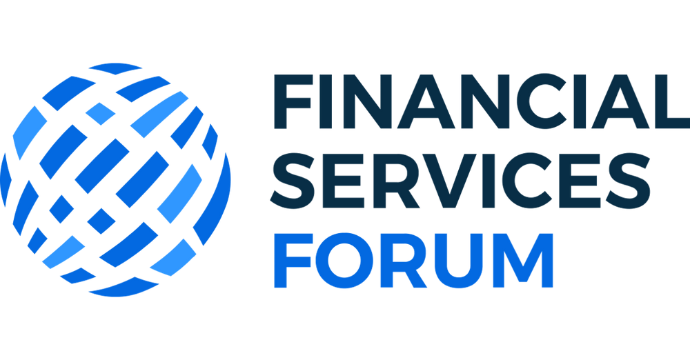

## Table of Contents

## What is the Financial Services Forum?

The Financial Services Forum is a group made up of the CEOs of the biggest financial companies in the United States. These companies include banks, insurance companies, and investment firms. The Forum was created to help these leaders work together and talk about important issues in the financial world. They meet regularly to discuss things like new laws, how to make the financial system safer, and how to help the economy grow.

The Forum also works to share ideas with government leaders and the public. They want to help make good rules and policies that keep the financial system strong and fair. By working together, the CEOs can give advice and share their knowledge to help solve big problems. This helps everyone, from the companies they run to the people who use their services.

## What is the mission of the Financial Services Forum?

The mission of the Financial Services Forum is to help make the financial world better. The group wants to make sure that the big financial companies work together to solve problems and make good rules. They talk about important things like new laws and how to keep the financial system safe. By working together, the CEOs can share their ideas and help make the economy stronger.

The Forum also wants to help the government and the public. They share their knowledge to help make rules that are fair and good for everyone. The CEOs meet regularly to discuss these issues and give advice. This helps the companies they run, the people who use their services, and the whole economy.

## Who are the members of the Financial Services Forum?

The Financial Services Forum is made up of the CEOs of the biggest financial companies in the United States. These companies include big banks, insurance companies, and investment firms. Some of the members are from companies like JPMorgan Chase, Bank of America, and Goldman Sachs. Other members come from companies like Citigroup, Wells Fargo, and Morgan Stanley.

There are also CEOs from companies like State Street, BNY Mellon, and Northern Trust. Insurance companies like MetLife and Prudential are part of the group too. All these CEOs work together to talk about important issues in the financial world. They meet regularly to share ideas and help make the financial system better for everyone.

## How does the Financial Services Forum influence financial policy?

The Financial Services Forum influences financial policy by bringing together the CEOs of the biggest financial companies in the United States. These leaders meet regularly to discuss important issues like new laws and how to make the financial system safer. By working together, they can share their ideas and give advice to government leaders. This helps the government make rules that are good for the economy and the people who use financial services.

When the Forum talks to the government, they can suggest policies that will help their companies and the whole financial system. They can explain how new rules might affect the economy and suggest ways to make the rules better. By sharing their knowledge and experience, the Forum helps make sure that financial policies are fair and help the economy grow. This way, everyone from the companies to the people who use their services can benefit.

## What are some key achievements of the Financial Services Forum?

The Financial Services Forum has helped make big changes in the financial world. They have worked with the government to make new rules that keep the financial system safe. By talking to lawmakers, the Forum has helped make laws that are good for everyone. They have also shared ideas about how to stop problems before they happen. This helps keep the economy strong and protects people who use financial services.

Another important thing the Forum has done is to help during tough times. When there are big problems in the economy, the CEOs come together to find solutions. They give advice on how to fix things and make the economy better. This has been really helpful during times like the financial crisis. By working together, the Forum makes sure that the financial system can handle hard times and keep going strong.

## How does the Financial Services Forum engage with the public and stakeholders?

The Financial Services Forum talks to the public and people who care about financial issues in simple ways. They share information through news stories and reports. This helps people understand what the Forum is doing and how it can help them. The CEOs also talk at events where they can explain big ideas in a way that everyone can understand. By doing this, the Forum makes sure that people know about important financial topics and feel included in the conversation.

The Forum also works with groups that have a say in financial rules. They meet with lawmakers and government people to talk about new laws and how they might affect everyone. The CEOs give their advice and ideas to help make these rules better. This way, the Forum helps make sure that the rules are fair and good for the economy. By working together with these groups, the Forum can help make the financial world better for everyone.

## What role does the Financial Services Forum play in economic development?

The Financial Services Forum helps the economy grow by getting the CEOs of big financial companies to work together. They talk about important things like new laws and how to keep the financial system safe. By sharing their ideas, they can help make rules that are good for everyone. This helps the economy because when the financial system is strong, businesses can grow and more people can get jobs.

The Forum also helps during tough times. When there are big problems in the economy, the CEOs come together to find solutions. They give advice on how to fix things and make the economy better. This has been really helpful during times like the financial crisis. By working together, the Forum makes sure that the financial system can handle hard times and keep going strong, which is important for economic development.

## How has the Financial Services Forum adapted to recent economic challenges?

The Financial Services Forum has been really helpful during recent tough times in the economy. When things got hard, like during the financial crisis or the economic problems caused by the global health crisis, the CEOs of the big financial companies came together. They talked about what was going wrong and how to fix it. By sharing their ideas, they helped the government make plans to keep the economy going. This was important because it helped businesses stay open and people keep their jobs.

The Forum also worked on making the financial system stronger so it could handle future problems better. They talked about new rules and ways to make sure the banks and other financial companies were safe. By doing this, they helped make the economy more stable. This means that even when things get tough, the financial system can keep working and help the economy grow. The Forum's work has been really important for keeping the economy strong during hard times.

## What are the current initiatives of the Financial Services Forum?

The Financial Services Forum is working on a few important things right now. They are talking about how to make the financial system safer and stronger. This includes looking at new rules and ideas that can help stop problems before they happen. The CEOs are sharing their thoughts on how to make sure the banks and other financial companies are ready for any tough times that might come. By doing this, they want to make the whole economy more stable and help everyone who uses financial services.

Another thing the Forum is doing is helping with new technology in the financial world. They are looking at how things like online banking and new ways of paying can be used safely. The CEOs are talking about how to use these new tools to make financial services better for people. They want to make sure that as the world changes, the financial system can keep up and still be safe and fair for everyone.

## How does the Financial Services Forum measure its impact and success?

The Financial Services Forum measures its impact and success by looking at how well they help make the financial system safer and stronger. They talk to the government and share their ideas on new rules. If these rules help stop problems before they happen, the Forum knows they are doing a good job. They also check if the economy is doing better because of their work. When businesses can grow and more people can get jobs, it shows that the Forum's efforts are helping.

Another way the Forum measures its success is by seeing how well they work with new technology in the financial world. They look at how online banking and new ways of paying are used safely. If these new tools make financial services better for people, the Forum knows they are on the right track. They also listen to what the public and other groups say about their work. If people feel that the financial system is fair and good for everyone, it shows that the Forum is making a positive impact.

## What are the future goals and strategies of the Financial Services Forum?

The Financial Services Forum wants to keep making the financial system safer and stronger. They will keep talking to the government about new rules that can help stop problems before they happen. The CEOs will share their ideas on how to make sure banks and other financial companies are ready for any tough times. By doing this, they hope to make the whole economy more stable and help everyone who uses financial services. The Forum will also keep working on making sure the rules are fair and good for everyone, not just the big companies.

Another big goal for the Forum is to help with new technology in the financial world. They want to make sure that things like online banking and new ways of paying are used safely. The CEOs will keep talking about how to use these new tools to make financial services better for people. As the world changes, the Forum wants to make sure the financial system can keep up and still be safe and fair for everyone. They will also keep listening to what the public and other groups say about their work, so they can keep improving and making a positive impact.

## How can one get involved with the Financial Services Forum or support its mission?

If you want to get involved with the Financial Services Forum or help with what they're doing, you can start by learning more about what they do. You can read news stories and reports about the Forum to understand their goals and how they're trying to make the financial system better. You can also go to events where the CEOs talk about their work. By listening to what they say, you can learn how they're trying to help the economy and make rules that are fair for everyone.

Another way to support the Forum's mission is to talk to your lawmakers about financial issues. You can tell them what you think about new rules and how they might affect you. The Forum works with the government to make good rules, so your voice can help too. If you work in the financial world, you can also share your ideas with the Forum. They want to hear from people who use financial services, so your thoughts can help them make things better for everyone.

## References & Further Reading

[1]: Bergstra, J., Bardenet, R., Bengio, Y., & Kégl, B. (2011). ["Algorithms for Hyper-Parameter Optimization."](https://papers.nips.cc/paper/4443-algorithms-for-hyper-parameter-optimization) Advances in Neural Information Processing Systems 24.

[2]: ["Advances in Financial Machine Learning"](https://www.amazon.com/Advances-Financial-Machine-Learning-Marcos/dp/1119482089) by Marcos Lopez de Prado

[3]: ["Evidence-Based Technical Analysis: Applying the Scientific Method and Statistical Inference to Trading Signals"](https://www.amazon.com/Evidence-Based-Technical-Analysis-Scientific-Statistical/dp/0470008741) by David Aronson

[4]: ["Machine Learning for Algorithmic Trading"](https://github.com/stefan-jansen/machine-learning-for-trading) by Stefan Jansen

[5]: ["Quantitative Trading: How to Build Your Own Algorithmic Trading Business"](https://books.google.com/books/about/Quantitative_Trading.html?id=j70yEAAAQBAJ) by Ernest P. Chan