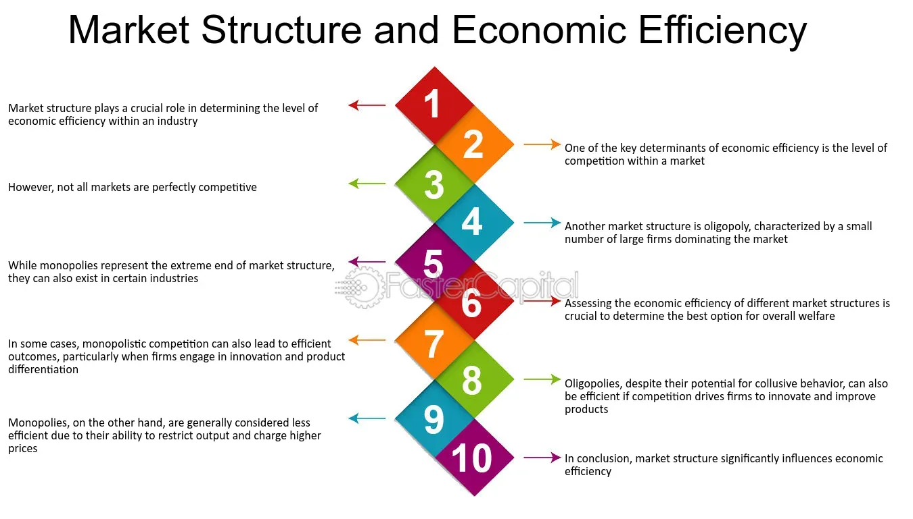

## Table of Contents

## What is financial stability and why is it important?

Financial stability means having enough money to cover your needs and some wants, without worrying about running out. It's like having a safety net that catches you if something unexpected happens, like losing your job or needing to fix your car. When you're financially stable, you can pay your bills on time, save for the future, and maybe even enjoy some fun things without stress.

Being financially stable is important because it helps you live a more relaxed and happy life. When you don't have to worry about money all the time, you can focus on other important things, like spending time with family and friends, or pursuing hobbies and interests. It also means you're better prepared for emergencies, which can keep small problems from turning into big ones. Overall, financial stability gives you peace of mind and the freedom to enjoy life more fully.

## How does market structure influence financial stability?

Market structure can really affect how stable our finances are. Think of market structure like the rules and setup of a game where people buy and sell things. If the market is set up well, with lots of competition and clear rules, it helps keep prices fair and stops one big company from bossing everyone around. This kind of setup makes the economy more stable because everyone has a fair shot, and it's harder for things to go wrong in a big way.

But if the market structure isn't good, like if there's not much competition or the rules are confusing, it can cause problems. For example, if one company gets too powerful, they might set prices too high or make it hard for new businesses to start up. This can lead to big ups and downs in the economy, making it harder for people to feel financially stable. So, having a good market structure is really important for keeping our finances steady and secure.

## What are the key components of a financial market?

A financial market is like a big store where people can buy and sell things like stocks, bonds, and money. The first key part of a financial market is the participants. These are the people and businesses that come to the market to trade. They include regular people saving for the future, big companies looking to grow, and banks that help move money around. Without these participants, the market wouldn't have anyone to buy or sell things, so they're really important.

The second key part is the infrastructure, which is like the building and tools of the market. This includes stock exchanges where trades happen, like the New York Stock Exchange, and the computers and systems that make sure everything runs smoothly and fairly. The infrastructure also includes rules and regulations that everyone has to follow, which helps keep the market safe and trustworthy. Together, these parts make sure that the financial market works well and helps people reach their financial goals.

## What role do financial institutions play in maintaining financial stability?

Financial institutions, like banks and insurance companies, are really important for keeping our finances stable. They do this by managing money and making sure it moves around safely. For example, banks take in money from people who want to save and then lend it out to others who need it for things like buying a house or starting a business. This helps keep the economy going strong. Banks also keep our money safe and make sure we can get it when we need it, which gives us peace of mind.

Insurance companies also help with financial stability by protecting us from big, unexpected costs. If something bad happens, like a fire or a car accident, insurance helps cover the costs so we don't have to pay everything ourselves. This means we can keep our finances steady even when life throws us a curveball. Together, banks and insurance companies work to make sure our money is safe and our financial lives are stable.

## How do regulations contribute to financial stability?

Regulations are like rules that keep the financial world safe and fair. They make sure that banks and other financial companies don't take big risks that could hurt a lot of people. For example, rules might say how much money a bank needs to keep on hand, so they can give it back to people who need it. This helps stop banks from running out of money and causing a big problem. When everyone follows these rules, it makes the whole financial system more stable, like a strong safety net that catches us if something goes wrong.

Regulations also help by making sure everyone plays by the same rules. This stops one company from cheating or taking advantage of others. When the rules are clear and everyone follows them, it builds trust. People feel more confident about putting their money in banks or buying stocks because they know it's being watched over. This trust is really important for keeping our finances stable. Without regulations, it would be like playing a game where some people can change the rules whenever they want, which would make everything unpredictable and risky.

## What are the common indicators of financial instability?

Financial instability can show up in different ways, but some common signs are easy to spot. One big indicator is when lots of people start losing their jobs. When unemployment goes up, it means fewer people have money to spend, which can hurt businesses and the economy. Another sign is when prices start going up a lot, which we call inflation. If prices keep rising and people's wages don't keep up, it becomes hard for them to afford things they need. Also, if banks and businesses start having trouble paying back their loans, it can be a sign that the financial system is under stress.

Another way to tell if things are getting unstable is by looking at the stock market. If stock prices start falling a lot and keep going down, it can mean that people are worried about the future and are selling their stocks. This can lead to a bigger problem if everyone starts selling at the same time, causing a crash. Also, if the value of a country's money starts to drop quickly compared to other countries' money, that's another warning sign. When these things happen, it's a signal that the financial system might be shaky and needs attention to keep things stable.

## How can market structure affect competition and efficiency in financial markets?

Market structure is like the setup of a game where people buy and sell things. It can really change how much competition there is in financial markets. If the market has a lot of different companies all trying to offer the best deals, it's like a big race where everyone wants to win. This kind of setup pushes companies to work hard and keep their prices fair, because if they don't, people will just go to someone else. But if the market is set up so that just a few big companies control everything, it can be like a game where only a few players get to make the rules. In that case, there might not be as much competition, and the big companies might not have to try as hard to keep customers happy.

Efficiency in financial markets is all about how quickly and smoothly money and investments can move around. A good market structure helps make things more efficient by making it easy for people to buy and sell what they need. For example, if there are clear rules and lots of different ways to trade, like online platforms and stock exchanges, it's easier for everyone to get what they want without waiting too long. But if the market structure is confusing or if there are only a few places to trade, it can slow things down and make it harder for people to get the best deals. So, a well-organized market structure is really important for keeping competition strong and making sure the financial markets run smoothly.

## What are the differences between centralized and decentralized market structures?

In a centralized market structure, there's one main place or organization that controls everything. It's like having a big boss who decides the rules and makes sure everyone follows them. This can be good because it makes things clear and organized. For example, when you buy or sell stocks, you might go to one big stock exchange, like the New York Stock Exchange. This can make trading easier because everyone knows where to go and what the rules are. But, it can also mean that if something goes wrong with the big boss, the whole market could have problems.

On the other hand, a decentralized market structure spreads out control among many different places or people. It's like a big game where lots of different groups can make their own rules. This can be good because it lets more people get involved and can make the market more flexible. For example, with cryptocurrencies, there isn't one main place to trade them; instead, lots of different platforms and people can trade them. This can make it harder for one problem to affect the whole market. But, it can also make things more confusing and harder to keep track of, because there are so many different rules and places to go.

## How do global financial markets interact and affect each other's stability?

Global financial markets are like a big web where what happens in one part can affect other parts. If a big economy like the United States has a problem, like a stock market crash, it can make people in other countries worried too. They might start selling their own stocks or moving their money to safer places, which can cause problems in their own markets. This is because many countries trade with each other and invest in each other's businesses, so when one country's market goes down, it can pull others down with it.

But it's not all bad news. When things are going well in one country, it can help other countries too. For example, if a big economy is growing fast, it might buy more things from other countries, which can help those countries' economies grow too. Also, if one country's central bank does something to make its market more stable, like lowering interest rates, it can make investors feel more confident and help keep other markets stable. So, global financial markets are always influencing each other, making it important for countries to work together to keep things stable.

## What advanced models are used to predict financial stability?

Advanced models used to predict financial stability often include big data and [machine learning](/wiki/machine-learning). These models look at tons of information from the past, like how stock prices moved or how many people were out of work. They use this data to find patterns that might show when things could get shaky. For example, if a model sees that every time unemployment goes up a lot, the stock market crashes soon after, it might warn us when unemployment starts rising again. These models can be really helpful because they can spot small signs of trouble that people might miss.

Another kind of model is called a stress test. Banks and financial companies use these to see how they would do if something really bad happened, like a big economic crash. They pretend that something terrible happens and then check if they would still have enough money to keep going. This helps them prepare for the worst and make plans to stay stable. By using these models, financial experts can get a better idea of what might happen in the future and take steps to keep the financial system strong and steady.

## How do technological advancements impact market structure and financial stability?

Technological advancements have changed the way financial markets work. They've made it easier for people to buy and sell things quickly, like stocks and cryptocurrencies, using the internet and apps. This has made markets more open and competitive because more people can join in from anywhere. But it's also made things more complicated. With so many new ways to trade, it's harder to keep track of everything and make sure it's fair. Sometimes, technology can even cause big problems, like when a computer glitch makes prices go crazy for a little while.

These changes also affect how stable our finances are. On one hand, technology helps keep markets running smoothly by making it easier to see what's going on and react quickly. For example, if there's a problem, computers can help fix it faster than people could. But on the other hand, technology can also make things less stable. If a lot of trading is done by computers following set rules, they might all start selling at the same time if something goes wrong, causing a big drop in prices. So, while technology can make markets more efficient and open, it also brings new risks that need to be managed carefully to keep our finances stable.

## What are the emerging trends in financial market structures and their implications for future stability?

One big trend in financial markets is the rise of decentralized finance, or DeFi. This means using technology like blockchain to let people trade and borrow money without big banks in the middle. It's like a big online party where everyone can join in and make their own deals. This could make markets more open and let more people get involved, which is good for competition. But it also means there's less control over what's happening, which can make things riskier. If something goes wrong in DeFi, it might be harder to fix because there's no big boss to step in and help.

Another trend is the use of [artificial intelligence](/wiki/ai-artificial-intelligence), or AI, in trading. AI can look at tons of data really fast and make smart guesses about what will happen next in the market. This can make trading more efficient and help people make better choices. But it also means that if lots of people start using the same AI tools, their computers might all decide to buy or sell at the same time, causing big swings in the market. So, while AI can help keep things stable by making better predictions, it can also make markets more unpredictable if everyone starts following the same computer advice.

These trends show that technology is changing how financial markets work, making them more open and efficient but also more complicated and risky. To keep things stable in the future, it's important for everyone to understand these new technologies and work together to manage the risks they bring. This way, we can enjoy the benefits of new ways to trade while still keeping our finances safe and steady.

## References & Further Reading

[1]: [Bank for International Settlements. (2015). "Algorithmic and High-Frequency Trading."](https://www.bis.org/publ/mktc07.pdf) Markets Committee Publications.

[2]: Harris, L. (2003). ["Trading and Exchanges: Market Microstructure for Practitioners."](https://www.amazon.com/Trading-Exchanges-Market-Microstructure-Practitioners/dp/0195144708) Oxford University Press.

[3]: Aldridge, I. (2013). ["High-Frequency Trading: A Practical Guide to Algorithmic Strategies and Trading Systems."](https://www.amazon.com/High-Frequency-Trading-Practical-Algorithmic-Strategies/dp/1118343506) Wiley Finance.

[4]: Malkiel, B. (2019). ["A Random Walk Down Wall Street: The Time-Tested Strategy for Successful Investing."](https://www.amazon.com/Random-Walk-Down-Wall-Street/dp/0393358380) W.W. Norton & Company.

[5]: [U.S. Securities and Exchange Commission. (2010). "Findings Regarding the Market Events of May 6, 2010."](https://www.sec.gov/news/studies/2010/marketevents-report.pdf) Report of the Staffs of the CFTC and SEC to the Joint Advisory Committee on Emerging Regulatory Issues.

[6]: De Luca, M., & di Giava, G. (2018). ["Financial Networks and Algorithmic Trading: How Financial Networks Increase the Speed of Innovation and Financial Instability."](https://it.wikipedia.org/wiki/Primo_viaggio_di_James_Cook) Decisions in Economics and Finance, 41(2), 341-360.

[7]: [Financial Stability Board. (2018). "Crypto-assets: Report to the G20 on Work by the FSB and Standard-Setting Bodies."](https://www.fsb.org/2018/07/crypto-assets-report-to-the-g20-on-the-work-of-the-fsb-and-standard-setting-bodies/) A report on financial stability implications by the FSB.