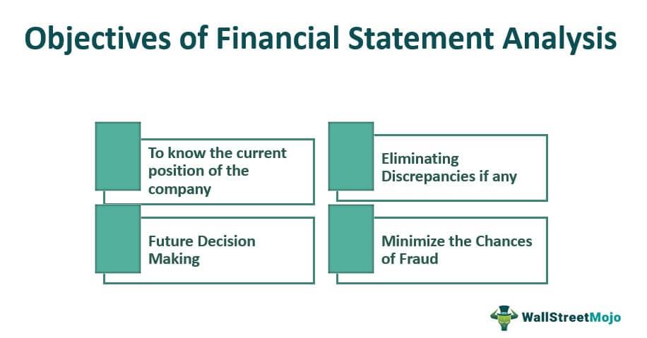

The financial industry is undergoing rapid transformations driven by continuous technological advancements. At the heart of these changes is the integration of finance with technology, which is reshaping how financial institutions operate and compete. One vital area of focus is financial statement analysis, a critical tool that aids stakeholders in understanding a bank's performance and evaluating its financial health. Through careful analysis of financial statements, which include the balance sheet, income statement, and cash flow statement, investors, analysts, and regulators can gain valuable insights into a bank's operational efficiency and risk exposure.

In tandem with the evolution of financial analysis, algorithmic trading is increasingly gaining prominence. Algorithmic trading involves the use of computer programs to execute trades in financial markets, relying on pre-determined strategies and quantitative models. By eliminating human intervention, algorithmic trading improves the speed and precision of trade executions, thereby enhancing market efficiency. This technological innovation allows for the rapid analysis of large datasets and the execution of complex trading strategies that would be unfeasible for human traders.



The convergence of financial analysis and algorithmic trading presents significant opportunities for modern banking. Through data-driven strategies, banks can optimize their trading operations, manage risk more effectively, and uncover new revenue streams. The synergy between algorithmic trading and comprehensive financial analysis enables banks to make informed decisions supported by robust analytics. As banks strive to navigate this ever-transforming landscape, the fusion of technology with traditional banking practices stands out as a pivotal factor in achieving sustained competitive advantage.

This article examines the intersection of bank analysis, financial statements, and algorithmic trading in modern banking, highlighting new developments and potential avenues for growth. By leveraging the latest technological innovations and analytical methods, financial institutions can enhance their strategic capabilities and respond dynamically to the challenges and opportunities presented by the evolving financial environment.

## Table of Contents

## Understanding Bank Financial Statements

Banks have unique financial statements that differ from those of traditional companies due to the distinct nature of their operations, where they primarily deal with money-as-product. Understanding these statements is essential for analyzing a bank’s financial health and performance.

The balance sheet, income statement, and cash flow statement are the key components that provide detailed insights into a bank's operations. The balance sheet presents a snapshot of a bank's assets, liabilities, and equity at a specific moment. For banks, important asset categories include loans and securities, while key liabilities consist of customer deposits. The balance sheet formula for banks typically adheres to:

$$
\text{Assets} = \text{Liabilities} + \text{Equity}
$$

The income statement provides a performance summary over a period, detailing revenues, expenses, and profits. Banks primarily generate income through the [interest rate](/wiki/interest-rate-trading-strategies) spread, which is the difference between the interest earned on loans and the interest paid on deposits. Important terms include net interest income and non-interest income, such as fees from financial services.

The cash flow statement tracks the inflows and outflows of cash, highlighting operational, investing, and financing activities. For banks, cash flow primarily centers around loan origination, repayment, and changes in deposits.

Understanding specific banking terms is essential for thorough financial analysis. Deposits are liabilities that represent borrowed money from customers, while loans are assets that earn banks interest income. Securities, often in the form of government or corporate bonds, provide additional income streams and [liquidity](/wiki/liquidity-risk-premium) management.

Regulation heavily influences bank financial statements. Agencies such as the Federal Reserve and the Federal Deposit Insurance Corporation (FDIC) impose guidelines to ensure stability and protect depositors. These regulations can affect how banks report assets and liabilities, as well as dictate capital reserve requirements, influencing a bank’s liquidity and risk management strategies.

Comprehensive analysis of these financial statements enables stakeholders to evaluate a bank’s operational efficiency, profitability, and adherence to regulatory requirements, ultimately guiding informed decision-making in financial markets.

## Financial Analysis Techniques for Banks

Effective bank analysis involves the careful examination of both quantitative and qualitative aspects of financial performance. This approach allows investors and analysts to understand a bank's efficiency, profitability, and risk management capabilities.

### Ratio Analysis

Ratio analysis is a primary quantitative tool used to evaluate a bank's financial health. Key ratios include:

1. **Efficiency Ratios**: These measure how well a bank utilizes its assets. The cost-to-income ratio, for example, is calculated as:
$$
   \text{Cost-to-Income Ratio} = \frac{\text{Operating Expenses}}{\text{Operating Income}}

$$
   A lower ratio indicates higher efficiency in managing expenses relative to income.

2. **Profitability Ratios**: Return on assets (ROA) and return on equity (ROE) are essential metrics. ROA is calculated by dividing net income by total assets, reflecting how effectively a bank uses its assets to generate profit. ROE measures profitability by showing how much profit is generated with shareholders' equity.

3. **Risk Ratios**: The loan-to-deposit ratio gauges a bank's liquidity risk and measures what percentage of deposits are loaned out. A high ratio might suggest potential liquidity issues, whereas too low a ratio may indicate inefficiency in using depositor funds for income generation.

### Trends in Loans, Net Interest Margins, and Non-Interest Income

Analyzing trends in loan growth, net interest margins (NIM), and non-interest income is crucial in assessing a bank's performance:

- **Loan Growth**: A steady increase in the loan portfolio often signals positive business conditions and trust in the bank's credit policies. However, rapid growth might warrant caution due to potential increases in credit risk.

- **Net Interest Margin (NIM)**: NIM represents the difference between interest income generated from loans and the interest paid out to depositors, relative to average earning assets. It is calculated as:
$$
  \text{NIM} = \frac{\text{Interest Income} - \text{Interest Expense}}{\text{Average Earning Assets}}

$$
  This metric is a core indicator of profitability, with higher margins typically suggesting more efficient [earning](/wiki/earning-announcement) asset management.

- **Non-Interest Income**: Diversification of income sources beyond interest is a positive indicator. Revenue from fees, trading, and asset management reduces dependence on net interest income and can stabilize profits during interest rate fluctuations.

### Interest Rate and Credit Risk Exposure

Scrutinizing a bank’s exposure to interest rate and credit risks provides critical insight into their operational health:

- **Interest Rate Risk**: Banks must manage the mismatch between the maturities of assets and liabilities. Rising interest rates can improve revenue if a bank has more variable-rate assets than liabilities, but may adversely affect fixed-rate loans if liabilities reprice more quickly.

- **Credit Risk**: Assessing the quality of the loan portfolio and the adequacy of provisions for loan losses is essential. High non-performing loans (NPLs) suggest potential future losses and can weaken the bank's financial position.

### Impact of Rising Interest Rates

Rising interest rates present a dual effect on bank revenues. If a bank holds a significant amount of interest-bearing liabilities, its interest expense might increase. Concurrently, if the bank's assets are mostly interest-sensitive loans, it could also see a rise in income. The net effect on revenue depends on the balance and duration of these assets and liabilities.

By employing these financial analysis techniques, investors and analysts can form a comprehensive view of a bank's financial health, strategic position, and potential risks. Effective analysis helps guide investment decisions and informs stakeholders of a bank's operational strengths and vulnerabilities.

 to Algorithmic Trading

Algorithmic trading automates the decision-making process for trading financial securities through the use of pre-programmed strategies. By removing human intervention, it significantly enhances the speed and accuracy of trades. This automation allows for rapid execution of orders, leading to potentially more favorable pricing and reduced transaction costs. 

Traders rely on quantitative models to anticipate market movements and execute trades. These models analyze vast amounts of data to generate signals for buying or selling securities. Among the numerous programming languages available, Python has emerged as a popular choice for developing [algorithmic trading](/wiki/algorithmic-trading) strategies. Its simplicity and extensive selection of libraries, such as Pandas for data manipulation and NumPy for numerical computations, make it ideal for implementing complex strategies efficiently.

Algorithmic trading offers several key advantages. Improved execution efficiency is one of its primary benefits, as algorithms can process market data and execute trades in fractions of a second. This capability often leads to transaction costs that are substantially lower compared to manual trading. Furthermore, the use of algorithms allows for the diversification of trading strategies. Traders can test and deploy multiple strategies simultaneously, enhancing the robustness and resilience of their trading portfolios.

Python's role in algorithmic trading is not limited to strategy development but extends to [backtesting](/wiki/backtesting) and visualization. Libraries like Backtrader facilitate backtesting, which involves running a strategy on historical data to evaluate its performance. This process helps minimize risks by identifying potential flaws in the strategy before it is deployed in live trading environments. Visualization tools such as Matplotlib and Plotly enable traders to analyze the performance data and gain insights into the strategy's effectiveness, ensuring that trading decisions are informed and data-driven.

## Using Python for Financial Analysis and Algorithmic Trading

Python has become a fundamental tool for both financial analysis and algorithmic trading, largely due to its versatility, ease of use, and the extensive suite of libraries available. These libraries provide robust frameworks for analyzing financial data, visualizing results, and backtesting trading strategies, thereby minimizing risk and optimizing performance.

One of the core strengths of Python in financial analysis is the Pandas library. Pandas facilitates data manipulation and analysis, making it easy to handle and process large financial datasets. It provides data structures such as DataFrames, which simplify the handling of time-series data—a common requirement in finance. For example, a financial analyst might use Pandas to compute moving averages of stock prices or to aggregate transaction data over specified intervals.

NumPy, another key library, complements Pandas by providing powerful methods for numerical computation. NumPy is particularly useful for performing linear algebra operations, which are crucial in developing [quantitative trading](/wiki/quantitative-trading) strategies and risk management models. Operations such as matrix multiplications and Fourier transforms, which are computationally intensive, can be performed efficiently using NumPy.

Visualizing data is an essential component of financial analysis and Python excels here with libraries like Matplotlib and Plotly. These tools enable the creation of static, interactive, and animated plots that are valuable for interpreting financial data trends and patterns. For instance, a portfolio manager might use Plotly to create an interactive dashboard that tracks asset allocations and performance metrics over time.

Backtesting is a critical process in developing algorithmic trading strategies, allowing traders to test the viability of their strategies using historical data. Python's Backtrader library is a powerful tool for this purpose, offering a comprehensive framework for implementing and optimizing trading strategies. By simulating trades over historical data, Backtrader helps traders understand potential weaknesses and adjust strategies accordingly.

Implementing a robust trading strategy requires continuous development and backtesting to ensure its validity under various market conditions. Python's simplicity and flexibility are advantageous in this context, enabling rapid iteration and frequent updates to strategies as market conditions change. Financial professionals often prefer Python over other programming languages due to its extensive support for both financial libraries and general-purpose programming needs.

In conclusion, Python's extensive library ecosystem, coupled with its straightforward syntax, empowers financial professionals to conduct sophisticated data analyses and automate trading strategies efficiently. Its wide adoption in the financial sector underscores its utility and effectiveness in addressing the complex challenges of modern finance.

## Challenges and Risks in Integrating Financial Analysis with Algo Trading

Integrating financial analysis with algorithmic trading presents several challenges and risks that must be managed carefully to ensure optimal performance and reliability in trading strategies. 

Data quality is a fundamental component in this integration. The precision and accuracy of the financial analysis and algorithmic trading heavily depend on the quality of the data used. Inaccurate or outdated data can lead to flawed analyses, resulting in misguided trading decisions. Ensuring high-quality data involves verifying data sources, ensuring consistency, and maintaining data integrity through rigorous validation processes.

Overfitting is a critical risk in the development and backtesting of trading algorithms. Overfitting occurs when a model is too tightly fitted to historical data, capturing noise rather than the underlying market patterns. This leads to strategies that perform well in backtesting but fail in real-world trading. To mitigate overfitting, techniques such as cross-validation and out-of-sample testing are employed. Regularization methods in [machine learning](/wiki/machine-learning), such as Lasso or Ridge regression, can also help reduce overfitting by penalizing overly complex models.

Execution costs and market [volatility](/wiki/volatility-trading-strategies) must be factored into algorithmic trading strategies. Transaction costs, slippage, and market impact can significantly erode profits. Therefore, when developing strategies, it is crucial to incorporate realistic assumptions about these costs. For instance, in a Python-based backtesting framework like Backtrader, these costs can be modeled directly in the strategy:

```python
def next(self):
    price = self.data.close[0]
    size = self.broker.get_cash() // price
    self.buy(size=size, exectype=bt.Order.Market, price=price * (1 + slippage_percent))
```

Algorithmic trading can exacerbate market volatility, particularly during periods of financial stress. Rapid execution and large volumes of trades can amplify price movements, leading to increased volatility. High-frequency trading, a subset of algorithmic trading, has been associated with "flash crashes" where markets plummet extremely quickly only to recover shortly afterward. 

Effective risk management frameworks are essential to address these challenges. This involves setting limits on trading positions, using stop-loss orders, and diversifying strategies across different markets and asset classes to reduce exposure. Moreover, continuous monitoring and adaptive algorithms can help in assessing market conditions and adjusting strategies in real time, ensuring robust performance under varying market dynamics.

In conclusion, although the integration of financial analysis with algorithmic trading offers substantial opportunities for enhanced trading performance, these benefits can only be realized by rigorously addressing the associated challenges and risks through stringent data quality checks, robust model validation, comprehensive execution cost analysis, and dynamic risk management practices.

## Conclusion

Integrating financial statement analysis with algorithmic trading unlocks new potentials that can significantly enhance the efficiency and effectiveness of financial decision-making. By leveraging data-driven strategies and comprehensive financial analysis, stakeholders can make informed decisions that align with their strategic goals. As banks and financial institutions navigate a transforming financial landscape, characterized by rapid technological advancements, the integration of these tools will become increasingly critical.

The role of technology in finance continues to grow, driven by ongoing advancements in data science and machine learning. These innovations offer the potential to refine analytical practices and improve the precision of trading strategies. For instance, machine learning algorithms can identify patterns in large datasets, providing insights that were previously unattainable. Additionally, the predictive power of these models can be used to optimize trading strategies, ensuring they are both comprehensive and adaptable to changing market conditions.

Professionals equipped with both financial and technical expertise are well-positioned to capitalize on these integrations. Their ability to interpret complex financial statements and harness the power of algorithmic trading provides a competitive advantage. They can exploit new opportunities, minimize risks, and ultimately enhance financial performance. This hybrid skill set will be essential for those seeking to lead in the evolving financial services sector, marking a decisive shift towards a more technologically adept approach to banking and investment management. As the industry continues to evolve, these integrated practices will not only define the way institutions operate but will also influence broader economic trends.

## References & Further Reading

[1]: Damodaran, A. (2002). ["Investment Valuation: Tools and Techniques for Determining the Value of Any Asset."](https://archive.org/details/investmentvaluat0000damo_n6k9) Wiley Finance.

[2]: Hull, J. C. (2018). ["Risk Management and Financial Institutions."](https://books.google.com/books/about/Risk_Management_and_Financial_Institutio.html?id=1J1QDwAAQBAJ) Wiley.

[3]: Liang, B. & Park, H. (2010). "Predicting Mutual Fund Manager Performance: A New Perspective." The Journal of Financial and Quantitative Analysis, 45(6).

[4]: Pyle, D. (1999). ["Data Preparation for Data Mining."](https://archive.org/details/datapreparationf0000pyle) Morgan Kaufmann.

[5]: Shah, H., & Murphy, S. (2017). ["Algorithmic Trading and DMA: An Introduction to Direct Access Trading Strategies."](https://www.amazon.com/Algorithmic-Trading-DMA-introduction-strategies/dp/0956399207) Harriman House.