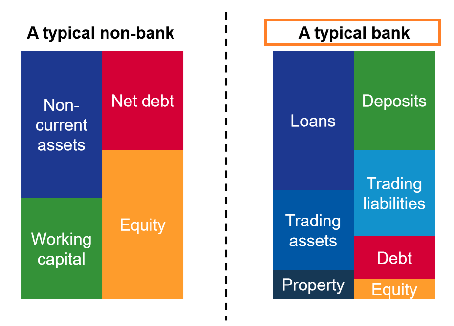

## Table of Contents

## What is a financial statement?

A financial statement is a document that shows the financial health of a business or an individual. It includes important information like how much money is coming in, how much is going out, and what the business or person owns and owes. People use financial statements to make decisions about their money, like whether to invest in a company or how to manage their personal finances.

There are three main types of financial statements: the income statement, the balance sheet, and the cash flow statement. The income statement shows how much money a business made and spent over a certain period, like a month or a year. The balance sheet lists what the business owns, like buildings or equipment, and what it owes, like loans or bills. The cash flow statement shows how money moves in and out of the business, helping to see if it can pay its bills on time.

## What are the main types of financial statements used by banks?

Banks use the same main types of financial statements as other businesses: the income statement, the balance sheet, and the cash flow statement. The income statement shows how much money the bank earned and spent over a period of time, like a month or a year. It helps banks see if they are making a profit or a loss. The balance sheet lists what the bank owns, like loans it has given out or buildings it owns, and what it owes, like money it has borrowed or deposits it needs to pay back.

The cash flow statement is also important for banks. It shows how money moves in and out of the bank, helping them see if they have enough cash to cover their expenses and meet their obligations. This is crucial for banks because they need to make sure they can give money to people who need it and also pay back people who have put money in the bank. All these statements help banks understand their financial health and make good decisions.

## How do you read a bank's income statement?

Reading a bank's income statement is like looking at a report card for how the bank did with its money over a certain time, like a year. At the top, you'll see the bank's total income, which is all the money it made from things like interest on loans, fees for services, and other ways it earns money. This is called revenue. Then, you'll see the bank's expenses, which is all the money it spent to run the bank, like paying employees, rent, and other costs. When you subtract the expenses from the revenue, you get the bank's profit or loss for that time. If the number is positive, the bank made a profit. If it's negative, the bank had a loss.

The income statement also shows some important details about how the bank made its money. For example, you can see how much of the bank's revenue came from interest on loans compared to fees for services. This helps you understand where the bank's money is coming from. You might also see some special items, like money the bank set aside for loans that might not get paid back, called loan loss provisions. These are important because they show how the bank is preparing for risks. By looking at all these parts of the income statement, you can get a good idea of how well the bank is doing financially.

## What key metrics should be analyzed on a bank's balance sheet?

When you look at a bank's balance sheet, some key things to check are the bank's assets, liabilities, and equity. Assets are things the bank owns, like loans it has given out, money it has invested, and the cash it has on hand. Liabilities are what the bank owes, like deposits from customers and money it has borrowed. Equity is the difference between the bank's assets and liabilities, and it shows how much the bank is really worth. 

One important metric to look at is the loan-to-deposit ratio, which shows how much of the money people have put in the bank is being lent out. A high ratio might mean the bank is doing a good job of lending, but it could also mean it might not have enough cash if a lot of people want their money back at the same time. Another key thing to check is the bank's capital adequacy ratio, which shows if the bank has enough money to cover risks like loans that might not get paid back. A strong capital position means the bank is more likely to be safe and stable.

## How does the cash flow statement help in understanding a bank's liquidity?

The cash flow statement helps us see how money moves in and out of a bank, which tells us about its liquidity. Liquidity is about how easily a bank can get cash to pay its bills and meet its needs. The cash flow statement shows the money coming in from things like loans being paid back, fees from services, and investments. It also shows the money going out for things like paying employees, rent, and other costs. By looking at these flows, we can see if the bank has enough cash to handle its day-to-day operations and unexpected needs.

For a bank, having good liquidity is really important. If a lot of people want their money back at the same time, the bank needs to have enough cash to give it to them. The cash flow statement helps us understand if the bank can do this. If the statement shows more money coming in than going out, it's a good sign that the bank is liquid. But if more money is going out than coming in, it might mean the bank could have trouble paying its bills or meeting customer demands. So, the cash flow statement is a key tool for understanding a bank's ability to stay liquid and manage its cash well.

## What are the common profitability ratios used in bank financial analysis?

When looking at a bank's financial health, profitability ratios are really helpful. They tell us how well the bank is doing at making money. One common ratio is the Return on Assets (ROA), which shows how much profit the bank makes for every dollar of assets it has. A higher ROA means the bank is using its assets well to make money. Another important ratio is the Return on Equity (ROE), which shows how much profit the bank makes for every dollar of shareholder's money. A higher ROE means the bank is doing a good job of making money for its owners.

Another useful ratio is the Net Interest Margin (NIM), which looks at the difference between the interest the bank earns on loans and the interest it pays on deposits. A higher NIM means the bank is making more money from the difference between what it charges and what it pays. The Efficiency Ratio is also important because it shows how well the bank is managing its costs. It's calculated by dividing the bank's expenses by its revenue. A lower efficiency ratio means the bank is spending less to make the same amount of money, which is good for profitability. By looking at these ratios, we can get a good idea of how profitable the bank is and how well it's managing its money.

## How can liquidity ratios be used to assess a bank's financial health?

Liquidity ratios help us understand if a bank has enough cash to pay its bills and meet its needs. One key ratio is the Current Ratio, which compares a bank's current assets, like cash and things that can be quickly turned into cash, to its current liabilities, like bills that need to be paid soon. A higher current ratio means the bank can easily cover its short-term debts, which is good for its financial health. Another important ratio is the Quick Ratio, which is similar but doesn't count inventory because it might take longer to sell. A strong quick ratio shows the bank can meet its short-term needs even without selling things that might take time to turn into cash.

Another useful liquidity ratio for banks is the Cash Ratio, which looks at how much cash and cash equivalents the bank has compared to its current liabilities. This ratio tells us if the bank can pay its bills right away with the cash it has on hand. A higher cash ratio means the bank is in a good position to handle any sudden needs for cash. By looking at these liquidity ratios, we can see if the bank is managing its cash well and if it's ready for any financial challenges that might come up. This helps us understand the overall financial health of the bank.

## What do solvency ratios tell us about a bank's long-term stability?

Solvency ratios help us see if a bank can keep going in the long run by looking at its ability to pay off its debts. One key ratio is the Debt to Equity Ratio, which compares what the bank owes to what its owners have put in. A lower ratio means the bank is using less borrowed money, which is good because it's less risky. Another important ratio is the Capital Adequacy Ratio, which shows if the bank has enough money to cover risks like loans that might not get paid back. A higher capital adequacy ratio means the bank is more likely to be stable and able to handle problems.

By looking at these solvency ratios, we can understand if the bank is on solid ground for the future. If the ratios show that the bank has a good balance between what it owes and what it owns, and enough money set aside for risks, it's a sign that the bank is strong and stable. This is important because it means the bank can keep operating and paying its bills even if things get tough, which gives us confidence in its long-term health.

## How can efficiency ratios indicate the operational performance of a bank?

Efficiency ratios help us see how well a bank is managing its costs and running its operations. One important ratio is the Efficiency Ratio, which you get by dividing the bank's expenses by its revenue. A lower efficiency ratio means the bank is spending less to make the same amount of money, which is good. It shows the bank is doing a good job of keeping its costs down while still earning money. Another useful ratio is the Cost to Income Ratio, which is similar but focuses on the bank's operating costs compared to its income. A lower cost to income ratio means the bank is efficient in how it uses its money to make more money.

These ratios can tell us a lot about how well a bank is performing day to day. If a bank has a low efficiency ratio or cost to income ratio, it means it's running smoothly and not wasting money. This is important because it shows the bank is good at managing its resources and can make more profit from the money it has. On the other hand, if these ratios are high, it might mean the bank is spending too much to make money, which could be a problem. By looking at these efficiency ratios, we can get a clear picture of how well the bank is doing in its everyday operations.

## What advanced techniques can be used to forecast a bank's financial performance?

To forecast a bank's financial performance, one advanced technique is to use regression analysis. This means looking at past data to find patterns and then using those patterns to predict the future. For example, you might look at how the bank's profits have changed over time and see if they go up when the economy is doing well or down when it's not. By using this information, you can make a guess about how the bank will do in the future based on what's happening in the economy right now. It's like using a weather report to guess if you'll need an umbrella tomorrow, but with numbers and financial data instead.

Another technique is to use scenario analysis, which involves imagining different situations that could happen and seeing how the bank would do in each one. For example, you might think about what would happen if interest rates went up or if there was a big economic downturn. By making models of these different scenarios, you can see how the bank's profits, loans, and other financial numbers might change. This helps the bank prepare for different possibilities and make better plans. It's like playing "what if" games with the bank's financial data to be ready for whatever might come next.

## How do regulatory requirements affect the financial statement analysis of banks?

Regulatory requirements play a big role in how we look at a bank's financial statements. Banks have to follow rules set by government agencies, like keeping enough money to cover risks and reporting their financial health in certain ways. These rules can change how banks show their numbers on their financial statements. For example, banks might have to set aside more money for loans that might not get paid back, which can make their profits look smaller. When we analyze a bank's financial statements, we need to know these rules so we can understand why the numbers look the way they do and make sure we're comparing banks fairly.

These regulations also affect the ratios and other measures we use to see how healthy a bank is. For instance, the capital adequacy ratio, which shows if a bank has enough money to cover risks, is directly influenced by regulatory standards. If a bank doesn't meet these standards, it might have to change how it does business or even get in trouble with regulators. So, when we look at a bank's financial statements, we need to think about these rules to get a full picture of the bank's financial health and future stability. Understanding the impact of regulatory requirements helps us make better decisions about the bank's performance and risks.

## What are the latest trends in financial statement analysis specific to the banking industry?

One of the latest trends in financial statement analysis for banks is the increased focus on digital transformation and technology investments. Banks are spending more money on technology to improve their services and keep up with competitors. When looking at a bank's financial statements, analysts pay close attention to how much the bank is spending on technology and if these investments are paying off. They look at things like the bank's efficiency ratio to see if the new technology is helping the bank spend less money while still making the same amount of profit. This trend is important because it shows how well a bank is adapting to changes in the industry and meeting customer needs.

Another trend is the growing emphasis on environmental, social, and governance ([ESG](/wiki/esg-investing)) factors. More and more, people want to know if a bank is doing good things for the environment and society, and if it's being run in a fair and responsible way. Analysts now look at a bank's financial statements to see if it's investing in green projects or supporting social causes. They also check to see if the bank is managing risks related to ESG issues well. This trend is changing how banks report their financial information and how investors and analysts look at their performance. It's becoming just as important to be a good corporate citizen as it is to make a profit.

## What is the process for understanding bank financial statements?

Banks have unique financial statements that differ from those of traditional companies due to the distinct nature of their operations, where they primarily deal with money-as-product. Understanding these statements is essential for analyzing a bank’s financial health and performance.

The balance sheet, income statement, and cash flow statement are the key components that provide detailed insights into a bank's operations. The balance sheet presents a snapshot of a bank's assets, liabilities, and equity at a specific moment. For banks, important asset categories include loans and securities, while key liabilities consist of customer deposits. The balance sheet formula for banks typically adheres to:

$$
\text{Assets} = \text{Liabilities} + \text{Equity}
$$

The income statement provides a performance summary over a period, detailing revenues, expenses, and profits. Banks primarily generate income through the [interest rate](/wiki/interest-rate-trading-strategies) spread, which is the difference between the interest earned on loans and the interest paid on deposits. Important terms include net interest income and non-interest income, such as fees from financial services.

The cash flow statement tracks the inflows and outflows of cash, highlighting operational, investing, and financing activities. For banks, cash flow primarily centers around loan origination, repayment, and changes in deposits.

Understanding specific banking terms is essential for thorough financial analysis. Deposits are liabilities that represent borrowed money from customers, while loans are assets that earn banks interest income. Securities, often in the form of government or corporate bonds, provide additional income streams and [liquidity](/wiki/liquidity-risk-premium) management.

Regulation heavily influences bank financial statements. Agencies such as the Federal Reserve and the Federal Deposit Insurance Corporation (FDIC) impose guidelines to ensure stability and protect depositors. These regulations can affect how banks report assets and liabilities, as well as dictate capital reserve requirements, influencing a bank’s liquidity and risk management strategies.

Comprehensive analysis of these financial statements enables stakeholders to evaluate a bank’s operational efficiency, profitability, and adherence to regulatory requirements, ultimately guiding informed decision-making in financial markets.

## What are Financial Analysis Techniques for Banks?

Effective bank analysis involves the careful examination of both quantitative and qualitative aspects of financial performance. This approach allows investors and analysts to understand a bank's efficiency, profitability, and risk management capabilities.

### Ratio Analysis

Ratio analysis is a primary quantitative tool used to evaluate a bank's financial health. Key ratios include:

1. **Efficiency Ratios**: These measure how well a bank utilizes its assets. The cost-to-income ratio, for example, is calculated as:
$$
   \text{Cost-to-Income Ratio} = \frac{\text{Operating Expenses}}{\text{Operating Income}}

$$
   A lower ratio indicates higher efficiency in managing expenses relative to income.

2. **Profitability Ratios**: Return on assets (ROA) and return on equity (ROE) are essential metrics. ROA is calculated by dividing net income by total assets, reflecting how effectively a bank uses its assets to generate profit. ROE measures profitability by showing how much profit is generated with shareholders' equity.

3. **Risk Ratios**: The loan-to-deposit ratio gauges a bank's liquidity risk and measures what percentage of deposits are loaned out. A high ratio might suggest potential liquidity issues, whereas too low a ratio may indicate inefficiency in using depositor funds for income generation.

### Trends in Loans, Net Interest Margins, and Non-Interest Income

Analyzing trends in loan growth, net interest margins (NIM), and non-interest income is crucial in assessing a bank's performance:

- **Loan Growth**: A steady increase in the loan portfolio often signals positive business conditions and trust in the bank's credit policies. However, rapid growth might warrant caution due to potential increases in credit risk.

- **Net Interest Margin (NIM)**: NIM represents the difference between interest income generated from loans and the interest paid out to depositors, relative to average earning assets. It is calculated as:
$$
  \text{NIM} = \frac{\text{Interest Income} - \text{Interest Expense}}{\text{Average Earning Assets}}

$$
  This metric is a core indicator of profitability, with higher margins typically suggesting more efficient [earning](/wiki/earning-announcement) asset management.

- **Non-Interest Income**: Diversification of income sources beyond interest is a positive indicator. Revenue from fees, trading, and asset management reduces dependence on net interest income and can stabilize profits during interest rate fluctuations.

### Interest Rate and Credit Risk Exposure

Scrutinizing a bank’s exposure to interest rate and credit risks provides critical insight into their operational health:

- **Interest Rate Risk**: Banks must manage the mismatch between the maturities of assets and liabilities. Rising interest rates can improve revenue if a bank has more variable-rate assets than liabilities, but may adversely affect fixed-rate loans if liabilities reprice more quickly.

- **Credit Risk**: Assessing the quality of the loan portfolio and the adequacy of provisions for loan losses is essential. High non-performing loans (NPLs) suggest potential future losses and can weaken the bank's financial position.

### Impact of Rising Interest Rates

Rising interest rates present a dual effect on bank revenues. If a bank holds a significant amount of interest-bearing liabilities, its interest expense might increase. Concurrently, if the bank's assets are mostly interest-sensitive loans, it could also see a rise in income. The net effect on revenue depends on the balance and duration of these assets and liabilities.

By employing these financial analysis techniques, investors and analysts can form a comprehensive view of a bank's financial health, strategic position, and potential risks. Effective analysis helps guide investment decisions and informs stakeholders of a bank's operational strengths and vulnerabilities.

 to Algorithmic Trading

Algorithmic trading automates the decision-making process for trading financial securities through the use of pre-programmed strategies. By removing human intervention, it significantly enhances the speed and accuracy of trades. This automation allows for rapid execution of orders, leading to potentially more favorable pricing and reduced transaction costs. 

Traders rely on quantitative models to anticipate market movements and execute trades. These models analyze vast amounts of data to generate signals for buying or selling securities. Among the numerous programming languages available, Python has emerged as a popular choice for developing [algorithmic trading](/wiki/algorithmic-trading) strategies. Its simplicity and extensive selection of libraries, such as Pandas for data manipulation and NumPy for numerical computations, make it ideal for implementing complex strategies efficiently.

Algorithmic trading offers several key advantages. Improved execution efficiency is one of its primary benefits, as algorithms can process market data and execute trades in fractions of a second. This capability often leads to transaction costs that are substantially lower compared to manual trading. Furthermore, the use of algorithms allows for the diversification of trading strategies. Traders can test and deploy multiple strategies simultaneously, enhancing the robustness and resilience of their trading portfolios.

Python's role in algorithmic trading is not limited to strategy development but extends to [backtesting](/wiki/backtesting) and visualization. Libraries like Backtrader facilitate backtesting, which involves running a strategy on historical data to evaluate its performance. This process helps minimize risks by identifying potential flaws in the strategy before it is deployed in live trading environments. Visualization tools such as Matplotlib and Plotly enable traders to analyze the performance data and gain insights into the strategy's effectiveness, ensuring that trading decisions are informed and data-driven.

## References & Further Reading

[1]: Damodaran, A. (2002). ["Investment Valuation: Tools and Techniques for Determining the Value of Any Asset."](https://archive.org/details/investmentvaluat0000damo_n6k9) Wiley Finance.

[2]: Hull, J. C. (2018). ["Risk Management and Financial Institutions."](https://books.google.com/books/about/Risk_Management_and_Financial_Institutio.html?id=1J1QDwAAQBAJ) Wiley.

[3]: Liang, B. & Park, H. (2010). "Predicting Mutual Fund Manager Performance: A New Perspective." The Journal of Financial and Quantitative Analysis, 45(6).

[4]: Pyle, D. (1999). ["Data Preparation for Data Mining."](https://archive.org/details/datapreparationf0000pyle) Morgan Kaufmann.

[5]: Shah, H., & Murphy, S. (2017). ["Algorithmic Trading and DMA: An Introduction to Direct Access Trading Strategies."](https://www.amazon.com/Algorithmic-Trading-DMA-introduction-strategies/dp/0956399207) Harriman House.