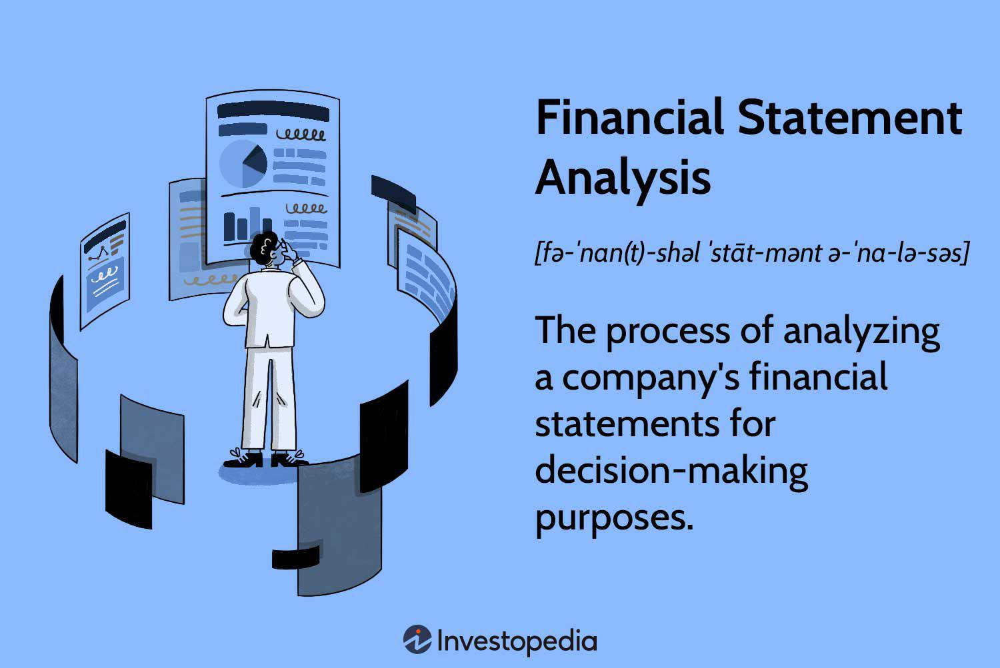

Financial reporting and analysis are fundamental to making informed investment decisions, significantly impacting the field of algorithmic trading. The ability to interpret and analyze financial statements is crucial for traders and investors striving for strategic success. Within this article, we examine the critical intersection of financial reporting, statement analysis, and algorithmic trading, emphasizing the importance of these elements in crafting effective trading strategies.

Financial statements such as the balance sheet, income statement, and cash flow statement provide an essential overview of a company's health and performance. Understanding these documents equips traders and investors with the knowledge to discern valuable insights that shape algorithmic trading strategies. These strategies typically rely on quantitative data derived from these statements, enabling the automation of trading decisions and enhancing the accuracy and reliability of trading systems.



Algorithmic trading leverages complex algorithms to execute trades based on specific, pre-programmed criteria. The accurate interpretation of financial statements is paramount to developing these criteria, ultimately influencing the success of algorithmic trading models. By enhancing financial literacy through thorough statement analysis, traders can optimize their trading methodologies and improve market performance through informed decision-making.

The objective of this article is to enhance financial literacy and optimize trading methodologies. By understanding the relationship between financial reporting and algorithmic trading, traders and investors can significantly improve their decision-making processes, leading to more successful investment outcomes. The continued advancement and adaptation to innovations in financial technologies remain essential for maintaining a competitive edge in the dynamic trading environment.

## Table of Contents

## Understanding Financial Statements

Financial statements are essential tools that offer key insights into a company’s financial health and performance. They are indispensable for investors, traders, and other stakeholders, as they form the bedrock for financial analysis and decision-making in trading environments. There are three primary types of financial statements that each serve a distinct purpose:

1. **Balance Sheets:** The balance sheet provides a snapshot of a company’s financial position at a specific point in time. It details the company’s assets, liabilities, and shareholders' equity, presenting a comprehensive picture of its financial status. Assets are classified as either current or non-current, reflecting their liquidity and time horizon for conversion into cash. Liabilities are similarly divided into current and long-term obligations. Shareholders' equity represents the residual interest in the company’s assets after deducting liabilities, and it encompasses contributed capital and retained earnings. The fundamental equation governing balance sheets is:
$$
   \text{Assets} = \text{Liabilities} + \text{Shareholders’ Equity}

$$

   This equation underscores the principle of financial equilibrium, indicating that a company's resources are funded either through liabilities or equity.

2. **Income Statements:** The income statement, also known as the profit and loss statement, provides insights into a company’s operational efficiency over a specific period. It details revenues, expenses, and profits, facilitating the understanding of how a company achieves its profitability. Key metrics derived from the income statement include gross profit, operating income, and net income. These metrics are crucial for assessing a company's ability to generate profit from its operations and manage its cost structure effectively.

3. **Cash Flow Statements:** The cash flow statement delineates the cash inflows and outflows from a company’s operating, investing, and financing activities over a period. It offers a detailed view of how a company generates and utilizes cash, highlighting its liquidity and financial flexibility. The cash flow from operating activities indicates the cash generated from day-to-day business operations, while investing and financing activities reflect long-term strategic financial actions. The ability to maintain positive cash flow is vital for a company’s sustainability and growth prospects.

These financial statements, when analyzed together, provide a holistic view of a company’s financial health and operational performance. Understanding the underlying connections between them is crucial for comprehensive financial analysis. For instance, the net income from the income statement impacts the shareholders' equity on the balance sheet and serves as a starting point for the cash flow from operating activities. Consequently, a thorough comprehension of these documents enables stakeholders to make informed investment and trading decisions efficiently.

## Types of Financial Statements

Financial statements are core components in assessing a company's financial health, each offering vital piece of information through different perspectives. 

The balance sheet serves as a financial statement that provides a snapshot of a company’s financial condition at a specific moment. It is structured into three major sections: assets, liabilities, and shareholders’ equity. Assets are everything a company owns, such as cash, inventory, and property. Liabilities are obligations the company must fulfill, including loans and accounts payable. Shareholders’ equity represents the residual interest in the company's assets after deducting liabilities. The balance sheet equation $\text{Assets} = \text{Liabilities} + \text{Shareholders' Equity}$ underscores the balance inherent in this document. This statement is pivotal in understanding the company's solvency and capital structure.

The income statement, often termed the profit and loss statement, details the company’s operational performance over a specific period, usually a quarter or a year. It presents information on revenues, expenses, and profits, allowing stakeholders to gauge the company’s profitability and operational efficiency. The fundamental structure involves subtracting total expenses from total revenues to derive net income, depicted by the equation $\text{Net Income} = \text{Revenues} - \text{Expenses}$. This statement is essential for analyzing how a company generates and manages earnings through its core operations.

The cash flow statement focuses on cash inflows and outflows within the business over a defined period. It is divided into three sections: operating, investing, and financing activities. Operating activities cover transactions related to the company’s core business operations. Investing activities involve cash flows from purchasing assets or investing in other businesses. Financing activities reflect changes in the company's capital structure, such as issuing stock or debt. The cash flow statement provides insights into the company's [liquidity](/wiki/liquidity-risk-premium) and cash management practices, crucial for understanding its ability to sustain operations and grow.

Each financial statement plays a distinct role in portraying various facets of a company's financial performance. A comprehensive analysis often involves examining these statements collectively to gain a holistic view of the company’s health and opportunities. The interconnections between these statements, such as linking net income from the income statement to operating activities in the cash flow statement, or understanding how the accruals on the balance sheet can impact both the income and cash flow statements, are essential for a thorough financial analysis. Such integration offers a multidimensional perspective necessary for informed decision-making in trading and investment contexts.

## Financial Statement Analysis Techniques

Financial statement analysis techniques, such as horizontal, vertical, and ratio analysis, provide structured methodologies for examining financial data. These techniques help analysts, traders, and investors extract meaningful interpretations and trends from financial statements, crucial for informed decision-making.

**Horizontal Analysis**

Horizontal analysis involves comparing financial data across different periods, typically on an annual or quarterly basis. The primary objective is to identify trends, growth patterns, and anomalies in financial performance over time. By calculating the percentage change for each item on the financial statement, analysts can determine whether a company's financial position is improving or deteriorating.

For example, suppose a company’s revenue for three consecutive years is $1,000, $1,200, and $1,300. The percentage increase from the first to the second year would be calculated as:

$$
\text{Percentage Change} = \left( \frac{\text{Current Year Revenue} - \text{Previous Year Revenue}}{\text{Previous Year Revenue}} \right) \times 100
$$

$$
= \left( \frac{1200 - 1000}{1000} \right) \times 100 = 20\%
$$

This form of analysis aids in identifying patterns that may forecast future financial outcomes, which is valuable in predicting stock performance and market trends.

**Vertical Analysis**

Vertical analysis involves assessing each item in a financial statement as a percentage of a base figure. For the income statement, this base is often total sales or revenue, while for the balance sheet, it could be total assets. This method facilitates the comparison of relative size and proportion of financial components within a single period, highlighting structural changes in financial compositions.

For instance, if total sales are $2,000 and the cost of goods sold (COGS) is $800, the vertical analysis would calculate COGS as a percentage of sales as follows:

$$
\text{COGS Percentage of Sales} = \left( \frac{\text{COGS}}{\text{Total Sales}} \right) \times 100
$$

$$
= \left( \frac{800}{2000} \right) \times 100 = 40\%
$$

Vertical analysis is particularly useful in comparing companies of different sizes or industry benchmarks.

**Ratio Analysis**

Ratio analysis involves calculating various financial ratios from financial statement data to assess a company’s performance across multiple dimensions, such as profitability, liquidity, and solvency. Common ratios include:

- **Profitability Ratios**: Such as the net profit margin, which is calculated as net income divided by total revenue. It indicates how efficiently a company transforms revenue into profit.

  \[ \text{Net Profit Margin} = \left( \frac{\text{Net Income}}{\text{Total Revenue}} \right) \times 100
$$

- **Liquidity Ratios**: For instance, the current ratio, which is the ratio of current assets to current liabilities, measuring a company’s ability to cover short-term obligations.

  \[ \text{Current Ratio} = \frac{\text{Current Assets}}{\text{Current Liabilities}}
$$

- **Solvency Ratios**: Like the debt-to-equity ratio, which compares a company’s total liabilities to its shareholder equity, indicating financial leverage.

  \[ \text{Debt-to-Equity Ratio} = \frac{\text{Total Liabilities}}{\text{Shareholders' Equity}}
$$

Ratio analysis offers a detailed and intricate view of a company’s financial health. These ratios are vital for developing trading strategies, allowing a deeper insight into a company’s operating performance and financial stability.

Together, these analytical techniques enable stakeholders to scrutinize financial documents effectively and derive actionable insights, facilitating more informed, data-driven investment decisions.

## Algorithmic Trading and Financial Statement Analysis

Algorithmic trading integrates the use of complex algorithms that automate trading decisions based on predefined criteria. This system relies heavily on the precise interpretation of financial statements to derive actionable insights. Financial statements, notably comprising income statements, balance sheets, and cash flow statements, contain critical data that can be transformed into [quantitative trading](/wiki/quantitative-trading) strategies through various analytical techniques. 

Financial ratios, such as the debt-to-equity ratio, net profit margin, and current ratio, serve as fundamental metrics in assessing a company’s financial health and operational efficiency. These ratios are crucial for constructing rules-based algorithms that can identify investment opportunities. For instance, the debt-to-equity ratio ($\text{Debt-to-Equity Ratio} = \frac{\text{Total Liabilities}}{\text{Shareholders' Equity}}$) can be programmed into an algorithm to filter out companies with excessive leverage, which may pose higher financial risk.

Incorporating financial statement analysis into algorithmic frameworks enhances decision-making by allowing algorithms to process vast quantities of financial data more efficiently than human analysts. This process involves translating qualitative data from financial reports into quantitative models that can swiftly adapt to market changes. For example, a trading algorithm might continuously monitor the net profit margin ($\text{Net Profit Margin} = \frac{\text{Net Income}}{\text{Total Revenue}} \times 100$) across multiple companies, automatically executing trades for those that consistently outperform industry benchmarks.

Moreover, advances in [machine learning](/wiki/machine-learning) and [artificial intelligence](/wiki/ai-artificial-intelligence) further enable the refinement of algorithmic strategies. By incorporating historical financial data, machine learning models can predict future performance and identify patterns that elude traditional analysis. These predictive capabilities are crucial for developing forward-looking trading systems that optimize returns while managing risk.

Enhanced financial literacy and a robust understanding of financial statement analysis can significantly improve the efficiency and outcomes of trading algorithms. As these automated systems become more sophisticated, they increasingly facilitate accurate, data-driven investment decisions, offering traders and investors a systematic approach to navigate complex financial markets effectively.

## Key Financial Ratios for Algorithmic Trading

Financial ratios are essential tools for assessing a company's financial health and are widely used in [algorithmic trading](/wiki/algorithmic-trading) to streamline investment strategies. They convert quantitative data from financial statements into insights that can trigger trading actions based on predefined criteria. Understanding these ratios is crucial for crafting algorithms that accurately reflect a company's financial status and potential market performance.

### Debt-to-Equity Ratio

The debt-to-equity ratio is a key measure of a company's financial leverage and risk. It is calculated as:

$$
\text{Debt-to-Equity Ratio} = \frac{\text{Total Liabilities}}{\text{Shareholders' Equity}}
$$

This ratio evaluates a company's ability to finance its operations with debt versus wholly-owned funds. A high ratio might suggest greater financial risk, which can affect an algorithm's decision to invest, while a lower ratio might indicate a more conservative funding structure, which could be seen as less risky.

### Net Profit Margin

Net profit margin assesses a company's profitability relative to its total revenue. It is determined using the formula:

$$
\text{Net Profit Margin} = \left( \frac{\text{Net Income}}{\text{Total Revenue}} \right) \times 100
$$

This ratio provides insights into operational efficiency and cost management. In algorithmic trading, a higher net profit margin might trigger buy signals as it indicates effective management and potentially strong future earnings prospects.

### Current Ratio

The current ratio measures a company's ability to meet its short-term obligations with its short-term assets. It is calculated as follows:

$$
\text{Current Ratio} = \frac{\text{Current Assets}}{\text{Current Liabilities}}
$$

A ratio above 1 suggests that the company can cover its short-term liabilities with its short-term assets, highlighting liquidity. This ratio is crucial in trading algorithms to ascertain a company's financial stability in the near term.

### Application in Algorithmic Trading

Incorporating these financial ratios into trading algorithms can significantly enhance decision-making accuracy and market performance. For instance, an algorithm might be programmed to execute trades only for companies with a debt-to-equity ratio below a certain threshold, ensuring investments in financially stable firms. Similarly, algorithms can filter companies with a net profit margin exceeding industry averages, pinpointing those with superior profitability.

### Example Python Code

Algorithmic traders might use Python to analyze and implement these ratios as follows:

```python
import pandas as pd

# Sample financial statement data
data = {
    'Company': ['A', 'B'],
    'Total Liabilities': [500000, 300000],
    'Shareholders Equity': [250000, 400000],
    'Net Income': [75000, 50000],
    'Total Revenue': [500000, 300000],
    'Current Assets': [300000, 350000],
    'Current Liabilities': [100000, 200000]
}

df = pd.DataFrame(data)

# Calculating ratios
df['Debt-to-Equity Ratio'] = df['Total Liabilities'] / df['Shareholders Equity']
df['Net Profit Margin'] = (df['Net Income'] / df['Total Revenue']) * 100
df['Current Ratio'] = df['Current Assets'] / df['Current Liabilities']

print(df[['Company', 'Debt-to-Equity Ratio', 'Net Profit Margin', 'Current Ratio']])
```

In this simplified example, the code calculates key financial ratios, which could form part of a larger algorithmic trading system filtering investment opportunities based on financial viability. By systematically analyzing these metrics, traders can construct more robust, data-driven trading strategies.

## Limitations and Considerations of Financial Statement Analysis

Financial statement analysis is an essential tool for investors and traders, yet it has several inherent limitations that must be considered to avoid misguided decisions. One primary limitation is that financial statements are historical documents, reflecting past performance rather than future prospects. They do not account for unexpected market dynamics or macroeconomic changes that can significantly impact a company's financial health and stock valuation. For instance, a company might report strong earnings, but an adverse shift in industry regulations or a market downturn could quickly alter its outlook.

Another critical limitation arises from the potential for inaccuracies or manipulations within the accounting practices. Financial statements depend heavily on subjective judgments and estimates by management. Manipulative practices, such as earnings management, can skew the real financial position of a company. Techniques like "earnings smoothing" or "big bath" accounting can distort profitability, making it difficult to assess a company's true performance and financial condition.

Furthermore, financial statement analysis often overlooks non-financial factors that can influence a company's success. These include brand reputation, customer satisfaction, innovation capacity, and management quality. Such qualitative aspects are not captured in quantitative financial reports but can have a substantial impact on a company's future growth and sustainability.

To mitigate these limitations, real-time data and advanced technologies like machine learning can be integrated into traditional financial analysis. Real-time data provide up-to-date insights that can capture market conditions and macroeconomic changes promptly. Machine learning algorithms can process vast amounts of heterogeneous data, identifying patterns and predicting future trends more effectively than conventional methods. Here's a basic Python example using machine learning to analyze financial data:

```python
from sklearn.model_selection import train_test_split
from sklearn.ensemble import RandomForestRegressor
import pandas as pd

# Load financial data from a CSV file
data = pd.read_csv('financial_data.csv')

# Features and target variable
X = data[['revenue', 'expenses', 'assets', 'liabilities']]
y = data['stock_price']

# Split the data into training and testing sets
X_train, X_test, y_train, y_test = train_test_split(X, y, test_size=0.2, random_state=42)

# Initialize the Random Forest model
model = RandomForestRegressor(n_estimators=100, random_state=42)

# Train the model
model.fit(X_train, y_train)

# Predict stock prices
predictions = model.predict(X_test)
```

By acknowledging these limitations and employing complementary analytical methods, traders can maintain robustness and flexibility in their investment strategies. This approach will enhance decision-making accuracy, allowing for more informed and strategic trading outcomes.

## Conclusion

The comprehensive analysis of financial reporting and statements serves as a foundational element in crafting informed investment and trading strategies. Financial statements, by offering a detailed view of a company's financial health, enable traders to develop strategies that account for a broad array of financial indicators. Their accurate interpretation, when integrated with algorithmic trading frameworks, facilitates optimized investment outcomes through data-driven decisions. The use of algorithms allows for systematic trading based on predefined criteria derived from financial data, thereby increasing efficiency and minimizing human error.

Staying abreast of ongoing advancements in financial technologies and methodologies is crucial for maintaining a competitive edge. The evolution of financial technologies, including big data analytics and machine learning, continues to transform the landscape of investment analysis. These tools enhance the precision with which financial data can be analyzed, helping to identify patterns and predict market movements more accurately than traditional methods. As these technologies evolve, continuous learning and adaptation are essential for traders and investors who wish to remain relevant and successful.

Understanding financial statements in depth is key to effectively developing and adapting trading algorithms in dynamic markets. This understanding involves not only knowledge of the components of financial statements—such as balance sheets, income statements, and cash flow statements—but also the ability to analyze and interpret these documents in the context of current market conditions. By leveraging this expertise, traders can refine their algorithms to respond to market fluctuations with greater agility and accuracy.

Through skilled analysis and application, traders and investors are well-positioned to significantly enhance their decision-making processes and overall performance. By embedding financial statement analysis within algorithmic trading systems, market participants can create a robust framework for evaluating investment opportunities. This approach fosters improved risk management and the identification of profitable trading signals, ultimately contributing to sustained success in the financial markets.

## References & Further Reading

[1]: Bergstra, J., Bardenet, R., Bengio, Y., & Kégl, B. (2011). ["Algorithms for Hyper-Parameter Optimization."](https://dl.acm.org/doi/10.5555/2986459.2986743) Advances in Neural Information Processing Systems 24.

[2]: ["Advances in Financial Machine Learning"](https://www.amazon.com/Advances-Financial-Machine-Learning-Marcos/dp/1119482089) by Marcos Lopez de Prado

[3]: ["Evidence-Based Technical Analysis: Applying the Scientific Method and Statistical Inference to Trading Signals"](https://www.amazon.com/Evidence-Based-Technical-Analysis-Scientific-Statistical/dp/0470008741) by David Aronson

[4]: ["Machine Learning for Algorithmic Trading"](https://github.com/stefan-jansen/machine-learning-for-trading) by Stefan Jansen

[5]: ["Quantitative Trading: How to Build Your Own Algorithmic Trading Business"](https://www.amazon.com/Quantitative-Trading-Build-Algorithmic-Business/dp/1119800064) by Ernest P. Chan