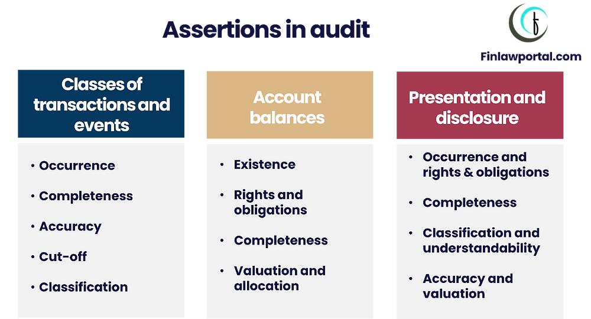

## Table of Contents

## What are financial statement assertions?

Financial statement assertions are claims made by a company's management about the accuracy and completeness of the information presented in their financial statements. These assertions help auditors understand what management is saying about the financial data, so they can check if it's true. Think of them as promises that the numbers and details in the financial reports are correct and reliable.

There are several types of assertions, but they generally fall into three main categories: assertions about transactions and events, assertions about account balances, and assertions about presentation and disclosure. For example, when management says that all sales for the year are included in the revenue figure, that's an assertion about transactions. If they claim that the cash balance shown is accurate, that's an assertion about account balances. And when they state that all necessary information is clearly shown in the financial statements, that's an assertion about presentation and disclosure.

Auditors use these assertions to plan their work and design tests to see if the financial statements are trustworthy. By checking these assertions, auditors can give an opinion on whether the financial statements fairly represent the company's financial position and performance. This process helps investors, creditors, and other stakeholders make informed decisions based on reliable financial information.

## Why are financial statement assertions important in auditing?

Financial statement assertions are important in auditing because they help auditors understand what the company's management is saying about their financial data. When management puts together financial statements, they are making claims, or assertions, that the information is correct and complete. Auditors need to check these claims to make sure the financial statements are reliable. This helps everyone who uses the financial statements, like investors and creditors, trust the information and make good decisions.

Auditors use these assertions to plan their work and decide what tests to do. For example, if management says all sales are included in the revenue figure, auditors will check to see if that's true. By testing these assertions, auditors can give their opinion on whether the financial statements show a true picture of the company's financial health. This process is crucial because it adds credibility to the financial statements, helping to maintain trust in the financial markets.

## Can you list the main types of financial statement assertions?

Financial statement assertions are the claims that a company's management makes about the information in their financial reports. These claims help auditors understand what the company is saying about their numbers and details. There are three main types of assertions: assertions about transactions and events, assertions about account balances, and assertions about presentation and disclosure.

Assertions about transactions and events are claims that all the business activities that happened during the year are included and recorded correctly in the financial statements. For example, this includes making sure all sales and purchases are listed and that they happened at the right times. Assertions about account balances focus on the amounts shown in the financial statements at the end of the year, like making sure the cash balance or the amount of debt is correct.

Assertions about presentation and disclosure deal with how the information is shown and explained in the financial statements. This means making sure all the important details are clearly presented and that the financial statements follow the rules for how they should be made. These three types of assertions help auditors check if the financial statements are trustworthy and reliable.

## How do assertions relate to the different components of financial statements?

Assertions relate to the different components of financial statements by making sure that each part of the statements is accurate and complete. For example, when we look at the income statement, which shows a company's revenues and expenses, assertions about transactions and events are important. These assertions say that all the sales and costs that happened during the year are included and recorded at the right times. This helps make sure the income statement gives a true picture of how the company did financially over the year.

The balance sheet, which shows what a company owns and owes at a specific time, relies on assertions about account balances. These assertions claim that the amounts listed for things like cash, inventory, and debt are correct. This helps ensure that the balance sheet accurately shows the company's financial position at the end of the year. 

Lastly, the notes to the financial statements, which provide more details and explanations, depend on assertions about presentation and disclosure. These assertions make sure that all important information is clearly shown and that the financial statements follow the rules for how they should be made. This helps everyone who reads the financial statements understand them better and trust the information.

## What is the difference between existence and completeness assertions?

The existence assertion is about making sure that the things a company says it has are real. For example, if a company says it has a certain amount of cash, the existence assertion checks that the cash is really there. It's like saying, "Yes, this thing exists, and it's not made up." This is important because it helps make sure the company isn't lying about what it owns or owes.

The completeness assertion is different because it's about making sure that the company has included everything it should in its financial statements. For example, if the company made some sales during the year, the completeness assertion checks that all those sales are included in the revenue number. It's like saying, "We've got everything here, nothing is missing." This helps make sure the financial statements show the full picture of the company's activities.

## How are financial statement assertions tested during an audit?

During an audit, auditors test financial statement assertions to make sure the company's numbers and details are correct. They do this by looking at different pieces of evidence. For example, to test the existence assertion, auditors might count the company's cash or check that the inventory listed in the financial statements is really there. They might also look at bank statements or other documents to make sure the assets and liabilities the company says it has are real. This helps them confirm that the company isn't making up what it owns or owes.

For the completeness assertion, auditors check to see if the company has included everything it should in its financial statements. They might look at sales records to make sure all sales are listed in the revenue number, or they might check invoices and receipts to make sure all expenses are included. This helps them make sure nothing important is left out. By testing these assertions, auditors can give their opinion on whether the financial statements give a true and fair view of the company's financial health.

## What role do management assertions play in the preparation of financial statements?

Management assertions are really important when a company is putting together its financial statements. They are like promises that the numbers and details in the financial reports are correct and complete. When management says that all sales are included in the revenue figure or that the cash balance is right, they are making these assertions. These claims help everyone who uses the financial statements, like investors and creditors, trust the information and make good decisions.

Auditors use these management assertions to check if the financial statements are reliable. They test these assertions by looking at different pieces of evidence, like bank statements or sales records, to make sure what management is saying is true. By doing this, auditors can give their opinion on whether the financial statements show a true picture of the company's financial health. This process helps keep the financial markets trustworthy and makes sure everyone has reliable information to work with.

## Can you explain the assertion of rights and obligations with an example?

The assertion of rights and obligations is about making sure that a company really owns the things it says it owns and owes the things it says it owes. It's like saying, "Yes, we have the right to these assets, and yes, we are responsible for these liabilities." This helps make sure the financial statements are honest about what the company controls and what it needs to pay back.

For example, imagine a company says it has a big building in its financial statements. The assertion of rights and obligations would check that the company actually owns that building and has the legal right to use it. If the company also says it has a big loan, this assertion would make sure the company really owes that money and is responsible for paying it back. By checking these things, auditors can make sure the financial statements are telling the truth about what the company owns and owes.

## How do valuation and allocation assertions affect the financial statements?

Valuation and allocation assertions are about making sure that the numbers in the financial statements are the right amounts. When a company says how much its inventory or its buildings are worth, these assertions check that those values are correct. They also make sure that costs and revenues are split up the right way among different parts of the financial statements. This helps make sure that the financial statements show a true picture of how much things are worth and how money is being used.

If these assertions are wrong, it can mess up the whole financial statement. For example, if a company says its inventory is worth more than it really is, it might look like the company is doing better than it actually is. Or if costs are not split up correctly, it might make some parts of the business look more profitable than they are. By checking these assertions, auditors help make sure that everyone who looks at the financial statements can trust the numbers and make good decisions based on them.

## What challenges might auditors face when testing presentation and disclosure assertions?

Auditors might face a lot of challenges when they are checking the presentation and disclosure assertions in financial statements. One big challenge is making sure that all the important information is clearly shown and easy to understand. Companies have to follow a lot of rules about how they present their financial statements, and it can be hard for auditors to check that everything is done right. They have to read through a lot of notes and details to make sure nothing important is left out or hidden.

Another challenge is keeping up with changes in rules and standards. These rules can change often, and auditors need to know the latest ones to make sure the company is following them. This can be a lot of work, especially if the company operates in different countries with different rules. Also, auditors have to use their judgment a lot when checking these assertions. They need to decide if the way the company explains things in its financial statements makes sense and is fair. This can be tricky because different people might see things differently.

## How have financial statement assertions evolved with changes in accounting standards?

Financial statement assertions have changed over time as accounting standards have been updated. When new rules come out, they often change how companies need to show their numbers and details in their financial statements. For example, new rules might say that companies need to give more information about certain things, like how they value their inventory or what risks they face. This means that auditors have to check new kinds of assertions to make sure the financial statements follow these new rules.

Even though the basic ideas behind assertions, like making sure things are real and complete, stay the same, the way auditors check them can change. New accounting standards might focus more on things like fair value or how companies explain their financial health. Auditors have to keep up with these changes and adjust their tests to make sure they are still doing a good job of checking the financial statements. This helps keep the financial information reliable and trustworthy, even as the rules change.

## What advanced techniques can be used to enhance the testing of financial statement assertions?

To make the testing of financial statement assertions better, auditors can use advanced techniques like data analytics. Data analytics means using computer programs to look at a lot of information quickly. For example, auditors can use these programs to check all the sales records in a year to see if they are complete and correct. This helps them find any mistakes or missing information that might be hard to spot by just looking at a few records. It's like using a powerful magnifying glass to see everything more clearly.

Another technique is using computer-assisted audit techniques (CAATs). These tools help auditors check the numbers and details in the financial statements in new ways. For example, they can use CAATs to test if the company's inventory values are right by comparing them to market prices. This helps make sure the numbers are not just made up but are based on real information. By using these advanced techniques, auditors can do a better job of checking the financial statements and making sure they are reliable.

## What is the key to understanding financial statements?

Financial statements are fundamental documents that provide stakeholders, including investors, creditors, and management, with critical information about a company's financial health. These documents encompass three primary components: balance sheets, income statements, and cash flow statements, each serving a unique purpose and offering different insights into a company's operations.

**Balance Sheets** present a snapshot of a company’s financial position at a specific point in time. It details assets, liabilities, and shareholders' equity, allowing stakeholders to assess what the company owns versus what it owes. The formula central to the balance sheet is:

$$
\text{Assets} = \text{Liabilities} + \text{Shareholders' Equity}
$$

Understanding the balance sheet helps stakeholders evaluate the company’s capital structure and [liquidity](/wiki/liquidity-risk-premium), which is crucial for both short-term and long-term financial planning.

**Income Statements**, often referred to as profit and loss statements, demonstrate a company’s financial performance over a specific period. This statement outlines revenues, expenses, and profits or losses, providing a clear picture of operational efficiency and profitability. It answers how well a company converts revenues into profits, highlighted by net income, which is calculated as follows:

$$
\text{Net Income} = \text{Total Revenue} - \text{Total Expenses}
$$

For [algorithmic trading](/wiki/algorithmic-trading) models, income statements indicate trends in profitability and operational success, essential for determining investment viability.

**Cash Flow Statements** report the actual movement of cash in and out of a business, categorized into operating, investing, and financing activities. Unlike the income statement, which includes non-cash items, the cash flow statement provides a realistic picture of the cash available, reflecting the company’s liquidity position. This is critical for issues such as meeting short-term liabilities. The basic structure is:

$$
\text{Net Cash Flow} = \text{Cash Flow from Operating Activities} + \text{Cash Flow from Investing Activities} + \text{Cash Flow from Financing Activities}
$$

The accuracy of these reports is paramount for stakeholders making informed decisions. Financial statements offer transparency and act as the foundation for constructing algorithmic trading models by providing the historical and current data required for developing trading strategies. Accurate financial data is vital for algorithms that depend on predictive analytics to identify patterns and execute trades.

Algorithmic trading systems ingest these data points to assess market conditions and predict future price movements, making it imperative that the underlying data is reliable and timely. Thus, maintaining accuracy in financial reporting is not only important for company stakeholders but is also a critical component in the design and success of trading algorithms.

## References & Further Reading

[1]: Berger, A., & Bouwman, C. (2009). ["Bank Liquidity Creation."](https://www.sciencedirect.com/science/article/pii/S1572308917303017) Journal of Financial Intermediation, 19(4), 418-437.

[2]: Lopez de Prado, M. (2018). ["Advances in Financial Machine Learning"](https://www.amazon.com/Advances-Financial-Machine-Learning-Marcos/dp/1119482089). Wiley.

[3]: Boudoukh, J., Richardson, M., & Whitelaw, R. F. (1998). ["The best of both worlds: A hybrid approach to measuring value at risk."](https://www.semanticscholar.org/paper/The-Best-of-Both-Worlds%3A-A-Hybrid-Approach-to-Value-Richardson-Boudoukh/011e7528076872c33cac43056e4da04c2efac8f0) Journal of Financial Economics, 62(1), 57-82.

[4]: Chan, E. P. (2009). ["Quantitative Trading: How to Build Your Own Algorithmic Trading Business"](https://github.com/ftvision/quant_trading_echan_book). Wiley.

[5]: Jansen, S. (2020). ["Machine Learning for Algorithmic Trading"](https://github.com/stefan-jansen/machine-learning-for-trading). Packt Publishing.

[6]: Aronson, D. (2006). ["Evidence-Based Technical Analysis: Applying the Scientific Method and Statistical Inference to Trading Signals"](https://www.wiley.com/en-us/Evidence+Based+Technical+Analysis%3A+Applying+the+Scientific+Method+and+Statistical+Inference+to+Trading+Signals-p-9780470008744). Wiley.

[7]: Fama, E. F., & French, K. R. (2004). ["The Capital Asset Pricing Model: Theory and Evidence."](https://www.aeaweb.org/articles?id=10.1257/0895330042162430) Journal of Economic Perspectives, 18(3), 25-46.