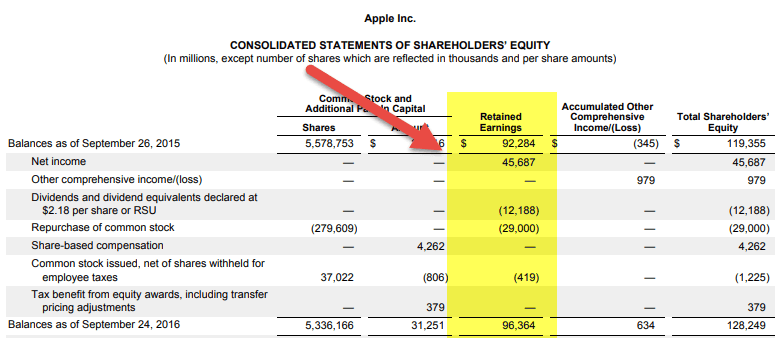

## Table of Contents

## What is a financial statement?

A financial statement is a document that shows a company's financial health. It includes information about how much money the company has, how much it owes, and how it has been spending its money. These statements are important because they help people like investors, managers, and creditors understand if the company is doing well or if it needs to make changes.

There are three main types of financial statements: the balance sheet, the income statement, and the cash flow statement. The balance sheet shows what the company owns and what it owes at a specific time. The income statement shows how much money the company made and spent over a period of time. The cash flow statement shows how money moves in and out of the company. Together, these statements give a full picture of the company's financial situation.

## What are retained earnings?

Retained earnings are the amount of money a company keeps after it pays out dividends to its shareholders. It's like the savings account of a business. When a company makes a profit, it can choose to either give some of that money back to the shareholders as dividends or keep it within the company. The money that stays in the company becomes part of the retained earnings.

These earnings are important because they show how much money the company has available to reinvest in the business, pay off debts, or save for future use. You can find the retained earnings on the balance sheet, which is one of the main financial statements. The balance sheet shows what the company owns and owes, and the retained earnings are part of the equity section, which represents the owners' stake in the company.

## How are retained earnings calculated?

Retained earnings are calculated by starting with the retained earnings from the beginning of the year, then adding the net income the company made during the year, and finally subtracting any dividends the company paid out to shareholders. It's like keeping track of your savings. If you start the year with some money saved, earn more money during the year, and then take some out to spend, what's left is your new savings amount.

The formula for calculating retained earnings is simple: Beginning Retained Earnings + Net Income - Dividends = Ending Retained Earnings. This calculation helps show how the company's profits are being used. If a company decides to keep more of its profits instead of paying them out as dividends, the retained earnings will grow. This can be a sign that the company is planning to reinvest in itself to grow bigger or improve its operations.

## Why are retained earnings important in financial statements?

Retained earnings are important in financial statements because they show how much profit a company has kept over time. When a company makes money, it can either give some of that money back to its owners as dividends or keep it in the business. The money that stays in the business is called retained earnings. This number tells people who look at the financial statements, like investors or managers, how much money the company has to use for things like growing the business, paying off debts, or saving for the future.

Looking at retained earnings also helps people understand how a company is doing over time. If the retained earnings are going up, it usually means the company is doing well and keeping more of its profits. If they are going down, it might mean the company is paying out a lot in dividends or not making as much profit. This information is really helpful for making decisions about whether to invest in the company or how to manage it better.

## What is the difference between retained earnings and net income?

Retained earnings and net income are two important numbers in a company's financial statements, but they show different things. Net income is the money a company makes after it pays for all its expenses during a specific time, like a year. It's the profit the company has left over after everything is paid for. If a company sells a lot of products and doesn't spend too much on things like rent or salaries, it will have a high net income.

Retained earnings, on the other hand, are what's left of the net income after the company pays out dividends to its owners or shareholders. It's like the company's savings account. If a company makes a profit (net income) and decides to keep some of that money instead of giving it all back to the owners, that money becomes part of the retained earnings. Over time, retained earnings can grow if the company keeps making profits and not paying out all of it as dividends. This money can be used for things like expanding the business or saving for future needs.

## How do dividends affect retained earnings?

Dividends are payments a company makes to its owners or shareholders from its profits. When a company decides to pay dividends, it takes money out of its net income. This means that the more dividends a company pays, the less money it has left to add to its retained earnings. Retained earnings are like the company's savings account, so paying dividends reduces the amount of money the company can save or reinvest in the business.

If a company has a lot of net income but decides to pay out big dividends, its retained earnings will not grow as much. For example, if a company makes $100 in profit and pays out $30 in dividends, it will only add $70 to its retained earnings. On the other hand, if the company decides to keep all its profits and not pay any dividends, all of the net income will go into retained earnings, helping the company save more money for future use or growth.

## Can retained earnings be negative, and what does that indicate?

Yes, retained earnings can be negative. This happens when a company loses more money than it makes over time and keeps those losses instead of paying them out. If a company keeps losing money and doesn't have enough profits to cover those losses, the retained earnings will go below zero. This is called an accumulated deficit.

A negative retained earnings, or accumulated deficit, shows that the company has been struggling financially. It means the company has not been able to make enough profit to cover its losses and keep some money in the business. This can be a warning sign for investors and managers that the company might need to make big changes to start making money again.

## How do companies use retained earnings for reinvestment?

Companies use retained earnings to reinvest in their business by spending the money on things that can help them grow or work better. This can mean buying new equipment, like machines that help make their products faster or better. It can also mean opening new stores or offices in different places, so they can reach more customers. Sometimes, companies use retained earnings to pay for research and development, which means trying to come up with new products or ways of doing things that could make them more successful in the future.

Another way companies use retained earnings is to pay off debts. If a company owes money to a bank or other lenders, using retained earnings to pay down those debts can help the company save money on interest and improve its financial health. This can make the company stronger and more able to take on new projects or investments. By using retained earnings wisely, a company can set itself up for long-term success and growth.

## What are the accounting standards governing the reporting of retained earnings?

The reporting of retained earnings is governed by accounting standards like Generally Accepted Accounting Principles (GAAP) in the United States and International Financial Reporting Standards (IFRS) used globally. These standards make sure that companies report their retained earnings in a clear and consistent way. GAAP and IFRS both say that retained earnings should be shown on the balance sheet under the equity section. This helps everyone looking at the financial statements understand how much money the company has kept over time.

Both GAAP and IFRS also say that companies need to explain any big changes in retained earnings. This means if a company decides to pay big dividends or if it has a big loss, it should tell people about it in the notes to the financial statements. This helps investors and other people understand why the retained earnings number might be going up or down. By following these standards, companies make sure their financial reports are honest and easy to understand.

## How do changes in accounting policies impact retained earnings?

Changes in accounting policies can affect retained earnings because they change how a company records its income and expenses. If a company decides to use a new way of accounting, it might have to go back and change the numbers from past years. This can make the net income for those years different, which means the retained earnings will also change. For example, if a new policy makes the company's expenses look smaller, the net income will be higher, and so will the retained earnings.

When a company changes its accounting policies, it has to tell everyone about it in its financial statements. This is important because it helps people understand why the retained earnings number might be different from what they expected. The company will explain the change and show how it affected the retained earnings. This way, investors and others can still trust the financial statements and make good decisions based on them.

## What are some advanced strategies for managing retained earnings?

One advanced strategy for managing retained earnings is to use them to buy back company shares. When a company buys back its own shares, it can increase the value of the remaining shares because there are fewer shares available. This can make the company more attractive to investors. By using retained earnings for this, the company doesn't have to borrow money or use other funds, which keeps the company's financial health strong. It's like using your savings to make a smart investment that could pay off in the future.

Another strategy is to use retained earnings to fund mergers and acquisitions. If a company wants to grow by buying another company, it can use its retained earnings to pay for it. This can help the company expand quickly without taking on a lot of debt. It's important for the company to choose the right target to buy, one that will add value to the business. By using retained earnings wisely in this way, the company can grow bigger and stronger, setting itself up for long-term success.

## How do analysts use retained earnings to assess a company's financial health?

Analysts use retained earnings to see how well a company is doing over time. They look at the retained earnings on the balance sheet to understand how much profit the company has kept instead of giving it back to shareholders as dividends. If the retained earnings are growing, it means the company is making more money than it's spending and choosing to save or reinvest that money. This is a good sign because it shows the company is healthy and has money to use for things like growing the business or paying off debts.

On the other hand, if the retained earnings are shrinking or negative, it can be a warning sign. A decrease in retained earnings might mean the company is paying out a lot in dividends or not making enough profit to cover its costs. A negative retained earnings, or an accumulated deficit, shows that the company has been losing money over time. Analysts will look closely at this to figure out why it's happening and what the company needs to do to turn things around. By looking at retained earnings, analysts get a clear picture of the company's financial health and can make better decisions about investing in it.

## What is Understanding Retained Earnings?

Retained earnings represent the portion of a company's net income that is retained within the organization rather than distributed to shareholders as dividends. This retained profit is crucial for several reasons, primarily due to its role in facilitating reinvestment strategies and improving a company's ability to repay outstanding debt. Retained earnings are duly recorded on the balance sheet, where they are considered a key indicator of a company's financial health and its capacity for future growth.

The calculation of retained earnings can be defined using the following formula:

$$
\text{Retained Earnings} = \text{Beginning Retained Earnings} + \text{Net Income} - \text{Dividends Paid}
$$

Here, "Beginning Retained Earnings" refers to the retained earnings balance at the start of the financial period, "Net Income" is the profit after all expenses and taxes for the period have been accounted for, and "Dividends Paid" are the distributions made to shareholders. This mathematical representation underscores the significance of retained earnings as a dynamic component influenced by the company's profitability and its dividend policy.

The importance of retained earnings lies in their potential for fostering company growth and maximizing shareholder value. Retained earnings can be utilized for a variety of strategic financial maneuvers, including investment in new projects, research and development, acquisition of new assets, or even mergers and acquisitions. By reinvesting retained earnings into productive ventures, a company can enhance its operational capabilities and sustainability, potentially leading to increased revenues and profits.

Moreover, robust retained earnings can signal to investors a well-managed and financially stable company, possibly leading to enhanced investor confidence and higher stock valuations. Conversely, persistently low retained earnings might indicate issues such as inadequate profits or excessive dividend payouts, which could necessitate closer examination by investors and stakeholders.

Understanding the dynamics of retained earnings is pivotal for assessing a company's growth prospects and financial strategies. As companies strategize to balance reinvestment with shareholder returns, retained earnings continue to serve as a cornerstone of prudent financial management and long-term value creation.

## What is the role of financial statements?

Financial statements are essential documents that provide a comprehensive overview of a company's financial health and operational efficiency. These reports are crucial for investors, analysts, and traders as they offer insights into a company’s economic activities over a specified period. The three primary financial statements are the balance sheet, income statement, and cash flow statement.

### Balance Sheet

The balance sheet presents a snapshot of a company's financial position at a specific moment in time. It is structured around the fundamental accounting equation:

$$
\text{Assets} = \text{Liabilities} + \text{Equity}
$$

- **Assets**: Resources owned by the company, which can be current (e.g., cash, inventory) or non-current (e.g., property, equipment).
- **Liabilities**: Obligations the company owes to external parties, categorized as current (e.g., accounts payable) or long-term (e.g., bonds payable).
- **Equity**: Represents the residual interest in the assets of the company after deducting liabilities, comprising common stock, retained earnings, and additional paid-in capital.

The balance sheet is vital for assessing a firm's [liquidity](/wiki/liquidity-risk-premium), financial leverage, and capital structure.

### Income Statement

The income statement, or profit and loss statement, outlines the company’s financial performance over a reporting period. It primarily focuses on revenues and expenses, leading to the net profit or loss:

$$
\text{Net Income} = \text{Total Revenue} - \text{Total Expenses}
$$

- **Revenue**: The income generated from normal business operations.
- **Cost of Goods Sold (COGS)**: Direct costs attributable to the production of goods sold.
- **Operating Expenses**: Include selling, general, and administrative expenses.
- **Net Income**: Also known as the bottom line, it indicates the company's total earnings or profit.

This statement is integral for evaluating a company's profitability, operational efficiency, and growth prospects.

### Cash Flow Statement

The cash flow statement details the inflows and outflows of cash within a company during a reporting period, categorized into:

- **Operating Activities**: Cash flows from primary business activities. Positive cash flow indicates that the company generates sufficient cash to maintain or grow operations.
- **Investing Activities**: Transactions for the purchase and sale of assets. This section reflects capital expenditure and investment returns.
- **Financing Activities**: Flows involving debt, equity, and dividends. Indicates how a company finances its operations and growth through debt or equity.

The cash flow statement is critical for understanding a company's liquidity position, solvency, and financial flexibility.

### Comprehensive Understanding

Together, these financial statements offer a robust framework for analyzing a company’s financial performance and position. They assist stakeholders in making informed decisions regarding investment, credit evaluation, and resource allocation. Understanding these statements is essential for assessing the operational efficiency and financial stability of a company, which in turn facilitates strategic investment decisions. References for further reading include academic journals on corporate finance and accounting textbooks that delve into advanced financial statement analysis techniques.

## How do you interpret retained earnings in financial statements?

Retained earnings, a critical component of shareholders' equity, are recorded on a company’s balance sheet. They represent the cumulative amount of net income that a company has decided to reinvest in its operations rather than distributing as dividends to shareholders. In financial statements, retained earnings are often found under the equity section, showcasing the portion of profit held for reinvestment, debt repayment, or future growth opportunities. 

The calculation of retained earnings is relatively straightforward, using the formula: 

$$

\text{Retained Earnings} = \text{Beginning Retained Earnings} + \text{Net Income} - \text{Dividends Paid} 
$$

Analyzing trends in retained earnings provides investors and financial analysts with insights into a company's ability to generate profits and allocate them efficiently. A consistent increase in retained earnings indicates the company is reinvesting its profits wisely, potentially boosting shareholder value through growth initiatives and enhanced profitability. Conversely, a decreasing trend might signal financial challenges or overly generous dividend policies, potentially hampering long-term growth prospects.

To assess a company's growth prospects and reinvestment strategies, it is essential to examine retained earnings trends alongside other financial metrics. For example, a company with increasing retained earnings and simultaneous capital investments may suggest that it is poised for expansion, leveraging internal profits to finance new projects or ventures. Consistent growth in retained earnings could also imply effective cost management and revenue growth, reinforcing operational efficiency.

Companies strategically utilize retained earnings in various ways to bolster their market position. For instance, tech companies often reinvest a substantial portion of retained earnings into research and development to innovate and maintain competitive edges. On the other hand, a manufacturing firm might use retained earnings to upgrade machinery, enhancing production capabilities and operational efficiency, which can lead to increased market share and profitability.

Alternatively, companies might allocate retained earnings for shareholder returns. For example, organizations might choose stock buybacks, reducing the number of shares outstanding and potentially increasing the value of remaining shares. This strategy can be particularly beneficial for mature companies seeking to maximize shareholder value without the need for aggressive expansion.

In summary, retained earnings are more than just an accounting figure; they are a strategic financial tool that reveals much about a company's past decisions and future potential. By understanding and interpreting these earnings in financial statements, investors and analysts can make more informed decisions regarding equity and investment opportunities.

## References & Further Reading

#