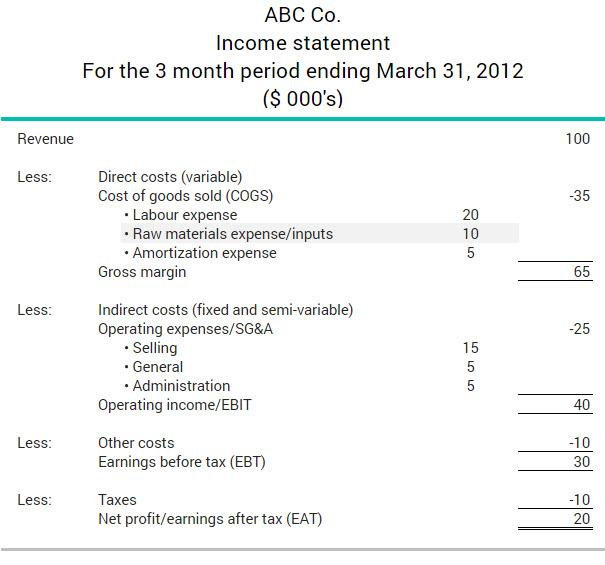

## Table of Contents

## What are raw materials in the context of business operations?

Raw materials are the basic substances used to make products in a business. They are the starting point for manufacturing and are essential for creating finished goods. For example, in a car factory, steel and rubber are raw materials that are used to build cars. Raw materials can be natural resources like wood, oil, or cotton, or they can be processed materials like chemicals or plastics that are bought from suppliers.

Managing raw materials is important for businesses because it affects their costs and ability to produce goods on time. If a company does not have enough raw materials, it might have to stop production, which can lead to delays and lost sales. On the other hand, having too many raw materials can be expensive because they take up space and might go bad or become outdated. Businesses need to carefully plan how much raw material to buy and when to buy it to keep their operations running smoothly.

## Why is it important to track raw material costs in financial statements?

Tracking raw material costs in financial statements is important because it helps businesses understand how much money they are spending to make their products. By keeping an eye on these costs, a company can figure out if they are paying too much for their raw materials. This can help them find ways to save money, maybe by finding a cheaper supplier or using less material. If a business doesn't track these costs, they might end up spending more than they need to, which can hurt their profits.

Also, tracking raw material costs is important for making good financial plans and setting prices for products. When a company knows exactly how much it costs to make something, they can set a price that covers those costs and still makes a profit. This information is also useful for investors and lenders who want to see if the business is managing its money well. If raw material costs go up a lot, the company might need to change its plans or find new ways to keep costs down.

## How are raw material costs typically categorized in financial statements?

Raw material costs are usually shown in the financial statements under the category of "Cost of Goods Sold" (COGS). This section includes all the costs that go into making a product, like the raw materials, labor, and other direct costs. By putting raw material costs here, businesses can see how much it costs them to make their products and how that affects their profits.

Sometimes, raw materials that are not yet used in production are listed as "Inventory" on the balance sheet. This shows how much money the company has tied up in raw materials that are waiting to be turned into products. Keeping track of this helps businesses make sure they have enough materials to keep making things without spending too much money on stuff they don't need right away.

## What is the difference between direct and indirect raw material costs?

Direct raw material costs are the costs of materials that go straight into making a product. For example, if you're making a wooden chair, the wood and nails you use are direct raw materials. These costs are easy to track because you can see exactly how much of each material goes into each product. Businesses need to keep a close eye on direct raw material costs because they make up a big part of what it costs to make things.

Indirect raw material costs are a bit different. These are costs for materials that help with making products but don't go directly into them. For example, the oil used to keep machines running smoothly or the cleaning supplies used in the factory are indirect raw materials. These costs are harder to track because they are spread out over many products and are not as easy to link to one specific item. Even though they might seem small, indirect costs can add up and affect the overall cost of production.

## How do you calculate the cost of raw materials used in production?

To calculate the cost of raw materials used in production, you start with the beginning inventory of raw materials. This is the value of all the raw materials you had at the start of the period. Then, you add the cost of any new raw materials you bought during that time. This gives you the total raw materials available for use. Next, you subtract the ending inventory of raw materials, which is the value of the raw materials you have left at the end of the period. The difference between the total raw materials available and the ending inventory is the cost of the raw materials you actually used in production.

For example, if you started with $10,000 worth of raw materials and bought an additional $5,000 during the period, you had $15,000 worth of raw materials available. If at the end of the period you had $3,000 worth of raw materials left, then you used $12,000 worth of raw materials in production. This simple calculation helps businesses keep track of how much they are spending on materials to make their products, which is important for managing costs and planning for the future.

## What accounting methods are used to record raw material costs?

The main accounting methods used to record raw material costs are the FIFO (First-In, First-Out) method and the LIFO (Last-In, First-Out) method. In the FIFO method, the first raw materials bought are the first ones used in production. This means the cost of the oldest inventory is used to calculate the cost of goods sold. This method is good when prices are going up because it keeps the cost of goods sold lower, which can make profits look better. On the other hand, the LIFO method uses the cost of the most recent raw materials bought for the cost of goods sold. This method is useful when prices are rising because it matches current costs with current revenues, giving a better picture of how much it costs to make things now.

Another method is the weighted average cost method. This method calculates the average cost of all the raw materials available during a period and uses this average to figure out the cost of goods sold. This method smooths out price changes over time and can be easier to use because it doesn't require keeping track of each batch of materials separately. Each of these methods has its own advantages and is chosen based on what makes the most sense for the business and how it wants to show its financial performance.

## How can fluctuations in raw material costs impact a company's financial health?

Fluctuations in raw material costs can have a big impact on a company's financial health. When the cost of raw materials goes up, it can make it more expensive for a company to make its products. If the company can't raise its prices to cover these higher costs, its profits will go down. This can make it harder for the company to pay its bills and might even lead to losses. Also, if raw material costs are unpredictable, it can be tough for a company to plan its budget and make good financial decisions.

On the other hand, if raw material costs go down, it can be good for a company's financial health. Lower costs mean the company can make its products for less money, which can lead to higher profits if it keeps its prices the same. But, if the company's competitors also see their raw material costs go down, they might lower their prices to try to get more customers. This could force the company to lower its prices too, which might mean it doesn't see as much benefit from the lower costs. Either way, managing raw material costs is important for keeping a company financially healthy.

## What are some common strategies for managing raw material costs effectively?

One common strategy for managing raw material costs effectively is to build strong relationships with suppliers. By working closely with them, a company can often get better prices or discounts on large orders. It's also a good idea to have more than one supplier, so if one can't deliver, the company can still get the materials it needs from another. This can help keep costs down and make sure production keeps going smoothly.

Another strategy is to use raw materials more efficiently. This means finding ways to use less material to make the same product, like by redesigning it or improving the manufacturing process. Companies can also look into using different materials that are cheaper but still work well. This can help save money without hurting the quality of the product.

Finally, keeping a close eye on the market and planning ahead is important. If a company knows that the price of a certain raw material might go up, it can buy more of it when it's still cheap. This is called forward buying. Also, using financial tools like hedging can help protect against big price changes. By planning and being ready for changes, a company can manage its raw material costs better and stay financially healthy.

## How do raw material costs affect the pricing of finished goods?

Raw material costs play a big role in deciding how much a company charges for its finished goods. When the cost of raw materials goes up, it costs more to make the product. If a company wants to keep making the same amount of profit, it might have to raise the price of its finished goods. But, if the company raises prices too much, customers might not want to buy the product anymore. So, the company has to find a balance between covering the higher raw material costs and keeping the price attractive to customers.

On the other hand, if raw material costs go down, a company can make its products for less money. This gives the company a few choices. It can keep the price the same and make more profit, or it can lower the price to try to sell more products and gain more customers. Sometimes, if competitors also have lower raw material costs, they might lower their prices too. This can lead to a price war where companies try to outdo each other with lower prices. In the end, raw material costs are a key [factor](/wiki/factor-investing) that companies have to think about when setting the price of their finished goods.

## What role do raw material costs play in inventory valuation?

Raw material costs are really important when it comes to figuring out how much a company's inventory is worth. When a business buys raw materials, it adds them to its inventory at the cost it paid for them. This cost is used to value the inventory on the balance sheet. If the cost of raw materials changes, it can change the value of the inventory too. For example, if the price of steel goes up, the value of the steel in the inventory will go up as well. This is important because the value of the inventory affects the company's total assets and its financial health.

There are different ways to value inventory based on raw material costs, like FIFO, LIFO, and the weighted average cost method. Each method can give a different value for the inventory depending on how it tracks the costs of the raw materials. For instance, with FIFO, the oldest costs are used first, which can be good when prices are going up. With LIFO, the newest costs are used first, which can help match current costs with current revenues. The choice of method can affect how much profit a company shows and how it plans for the future. Understanding and managing raw material costs is key to getting inventory valuation right.

## How can advanced analytics be used to forecast raw material cost trends?

Advanced analytics can help businesses predict how raw material costs might change in the future. By using big data and special computer programs, companies can look at a lot of information from the past to find patterns. For example, they might see that the price of oil goes up every summer because more people are driving. With this information, businesses can use math models to guess what will happen next. This can help them plan better and maybe buy raw materials when they are cheaper.

Using advanced analytics also means looking at things that might affect raw material costs, like the weather, politics, or what's happening in the economy. If a company knows that a big storm might mess up the supply of a certain raw material, it can get ready and maybe buy more of it before the storm hits. By keeping an eye on all these different things and using smart computer tools, businesses can make better guesses about raw material costs. This helps them save money and keep making their products without any big surprises.

## What are the international accounting standards for reporting raw material costs in financial statements?

International accounting standards for reporting raw material costs in financial statements are set by the International Financial Reporting Standards (IFRS). These standards help make sure that companies all over the world report their financial information in a clear and consistent way. When it comes to raw material costs, IFRS says that these costs should be included in the "Cost of Sales" or "Cost of Goods Sold" section of the income statement. This section shows how much it costs a company to make its products, including the raw materials used. Companies also need to show the value of their raw materials in the "Inventories" section of the balance sheet, which lists all the things the company has that it plans to sell or use to make things.

There are different ways to value raw materials according to IFRS, like the First-In, First-Out (FIFO) method and the weighted average cost method. The FIFO method means that the oldest raw materials bought are the first ones used in production, and their cost is used to figure out the cost of goods sold. The weighted average cost method calculates an average cost of all the raw materials available during a period. Companies have to choose one method and stick with it to make sure their financial reports are consistent and easy to understand. By following these standards, businesses can give a true picture of their raw material costs and help investors and other people see how well the company is doing.

## What are the impacts and applications of cost accounting in algorithmic trading?

Cost accounting is essential for [algorithmic trading](/wiki/algorithmic-trading) firms as it facilitates an in-depth understanding of various financial elements crucial to maintaining competitive advantage. By analyzing transaction costs, R&D expenditures, and technology infrastructure investments, companies can refine their trading strategies and improve overall performance.

**Transaction Costs:** Managing transaction costs is integral for algorithmic trading, where numerous trades are executed rapidly. Cost accounting allows firms to meticulously calculate fees, commissions, and slippage associated with trades. Understanding these costs enables firms to adjust algorithms to minimize them, enhancing net profitability. For instance, algorithmic traders often analyze cost per trade using:

$$
\text{Cost per Trade} = \frac{\text{Total Transaction Costs}}{\text{Number of Trades}}
$$

By keeping the cost per trade low, firms can increase the profitability of their trading strategies.

**R&D Expenditures:** Investment in research and development is a fundamental aspect of staying ahead in algorithmic trading. Cost accounting provides insights into how R&D expenditures contribute to creating advanced trading models and infrastructure. Accurate accounting of these expenses helps in evaluating the return on investment (ROI) from R&D activities and adjusting budgets to focus on the most promising areas.

**Technology Infrastructure Investments:** Algorithmic trading relies heavily on robust technology infrastructure, including hardware, software, and network components. Cost accounting helps in the allocation and management of these investments. By evaluating the depreciation costs, maintenance expenses, and potential upgrades needed, firms can ensure their technology stack is both efficient and cost-effective.

Incorporating cost accounting into performance measurement frameworks can yield valuable insights for algorithmic trading firms. Metrics such as cost-to-income ratios and operational efficiencies derived from detailed accounting data are pivotal for assessing and enhancing trading strategies.

Furthermore, cost accounting aids in regulatory compliance, as algorithmic trading firms must adhere to various financial reporting standards and regulations. Detailed cost analysis supports transparency and accountability in financial disclosures, aligning with regulatory requirements.

Ultimately, the insights derived from cost accounting enable algorithmic trading firms to make informed decisions that support both strategic and operational goals, ensuring sustained competitiveness and profitability in the market.

## References & Further Reading

- **Raw Material Costs**:
  - **"Cost Accounting: A Managerial Emphasis" by Charles T. Horngren, Srikant M. Datar, and Madhav V. Rajan**: This book provides a foundational understanding of cost accounting principles, including the intricacies of handling raw material costs (ISBN: 978-0134475585).
  - **"Materials Planning with SAP" by Marc Hoppe**: This text outlines strategies for utilizing Materials Requirement Planning (MRP) systems for efficient raw material management.
  - [Investopedia: Raw Materials](https://www.investopedia.com/terms/r/rawmaterials.asp): A comprehensive resource detailing the significance and management of raw materials in the production process.

- **Financial Statements**:
  - **"Financial Statement Analysis" by Martin S. Fridson and Fernando Alvarez**: Essential for understanding how to analyze financial statements to assess a company's financial health (ISBN: 978-0470635605).
  - **"Intermediate Accounting" by Donald E. Kieso, Jerry J. Weygandt, and Terry D. Warfield**: This text covers the principles of financial accounting necessary for accurate financial statement preparation (ISBN: 978-1119503682).
  - [U.S. Securities and Exchange Commission: Beginners' Guide to Financial Statements](https://www.sec.gov/reportspubs/investor-publications/investorpubsbegfinstmtguidehtm.html): An introductory guide to understanding and using financial statements.

- **Algorithmic Trading**:
  - **"Algorithmic Trading: Winning Strategies and Their Rationale" by Ernie Chan**: A guide to the strategies behind algorithmic trading and the importance of efficient cost management (ISBN: 978-1118460146).
  - **"Automated Trading with R: Quantitative Research and Platform Development" by Chris Conlan**: Integrates quantitative research with algorithmic trading platform development.
  - [Quantitative Finance - Algorithmic Trading](https://quantitativefinance.ninja/): Online resource offering various articles and tutorials related to algorithmic trading.
  - [Wikipedia: Algorithmic Trading](https://en.wikipedia.org/wiki/Algorithmic_trading): An overview of algorithmic trading principles and methods. 

These resources offer a comprehensive foundation for understanding the interactions between accounting practices and algorithmic trading, enabling readers to further explore these critical business facets.

