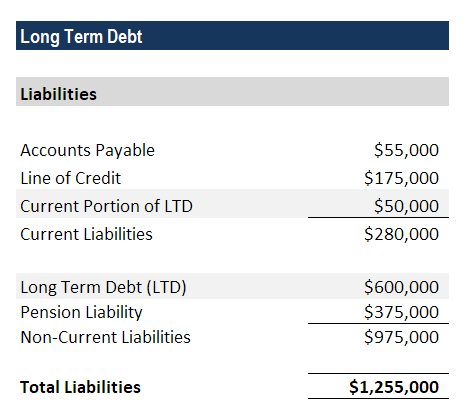

In today’s rapidly evolving financial landscape, the ability to navigate corporate finance dynamics is more essential than ever. This article addresses the critical intersection of financial statements, long-term debt, corporate finance, and algorithmic trading—four cornerstones that profoundly impact a company's financial health and strategic direction. 

Financial statements, including the balance sheet, income statement, and cash flow statement, provide a comprehensive view of a company’s financial condition. They detail assets, liabilities, and equity, presenting a picture of financial performance over time. Understanding these fundamentals is essential as they reveal how long-term liabilities, such as bonds and mortgages, are reflected in corporate accounts. These liabilities are often pivotal in shaping financial strategies, influencing decisions on resource allocation and risk management.



Corporate finance management seeks to optimize a company's financial operations by structuring capital effectively. Long-term debt is a crucial component of this capital structure, providing a relatively low-cost funding source compared to equity. Managing this debt wisely assures fiscal stability and supports ambitions for growth, investment, and expansion.

Algorithmic trading, a relatively recent development in financial markets, leverages mathematical algorithms to automate and enhance decision-making processes. This technological approach not only aids in investment portfolio management and asset allocation but also refines risk management strategies. By incorporating real-time data analysis, companies can execute more informed and efficient financial strategies.

These components—financial statements, long-term debt, corporate finance, and algorithmic trading—are intricately linked, influencing business growth and sustainability. By understanding and strategically aligning these elements, businesses can build resilience, adapt to market changes, and sustain a competitive edge in the marketplace.

## Table of Contents

## Understanding Financial Statements and Long-Term Debt

Financial statements are essential tools for evaluating a company's economic health. They consist of three key documents: the balance sheet, income statement, and cash flow statement. Each serves a distinct purpose in presenting the financial position and performance of a company.

The balance sheet offers a snapshot of a company's financial standing at a specific point in time. It is divided into three major sections: assets, liabilities, and shareholders' equity. Long-term debt falls under the liabilities section and is crucial for understanding a company’s financial obligations. Long-term debts are liabilities due after more than a year and typically include instruments such as bonds payable, mortgages payable, and long-term lease obligations.

Long-term debt is vital for investors and stakeholders as it reflects the company’s approach towards leveraging and funding strategic initiatives. These obligations are reported on the balance sheet under the category of long-term liabilities. By examining this section, stakeholders can evaluate the company's risk profile and financial strategy. The amount of long-term debt a company holds could indicate its level of risk and reliance on borrowed funds to finance its operations and growth.

Typical examples of long-term debt include:

1. **Bonds Payable**: These are debt securities issued by the company to raise funds, typically with a fixed interest rate and maturity date. Bonds are often used by companies when they need to finance large projects.

2. **Mortgages Payable**: These are loans secured by real estate and constitute a substantial part of long-term debt for companies that own property.

3. **Long-Term Leases**: With the adoption of newer accounting standards like IFRS 16 and ASC 842, many leases which extend beyond twelve months are recognized on the balance sheet as right-of-use assets with corresponding lease liabilities.

The interpretation of long-term debt on financial statements involves assessing the maturity profile and interest rates, which affect a company's cash flow and ability to service its debt. Understanding these elements helps stakeholders make informed decisions about investing in or lending to the company, as they provide signals about potential [liquidity](/wiki/liquidity-risk-premium) or solvency issues. 

Furthermore, various financial ratios derived from these statements, such as the debt-to-equity ratio and interest coverage ratio, can offer insights into the financial leverage and risk associated with a company's debt profile. Accurate representation and analysis of these obligations are thus essential for assessing long-term financial health and strategic maneuverability.

## Corporate Finance and Its Influence on Long-Term Debt

Corporate finance centers on managing a company's financial activities, with a focus on capital structure and funding sources. A critical aspect of this is the strategic use of long-term debt, which often serves as a cost-effective alternative to equity financing. Unlike issuing new equity, which can dilute existing shareholders' stakes and potentially affect market perceptions, long-term debt provides capital while generally preserving ownership structure. This makes it an attractive option for companies seeking to fund significant projects such as mergers, acquisitions, or large-scale capital expenditures.

Effectively managing long-term debt is crucial to maintaining fiscal stability and supporting corporate growth. An optimal debt strategy can facilitate investment in projects that drive expansion, development, and competitive advantage. It involves considerations such as the timing of debt issuance, [interest rate](/wiki/interest-rate-trading-strategies) environments, and the maturity structure of the debt portfolio. Employing strategies such as refinancing at lower interest rates or extending maturities to match cash flow projections can enhance fiscal flexibility and reduce costs.

Balancing debt with equity is a key strategy in managing long-term obligations to ensure financial flexibility. A well-balanced capital structure minimizes the cost of capital, blending the tax advantages of debt interest deductions with the broader risk management benefits of equity. By maintaining an appropriate debt-to-equity ratio, companies can mitigate the risk of financial distress while still leveraging growth opportunities. The following Python snippet illustrates a simple calculation of the debt-to-equity ratio:

```python
def calculate_debt_to_equity_ratio(total_debt, total_equity):
    if total_equity == 0:
        raise ValueError("Total equity must be greater than zero to calculate the ratio.")
    return total_debt / total_equity

# Example usage:
total_debt = 500000  # Example total debt amount
total_equity = 1000000  # Example total equity amount
debt_to_equity_ratio = calculate_debt_to_equity_ratio(total_debt, total_equity)
print(f"Debt-to-Equity Ratio: {debt_to_equity_ratio:.2f}")
```

A prudent approach to managing long-term debt not only drives investment but also safeguards against potential financial challenges. Companies that strategically align their debt management practices with their broader corporate objectives are more likely to sustain growth and adaptability in an increasingly dynamic financial landscape.

## The Role of Algorithmic Trading in Corporate Finance

Algorithmic trading, often referred to as algo trading, involves the use of complex mathematical models and algorithms to make financial decisions. In corporate finance, [algorithmic trading](/wiki/algorithmic-trading) has revolutionized how firms manage investment portfolios, optimize asset allocations, and enhance risk management practices. By employing sophisticated algorithms, companies can execute trades with greater speed and precision, which is crucial for managing portfolios in dynamic markets.

One of the significant advantages of algorithmic trading is its ability to provide real-time analysis and execution, especially when managing long-term investments. This capability allows corporations to respond rapidly to market changes and adjust their strategies to optimize returns. Algorithms can process vast amounts of financial data, identifying patterns and opportunities that might not be evident to human traders. Consequently, companies can implement strategies that maximize their financial performance while mitigating risks.

Risk management is a critical aspect where algorithmic trading provides tangible benefits. By continuously evaluating risk based on current market conditions, algorithms can adjust investment portfolios to maintain the desired risk profile. Two widely used metrics in algorithmic trading for assessing risk-adjusted returns are the Sharpe Ratio and the Treynor Ratio.

The Sharpe Ratio assesses the average return earned in excess of the risk-free rate per unit of [volatility](/wiki/volatility-trading-strategies) or total risk. It is calculated using the formula:

$$
\text{Sharpe Ratio} = \frac{R_p - R_f}{\sigma_p}
$$

where $R_p$ is the return of the portfolio, $R_f$ is the risk-free rate, and $\sigma_p$ is the standard deviation of the portfolio's excess return. A higher Sharpe Ratio indicates better risk-adjusted performance.

The Treynor Ratio, on the other hand, measures returns earned in excess of the risk-free rate per unit of systemic risk, as indicated by beta ($\beta$). Its formula is:

$$
\text{Treynor Ratio} = \frac{R_p - R_f}{\beta_p}
$$

where $\beta_p$ is the portfolio's beta. Unlike the Sharpe Ratio, which considers total risk, the Treynor Ratio focuses on market risk, making it particularly useful for evaluating portfolios that are parts of larger diversified investments.

Incorporating these metrics into algorithmic trading strategies can enhance corporate financial strategy by ensuring that investment decisions are aligned with the company's risk tolerance and return objectives. Algorithms allow for real-time computation of these ratios, enabling continuous portfolio optimization and better strategic decision-making. Companies adopting algorithmic trading can gain a competitive edge, leveraging technology to improve efficiency, reduce costs, and increase the overall effectiveness of their investment decisions.

## Impact of Long-Term Debt on Financial Strategy and Liquidity

Long-term investments play a pivotal role in shaping a company's financial strategy and liquidity management. These investments can diversify an asset portfolio and provide a stable source of income over time. By allocating resources into longer-term projects or securities, companies can safeguard against market volatility and ensure predictable returns. However, this strategic allocation often comes at the cost of reduced liquidity.

The liquidity challenge emerges because long-term investments typically require a company to lock in resources for extended periods, thereby limiting its ability to swiftly convert these assets into cash. This can restrict a firm's operational flexibility, especially during periods of financial strain or unforeseen expenditure. For instance, if a company primarily holds long-term assets such as real estate or fixed-income securities, it might struggle to generate enough cash flow to meet short-term liabilities without incurring significant transaction costs or losses.

Balancing long-term and short-term investments is therefore critical. An optimized financial strategy might involve maintaining a mix of liquid assets to cover immediate needs and long-term holdings for sustained growth. Financial managers must ensure that the firm's liquidity ratios, such as the current ratio (current assets divided by current liabilities), are maintained at healthy levels to avoid cash flow bottlenecks.

Improper management of long-term debt can precipitate financial distress. If a company over-leverages by taking on excessive long-term debt without a proportional increase in revenue-generating capacity, it risks falling into a debt trap. This situation is characterized by the need to use a significant portion of earnings to service debt, leaving little for reinvestment or unforeseen expenses.

To prevent financial distress, strategic oversight is essential. Companies can employ various strategies such as adjusting the capital structure, refinancing at lower interest rates when possible, or timing debt issuance to align with anticipated revenue increases. Additionally, monitoring debt-to-equity ratios and ensuring they remain within industry norms can provide insights into financial health. 

In conclusion, while long-term debt and investments are instrumental in achieving corporate growth and stability, they must be meticulously managed to maintain liquidity and sustain operational agility.

## Case Studies and Practical Applications

Case studies of various industries reveal practical applications of long-term debt, emphasizing its critical role in financing and strategic planning. Notably, restaurant chains and manufacturing companies consistently employ long-term notes as a strategic tool for expansion and technological upgrades.

In the restaurant industry, long-term debt is often leveraged to finance the opening of new locations. For example, a well-known restaurant chain might use bonds or long-term loans to secure capital necessary for infrastructure development and entry into new geographic markets. This investment impacts the company’s financial statements by increasing its long-term liabilities, while potentially boosting revenue in the long term due to increased market presence and customer reach. Furthermore, interest payments on such debt can be tax-deductible, offering a fiscal advantage over using equity alone.

In manufacturing, the necessity for technological upgrades to maintain competitive advantage and efficiency is paramount. Long-term debt enables these companies to invest in modern machinery and automation without the immediate need to deplete their cash reserves. This strategy aligns financial obligations with expected future cash flows generated by increased operational efficiency and productivity. For example, long-term debt may be used to fund the acquisition of cutting-edge robotics technology that enhances production capabilities, directly affecting operational capacity and efficiency. Additionally, such investments can be capitalized on the balance sheet, providing a clearer picture of asset growth relative to liabilities.

These real-world examples underscore the importance of aligning financial strategies with corporate growth objectives and prevailing market conditions. Understanding the cost of debt relative to expected returns is crucial for sound financial management. Companies that strategically manage their long-term debt can stabilize their financial footing while supporting sustainable growth.

Ultimately, the effective employment of long-term debt positions companies to navigate financial changes, optimize capital structure, and maximize shareholder value. These strategic applications not only enhance competitiveness but also ensure long-term operational viability in an ever-changing economic landscape.

## Conclusion and Future Outlook

Understanding financial statements, long-term debt, and algorithmic trading is crucial for sustaining modern corporate finance. These elements form the backbone of financial management and strategic planning, determining a company's economic health and competitive positioning.

Financial statements provide a snapshot of a company's fiscal standing, allowing stakeholders to assess performance, risk, and strategic alignment. Accurately interpreting these documents helps in identifying potential areas for growth and improvement while ensuring compliance and transparency. Long-term debt, a key aspect of financial statements, plays a significant role in funding business operations and expansion. It offers firms a pathway to secure substantial capital with manageable conditions, provided the debt is aligned with the company's long-term strategic objectives and risk tolerance levels.

The integration of algorithmic trading in corporate finance has ushered in new efficiencies and precision in financial decision-making. By utilizing advanced algorithms, companies can optimize their trading strategies, resulting in enhanced asset management and improved risk-adjusted returns. For instance, metrics such as the Sharpe Ratio—a measure of risk-adjusted return expressed as $\text{Sharpe Ratio} = \frac{R_p - R_f}{\sigma_p}$, where $R_p$ is the portfolio return, $R_f$ is the risk-free rate, and $\sigma_p$ is the standard deviation of the portfolio's excess return—enable firms to evaluate and refine their investment approaches more effectively.

Looking toward the future, the trajectory of corporate finance will likely be shaped by further technological advancements. The ongoing development of [artificial intelligence](/wiki/ai-artificial-intelligence) and [machine learning](/wiki/machine-learning) is poised to deepen the role of technology in finance, ushering in capabilities that enhance real-time decision-making and analytical precision. As firms navigate the complexities of an ever-evolving marketplace, embracing these technological tools will be critical. The continuous adaptation and strategic incorporation of technology into financial management practices will ensure sustainability and a robust competitive edge in the corporate domain.

Thus, the importance of these components in corporate finance cannot be overstated. A robust understanding and strategic alignment of financial statements, long-term debt, and algorithmic trading will provide companies with the agility and foresight necessary to thrive amidst the uncertainties of the modern financial landscape. As these elements become increasingly intertwined with technology, the future promises heightened efficiency and strategic advantage for companies that invest wisely in their integration.

## References & Further Reading

[1]: Kieso, D. E., Weygandt, J. J., & Warfield, T. D. (2021). ["Intermediate Accounting"](https://books.google.com/books/about/Intermediate_Accounting_IFRS.html?id=3XntDwAAQBAJ). Wiley.

[2]: Titman, S., & Martin, J. D. (2016). ["Valuation: The Art and Science of Corporate Investment Decisions"](https://www.amazon.com/Valuation-Science-Corporate-Investment-Decisions/dp/0133479528). Pearson.

[3]: Pring, M. J. (2014). ["Technical Analysis Explained: The Successful Investor's Guide to Spotting Investment Trends and Turning Points"](https://www.amazon.com/Technical-Analysis-Explained-Fifth-Successful/dp/0071825177).

[4]: Fabozzi, F. J. (2000). ["Fixed Income Analysis for the Chartered Financial Analyst Program."](https://archive.org/details/fixedincomeanaly00fabo) Frank J. Fabozzi Associates.

[5]: Bhansali, V. (2010). ["Beyond Risk: Insights on Risk Management"](https://www.longtailalpha.com/wp-content/uploads/2018/03/Beyond-Risk-Parity-WhitePaper.pdf). McGraw-Hill Education.