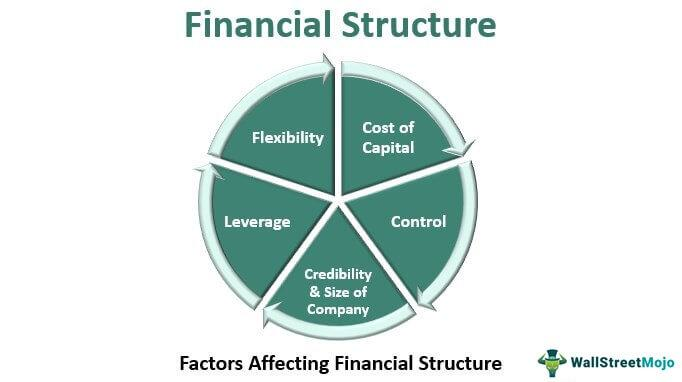

Corporate finance is a multifaceted field that involves making crucial financial decisions essential for optimizing a company's financial health and maximizing its value. It encompasses various aspects that collectively contribute to a firm's overall financial strategy. A crucial component within this realm is understanding the financial structure, which is the mix of debt and equity employed by a company. This dynamic blend plays a significant role in shaping a firm's risk profile and influences its cost of capital, thereby affecting the company's ability to fund its operations and investments effectively.

Capital structure, which is a subset of a company's financial structure, is pivotal in strategic financial management. It directly impacts a company's risk, cost of capital, and ability to sustain its operations. The optimal capital structure aims to balance the benefits and costs associated with different financing sources. Companies strive to achieve a mix that minimizes the cost of capital while maximizing firm value. This involves choosing between equity, debt, and hybrid instruments in a manner that aligns with the company's strategic objectives and market environment.



In recent years, algorithmic trading has emerged as a transformative force in corporate finance. This sophisticated approach allows trading strategies to be executed with unparalleled speed and precision, fundamentally altering how financial markets operate. Algorithmic trading leverages advanced mathematical models and computational power to analyze and execute transactions swiftly. This has led to enhanced market efficiency, accuracy, and the ability to manage complex datasets.

This article explores the interplay between financial structure, corporate finance, capital structure, and algorithmic trading, offering insights into their strategic integration. Understanding how these elements converge is essential for modern firms seeking to optimize their capital allocation and manage financial risks effectively. By examining this intersection, companies can harness technological advancements in algorithmic trading to support and refine their financial strategies.

## Table of Contents

## Understanding Financial Structure

Financial structure represents the combination of debt and equity utilized to finance a company's operations, and it plays a critical role in shaping the financial health and strategy of an organization. An optimized financial structure can enhance a company's valuation, support sustainable growth, and effectively manage risks by ensuring a balance that aligns with the company’s strategic objectives.

Debt and equity are primary components of financial structure. Debt includes loans, bonds, and other financial liabilities that require repayment over time, often with interest. Equity comprises common and preferred stock, representing ownership interests in the company. The blend of these components determines the company’s capital structure, influencing its risk profile and cost of capital. 

An appropriate financial structure minimizes the firm's overall cost of capital, which is a weighted average of equity and debt costs, known as the Weighted Average Cost of Capital (WACC). The WACC can be calculated using the formula:

$$

WACC = \frac{E}{V} \times R_e + \frac{D}{V} \times R_d \times (1 - T)
$$

where:
- $E$ is the market value of equity,
- $V$ is the total market value of the firm’s financing (equity plus debt),
- $R_e$ is the cost of equity,
- $D$ is the market value of debt,
- $R_d$ is the cost of debt, and
- $T$ is the corporate tax rate.

Managing financial structure involves strategic decisions about the balance between these elements, with the aim of minimizing costs while ensuring sufficient flexibility to capture growth opportunities. A higher proportion of debt in the financial structure can enhance returns on equity through leverage but also increases the risk of financial distress. Conversely, relying extensively on equity can dilute ownership and potentially lead to higher funding costs if investors expect higher returns compared to debt financing.

Financial managers continuously assess factors such as market conditions, interest rates, corporate tax rates, and the company's growth prospects to determine the optimal financial structure. This involves periodic re-evaluation and adjustment of the equity-to-debt ratio to align with the company's evolving objectives and external environments. 

Ultimately, the goal is to achieve a financial structure that supports the company's strategic initiatives, manages risks effectively, and maximizes shareholder value. Practical application of these principles requires financial managers to be adept at weighing the trade-offs between risk and return, while ensuring that the company maintains financial flexibility and operational efficiency.

## Exploring Capital Structure

Capital structure represents a pivotal element in a company's financial framework, entailing the proportions of debt, equity, and hybrid instruments utilized to fund its operations. Achieving an optimal capital structure involves balancing the cost of capital against the risk of financial distress, thereby maximizing firm value. This balance is crucial as it directly impacts the organization's capacity to sustain growth and maneuver through financial challenges.

The trade-off theory and the pecking order theory are two significant frameworks that guide the structuring of capital. The trade-off theory suggests that companies strive to balance the benefits and costs of debt and equity to arrive at an optimal structure. It emphasizes the tax shields provided by debt due to interest being tax-deductible, which effectively lowers the overall cost of capital. However, it also considers the increased financial distress risk that comes with higher debt levels. The pecking order theory, alternatively, posits that firms prioritize their sources of financing—preferring internal financing first (retained earnings), followed by debt, and finally equity, when external funding is necessary. This preference is due to the asymmetrical information between company insiders and investors, which can make equity issuance costly.

Financial managers are tasked with tailoring their company's capital structures to align with strategic goals and prevailing market conditions. This involves a nuanced understanding of various factors impacting capital structure decisions, including market dynamics, interest rates, and internal cash flow generation capacity. For instance, in a low-interest-rate environment, companies might lean more towards debt financing to capitalize on the cheaper cost of borrowing.

Adjustments in capital structure are often reflected in the company's weighted average cost of capital (WACC), represented by the formula:
$$
WACC = \left( \frac{E}{V} \times Re \right) + \left( \frac{D}{V} \times Rd \times (1 - Tc) \right)
$$

Where:
- $E$ represents the market value of equity
- $D$ represents the market value of debt
- $V$ (total value) is the sum of equity and debt
- $Re$ is the cost of equity
- $Rd$ is the cost of debt
- $Tc$ is the corporate tax rate

By effectively managing these variables, financial managers seek to minimize WACC, enhancing the firm's valuation and competitive position. The strategic integration of capital structure decisions ensures that companies are well-positioned to leverage opportunities while mitigating potential financial distress.

## Algorithmic Trading: An Overview

Algorithmic trading involves the execution of financial transactions using computer algorithms that can operate at high speeds and frequencies. This transformative approach to trading harnesses the power of advanced mathematical models and extensive datasets to optimize decision-making and minimize human intervention. By automating processes, [algorithmic trading](/wiki/algorithmic-trading) enhances the efficiency and precision of transactions, offering significant advantages over traditional trading methods.

At the core of algorithmic trading systems are complex algorithms that analyze market data to identify trading opportunities. These algorithms utilize various strategies, such as statistical [arbitrage](/wiki/arbitrage), [trend following](/wiki/trend-following), and [market making](/wiki/market-making). For example, [statistical arbitrage](/wiki/statistical-arbitrage) strategies might exploit temporal price discrepancies between correlated securities. A simple Python model for this could be:

```python
import numpy as np

# Simulated price differences of two correlated stocks
price_diff = np.random.normal(loc=0, scale=1, size=1000)

# Identify trading opportunities when the absolute price difference exceeds a threshold
threshold = 2
trade_signals = np.where(abs(price_diff) > threshold, np.sign(price_diff), 0)
```

This paradigm has transformed financial markets by enabling rapid order execution and the capacity to exploit inefficiencies that emerge fleetingly within markets. High-frequency trading ([HFT](/wiki/high-frequency-trading-strategies)), a subset of algorithmic trading, can execute thousands of trades in mere fractions of a second, capturing opportunities that would be impractical for human traders.

However, the speed and automation that make algorithmic trading advantageous also introduce significant risks. Systemic failures and market phenomena such as flash crashes are notable concerns. The 2010 Flash Crash, during which major U.S. stock indices plunged and recovered within minutes, highlighted these vulnerabilities, emphasizing the need for solid risk management frameworks. Algorithms must be carefully designed to include safeguards against unforeseen market conditions, using strategies such as circuit breakers and real-time surveillance systems to mitigate potential losses and stabilize the market during periods of [volatility](/wiki/volatility-trading-strategies).

In conclusion, while algorithmic trading offers exceptional efficiency and capability to handle complex datasets, it demands a rigorous approach to risk management to prevent systemic issues. It represents a critical intersection of finance and technology, providing significant benefits and challenges to modern financial markets.

## The Intersection of Capital Structure and Algorithmic Trading

The intersection of capital structure and algorithmic trading represents a dynamic facet of corporate finance, where strategic financial decisions influence technological advancements in trading. The capital structure of a company, which encompasses its mix of debt, equity, and hybrid instruments, significantly informs its approach to algorithmic trading. Companies investing in algorithmic trading must allocate substantial resources to technology and infrastructure, necessitating careful financial structuring.

Optimizing the capital structure is crucial to securing necessary investments in algorithmic trading systems without unduly increasing the cost of equity or debt. Firms often favor equity financing in this context, as it may prove more flexible and less burdensome than debt, which requires fixed repayments regardless of trading profits. This strategic shift can be particularly beneficial in mitigating insolvency risks associated with substantial technological investments.

Algorithmic trading, characterized by high-speed and high-frequency transaction execution, influences a company's financial structure by necessitating robust technological infrastructure and continuous investment in advanced algorithms. These investments demand a reevaluation of existing capital structures. While equity financing is often emphasized, hybrid structures that integrate features of both debt and equity may also be considered, offering a balanced approach to funding these activities.

Successful integration of algorithmic trading within a firm's capital structure strategy allows for enhanced financial flexibility and risk management. By aligning technological investment decisions with optimal financial structuring, companies can better absorb market volatilities and capitalize on trading opportunities. This integration requires a thorough understanding of both financial risk management and technological capabilities, enabling firms to adjust their financial strategies in response to evolving market conditions and technological advancements.

In conclusion, the interaction between capital structure and algorithmic trading necessitates a strategic, informed approach to financial management. By carefully adjusting capital structures to accommodate the technological demands of algorithmic trading, companies can position themselves to maintain competitive advantages in increasingly digitalized financial markets.

## Case Studies and Real-World Examples

Renaissance Technologies is renowned for its pioneering use of algorithmic trading, which has been instrumental in achieving exceptional returns. The firm employs complex mathematical models and statistical techniques to analyze market data and predict price movements. This approach allows Renaissance Technologies to trade with [high frequency](/wiki/high-frequency-trading) and precision, capitalizing on small market inefficiencies. The integration of algorithmic trading into its financial framework has enabled the firm to efficiently allocate capital, reduce transaction costs, and enhance overall investment performance.

Goldman Sachs stands out for its diverse capital structure, which seamlessly incorporates algorithmic trading. The firm leverages sophisticated algorithms to execute trades at lightning speed, ensuring precision and responsiveness to market changes. This capability is a core component of Goldman Sachs' strategy, as it allows the firm to mitigate risks and optimize returns. By investing significantly in proprietary trading technology and infrastructure, Goldman Sachs maintains a competitive edge in global financial markets.

The incident involving Knight Capital Group in 2012 serves as a cautionary tale about the potential risks associated with algorithmic trading. A software glitch led to erratic trading behavior, resulting in a loss of approximately $440 million within 45 minutes. This incident underscores the importance of robust risk management frameworks and thorough testing of algorithms before deployment. The challenges highlighted by Knight Capital Group illustrate the delicate balance required to integrate algorithmic trading within a firm's capital structure effectively.

Emerging trends in the financial sector indicate a growing emphasis on automation and diversification of capital sources, driven by the evolving landscape of algorithmic trading. Firms are increasingly adopting advanced technologies, such as [machine learning](/wiki/machine-learning) and big data analytics, to enhance the accuracy and efficiency of trading strategies. Additionally, the diversification of capital sources enables companies to adapt to market volatility by leveraging a mix of equity, debt, and hybrid instruments. This strategic approach allows firms to maintain financial flexibility and resilience in the face of unpredictable market conditions.

For sustainable growth, companies incorporating algorithmic trading into their financial strategies must prioritize a balanced and adaptable capital structure. This entails not only investing in state-of-the-art technology but also ensuring that financial risk management practices are robust and comprehensive. By carefully aligning capital structure decisions with technological advancements, firms can optimize their trading operations, maximize value, and maintain a competitive position in the ever-evolving financial markets.

## Conclusion

The dynamic interaction between financial structure, capital structure, and algorithmic trading represents a crucial facet of modern corporate finance. Efficient capital allocation and effective risk management hinge upon a deep understanding and optimization of both financial and capital structures. By carefully balancing debt and equity, companies can manage their risk profiles and minimize their cost of capital while maximizing firm value. Algorithmic trading injects a technological edge, enhancing the speed and precision of trading activities. This enhanced capability enables firms to exploit market efficiencies quickly, executing trades at a pace and accuracy unattainable by human intervention alone.

The strategic integration of financial and capital structures with algorithmic trading can furnish firms with significant competitive advantages. By leveraging technological advancements, companies can improve their financial performance, capitalize on complex datasets, and refine their trading strategies for greater efficacy. However, the incorporation of algorithmic trading also necessitates a robust risk management framework to mitigate potential pitfalls such as systemic failures and extreme market events like flash crashes. 

Ultimately, to successfully integrate algorithmic trading within corporate finance strategies, firms must thoroughly evaluate and manage the associated risks. An adaptive and balanced capital structure, aligned with cutting-edge trading technologies, ensures that companies remain resilient and capable of sustainable growth in an ever-evolving financial landscape. Consequently, recognizing and harnessing the synergy between financial structure, capital structure, and algorithmic trading is indispensable for firms aiming to achieve superior financial outcomes and strengthened market positions.

## References

Ross, S. A., Westerfield, R. W., & Jaffe, J. (2013). *Corporate Finance* (10th ed.). McGraw-Hill Education.

Modigliani, F., & Miller, M. H. (1958). The Cost of Capital, Corporation Finance and the Theory of Investment. *The American Economic Review, 48*(3), 261-297.

Hull, J. C. (2018). *Options, Futures, and Other Derivatives* (10th ed.). Pearson.

Brunnermeier, M., & Pedersen, L. H. (2009). Market Liquidity and Funding Liquidity. *Review of Financial Studies, 22*, 2201-2238.

Gomber, P., Arndt, B., Lutat, M., & Uhle, T. (2011). High-Frequency Trading. Discussion Paper, University of Frankfurt.

## References & Further Reading

[1]: Modigliani, F., & Miller, M. H. (1958). ["The Cost of Capital, Corporation Finance and the Theory of Investment."](https://www.aeaweb.org/aer/top20/48.3.261-297.pdf) *The American Economic Review, 48*(3), 261-297.

[2]: Ross, S. A., Westerfield, R. W., & Jaffe, J. (2013). *Corporate Finance* (10th ed.). McGraw-Hill Education.

[3]: Hull, J. C. (2018). *Options, Futures, and Other Derivatives* (10th ed.). Pearson.

[4]: Brunnermeier, M., & Pedersen, L. H. (2009). ["Market Liquidity and Funding Liquidity."](https://www.nber.org/papers/w12939) *Review of Financial Studies, 22*, 2201-2238.

[5]: Gomber, P., Arndt, B., Lutat, M., & Uhle, T. (2011). ["High-Frequency Trading."](https://papers.ssrn.com/sol3/papers.cfm?abstract_id=1858626) Discussion Paper, University of Frankfurt.