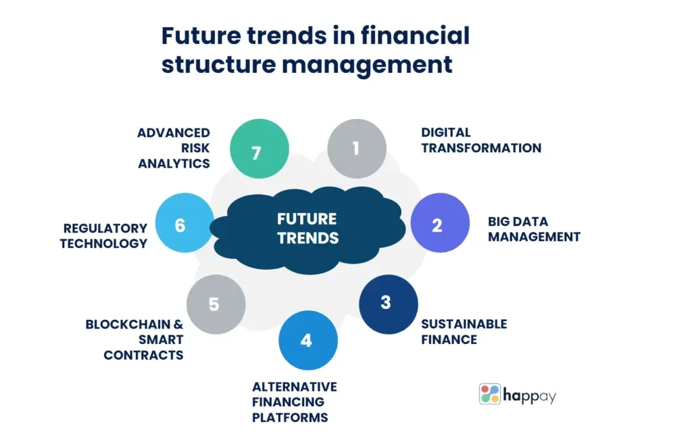

## Table of Contents

## What is financial structure?

Financial structure refers to the way a company organizes its finances, specifically how it uses different sources of funds to support its operations and growth. This includes a mix of debt, equity, and other financial instruments. A company's financial structure is crucial because it affects its risk, cost of capital, and overall financial health. For example, a business might choose to finance its operations through loans (debt) or by selling shares (equity), or a combination of both.

The choice of financial structure can significantly impact a company's ability to grow and manage its finances. A company with a high level of debt might face higher interest payments, which can be risky if its income is unstable. On the other hand, using more equity might dilute the ownership of existing shareholders but can provide a more stable financial base. Companies often aim to strike a balance that minimizes their cost of capital while maximizing their ability to invest in new opportunities and manage financial risks effectively.

## Why is financial structure important for a business?

Financial structure is important for a business because it helps the company decide how to get the money it needs to run and grow. Think of it like building a house; you need to choose the right materials and design so the house is strong and can last a long time. For a business, this means deciding between borrowing money (debt) or selling parts of the company (equity). Each choice has different effects on the company's future. If a business uses too much debt, it might struggle to pay back the loans, especially if things don't go as planned. On the other hand, using too much equity might mean sharing more of the company's profits with new owners.

The financial structure also affects how much it costs the company to get money. This is called the cost of capital. A good financial structure can make this cost lower, which means the company keeps more of its money to use for other things like expanding the business or improving products. It's also about balancing risk. A well-thought-out financial structure can help a business handle tough times better. If the economy goes down or the business faces unexpected problems, a smart financial structure can make it easier to keep going. So, choosing the right mix of debt and equity is key to keeping the business healthy and ready for growth.

## What are the main components of a financial structure?

The main components of a financial structure are debt and equity. Debt means borrowing money that the company needs to pay back, usually with interest. This can come from loans or bonds. Equity means selling parts of the company to investors, like when a company issues stocks. When investors buy these stocks, they become part owners of the company and might get a share of the profits.

There are other parts of financial structure too, like preferred stock and retained earnings. Preferred stock is a type of equity that gives investors a fixed dividend before common stockholders get anything. Retained earnings are the profits that a company keeps instead of paying out to shareholders. These earnings can be used to reinvest in the business or pay off debt. Together, these components help a company decide how to fund its operations and growth in a way that balances risk and reward.

## How does debt financing differ from equity financing?

Debt financing means a company borrows money that it has to pay back, usually with interest. This can be from a bank loan or by selling bonds. The company gets the money it needs right away, but it has to make regular payments to the lender. If the company can't pay back the debt, it might have to sell assets or even go bankrupt. Debt financing can be risky, but it doesn't change who owns the company. The people who lend the money don't get a say in how the company is run.

Equity financing is when a company sells parts of itself to investors, like when it issues stocks. Investors buy these stocks and become part owners of the company. They might get a share of the profits through dividends, but they don't get their money back like a loan. Instead, they hope the value of their shares will go up over time. Equity financing doesn't have to be paid back, so it's less risky for the company. But it means sharing ownership and control with new investors, which can change how the company is run.

## What are the advantages and disadvantages of using debt in a financial structure?

Using debt in a financial structure has some good points. It lets a company get money quickly without giving up any ownership. This means the original owners keep control of the business. Also, the interest paid on debt can sometimes be taken off the company's taxes, which saves money. If the company is doing well and making more money than the interest it has to pay, using debt can help grow the business faster.

But there are also downsides to using debt. The biggest problem is that the company has to pay back the money, plus interest, no matter what. If the business has a tough time and can't make the payments, it might have to sell things it owns or even go bankrupt. Debt can also make it harder to get more loans in the future because lenders might see the company as too risky. So, while debt can help a company grow, it also adds a lot of risk.

## How can a company optimize its capital structure?

A company can optimize its capital structure by finding the right mix of debt and equity that keeps its cost of capital low while also managing risk. This means the company needs to look at how much it costs to borrow money and how much it costs to get money from selling parts of the company. If the company can borrow money at a lower cost than the return it gets from its investments, using more debt might be a good idea. But the company also needs to think about how much debt it can handle without getting into trouble. This balance is key to making sure the company can grow and stay healthy.

To find this balance, a company might look at its cash flow to see if it can handle the payments on its debt. It might also look at the industry it's in and see what other companies are doing. Sometimes, a company might decide to change its capital structure by paying off debt or by selling more shares. The goal is always to make sure the company has enough money to operate and grow, but not so much debt that it becomes too risky. By regularly checking and adjusting its capital structure, a company can keep its finances in good shape and be ready for new opportunities.

## What role does financial leverage play in financial structure?

Financial leverage is when a company uses borrowed money, or debt, to try to make more money. Think of it like using a lever to lift something heavy; the debt is the lever that helps the company do more with less. When a company uses financial leverage, it hopes that the money it makes from its investments will be more than the interest it has to pay on the debt. This can help the company grow faster and make bigger profits. But it's a bit like playing a game where the stakes are high. If the company's investments don't go well, it still has to pay back the debt, which can be tough.

The key thing with financial leverage is finding the right balance. Too much debt can make a company very risky because it has to make big payments no matter what. If the company can't pay, it might have to sell things it owns or even go bankrupt. On the other hand, using some debt can be good if the company is careful. It can help the company grow without giving up any ownership. So, when a company is deciding on its financial structure, it needs to think about how much risk it's willing to take and how much debt it can handle while still making good investments.

## How do interest rates affect a company's financial structure decisions?

Interest rates play a big role in how a company decides to use debt in its financial structure. When interest rates are low, borrowing money becomes cheaper. This means a company might decide to take out more loans because it won't have to pay as much interest. Using more debt can help the company grow faster and make more money, especially if the money it makes from its investments is more than the interest it has to pay. But the company still needs to be careful not to borrow too much, even when rates are low, because it still has to pay the money back.

On the other hand, when interest rates are high, borrowing money costs more. This can make a company think twice about taking on more debt. High interest rates mean higher loan payments, which can be risky if the company's income goes down or if it has trouble making money. In this situation, a company might choose to use more equity instead, like selling shares to investors. This way, the company doesn't have to worry about paying back loans with high interest, but it does mean sharing ownership and profits with more people.

## What are the implications of a high debt-to-equity ratio?

A high debt-to-equity ratio means a company is using a lot of borrowed money compared to the money it gets from selling parts of the company. This can be risky because the company has to pay back the loans, plus interest, no matter what. If the company's income goes down or it has a hard time making money, it might struggle to make the payments. This can lead to big problems, like having to sell things it owns or even going bankrupt. Lenders might also see the company as too risky and not want to give it more loans, which can make it hard for the company to grow.

On the other hand, a high debt-to-equity ratio can help a company grow faster if things go well. If the company can make more money from its investments than the interest it has to pay, using a lot of debt can be a good way to make bigger profits. But it's like walking a tightrope; the company needs to be very careful and make sure it can handle the debt. If it gets the balance right, it can use the borrowed money to expand and do well. But if it gets it wrong, the risks can be big.

## How do different industries approach financial structuring differently?

Different industries have different ways of setting up their financial structures because they have different needs and risks. For example, tech companies often use a lot of equity financing. They do this because they need a lot of money to grow fast and develop new products, but they might not have enough steady income to pay back big loans. By selling shares, they can get the money they need without the pressure of loan payments. On the other hand, industries like utilities, which have steady income from things like electricity and water, might use more debt. They can handle the regular loan payments because they know they'll keep getting money from customers.

Another example is the real estate industry, which often uses a lot of debt because buying property is expensive. They might take out big loans to buy land or buildings, expecting to pay back the loans with the money they make from renting or selling the property. This can be risky if the real estate market goes down, but it can also help them grow quickly when things are going well. Each industry looks at its own situation and tries to find the best mix of debt and equity to help it grow while managing risks.

## What advanced financial instruments can be used to manage financial structure?

Companies can use different advanced financial instruments to manage their financial structure and make it work better for them. One such instrument is convertible bonds. These are like loans that can turn into shares of the company. If the company does well, the people who bought the bonds can choose to get shares instead of getting their money back with interest. This can be good for the company because it might not have to pay back the loan if the bonds are converted to shares, but it means giving up some ownership. Another tool is a warrant, which gives someone the right to buy shares at a set price in the future. This can help the company get money now and also give investors a chance to own part of the company later if they think it will do well.

Another advanced instrument is a derivative, which is a contract that gets its value from something else, like the price of a stock or interest rates. Companies can use derivatives to manage risks. For example, they might use an [interest rate](/wiki/interest-rate-trading-strategies) swap to change from paying a variable interest rate on their debt to a fixed rate, which can make their payments more predictable. This can help the company plan better and avoid surprises if interest rates go up. These advanced instruments can be tricky to use, but when a company understands them well, they can be powerful tools to help manage the financial structure and make the company stronger and more flexible.

## How does global economic policy impact corporate financial structuring?

Global economic policy can change how companies decide to set up their financial structures. When countries change their rules about taxes or interest rates, it can make a big difference. For example, if a country lowers its taxes on business profits, companies might want to use more debt because they can save money on taxes by deducting the interest they pay. On the other hand, if a country raises interest rates, borrowing money becomes more expensive, so companies might choose to use less debt and more equity to avoid high loan payments.

These policies also affect how companies do business around the world. If one country makes it easier for companies to borrow money, a company might decide to take out loans there instead of in a country with stricter rules. This can help the company save money and grow faster. But it also means the company has to keep an eye on what's happening in different countries and be ready to change its financial structure if the rules change.

## What is the key to understanding financial structure?

Financial structure represents the combination of debt and equity utilized to finance a company's operations, and it plays a critical role in shaping the financial health and strategy of an organization. An optimized financial structure can enhance a company's valuation, support sustainable growth, and effectively manage risks by ensuring a balance that aligns with the company’s strategic objectives.

Debt and equity are primary components of financial structure. Debt includes loans, bonds, and other financial liabilities that require repayment over time, often with interest. Equity comprises common and preferred stock, representing ownership interests in the company. The blend of these components determines the company’s capital structure, influencing its risk profile and cost of capital. 

An appropriate financial structure minimizes the firm's overall cost of capital, which is a weighted average of equity and debt costs, known as the Weighted Average Cost of Capital (WACC). The WACC can be calculated using the formula:

$$

WACC = \frac{E}{V} \times R_e + \frac{D}{V} \times R_d \times (1 - T)
$$

where:
- $E$ is the market value of equity,
- $V$ is the total market value of the firm’s financing (equity plus debt),
- $R_e$ is the cost of equity,
- $D$ is the market value of debt,
- $R_d$ is the cost of debt, and
- $T$ is the corporate tax rate.

Managing financial structure involves strategic decisions about the balance between these elements, with the aim of minimizing costs while ensuring sufficient flexibility to capture growth opportunities. A higher proportion of debt in the financial structure can enhance returns on equity through leverage but also increases the risk of financial distress. Conversely, relying extensively on equity can dilute ownership and potentially lead to higher funding costs if investors expect higher returns compared to debt financing.

Financial managers continuously assess factors such as market conditions, interest rates, corporate tax rates, and the company's growth prospects to determine the optimal financial structure. This involves periodic re-evaluation and adjustment of the equity-to-debt ratio to align with the company's evolving objectives and external environments. 

Ultimately, the goal is to achieve a financial structure that supports the company's strategic initiatives, manages risks effectively, and maximizes shareholder value. Practical application of these principles requires financial managers to be adept at weighing the trade-offs between risk and return, while ensuring that the company maintains financial flexibility and operational efficiency.

## References & Further Reading

[1]: Modigliani, F., & Miller, M. H. (1958). ["The Cost of Capital, Corporation Finance and the Theory of Investment."](https://www.aeaweb.org/aer/top20/48.3.261-297.pdf) *The American Economic Review, 48*(3), 261-297.

[2]: Ross, S. A., Westerfield, R. W., & Jaffe, J. (2013). *Corporate Finance* (10th ed.). McGraw-Hill Education.

[3]: Hull, J. C. (2018). *Options, Futures, and Other Derivatives* (10th ed.). Pearson.

[4]: Brunnermeier, M., & Pedersen, L. H. (2009). ["Market Liquidity and Funding Liquidity."](https://www.nber.org/papers/w12939) *Review of Financial Studies, 22*, 2201-2238.

[5]: Gomber, P., Arndt, B., Lutat, M., & Uhle, T. (2011). ["High-Frequency Trading."](https://papers.ssrn.com/sol3/papers.cfm?abstract_id=1858626) Discussion Paper, University of Frankfurt.