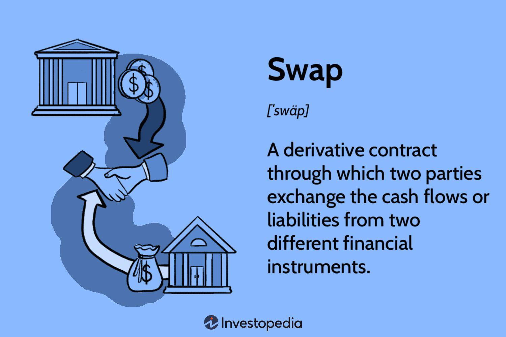

## Table of Contents

## What is a financial swap?

A financial swap is a contract between two parties to exchange cash flows or other financial instruments. It's like a trade where one party agrees to pay the other based on certain conditions, and in return, they receive payments based on different conditions. Swaps are often used to manage risk or to take advantage of better borrowing rates in different markets.

For example, imagine Company A has a loan with a variable interest rate, but they would prefer a fixed rate to better predict their costs. Company B, on the other hand, has a fixed-rate loan but thinks interest rates will go down, so they'd rather have a variable rate. They can enter into a swap where Company A pays Company B a fixed rate, and Company B pays Company A a variable rate. This way, both companies get the type of interest rate they want without changing their original loans.

Swaps can be used for many things, like swapping different currencies, interest rates, or even commodities. They are very flexible and can be customized to fit the needs of the parties involved. However, they also come with risks, like the risk that one party might not be able to make the payments as agreed. That's why it's important for both parties to understand the terms of the swap and to work with reputable partners.

## What are the main types of financial swaps?

The main types of financial swaps are interest rate swaps, currency swaps, and commodity swaps. Interest rate swaps are the most common type. They involve two parties exchanging interest payments, usually one with a fixed rate and the other with a variable rate. This helps companies manage their exposure to changes in interest rates. For example, a company with a variable-rate loan might swap it for a fixed rate to have more predictable costs.

Currency swaps involve exchanging principal and interest payments in one currency for the same in another currency. This can be useful for companies that do business in multiple countries and want to hedge against currency fluctuations. For instance, a company might borrow in dollars but need euros for its operations, so it enters a swap to convert its dollar payments into euro payments.

Commodity swaps are used to manage price risks associated with commodities like oil, gas, or metals. In a commodity swap, one party agrees to pay a fixed price for a commodity, while the other pays a floating price based on the market rate. This can help producers and consumers of commodities stabilize their costs or revenues. For example, an airline might use a fuel swap to lock in a predictable price for jet fuel, protecting against price spikes.

## How do interest rate swaps work?

An interest rate swap is like a deal between two people or companies where they agree to swap their interest payments. Imagine you have a loan where you pay a changing interest rate, but you'd rather pay a steady rate that doesn't change. You can find someone who wants the opposite – they have a loan with a steady rate but think rates will go down, so they want a changing rate. You both agree to swap: you pay them the steady rate, and they pay you the changing rate. This way, you both get the kind of interest rate you want without changing your original loans.

These swaps can be set up in different ways, but they usually last for a certain time, like five or ten years. During this time, you and the other person keep swapping payments according to the terms you agreed on. It's important to have a good agreement because if one person can't pay, it can cause problems. Interest rate swaps help businesses manage their money better by making their costs more predictable or by taking advantage of changes in interest rates.

## What is the purpose of using currency swaps?

Currency swaps are used by companies that do business in different countries and want to manage their money better. Imagine a company in the United States has to pay for things in Europe, but all their money is in dollars. They can use a currency swap to change their dollar payments into euro payments. This helps them avoid the risk of the dollar getting weaker compared to the euro, which could make their payments more expensive.

These swaps work by two parties agreeing to exchange principal and interest payments in one currency for the same in another currency. For example, the U.S. company might swap dollars for euros with a European company that needs dollars. They both agree on how much to swap and for how long. This way, both companies can do business in the currency they need without worrying too much about changes in exchange rates.

## Can you explain how commodity swaps function?

Commodity swaps help companies that use or sell things like oil, gas, or metals to manage the risk of price changes. Imagine you're a company that needs to buy a lot of oil every month. You might be worried that the price of oil will go up and make your costs higher. With a commodity swap, you can agree with another company to pay a fixed price for oil, while they pay you based on the actual market price. This way, you know exactly how much you'll pay for oil, no matter what happens to the market price.

These swaps can last for a certain time, like a year or more. During this time, you and the other company keep swapping payments according to the terms you agreed on. If the market price of oil goes up, the other company pays you the difference between the fixed price and the higher market price. If the market price goes down, you pay them the difference. This helps both companies manage their costs or revenues better, making their business more predictable and less risky.

## What are the risks involved in entering a swap agreement?

Entering a swap agreement can be risky because one party might not be able to make the payments as agreed. This is called counterparty risk. If the other company can't pay, you might lose money or have to find another way to manage your costs or risks. It's important to check that the company you're swapping with is reliable and has a good financial standing.

Another risk is that the market might move in a way you didn't expect. For example, if you enter an interest rate swap to get a fixed rate, but interest rates go down a lot, you might end up paying more than you would have without the swap. This is called market risk. It's hard to predict what will happen in the future, so you need to think carefully about whether a swap will really help you.

There's also the risk of not understanding the swap agreement fully. Swaps can be complicated, and if you don't understand all the terms, you might agree to something that doesn't work out well for you. It's a good idea to get advice from someone who knows about swaps before you enter into an agreement.

## How are swaps used for hedging purposes?

Swaps are often used for hedging, which means protecting against risks. Imagine you're a company that needs to buy a lot of oil every month, but you're worried that the price might go up and make your costs higher. You can use a commodity swap to agree with another company to pay a fixed price for oil, while they pay you based on the actual market price. This way, you know exactly how much you'll pay for oil, no matter what happens to the market price. It's like putting a safety net under your business so that unexpected price changes don't hurt you too much.

Another example is if you have a loan with a variable interest rate, but you'd rather have a fixed rate to better predict your costs. You can enter an interest rate swap with another company that has a fixed-rate loan but thinks interest rates will go down. You agree to swap: you pay them the fixed rate, and they pay you the variable rate. This way, you protect yourself against rising interest rates, making your costs more predictable. Swaps help companies manage their risks by turning uncertain costs into more predictable ones.

## What role do swaps play in arbitrage strategies?

Swaps can be used in arbitrage strategies to take advantage of price differences in different markets. Imagine you see that the price of oil is different in two places. You can use a commodity swap to buy oil at the lower price and sell it at the higher price, making a profit from the difference. This is called arbitrage, and swaps help you do it without having to actually move the oil around. You just agree to swap payments based on the oil prices in the two places.

Another way swaps are used in arbitrage is with interest rates. If you notice that the interest rates are different in two countries, you can use an interest rate swap to borrow money at the lower rate and lend it at the higher rate. This way, you make money from the difference in interest rates. Swaps make it easier to do this because you can swap the interest payments without having to change your original loans. It's like finding a way to make money from the gaps between different markets.

## How are swaps priced and valued?

Swaps are priced and valued by looking at the present value of the future cash flows that will be swapped between the two parties. This means figuring out how much the payments that will be made in the future are worth right now. To do this, you need to know the interest rates or prices that the swap is based on, and you need to use a discount rate to bring those future payments back to today's value. The discount rate is like the interest rate you would use if you were borrowing money to make those payments now. If the present value of what you will receive is more than what you will pay, the swap has a positive value for you.

The pricing of swaps also depends on the terms of the swap agreement, like how long it will last and how often payments will be made. For example, in an interest rate swap, you need to know the fixed rate you will pay and the variable rate you will receive. The difference between these rates, and how they are expected to change over time, will affect the swap's value. Market conditions, like the current interest rates or commodity prices, also play a big role in pricing swaps. If interest rates go up, the value of a swap where you pay a fixed rate and receive a variable rate might go down, because you will be paying more than you would if you had just taken out a new loan at the higher rate.

## What regulatory considerations should be taken into account when dealing with swaps?

When dealing with swaps, there are important rules and regulations you need to follow. In many countries, swaps are overseen by financial regulators like the Commodity Futures Trading Commission (CFTC) in the United States or the European Securities and Markets Authority (ESMA) in Europe. These regulators make sure that swaps are traded fairly and that companies report their swap activities. They also set rules to reduce risks, like requiring companies to use clearinghouses for certain types of swaps. This means that instead of dealing directly with each other, companies go through a middleman to make sure the swap is safe and secure.

Another big thing to think about is the Dodd-Frank Act in the United States, which was passed after the 2008 financial crisis to make the financial system safer. This law requires more transparency in the swap market, meaning companies have to report their swaps to a public database. It also sets rules about who can trade swaps and how they can do it. For example, certain swaps must be traded on exchanges or through swap execution facilities, and companies need to keep records of their swap transactions. Following these rules helps keep the financial system stable and protects everyone involved in swaps.

## How have financial swaps evolved over time?

Financial swaps started in the late 1970s and early 1980s as a way for big companies to manage their money better. The first swaps were simple interest rate swaps, where two companies would agree to swap their interest payments. This helped them deal with changes in interest rates without having to change their original loans. Over time, swaps got more complicated and were used for more things, like swapping different currencies or commodities. By the 1990s and 2000s, swaps were a big part of the financial world, with lots of different kinds of swaps being used by companies and banks all over the world.

The 2008 financial crisis changed how people thought about swaps. It showed that swaps could be risky if they weren't managed carefully. After the crisis, new rules were made to make swaps safer. For example, in the United States, the Dodd-Frank Act was passed to make sure swaps were traded more openly and that companies reported their swap activities. Today, swaps are still an important tool for managing risks, but there are more rules to follow to make sure they don't cause big problems. Swaps keep evolving, with new types of swaps being created to meet the needs of businesses in a changing financial world.

## What advanced strategies can be implemented using complex swap structures?

Complex swap structures can be used for advanced strategies like basis swaps and swaptions. A basis swap is when two companies swap payments based on different interest rates or different ways of calculating interest rates. For example, one company might pay a fixed rate while the other pays a variable rate based on a different index, like the difference between the LIBOR and the prime rate. This can help companies take advantage of small differences in how interest rates move, making a profit from those differences. Basis swaps are like a more advanced version of regular interest rate swaps, and they need a good understanding of how different interest rates work.

Another advanced strategy is using swaptions, which are options on swaps. A swaption gives you the right, but not the obligation, to enter into a swap at a future date. For example, you might buy a swaption that lets you enter an interest rate swap in six months if interest rates go up. This can be useful if you think rates will go up but you're not sure, so you want to protect yourself without committing to the swap right away. Swaptions are like insurance for your swap strategy, giving you more flexibility and control over your financial risks.

These advanced strategies need a good understanding of the swap market and how different financial instruments work together. They can help companies manage their risks better and take advantage of market opportunities, but they also come with more complexity and potential risks. It's important for companies to work with experienced financial advisors and to carefully consider the terms of any complex swap structures before entering into them.

## References & Further Reading

[1]: ["Advances in Financial Machine Learning"](https://www.amazon.com/Advances-Financial-Machine-Learning-Marcos/dp/1119482089) by Marcos Lopez de Prado

[2]: ["Machine Learning for Algorithmic Trading"](https://github.com/stefan-jansen/machine-learning-for-trading) by Stefan Jansen

[3]: ["Quantitative Trading: How to Build Your Own Algorithmic Trading Business"](https://www.amazon.com/Quantitative-Trading-Build-Algorithmic-Business/dp/1119800064) by Ernest P. Chan

[4]: Hull, J. C. (2017). ["Options, Futures and Other Derivatives,"](https://www.semanticscholar.org/paper/Options%2C-Futures%2C-and-Other-Derivatives-Hull/89bdee500c8623864fc9eb7a471546aa713acc44) 9th Edition. Pearson.

[5]: ["Swaps and Other Derivatives"](https://www.investopedia.com/ask/answers/060215/what-difference-between-derivatives-and-swaps.asp) by Richard Flavell