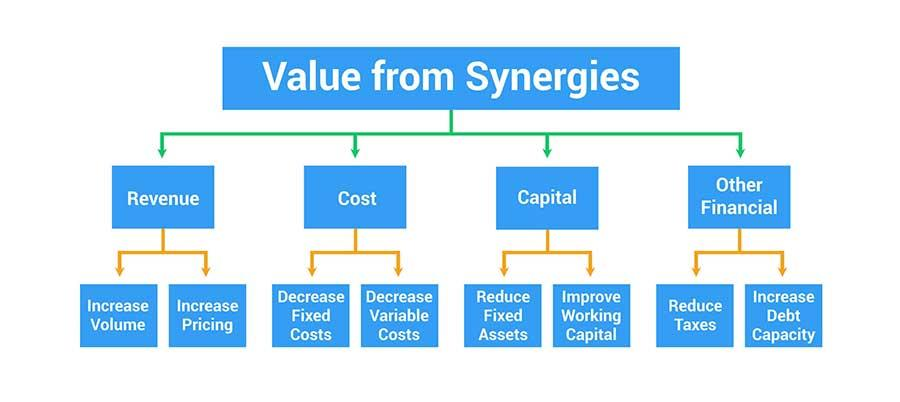

## Table of Contents

## What is financial synergy and why is it important?

Financial synergy is when two companies join together and their combined value becomes greater than the sum of their separate values. This happens because the companies can share resources, cut costs, and increase their profits in ways they couldn't do alone. For example, one company might have a great product but not enough money to grow, while the other company has lots of money but no new products. By joining together, they can use the money to grow the product and make more profit.

It's important because financial synergy can help companies grow faster and become more successful. When companies work together, they can save money by sharing things like factories, offices, or technology. This means they can spend more money on new projects or expanding their business. Also, when companies combine, they might be able to borrow money at lower interest rates because they are seen as less risky. This can help them invest in new opportunities and grow even more.

## How can financial synergy be achieved in a business?

Financial synergy can be achieved in a business when two companies come together and use their strengths to help each other. For example, one company might be good at making products but not so good at selling them. Another company might be great at selling but needs new products to sell. When they join forces, the first company can make products that the second company can sell, and they both benefit. This way, they can use each other's skills to make more money and grow faster than they could on their own.

Another way to achieve financial synergy is by sharing resources and cutting costs. When two companies combine, they can share things like factories, offices, or computer systems. This means they don't have to pay for these things twice, and they can save a lot of money. With the money they save, they can invest in new projects or expand their business. This can help them make more profit and become more successful.

## What are the different types of financial synergies?

There are mainly two types of financial synergies: revenue synergy and cost synergy. Revenue synergy happens when two companies join together and they can make more money than they could on their own. For example, one company might have a great product but not many customers, and the other company might have lots of customers but no new products. When they come together, they can sell the product to all the customers and make more money.

Cost synergy is when two companies join together and they can save money by sharing things like factories, offices, or computer systems. Instead of paying for these things twice, they only need to pay for them once. This saves them money, which they can use to invest in new projects or to grow their business. Both types of synergies help companies to become more successful by either making more money or saving money.

## Can you explain the concept of revenue synergy?

Revenue synergy happens when two companies join together and they can make more money than they could if they were working alone. Imagine one company has a great product, but it doesn't have enough customers to sell it to. At the same time, another company has lots of customers but doesn't have any new products to sell. When these two companies come together, they can use the great product to sell to all the customers. This way, they can make more money because they are using each other's strengths to grow their business.

For example, if a company that makes tasty snacks joins with a company that has a big network of stores, they can sell more snacks in more places. The snack company can reach more customers through the stores, and the store company can offer something new and exciting to their customers. Both companies benefit because they are working together to increase their sales and profits. This is how revenue synergy helps businesses grow and make more money.

## How does cost synergy differ from revenue synergy?

Cost synergy is when two companies join together and they can save money by sharing things like factories, offices, or computer systems. Instead of paying for these things twice, they only need to pay for them once. This saves them money, which they can then use to invest in new projects or to grow their business. For example, if two companies that make toys join together, they might be able to use the same factory to make all their toys, which would save them a lot of money.

Revenue synergy is different because it's about making more money, not just saving it. It happens when two companies come together and they can sell more products or services than they could on their own. For instance, if a company that makes tasty snacks joins with a company that has a big network of stores, they can sell more snacks in more places. The snack company can reach more customers through the stores, and the store company can offer something new and exciting to their customers. Both companies make more money because they are working together to increase their sales and profits.

## What are some real-world examples of financial synergy?

When Disney bought Pixar in 2006, it was a great example of financial synergy. Disney was really good at making money from movies through things like toys and theme parks, but they needed new and exciting stories. Pixar had those new stories and great technology for making movies, but they didn't have as many ways to make money from their movies. When they joined together, Disney could use Pixar's stories to make more money from toys, theme parks, and other products. This helped both companies make more money than they could have on their own.

Another example is when Exxon and Mobil merged in 1999 to become ExxonMobil. Both companies were in the oil business, but they could save a lot of money by coming together. They shared things like refineries and pipelines, which meant they didn't have to pay for these things twice. By saving money on costs, they could invest more in finding new oil and improving their business. This helped them become a bigger and more successful company than they were before the merger.

## How do mergers and acquisitions contribute to financial synergy?

Mergers and acquisitions help create financial synergy when two companies join together and become more valuable than they were on their own. This happens because the companies can use each other's strengths to make more money or save money. For example, one company might have a great product but not enough customers, while the other company has lots of customers but needs new products. When they merge, they can use the great product to sell to all the customers, which helps them make more money. This is called revenue synergy.

Another way mergers and acquisitions contribute to financial synergy is by helping companies save money. When two companies come together, they can share things like factories, offices, or computer systems. Instead of paying for these things twice, they only need to pay for them once. This saves them a lot of money, which they can then use to invest in new projects or grow their business. This is called cost synergy. Both revenue and cost synergies help companies become more successful by either making more money or saving money.

## What are the key financial metrics to measure synergy?

To measure financial synergy, companies look at key financial metrics like revenue growth and cost savings. Revenue growth is important because it shows if the companies are making more money together than they did before. For example, if a company that makes tasty snacks joins with a company that has a big network of stores, they can check if their sales have gone up after the merger. If the sales are higher, it means they are benefiting from revenue synergy.

Cost savings are another key metric. This means looking at whether the companies are spending less money together than they did apart. When two companies merge, they might share things like factories or offices, which helps them save money. If their costs go down after the merger, it shows they are achieving cost synergy. Both revenue growth and cost savings help companies see if their merger or acquisition is working well and if they are becoming more successful together.

## How can a company assess the potential for financial synergy before a merger?

Before a merger, a company can assess the potential for financial synergy by looking at how the two companies could work together to make more money or save money. They can start by studying the strengths and weaknesses of each company. For example, if one company has a great product but not many customers, and the other company has lots of customers but no new products, they can see how joining together could help them sell more products to more people. This kind of analysis helps them understand if they can achieve revenue synergy, where they make more money together than they could on their own.

Another way to assess potential financial synergy is by looking at the costs each company has. If both companies have factories or offices, they might be able to share these resources after the merger, which would save them money. They can do a detailed cost analysis to see how much they could save by sharing things like technology, buildings, or even staff. If the numbers show they can save a lot of money, it means they could achieve cost synergy. By looking at both revenue growth and cost savings, a company can get a good idea of whether a merger will help them become more successful.

## What are the common challenges in realizing financial synergy?

One common challenge in realizing financial synergy is that it can be hard to make the two companies work well together. After a merger, people from both companies have to learn to work together, but they might have different ways of doing things. This can cause problems and slow down the process of achieving synergy. It takes time and effort to make sure everyone is on the same page and working towards the same goals.

Another challenge is that the expected benefits of the merger might not happen as quickly or as much as planned. Companies might think they will save a lot of money by sharing resources, but it can be hard to actually make those savings happen. Sometimes, the costs of merging, like paying for lawyers or consultants, can be higher than expected. This can make it harder to see the financial benefits of the merger right away.

## How can financial synergy impact a company's valuation?

Financial synergy can make a company more valuable when two companies join together and become worth more than they were on their own. This happens because they can make more money or save money by working together. For example, if one company has a great product but not many customers, and the other company has lots of customers but no new products, they can sell the product to all the customers and make more money. This is called revenue synergy. When investors see that a company can make more money after a merger, they might be willing to pay more for the company, which increases its valuation.

Another way financial synergy can impact a company's valuation is through cost synergy. When two companies merge, they can share things like factories, offices, or computer systems. Instead of paying for these things twice, they only need to pay for them once, which saves them money. If a company can show that it will save a lot of money after a merger, investors might think the company is worth more because it will have more money to invest in new projects or grow its business. Both revenue and cost synergies can make a company more attractive to investors, which can lead to a higher valuation.

## What advanced strategies can be employed to maximize financial synergy in complex corporate structures?

In complex corporate structures, maximizing financial synergy often involves carefully aligning the operations and resources of multiple business units. One strategy is to centralize certain functions like procurement, IT, and human resources. By doing this, the company can negotiate better deals with suppliers, streamline technology use, and manage staff more efficiently across the entire organization. This not only cuts costs but also helps in sharing best practices and knowledge, which can lead to better decision-making and innovation. Another approach is to use advanced data analytics to identify where synergies can be most effectively realized. By analyzing data from different parts of the business, companies can spot trends and opportunities that might not be visible when looking at each unit separately.

Another strategy involves restructuring the corporate governance to enhance coordination and communication between different units. This can be done by setting up cross-functional teams that work on projects that benefit from the combined strengths of various parts of the company. For example, a team could be formed to develop a new product that uses the technology from one unit and the market access of another. This not only helps in leveraging existing assets but also fosters a culture of collaboration. Additionally, financial engineering techniques, such as optimizing the capital structure or using financial instruments like derivatives, can help in managing risks and maximizing the financial benefits of synergy. By carefully managing the financial aspects, the company can ensure that the potential value from synergy is fully realized.

## How can we measure financial synergy?

Measuring financial synergy is critical for assessing the value generated from mergers and acquisitions. A key tool in this analysis is the Discounted Cash Flow (DCF) method. This technique projects future cash flows generated by the merged entities and discounts them back to their present value using an appropriate discount rate. The formula for DCF is:

$$

DCF = \sum \frac{CF_t}{(1 + r)^t} 
$$

where $CF_t$ is the cash flow in period $t$ and $r$ is the discount rate. By comparing the DCF of the merged entity to the sum of the DCFs of the individual companies, analysts can determine if financial synergy has resulted in added value.

In addition to DCF, financial analysts often examine key financial metrics and ratios, including Earnings Per Share (EPS) and profit margins. These metrics provide insights into the enhancement of the company's financial performance post-merger. For instance, an increase in EPS post-merger could indicate successful synergy if it surpasses the sum of the EPS of the individual firms prior to the merger.

Moreover, comparative analysis of cost structures and revenue streams is essential. This analysis involves evaluating the cost savings and revenue enhancements achieved after the merger versus those prior. Analysts look at reductions in overlapping departmental costs, streamlined operations, and enhanced economies of scale that may contribute to cost synergy. They also assess revenue synergy by examining the expanded market reach and increased sales opportunities emerging from the merger.

In summary, measuring financial synergy involves a combination of quantitative tools, like DCF analysis, and evaluative metrics, ensuring a comprehensive assessment of the merger's tangible benefits.

## References & Further Reading

[1]: Damodaran, A. (2005). ["The Value of Synergy."](https://papers.ssrn.com/sol3/papers.cfm?abstract_id=841486) Stern School of Business Working Paper.

[2]: DePamphilis, D. (2019). ["Mergers, Acquisitions, and Other Restructuring Activities."](https://www.sciencedirect.com/book/9780128016091/mergers-acquisitions-and-other-restructuring-activities) Academic Press.

[3]: Palepu, K. G., Healy, P. M., & Peek, E. (2019). ["Business Analysis and Valuation: IFRS Edition."](https://books.google.com/books/about/Business_Analysis_and_Valuation_Using_Fi.html?id=IDT6DwAAQBAJ) Cengage Learning EMEA.

[4]: Jansen, S. (2020). ["Machine Learning for Algorithmic Trading."](https://github.com/stefan-jansen/machine-learning-for-trading) Packt Publishing.

[5]: Bratton, W. W. (2006). ["The New Economic Theory of the Firm: Critical Perspectives from History."](https://www.jstor.org/stable/1228806) Business History Review.