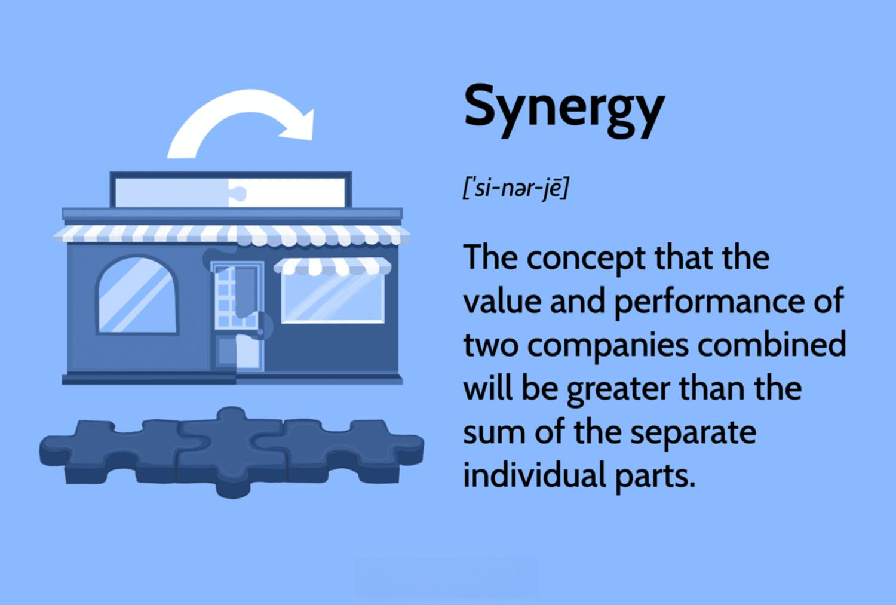

Financial synergy is a fundamental concept in the finance industry, with significant implications for mergers and acquisitions (M&As). It represents the enhanced value created when two entities combine their operations, leading to increased efficiency, cost reductions, and potentially higher revenues. By integrating operations, companies can optimize resource utilization, streamline processes, and leverage economies of scale to achieve superior financial outcomes.

This comprehensive guide seeks to explore the intricacies surrounding financial synergy, offering insights into its various types, methodologies for measurement, and notable real-world examples. Beyond the basics, the guide will address the potential challenges and risks that entities may face when pursuing financial synergy. This includes potential pitfalls such as cultural clashes and integration costs, which can hinder the realization of expected benefits.



Additionally, strategies for successfully achieving financial synergy will be outlined, emphasizing the importance of thorough due diligence, effective integration, and clear goal setting. The guide also examines the significant role that technology plays in modern financial synergy, highlighting the integration of artificial intelligence and advanced analytics in areas such as algorithmic trading. This technological synergy fosters enhanced trading precision and efficiency, reducing human error and enabling better analytical insights.

Ultimately, financial synergy not only serves as a catalyst in strategic financial decision-making but also supports companies in gaining a competitive edge and driving sustainable growth in the continually evolving economic landscape.

## Table of Contents

## Understanding Financial Synergy

Financial synergy occurs when the combined performance of two merging entities exceeds the sum of their individual performances. This phenomenon is essential in the context of mergers and acquisitions (M&As), where the strategic combination of two companies aims to create enhanced value. Financial synergy is primarily achieved through mechanisms such as cost reductions, increased revenue potential, and improvements in capital efficiency.

Cost reductions are often realized through mergers by eliminating duplicate functions, optimizing supply chains, and leveraging economies of scale. When two companies merge, they can streamline operations, which cuts down on operational expenses, and enhance purchasing power, which results in reduced costs of goods sold.

Increased revenue is another crucial aspect of financial synergy. By combining resources, companies can access a broader customer base, enhance product or service offerings, and explore new market opportunities. This results in an amplified revenue stream exceeding what the companies could have achieved individually.

Capital efficiency improvements occur when the combined entity benefits from a more robust balance sheet, which might lead to a better credit rating and reduced cost of capital. This can enhance the company's ability to invest in growth opportunities and provide a better return on investment for shareholders.

The strategic importance of financial synergy is significant for business growth and competitive positioning. It not only strengthens a company's financial stability but also maximizes shareholder value. By achieving financial synergy, companies can enhance their market position, adapt more quickly to changing market conditions, and improve their overall financial performance.

Understanding the foundations of financial synergy and successfully leveraging it during M&As provides firms with a competitive edge, ensuring both immediate and long-term benefits.

## Types of Synergy in Finance

In the context of finance, synergy types primarily manifest in three forms: revenue synergy, cost synergy, and other financial synergies. Each plays a significant role in enhancing the overall value of a merger or acquisition by improving financial performance and strategic market positioning.

### Revenue Synergy
Revenue synergy arises when strategic business combinations enhance sales and market reach. By integrating customer bases, merged entities can cross-sell products to a broader audience, creating new sales avenues. This synergy is particularly beneficial for companies aiming to enter new geographical markets or expand product offerings. For example, a company with a dominant market position in Asia merging with another firm strong in Europe can quickly access new markets without starting from scratch. Revenue synergy can also enable companies to leverage combined brand strengths, enhance customer experiences, and outpace competitors through innovative product development.

### Cost Synergy
Cost synergy involves the reduction of operational costs through the elimination of redundant functions and the consolidation of resources. Mergers and acquisitions provide opportunities to streamline operations, leading to cost efficiencies. These often arise from layoffs in overlapping departments, shared use of infrastructure, and bulk purchasing advantages. The essence of cost synergy lies in economies of scale, where per-unit costs decrease as the [volume](/wiki/volume-trading-strategy) of production increases. By unifying production facilities or distribution networks, combined entities can significantly reduce overall expenses, enhancing profitability.

### Other Financial Synergies
Beyond revenue and cost benefits, other financial synergies include improved borrowing capacity and financial stability. When two firms merge, their combined balance sheets often display enhanced assets and cash flows, which can strengthen creditworthiness. As a result, the new entity may achieve lower interest rates or more favorable borrowing terms. Additionally, improved cash flow consistency can cushion against market [volatility](/wiki/volatility-trading-strategies), providing a more stable financial footing. This stability can also open doors for further strategic investments, fueling growth and expansion.

These synergies, when effectively harnessed, can lead to significant increases in company value. However, realizing these benefits requires meticulous planning and execution, ensuring that strategic goals align with market needs and operational realities.

## Measuring Financial Synergy

Measuring financial synergy is critical for assessing the value generated from mergers and acquisitions. A key tool in this analysis is the Discounted Cash Flow (DCF) method. This technique projects future cash flows generated by the merged entities and discounts them back to their present value using an appropriate discount rate. The formula for DCF is:

$$

DCF = \sum \frac{CF_t}{(1 + r)^t} 
$$

where $CF_t$ is the cash flow in period $t$ and $r$ is the discount rate. By comparing the DCF of the merged entity to the sum of the DCFs of the individual companies, analysts can determine if financial synergy has resulted in added value.

In addition to DCF, financial analysts often examine key financial metrics and ratios, including Earnings Per Share (EPS) and profit margins. These metrics provide insights into the enhancement of the company's financial performance post-merger. For instance, an increase in EPS post-merger could indicate successful synergy if it surpasses the sum of the EPS of the individual firms prior to the merger.

Moreover, comparative analysis of cost structures and revenue streams is essential. This analysis involves evaluating the cost savings and revenue enhancements achieved after the merger versus those prior. Analysts look at reductions in overlapping departmental costs, streamlined operations, and enhanced economies of scale that may contribute to cost synergy. They also assess revenue synergy by examining the expanded market reach and increased sales opportunities emerging from the merger.

In summary, measuring financial synergy involves a combination of quantitative tools, like DCF analysis, and evaluative metrics, ensuring a comprehensive assessment of the merger's tangible benefits.

## Examples of Financial Synergy

The concept of financial synergy is exemplified in several high-profile mergers and acquisitions (M&As), where the combined entities achieve significant operational and financial benefits that would have been unattainable individually. Two prominent examples include the Disney-Pixar merger and the ExxonMobil merger.

### Disney-Pixar Merger

The acquisition of Pixar by Disney in 2006 is a quintessential illustration of financial synergy. This strategic merger was not merely about acquiring assets but integrating complementary strengths to enhance overall business performance. Disney sought to leverage Pixar's cutting-edge animation technology and exceptional creative talent to rejuvenate its animation portfolio, which had been facing declining success compared to past milestones. This merger resulted in several successful animated films, including "Up," "Wall-E," and "Toy Story 3," contributing significantly to Disney's animation revenue.

The synergy realized from this merger can be attributed to several factors:

1. **Creative Talent**: Pixar brought a team of highly skilled animators and storytellers who complemented Disney's existing teams, leading to superior content production.
2. **Technology and Innovation**: Pixar's advancements in computer animation technology were integrated into Disney's operations, enhancing visual effects and production efficiency.
3. **Cross-Promotion and Branding Opportunities**: Disney utilized its vast array of channels and platforms to promote Pixar's content, maximizing reach and revenue potential.

### ExxonMobil Merger

The merger of Exxon and Mobil in 1999 serves as an exemplary model of financial synergy through operational efficiencies and enhanced market position. This merger was driven by the need to improve competitive standing in the global petroleum market amidst fluctuating oil prices and industry challenges.

Key synergies achieved from the ExxonMobil merger include:

1. **Cost Savings**: The merger facilitated cost reduction through the elimination of redundant operations, the integration of supply chains, and the streamlining of research and development efforts. These efficiencies were estimated to result in annual savings of approximately $4 billion.
2. **Increased Production and Refining Capacity**: The combined entity expanded its production capabilities, enabling better optimization of resources and scaling of operations to meet global demand.
3. **Enhanced Market Reach and Stability**: By combining assets and resources, ExxonMobil strengthened its financial stability and global market presence, allowing the company to better navigate economic downturns and fluctuations in oil prices.

These examples illustrate how financial synergy can lead to enhanced capabilities, cost efficiencies, and revenue growth, ultimately driving value creation for shareholders. The strategic alignment and integration of complementary strengths play a crucial role in realizing the potential benefits of such mergers.

## Challenges and Risks

Integration challenges are a significant consideration when pursuing financial synergy through mergers and acquisitions (M&As). One primary challenge is the alignment of different operational systems; companies may use disparate software platforms, databases, and technology infrastructure. This can lead to compatibility issues and require substantial investment in time and resources to resolve. Furthermore, corporate culture differences can also pose substantial hurdles. Each organization may have established ways of working, decision-making processes, and employee expectations, which can clash during a merger. Bridging these cultural gaps is critical to achieving a cohesive working environment and ensuring productivity.

Another major risk associated with the pursuit of financial synergy is overestimating the potential benefits. During M&A transactions, companies might have an optimistic view of the synergy that could be achieved, often due to pressure from stakeholders or competitive motives. This optimism can lead to financial disappointment if the perceived benefits do not materialize. High integration costs are another concern, as companies may need to invest heavily in aligning their systems and processes, which can offset any potential savings or revenue increases initially projected.

To mitigate these risks, it is essential to conduct thorough due diligence before proceeding with a merger or acquisition. Due diligence involves a detailed analysis and assessment of the target company's financial performance, operational structure, and cultural dynamics. This process helps identify potential synergies accurately and uncover any integration challenges early. Furthermore, effective management of the post-merger integration process is crucial. Companies should form dedicated integration teams tasked with overseeing the transition phase. These teams work to align processes, systems, and cultures, ensuring a smooth and effective amalgamation. Setting clear goals and metrics is also critical, as it facilitates tracking progress towards achieving financial synergy, ensuring that both entities remain aligned and focused on the shared objectives.

## Strategies for Achieving Financial Synergy

To achieve financial synergy following a merger or acquisition, companies must adopt strategic approaches that ensure the seamless integration of operations and the realization of expected benefits. These strategies can significantly influence the success of the synergy and the overall value generated from the merger.

Conducting thorough due diligence is a critical first step to identify potential synergies. This involves an exhaustive analysis of the companies involved, focusing on financial statements, market positions, cultural compatibility, operational processes, and potential areas of overlap or redundancy. Due diligence helps in assessing the feasibility of the projected synergies and provides a clear understanding of the potential value that can be unlocked. This step also aids in identifying risks and preparing mitigation strategies before the merger is finalized.

Once the potential synergies are identified, forming dedicated integration teams becomes essential. These teams are responsible for executing the integration plans and ensuring that both organizations align operationally and culturally. Integration teams typically include members from both companies and are tasked with overseeing the transition in key areas such as IT systems, HR policies, and operational processes. By concentrating on integration, these teams facilitate the delivery of synergies in a timely and effective manner.

Furthermore, setting clear goals and metrics is vital for tracking the progress of financial synergies. Clear objectives enable both organizations to work towards common targets and priorities. These goals should be specific, measurable, achievable, relevant, and time-bound (SMART). Metrics might include cost savings, revenue increases, or improvements in market share. Regular monitoring against these metrics ensures that the merger is on track to deliver the expected synergies and allows for adjustments in strategy if required.

In summary, achieving financial synergy requires meticulous planning and execution. Conducting due diligence, forming dedicated integration teams, and establishing clear goals with measurable outcomes are integral to ensuring alignment and maximizing the benefits of a merger or acquisition.

## Role of Synergy in Financial Decision Making

Financial synergy is a fundamental aspect of guiding decision-making processes in mergers and acquisitions (M&As). It plays a crucial role in optimizing resource allocation and providing a competitive edge in the market. By enabling companies to pool resources effectively, financial synergy facilitates strategic realignment and enhances operational capabilities.

The strategic alignment fostered by financial synergy ensures that the merged entities can leverage each other's strengths. This synergy is not merely about combining assets; it involves a comprehensive integration of operations, cultures, and strategic objectives to maximize shareholder value. For example, when two companies share complementary technologies or market knowledge, they can effectively exploit these synergies to innovate and explore new market opportunities.

Moreover, financial synergy fosters innovation by bringing together diverse skill sets and resources, encouraging a culture of creativity and collaboration. This is particularly important as companies strive to stay competitive in rapidly evolving markets. The shared knowledge and technological assets can lead to the development of new products and services, allowing firms to capture emerging opportunities that would have been unattainable independently.

The decision-making process in M&As often involves assessing the potential for financial synergy by analyzing various financial metrics and predictive models. For instance, companies may use complex financial models to evaluate the potential revenue growth and cost savings that can be achieved post-merger. Algorithms can be applied to predict synergy benefits by analyzing historical data and market trends, thus providing a quantitative foundation for strategic decisions.

In essence, financial synergy acts as a linchpin that aligns corporate strategy with financial objectives, ensuring that the newly formed entity can achieve more than the sum of its parts. It underscores the importance of thoughtful planning and execution in the M&A process, where the successful realization of synergy can lead to sustainable long-term growth and market dominance.

## Financial Synergy and Algorithmic Trading

The integration of finance and [artificial intelligence](/wiki/ai-artificial-intelligence) through [algorithmic trading](/wiki/algorithmic-trading) serves as a prime example of modern financial synergy. This melding of technology with financial practices enhances trading efficiency by leveraging AI capabilities to ensure both precision and speed in executing trades. 

Algorithmic trading systems utilize AI to process vast amounts of market data, detecting patterns and executing trades at a pace unachievable by human traders. These systems employ sophisticated algorithms that consider various financial metrics and market indicators to make informed decisions. The primary advantage lies in their ability to operate without the emotional biases that often affect human decision-making, thus reducing the impact of human error.

A significant aspect of this synergy is the use of predictive analytics. By analyzing historical data and current market trends, AI algorithms predict future market movements with a high degree of accuracy. This predictive capability is especially valuable in high-frequency trading ([HFT](/wiki/high-frequency-trading-strategies)), where rapid trade execution can secure profitable [arbitrage](/wiki/arbitrage) opportunities.

For example, a simplified Python code snippet for an algorithmic trading strategy may look like this:

```python
import pandas as pd
from sklearn.ensemble import RandomForestClassifier

# Load historical stock data
data = pd.read_csv('stock_data.csv')

# Feature engineering: creating input features
data['Moving_Average'] = data['Close'].rolling(window=5).mean()
data['Price_Volume_Trend'] = data['Volume'] * (data['Close'] - data['Close'].shift(1)) / data['Close'].shift(1)

# Define target variable
data['Target'] = (data['Close'].shift(-1) > data['Close']).astype(int)

# Remove NA values
data.dropna(inplace=True)

# Split data into features and target
X = data[['Moving_Average', 'Price_Volume_Trend']]
y = data['Target']

# Initialize random forest classifier
model = RandomForestClassifier()

# Fit model on historical data
model.fit(X, y)

# Make predictions
predictions = model.predict(X)

# Print the predicted buy/sell decisions
print(predictions)
```

This example outlines a basic model that utilizes moving averages and price-volume trends to predict stock price movements. The RandomForestClassifier from the scikit-learn library is employed here for its efficacy in handling vast datasets and providing robust predictions.

The synergy of financial practices with AI-driven technologies like algorithmic trading transcends traditional methods, offering cutting-edge tools to tackle market volatility and enhance profitability. This amalgamation provides traders and institutions with an unprecedented ability to adapt to dynamic financial landscapes, making it a crucial aspect of contemporary financial strategy.

## Conclusion

Financial synergy embodies the enhanced efficiency attained through the strategic amalgamation of financial partnerships and mergers. It is premised on the principle that the united capabilities of collaborating entities can surpass their individual efforts, ultimately leading to elevated company value and sustained growth. Nevertheless, financial synergy is accompanied by its share of complexities and risks. Achieving it necessitates meticulous planning and management to overcome integration challenges and effectively realize projected benefits.

Realizing financial synergy requires a strategic approach, grounded in thorough due diligence and precise execution of post-merger integration. It is essential to identify potential synergy targets and establish clear objectives to ensure alignment and track progress. Despite the inherent risks, financial synergy remains a critical driver of transformative business growth, fostering innovation and competitive advantages.

In today's rapidly evolving financial landscape, technology plays a pivotal role in enabling successful synergy execution. Leveraging cutting-edge tools and methodologies not only enhances operational efficiencies but also opens avenues for capturing emerging market opportunities. Algorithmic trading, for example, exemplifies how technology can synergistically enhance financial operations by ensuring precision, speed, and reduced error margins. 

The pursuit of financial synergy, when executed with careful planning and strategic foresight, can unlock substantial value, fueling sustainable business expansion and positioning companies favorably within their competitive environments. As the dynamics of finance continue to evolve, the strategic harnessing of technology will be increasingly central to realizing the full potential of financial synergies in future mergers and collaborations.

## References & Further Reading

[1]: Damodaran, A. (2005). ["The Value of Synergy."](https://papers.ssrn.com/sol3/papers.cfm?abstract_id=841486) Stern School of Business Working Paper.

[2]: DePamphilis, D. (2019). ["Mergers, Acquisitions, and Other Restructuring Activities."](https://www.sciencedirect.com/book/9780128016091/mergers-acquisitions-and-other-restructuring-activities) Academic Press.

[3]: Palepu, K. G., Healy, P. M., & Peek, E. (2019). ["Business Analysis and Valuation: IFRS Edition."](https://books.google.com/books/about/Business_Analysis_and_Valuation_Using_Fi.html?id=IDT6DwAAQBAJ) Cengage Learning EMEA.

[4]: Jansen, S. (2020). ["Machine Learning for Algorithmic Trading."](https://github.com/stefan-jansen/machine-learning-for-trading) Packt Publishing.

[5]: Bratton, W. W. (2006). ["The New Economic Theory of the Firm: Critical Perspectives from History."](https://www.jstor.org/stable/1228806) Business History Review.