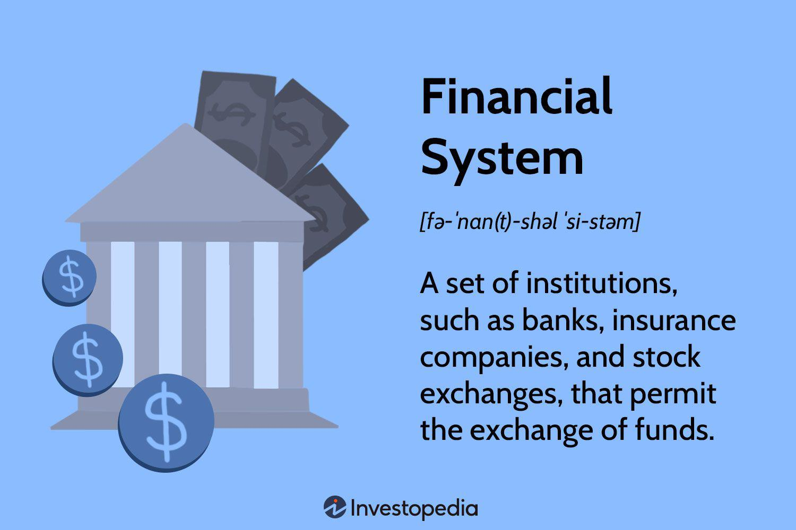

In today's fast-paced financial landscape, understanding the different types of financial systems, market components, and the role of algorithmic trading is crucial for both new and experienced investors. As global markets become increasingly interconnected, navigating the complex web of financial systems requires a nuanced grasp of the structures and entities that drive economic activity. This article aims to demystify these concepts, providing a comprehensive guide to financial systems and their components while exploring the impact of algorithmic trading on financial markets.

Financial systems are multifaceted entities comprising various institutions that facilitate the exchange and allocation of resources. Recognizing the intricacies of these systems, including the principles governing market operations and the entities involved, is essential for making informed investment decisions. This understanding encompasses analyzing the fundamental components and institutions—from stock exchanges and banks to insurance firms and regulatory bodies—that underpin these systems. Their interrelations play a significant role in shaping the efficiency and stability of markets.

Algorithmic trading, a transformative force in today's markets, leverages sophisticated algorithms to execute trades at unprecedented speeds, reshaping trading dynamics and presenting new challenges and opportunities. This article will illuminate how technological advancements in algorithmic trading are altering the landscape of financial markets, affecting liquidity, transaction costs, and how financial instruments are traded.

By the end of this article, readers will gain a clearer understanding of how financial systems operate and the vital role algorithmic trading plays in today's markets. Whether you're a novice investor or an experienced market participant, this exploration promises to enhance your comprehension of financial systems and help you harness them effectively. Let's explore the types of financial systems and their market components together.

## Table of Contents

## What Is a Financial System?

A financial system represents an intricate network of institutions, such as banks, insurance companies, and stock exchanges, instrumental in the facilitation and exchange of funds. At its core, a financial system serves as the backbone for the movement of capital, enabling the assessment, allocation, and channeling of resources from savers to borrowers, thus promoting economic growth and stability.

Financial systems operate across various levels, including firm-specific, regional, and global scales. On a firm-specific scale, financial systems are organized around individual businesses, focusing on their capacity to manage financial operations, investments, and growth strategies. This level is characterized by detailed financial management and accounting practices necessary for achieving a company's strategic financial goals.

Regionally, financial systems are composed of networks that include banks, credit unions, and other financial institutions functioning within a specific geographic area. These networks support regional economic activities by providing necessary financial services and products tailored to the needs of local businesses and individuals.

Globally, financial systems integrate into the broader international landscape, involving multinational institutions like the International Monetary Fund (IMF) and the World Bank. These entities provide financial stability and aid to countries, facilitating international trade, investment, and development initiatives. The globalization of financial systems promotes cross-border capital flows and influences global economic policies and regulations.

A financial system comprises various rules and practices, along with borrowers, lenders, and investors, all working synergistically to finance projects and generate returns on financial assets. This includes determining who provides the funding and the terms under which these financial exchanges occur. Understanding the structural organization of financial systems is crucial for effectively navigating investments, securing loans, and engaging in other financial activities. It enables participants to make informed financial decisions that align with their goals while adapting to changes in the broader economic environment.

## Types of Financial Systems

Financial systems can be systematically categorized based on their organizational structure, each offering distinct methodologies for the exchange, valuation, and regulation of assets. Understanding these types is crucial for comprehending how different economies manage and direct financial flows, affecting investment landscapes and economic stability.

Market-based systems are characterized by their reliance on supply and demand dynamics. In these systems, financial instruments are primarily exchanged through markets where prices are determined by the competitive interactions of buyers and sellers. Prominent examples include stock and bond markets, where the decentralized nature of transactions allows market-driven mechanisms to dictate asset prices. Such systems are typically supported by a network of intermediaries, such as brokers and dealers, who facilitate the smooth operation of exchanges. The United States is often cited as a model of a market-based financial system, where capital markets play a vital role in resource allocation and economic growth.

In contrast, centralized systems operate with a high degree of coordination from governing entities, whether governmental bodies or centralized banks. These systems depend on directed plans, where business managers or policymakers outline the flow of financial resources, set interest rates, and determine the availability of credit. Central planning can be advantageous in maintaining economic stability during times of crisis, as authorities can swiftly implement monetary policies to control inflation or stimulate growth. Centralized systems often feature prominently in countries with substantial state intervention in their economies, such as China, where government policies play a pivotal role in shaping financial interactions.

The hybrid model marries the principles of both market-based and centralized systems, aiming to capitalize on their respective strengths while mitigating their weaknesses. This approach allows for a level of market-driven activity within a regulated framework, creating a financial system that can be adaptable yet stable. The European Union exemplifies a hybrid financial system, incorporating elements of market competition within a regulated environment to ensure economic cohesion among member states. Hybrid models can provide greater flexibility in accommodating diverse economic conditions and regulatory environments, fostering robust and resilient financial ecosystems.

Each type of financial system has significant implications for how assets are valued and traded, consequently impacting investments and overall economic stability. Market-based systems tend to favor innovation and risk-taking due to their competitive nature, whereas centralized systems may focus on stability and long-term planning. Hybrid systems strive to balance these factors, attempting to harness the efficiency of markets with the oversight of regulatory bodies. Understanding these differences aids investors, policymakers, and scholars in navigating and fostering sustainable economic environments across the globe.

## Components of Financial Markets

Financial markets consist of a wide array of components that collectively facilitate the flow of capital and the allocation of resources essential for economic growth. The primary components include stock exchanges, banks, credit unions, and government treasuries. These entities provide platforms for trading financial instruments, offering credit and capital services crucial for leading-edge economic functions such as lending, borrowing, and investing.

### Stock Exchanges
Stock exchanges serve as marketplaces where securities such as stocks and bonds are bought and sold. They provide [liquidity](/wiki/liquidity-risk-premium), enabling investors to participate in the market by buying or selling shares easily. Prominent examples include the New York Stock Exchange (NYSE) and NASDAQ. These exchanges enforce rules and standards that ensure market integrity and protect investors' interests, thereby enhancing market stability.

### Banks and Credit Unions
Banks and credit unions are vital in financial intermediation by accepting deposits and providing loans. They assess credit risk and facilitate economic transactions, bridging the gap between depositors who want safe storage for their funds and borrowers who need liquidity. Banks also offer various products such as mortgages, personal loans, and lines of credit, which further aid consumer finance and economic development.

### Government Treasuries
Government treasuries are responsible for managing a country's economic resources, primarily through the issuance of government bonds. These instruments allow governments to raise funds to cover expenditures beyond their revenues. Treasury bonds, notes, and bills differ in terms of maturity and [interest rate](/wiki/interest-rate-trading-strategies), offering investors a relatively low-risk means to diversify their portfolios.

### Micro and Macro Financial Systems
At the micro level, firms have their financial systems comprising internal mechanisms like accounting and auditing, which are crucial for tracking financial performance. Effective financial management within firms ensures operational efficiency and informs strategic decision-making.

On a larger scale, financial markets are influenced by institutions such as the International Monetary Fund (IMF) and the World Bank, which play pivotal roles in maintaining global economic stability. The IMF aims to foster global monetary cooperation and financial stability, while the World Bank provides financial and technical assistance to developing countries to facilitate economic development and reduce poverty.

### Interaction and Market Stability
The interaction among these components, both independently and collaboratively, determines the overall health and functionality of financial markets. For instance, stock exchanges and banks work in tandem to channel funds from savers to entities requiring capital. At the same time, policies and support from institutions like the IMF and World Bank can stabilize markets during economic downturns or financial crises.

Maintaining a well-functioning financial market is crucial for economic stability, facilitating the effective allocation of resources and providing a reliable mechanism for pricing financial assets. The interaction among stock exchanges, banks, government treasuries, and global institutions underscores the complexity and interdependence of modern financial systems.

## The Role of Algorithmic Trading

Algorithmic trading, commonly referred to as algo trading, employs sophisticated computer algorithms to automate the execution of trading strategies, removing the need for direct human intervention in trade decisions. This method utilizes pre-defined criteria such as timing, price, and [volume](/wiki/volume-trading-strategy) to execute orders, optimizing the trading process across various financial markets.

The advent and evolution of electronic trading platforms have fundamentally transformed financial markets, allowing for significant enhancements in the speed and precision of trade execution. In contrast to manual trading processes, [algorithmic trading](/wiki/algorithmic-trading) systems can process vast amounts of data in real-time, reacting instantly to market conditions. This transformation has resulted in a substantial increase in trading volume, with algo trading contributing to a significant share of activity in global financial markets, particularly in equities and foreign exchange.

One of the primary benefits of algorithmic trading is its impact on market liquidity. By executing orders rapidly and efficiently, algorithmic trading helps ensure that sellers and buyers can transact with minimal delays, thereby improving market depth and reducing bid-ask spreads. Additionally, the automation of trades decreases transaction costs by minimizing human errors and operational latency that are often prevalent in manual trading. Moreover, since algorithmic trading removes human emotion from the equation, it fosters more consistent and rational trading decisions, avoiding the biases and impulsive mistakes that human traders might make under market stress.

Despite the many advantages, algorithmic trading is not without its challenges. The algorithms rely heavily on the underlying technology, which poses inherent risks, such as system failures or bugs that could lead to unintended trading behaviors and financial losses. Furthermore, the complexity of these algorithms can obscure understanding and oversight, making them susceptible to scrutiny by regulatory bodies that aim to safeguard market integrity. Regulators are tasked with ensuring that the prevalence of algorithmic trading does not compromise market transparency, fairness, or stability, particularly during volatile market conditions or events that might trigger flash crashes.

Algorithmic trading continues to shape the landscape of modern financial markets by offering efficient and low-cost trading solutions. However, balancing its technological advances with adherence to stringent regulatory requirements is essential to maintaining a healthy and robust trading environment. As both opportunities and challenges co-evolve, market participants must remain vigilant and well-informed, leveraging algo trading to enhance their investment strategies while being cognizant of associated risks.

## Benefits and Challenges of Algo Trading

Algorithmic trading has revolutionized the landscape of financial markets, offering numerous advantages while also presenting specific challenges. One of the primary benefits of algorithmic trading is its ability to enhance market efficiency. By executing trades at velocities unattainable by human traders, algorithmic systems can exploit short-lived market inefficiencies and opportunities. This rapid execution capability allows for better price discovery and increased market liquidity.

Moreover, algorithmic trading significantly reduces transaction costs. Large trade orders, when executed manually, can disrupt market prices. Algorithmic systems circumvent this by fragmenting large orders into smaller, more manageable trades, thereby minimizing the market impact and achieving a more favorable average execution price. This approach not only optimizes trade execution but also contributes to smoother market operations.

The absence of human emotion in algorithmic trading is another pivotal advantage. Human traders are often susceptible to psychological biases and emotional decision-making, which can result in irrational trading behavior. Algorithms, in contrast, make decisions based solely on pre-defined criteria and quantitative models, leading to more consistent and rational trading outcomes. This unemotional nature helps in maintaining discipline in volatile market conditions, ultimately enhancing the reliability of trading strategies.

Despite these advantages, algorithmic trading is not without risks. One of the significant challenges is the reliance on technology, which introduces the potential for systemic failures. Glitches, bugs, or unforeseen technical issues can lead to erroneous trades and substantial financial losses. Therefore, robust risk management frameworks and regular system audits are essential to mitigate these technological risks.

Regulatory scrutiny also poses a challenge for algorithmic trading. The sheer speed and complexity of algorithms can make it difficult for regulators to monitor and assess trading behaviors effectively. As a result, there is a growing need for stringent regulations and compliance measures to ensure that algorithmic trading does not compromise market fairness and stability.

Given both the benefits and challenges, a comprehensive understanding of algorithmic trading is critical for market participants. By recognizing the strengths of algorithmic trading, such as increased efficiency and cost reduction, alongside its technological and regulatory challenges, traders and institutions can better strategize and adapt to the evolving financial landscape. Embracing algorithmic advancements while addressing potential pitfalls will be crucial for participants aiming to succeed in modern markets.

## Conclusion: The Future of Financial Systems

Financial systems are essential to the operation of economies, as they serve as conduits that connect borrowers and lenders through a network of institutions, ranging from traditional banks to innovative financial technology companies. The modern financial landscape is characterized by rapid advancements in technology, particularly with the advent and rise of algorithmic trading. Algorithmic trading, which utilizes computer algorithms to execute trades with speed and precision, is reshaping financial markets by introducing new efficiencies and complexities.

The integration of algorithmic trading into financial systems presents both opportunities and challenges. On one hand, it offers enhanced trading capabilities, allowing for quicker execution, improved liquidity, and reduced transaction costs. This technological leap provides investors with the tools to craft more sophisticated and responsive investment strategies, aligning with the evolving market conditions. On the other hand, the reliance on algorithmic trading introduces potential risks such as technological malfunctions, increased market [volatility](/wiki/volatility-trading-strategies), and the need for stringent regulatory oversight to mitigate potential abuses.

To fully capitalize on the benefits of emerging technologies like algorithmic trading, market participants must remain informed about the ongoing changes within financial systems. Staying abreast of technological advancements allows investors and institutions to adapt their strategies, facilitating more effective and efficient trading practices. Moreover, embracing these innovations while being cognizant of the accompanying risks is vital for maintaining financial stability. A balanced approach that leverages the strengths of technology while safeguarding against its pitfalls will be key to success in the future financial ecosystem.

Looking ahead, the future of financial systems promises greater connectivity and efficiency. The continued integration of sophisticated technologies will likely lead to more interconnected global markets, offering enhanced access to financial services and driving economic growth. As financial systems evolve, the ability to harness technological advancements responsibly will determine their role in shaping a prosperous and stable economic future.

## References & Further Reading

[1]: Lopez de Prado, M. (2018). ["Advances in Financial Machine Learning."](https://www.amazon.com/Advances-Financial-Machine-Learning-Marcos/dp/1119482089) Wiley.

[2]: Chan, E. (2008). ["Quantitative Trading: How to Build Your Own Algorithmic Trading Business."](https://github.com/ftvision/quant_trading_echan_book) Wiley.

[3]: Jansen, S. (2020). ["Machine Learning for Algorithmic Trading."](https://github.com/stefan-jansen/machine-learning-for-trading) Packt Publishing.

[4]: Aronson, D. R. (2006). ["Evidence-Based Technical Analysis: Applying the Scientific Method and Statistical Inference to Trading Signals."](https://onlinelibrary.wiley.com/doi/book/10.1002/9781118268315) Wiley.

[5]: Bergstra, J., Bardenet, R., Bengio, Y., & Kégl, B. (2011). ["Algorithms for Hyper-Parameter Optimization."](https://dl.acm.org/doi/10.5555/2986459.2986743) Advances in Neural Information Processing Systems 24.