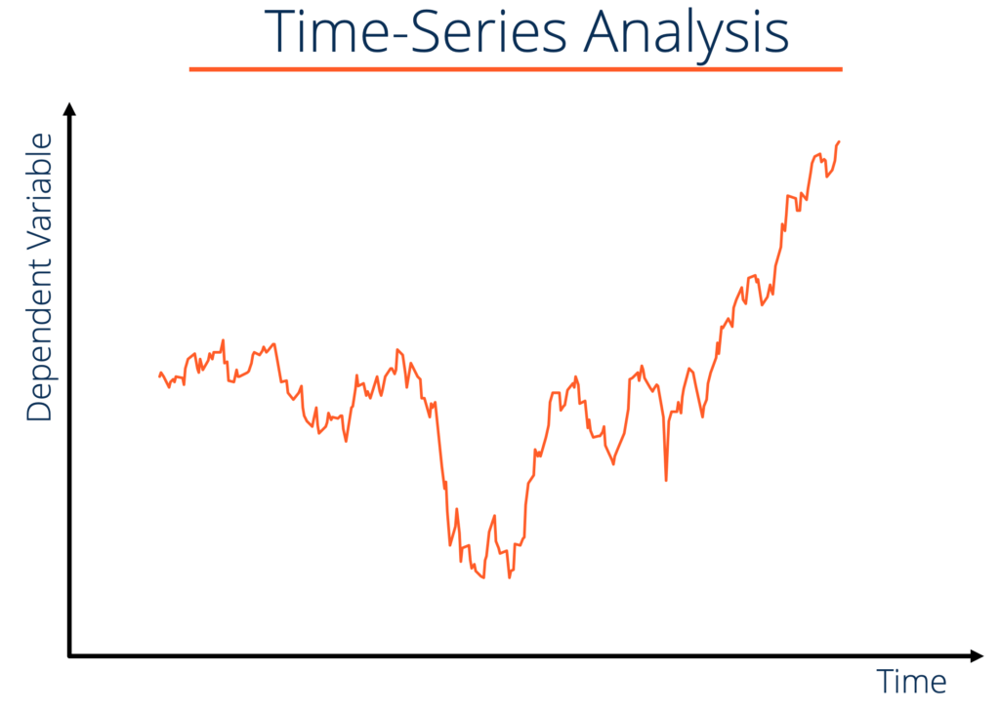

## Table of Contents

## What is financial time series analysis?

Financial time series analysis is a way to study and understand how financial data, like stock prices or interest rates, change over time. It helps people make better decisions about investing or managing money by looking at patterns and trends in the data. By using special math and computer tools, analysts can predict what might happen next with the data, which is really helpful for making smart choices in finance.

One important part of financial time series analysis is figuring out if the data follows a pattern or if it's just random. Analysts use different methods to see if there are any repeating cycles or trends. For example, they might look at how stock prices move up and down over days, weeks, or even years. Understanding these patterns can help investors know when to buy or sell stocks to make more money or avoid losing money.

Another key aspect is using the data to make predictions. By looking at past data, analysts can build models that guess future prices or trends. These models are not perfect, but they can give a good idea of what might happen. This is very useful for people who need to plan ahead, like investors or financial managers, because it helps them prepare for different possible outcomes in the financial markets.

## Why is time series analysis important in finance?

Time series analysis is really important in finance because it helps people understand how things like stock prices or interest rates change over time. By looking at past data, analysts can spot patterns and trends that show how these financial numbers move. This is super helpful for investors because they can use this information to make smarter choices about when to buy or sell investments. For example, if they see that a stock usually goes up in price during a certain time of year, they might decide to buy it before that time to make a profit.

Another reason time series analysis is important is that it helps in making predictions about the future. Analysts use special math and computer tools to build models that guess what might happen next with financial data. These predictions aren't always right, but they give a good idea of what could happen. This is really useful for financial planning because it helps people prepare for different situations. For instance, a bank might use these predictions to decide how much money to lend or how to manage their risks better.

## What are the basic components of a time series?

The basic components of a time series are trend, seasonality, cycle, and irregular fluctuations. The trend is the long-term direction that the data is moving in. It shows if the data is generally going up, down, or staying the same over a long period of time. For example, if you look at the stock price of a company over many years, the trend might show that the price is slowly increasing.

Seasonality refers to patterns that repeat at regular intervals, like every year, month, or week. These patterns are often influenced by things like holidays or weather. For instance, sales of winter coats might go up every year in the winter months. Cycles are similar to seasonality but they don't happen at fixed times and can last for different lengths of time. They might be caused by economic conditions or business cycles that affect the data.

Irregular fluctuations, or noise, are the random changes in the data that don't follow any pattern. These can be caused by unexpected events like a sudden news announcement or a natural disaster. Understanding these components helps analysts break down the time series data and make better predictions about what might happen in the future.

## How can one collect and prepare financial time series data?

Collecting financial time series data starts with deciding what kind of data you need, like stock prices, interest rates, or exchange rates. You can get this data from many places, like financial websites, stock exchanges, or special data services that sell detailed information. Once you know what data you want, you can download it or use software tools to pull it straight from the internet. It's important to make sure the data is correct and comes from a good source, so always check where it's coming from.

After collecting the data, you need to prepare it for analysis. This means cleaning the data to fix any mistakes or missing numbers. Sometimes, data might have gaps or wrong entries, so you'll need to fill in or correct those. Next, you organize the data in a way that makes it easy to work with, usually in a spreadsheet or a special time series format. You might also need to change the data into the same units or time periods, like turning daily data into weekly data if that's what you need. Preparing the data well makes sure your analysis will be accurate and helpful.

## What are some common statistical methods used in time series analysis?

Time series analysis uses a bunch of statistical methods to understand and predict how data changes over time. One common method is called moving averages, which smooths out the data to show the overall trend by averaging the values over a certain period. Another method is exponential smoothing, which gives more weight to recent data points, making it good for short-term forecasts. Autoregressive models, or AR models, look at how past values of the data can help predict future values. These models are great for understanding patterns in the data.

Another important method is the ARIMA model, which stands for AutoRegressive Integrated Moving Average. ARIMA combines the ideas of autoregression and moving averages and can handle data that changes over time in a more complex way. It's really useful for making long-term predictions. There's also something called seasonal decomposition, which breaks the data into trend, seasonal, and irregular parts. This helps analysts see what's causing the changes in the data and make better predictions.

Lastly, there are methods like spectral analysis, which looks at the data to find repeating cycles or patterns. This can be helpful for understanding things like economic cycles. And there's also the Granger causality test, which checks if one time series can help predict another. All these methods help analysts make sense of financial data and make better decisions about the future.

## How do moving averages help in analyzing financial time series?

Moving averages help in analyzing financial time series by smoothing out the data to show the overall trend more clearly. When you look at stock prices or other financial numbers, they can go up and down a lot from day to day. A moving average takes the average of these numbers over a certain period, like 10 days or 50 days, and it makes the ups and downs less sharp. This helps you see the bigger picture and understand if the price is generally going up, down, or staying the same over time.

In finance, moving averages are also used to make predictions about where prices might go next. For example, if a short-term moving average, like a 10-day average, crosses above a longer-term moving average, like a 50-day average, it might mean that the price is starting to go up more quickly. This can be a signal for investors to buy the stock. On the other hand, if the short-term average goes below the long-term average, it might mean the price is starting to fall, and investors might want to sell. By using moving averages, investors can make better decisions based on the trends they see in the data.

## What is the difference between ARIMA and SARIMA models?

ARIMA and SARIMA are both models used to predict how data changes over time, but they work a bit differently. ARIMA stands for AutoRegressive Integrated Moving Average. It's good for looking at data that changes in a regular way, but it doesn't handle patterns that repeat at certain times of the year very well. For example, if you're looking at stock prices, ARIMA can help you see the overall trend and make predictions, but it might miss out on things like how prices go up every December because of holiday shopping.

SARIMA, which stands for Seasonal AutoRegressive Integrated Moving Average, is a special kind of ARIMA that can handle these repeating patterns. It adds an extra part to the model that looks at the seasonal changes in the data. So, if you're looking at sales data and you know that sales always go up in the summer, SARIMA can take that into account and make better predictions. This makes SARIMA really useful for data where the time of year matters a lot, like in retail or tourism.

## How can one use time series decomposition for financial forecasting?

Time series decomposition is a way to break down financial data into different parts to understand it better. When you use it for financial forecasting, you split the data into four main pieces: trend, seasonality, cycle, and irregular parts. The trend shows the overall direction of the data, like if stock prices are going up over time. Seasonality shows patterns that happen at the same time every year, like how sales might go up during the holidays. Cycles are similar but don't happen at fixed times, like economic booms and busts. The irregular part is just the random ups and downs that don't fit into any pattern.

Once you have these parts, you can make better forecasts. By understanding the trend, you can predict where the data might be headed in the long run. If you know the seasonal patterns, you can guess how the data might change at certain times of the year. For example, if you see that a company's stock usually goes up in the summer, you can use that information to make a better guess about what might happen next summer. By taking out the irregular parts, your predictions can be more accurate because you're focusing on the patterns that matter. This way, time series decomposition helps you make smarter decisions about investing or managing money.

## What role do machine learning techniques play in financial time series analysis?

Machine learning techniques are really helpful in financial time series analysis because they can find patterns in big sets of data that are hard for people to see. These techniques can look at lots of different information at the same time, like stock prices, news, and economic reports, to make better predictions. For example, a [machine learning](/wiki/machine-learning) model can learn from past stock prices and other data to guess where prices might go next. This is useful for investors who want to make smart choices about buying or selling stocks.

Another way machine learning helps is by making models that can change and get better over time. As new data comes in, the models can learn from it and update their predictions. This means they can keep up with changes in the market, like new trends or big news events. By using machine learning, financial analysts can make more accurate forecasts and manage risks better, which is really important in the fast-changing world of finance.

## How can volatility clustering be identified and modeled in financial time series?

Volatility clustering in financial time series means that times when prices move a lot tend to happen close together, and times when prices don't move much also happen close together. To spot this, you can look at a chart of how much prices change over time, called the [volatility](/wiki/volatility-trading-strategies). If you see big changes happening one after another, and then smaller changes happening one after another, that's a sign of volatility clustering. Another way to see it is by using math to measure how much the price changes, like using the standard deviation of returns. If this measure shows big changes followed by more big changes, and small changes followed by more small changes, you've found volatility clustering.

To model volatility clustering, people often use something called a GARCH model, which stands for Generalized Autoregressive Conditional Heteroskedasticity. This model looks at how past volatility can help predict future volatility. It says that if there's been a lot of movement in prices recently, there's likely to be more movement soon. GARCH models are good at capturing this pattern because they can change their predictions based on what's happened before. By using a GARCH model, financial analysts can better understand and predict how much prices might move in the future, which helps them make smarter decisions about investing or managing risks.

## What are the advanced techniques for high-frequency financial time series analysis?

High-frequency financial time series analysis looks at data that changes very quickly, like stock prices that are updated every second or even faster. One advanced technique for this is called tick data analysis. This means looking at every single trade or price change, no matter how small, to understand what's happening in the market. By using tick data, analysts can see patterns that happen in just a few seconds or minutes, which can help them make quick decisions about buying or selling. Another technique is called microstructure analysis, which looks at how the market works at a very detailed level. This can include things like how orders are placed and filled, and how different traders interact with each other. Understanding these details can help predict short-term price movements and improve trading strategies.

Another important technique is machine learning, which can handle the huge amount of data that comes with high-frequency trading. Machine learning models can learn from past data to predict what might happen next, even with data that changes very quickly. These models can find patterns that are too complex for people to see on their own. For example, they might look at lots of different information at the same time, like stock prices, news, and trading volumes, to make better guesses about where prices are headed. By using these advanced techniques, traders and analysts can make more accurate predictions and manage risks better in the fast-paced world of high-frequency trading.

## How can one evaluate the performance of time series models in financial contexts?

To evaluate the performance of time series models in financial contexts, you need to look at how well the model's predictions match up with what actually happens. One common way to do this is by using something called the Mean Absolute Error (MAE). This measures the average difference between the predicted values and the real values. If the MAE is small, it means the model's predictions are pretty close to what actually happened, which is good. Another way is to use the Root Mean Square Error (RMSE), which also looks at the difference between predictions and real values but gives more weight to bigger mistakes. Both of these methods help you see if the model is doing a good job at guessing future prices or trends.

Another important thing to check is how well the model can predict the direction of changes, not just the exact numbers. This is called the Directional Accuracy, and it looks at whether the model correctly predicts if prices will go up or down. If the model gets the direction right most of the time, it can be really useful for making trading decisions. You can also use something called the Sharpe Ratio to see how well the model's predictions help with making money compared to the risk involved. A higher Sharpe Ratio means the model is doing a good job at balancing the potential rewards with the risks. By looking at all these different measures, you can get a good idea of how well your time series model is working in the world of finance.

## What are the methods and importance of Data Collection and Preprocessing?

Collecting high-quality historical and real-time data is a foundational element for financial time series analysis, as the reliability of trading models heavily depends on the accuracy and completeness of the data used. The first step in data collection involves identifying reputable data sources. Stock exchanges are primary providers of data, offering comprehensive historical and real-time pricing details. Market data providers, such as Bloomberg and Reuters, offer a broad spectrum of financial information, including stock prices, trading volumes, and financial statements. Third-party services can also supply niche datasets, such as social media sentiment or alternative market insights, which can enhance predictive analytics in [algorithmic trading](/wiki/algorithmic-trading).

Once data is collected, preprocessing is essential to ensure data integrity and suitability for analysis. This process starts with cleaning the data, which involves removing duplicates and rectifying inconsistencies. Managing missing values is critical, as incomplete data can skew analysis and prediction outcomes. Techniques such as interpolation or using machine learning models like k-nearest neighbors (KNN) can effectively address missing data issues. Handling outliers is another key aspect, as extreme values might represent data errors or rare market events. Statistical methods such as Z-score filtering or winsorizing can be applied to mitigate the impact of outliers.

Normalization is a crucial preprocessing step to scale data into a consistent format, facilitating comparisons across different datasets and ensuring algorithm stability. Min-max scaling is a common normalization technique, which rescales data to fit within a specific range [0, 1] using the formula:

$$
x_{\text{scaled}} = \frac{x - x_{\text{min}}}{x_{\text{max}} - x_{\text{min}}}
$$

Alternatively, z-score normalization standardizes data based on its mean and standard deviation, transforming the data into dimensions with a mean of zero and a standard deviation of one:

$$
z = \frac{x - \mu}{\sigma}
$$

In Python, these normalization techniques can be implemented using libraries such as pandas and scikit-learn. For min-max scaling:

```python
from sklearn.preprocessing import MinMaxScaler
import numpy as np

data = np.array([[100, 200, 400], [120, 220, 440], [130, 250, 480]])
scaler = MinMaxScaler()
normalized_data = scaler.fit_transform(data)
```

And for z-score normalization:

```python
from sklearn.preprocessing import StandardScaler

scaler = StandardScaler()
standardized_data = scaler.fit_transform(data)
```

Preprocessing financial time series data meticulously provides a clean, formatted, and accurately scaled dataset ready for further analysis and modeling, ultimately aiding in the development of robust algorithmic trading strategies.

## How can we model financial time series?

Modeling financial time series is a critical part of quantitative finance, providing valuable insights and predictive capabilities. Forecasting and volatility estimation are two primary applications in this field.

Autoregressive Integrated Moving Average (ARIMA) is a widely used statistical model for forecasting financial time series. ARIMA accounts for various standard temporal structures in the data through its parameters: autoregressive (AR), differencing (I), and moving average (MA). The general mathematical form of an ARIMA model, ARIMA(p, d, q), combines these components, where p represents the number of lag observations in the model, d signifies the number of times that the raw observations are differenced, and q stands for the size of the moving average window.

$$
X_t = c + \sum_{i=1}^p \phi_i X_{t-i} + \sum_{i=1}^q \theta_i \varepsilon_{t-i} + \varepsilon_t
$$

Here, $X_t$ is the output variable, $c$ is a constant, $\phi$ and $\theta$ are parameters, and $\varepsilon_t$ is a random error term.

For volatility estimation, the Generalized Autoregressive Conditional Heteroskedasticity (GARCH) model is prevalent. It captures time-varying volatility by modeling both the returns and the volatility itself. The standard GARCH(1,1) model can be represented as:

$$
\sigma_t^2 = \alpha_0 + \alpha_1 \varepsilon_{t-1}^2 + \beta_1 \sigma_{t-1}^2
$$

Where $\sigma_t^2$ is the conditional variance, $\alpha_0$, $\alpha_1$, and $\beta_1$ are parameters.

Machine learning approaches like Recurrent Neural Networks (RNNs), Support Vector Machines (SVMs), and Random Forests have also gained popularity in financial time series prediction. RNNs, particularly Long Short-Term Memory networks (LSTMs), are effective for sequential data due to their ability to capture dependencies across time. An LSTM network can be implemented in Python using libraries such as TensorFlow and Keras.

```python
from tensorflow.keras.models import Sequential
from tensorflow.keras.layers import LSTM, Dense

model = Sequential()
model.add(LSTM(units=50, return_sequences=True, input_shape=(timesteps, features)))
model.add(LSTM(units=50))
model.add(Dense(units=1))
model.compile(optimizer='adam', loss='mean_squared_error')
```

Support Vector Machines can be employed for financial time series classification tasks, while Random Forests, a type of ensemble learning method, are useful for regression and classification by constructing multiple decision trees.

Each modeling approach has unique strengths and can be selected based on the specific characteristics of the financial data and the trading objectives. For example, ARIMA is most suitable for modeling linear relationships, whereas machine learning methods excel at capturing complex patterns.

Combining models, known as ensemble methods, can enhance predictive performance and provide more robust trading signals. This approach involves aggregating predictions from different models, which can reduce model-specific biases and improve overall prediction accuracy. Leveraging these diverse models judiciously can lead to significant improvements in trading strategy development and optimization.

## How do Risk Management and Performance Metrics relate to each other?

Risk management is a crucial component of algorithmic trading, serving as a safeguard against market uncertainties and potential losses. Effective risk management strategies rely heavily on quantitative metrics to assess the potential risks and returns associated with trading strategies. Two of the most commonly used metrics in this domain are Value at Risk (VaR) and drawdown.

Value at Risk (VaR) is a statistical measure that quantifies the potential loss in value of a portfolio over a defined period for a given confidence interval. Mathematically, VaR can be expressed as:

$$
\text{VaR}_{\alpha} = - \text{Quantile}_{1-\alpha}(R)
$$

where $R$ is the return of the portfolio, and $\alpha$ is the confidence level. For instance, a daily VaR of 5% at the 95% confidence level suggests that there is a 95% probability that the portfolio will not lose more than 5% of its value in a single day.

Drawdown refers to the decline from a historical peak in portfolio value to a trough. It is commonly expressed as a percentage and serves as a measure of downside risk over a specified period. The maximum drawdown is often used as a key indicator to evaluate the risk of a trading strategy.

Performance metrics play a vital role in evaluating the efficiency and effectiveness of trading strategies. The Sharpe Ratio is a widely used performance metric that measures the average return earned in excess of the risk-free rate per unit of volatility or total risk. It is calculated using the formula:

$$
\text{Sharpe Ratio} = \frac{\overline{R} - R_f}{\sigma_R}
$$

where $\overline{R}$ is the expected portfolio return, $R_f$ is the risk-free interest rate, and $\sigma_R$ is the standard deviation of portfolio returns.

The Sortino Ratio is a variation of the Sharpe Ratio, specifically designed to differentiate harmful volatility from total overall volatility. Unlike the Sharpe Ratio, it only considers downside deviation, providing a better measure of risk-adjusted return when the return distribution is not symmetric. It is calculated as follows:

$$
\text{Sortino Ratio} = \frac{\overline{R} - R_f}{\sigma_D}
$$

where $\sigma_D$ is the standard deviation of downside volatility.

Consistent risk evaluation is essential to ensure that trading strategies are aligned with the trader's risk tolerance and investment goals. This involves continuously monitoring these metrics and adjusting the portfolio as needed to manage risk effectively. By integrating robust risk management practices and performance evaluation into algorithmic trading, traders can enhance their strategies’ resilience to market fluctuations and improve their overall success.

## References & Further Reading

[1]: Tsay, R. S. (2010). ["Analysis of Financial Time Series."](https://onlinelibrary.wiley.com/doi/book/10.1002/9780470644560) Wiley.

[2]: Engle, R. F. (1982). ["Autoregressive Conditional Heteroscedasticity with Estimates of the Variance of United Kingdom Inflation."](https://www.semanticscholar.org/paper/Autoregressive-conditional-heteroscedasticity-with-Engle/2ee6cb87fc81ecd78d161c4a92c9dfce00c8961c) Econometrica.

[3]: Box, G. E. P., & Jenkins, G. M. (1970). ["Time Series Analysis: Forecasting and Control."](https://link.springer.com/chapter/10.1057/9781137291264_6) Holden-Day.

[4]: Patel, J., Shah, S., Thakkar, P., & Kotecha, K. (2015). ["Predicting Stock and Stock Price Index Movement Using Trend Deterministic Data Preparation and Machine Learning Techniques."](https://www.sciencedirect.com/science/article/pii/S0957417414004473) Expert Systems with Applications.

[5]: Lopez de Prado, M. (2018). ["Advances in Financial Machine Learning."](https://www.amazon.com/Advances-Financial-Machine-Learning-Marcos/dp/1119482089) Wiley.

[6]: Ripley, B. D. (1996). ["Pattern Recognition and Neural Networks."](https://www.cambridge.org/core/books/pattern-recognition-and-neural-networks/4E038249C9BAA06C8F4EE6F044D09C5C) Cambridge University Press.

[7]: Shumway, R. H., & Stoffer, D. S. (2017). ["Time Series Analysis and Its Applications: With R Examples."](https://link.springer.com/book/10.1007/978-3-031-70584-7) Springer.

[8]: Hamilton, J. D. (1994). ["Time Series Analysis."](https://www.amazon.com/Time-Analysis-James-Douglas-Hamilton/dp/0691042896) Princeton University Press.