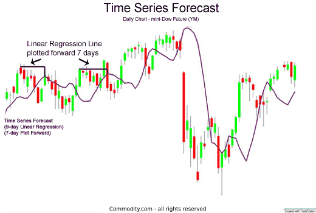

Financial time series forecasting is a foundational component of algorithmic trading, where the primary goal is to predict future market trends using historical data. This process is crucial as it provides the necessary insights to develop robust trading strategies that can operate autonomously with minimal human intervention. By accurately forecasting market movements, traders can make informed decisions, enhancing their ability to capitalize on potential opportunities and mitigate risks.

The methodologies employed in financial time series forecasting are diverse, encompassing various statistical and machine learning techniques. This article intends to explore these methodologies with a particular emphasis on their application in algorithmic trading. Key concepts, models, and implementation techniques will be discussed to provide a comprehensive understanding of how these methods can be harnessed to forecast market movements effectively. Resources such as QuantStart and Quantcademy, along with seminal books like "Successful Algorithmic Trading" and "Advanced Algorithmic Trading," will serve as valuable references for those seeking to further their knowledge in this domain.



The success of these forecasting techniques largely hinges on the quality of the historical data and the sophistication of the algorithms employed. By analyzing patterns within the data, these algorithms aim to make informed predictions about future market trends, thereby transforming raw data into actionable trading strategies. As we progress through the ensuing sections, we will delve into the key techniques, the importance of selecting good predictors, and a case study involving the S&P500. Furthermore, the challenges and considerations inherent in this field will be addressed, alongside a discussion of advanced techniques and potential future directions. This comprehensive exploration aims to equip readers with the necessary knowledge and tools to navigate the complex landscape of financial time series forecasting.

## Table of Contents

## Understanding Financial Time Series Forecasting

Financial time series forecasting is an essential process that leverages both statistical and machine learning techniques to predict future market behavior. This method is critical for developing automated trading strategies capable of operating with minimal human intervention, significantly increasing both efficiency and profitability in trading operations.

The basis of financial time series forecasting lies in analyzing patterns within historical data. This analysis is achieved through a set of algorithms that identify trends and inform predictions about future market trends. Statistical methods, such as autoregressive integrated moving average (ARIMA) models, and machine learning models, like Random Forests and Gradient Boosting, are commonly used to uncover these patterns. These models rely on the assumption that past market behaviors hold valuable information that can help anticipate future movements.

A financial time series is a sequence of data points, typically consisting of successive closing prices of a particular stock, index, or other financial instruments, collected at uniform time intervals. Common preprocessing steps include normalization and scaling, which ensure that all data inputs are on a comparable scale, and differencing, which helps to stabilize the mean of a time series by removing changes in the level of a series, thus making it stationary. 

The forecasting process can be expressed mathematically, where the goal is to estimate a function $f$ that maps historical data $X$ to future outcomes $Y$. Formally, for a given dataset $D = \{(X_i, Y_i)\}$, where $i$ indexes time periods, the model attempts to minimize some error metric $L$, such as mean squared error, through:

$$
\min_{f} \sum_{i} L(Y_i, f(X_i))
$$

The success of financial time series forecasting largely depends on the robustness of the models and the quality of data used. Machine learning methods are particularly advantageous in dealing with non-linear relationships that are often present in financial data, enabling the capture of complex patterns that may not be apparent with traditional statistical techniques.

Developing automated trading systems around these forecasts requires careful model training and selection. Such systems are designed to autonomously execute trades based on the predictive signals derived from the forecasting models, achieving quick responses to market fluctuations. This autonomous capability is particularly useful for high-frequency trading strategies, where the speed of decision-making is paramount to exploiting ultra-short-term market inefficiencies.

In summary, financial time series forecasting is a sophisticated process that underpins the ability to make informed predictions about financial markets. By utilizing appropriate models and techniques, traders can derive significant insights that aid in formulating effective and profitable trading strategies.

## Key Techniques in Forecasting

Supervised learning techniques, such as Logistic Regression, Linear Discriminant Analysis (LDA), and Quadratic Discriminant Analysis (QDA), are widely employed in financial time series forecasting due to their adaptability and efficiency. These techniques, integral to predicting financial markets, utilize historical data to identify patterns and extrapolate future movements. Each method has distinct characteristics that cater to varied forecasting needs.

Logistic Regression is primarily used for binary classification problems, making it effective for scenarios where the objective is to predict categorical outcomes, such as the direction of stock price movement. It models the probability that a given input point belongs to a particular category and employs the logistic function for the prediction task. For instance, in Python, one can implement logistic regression using the `scikit-learn` library:

```python
from sklearn.linear_model import LogisticRegression
model = LogisticRegression()
model.fit(X_train, y_train)
y_pred = model.predict(X_test)
```

Contrarily, Linear Discriminant Analysis (LDA) is employed when the goal is to find a linear combination of features that best separates two or more classes. LDA assumes Gaussian-distributed predictors and is especially effective when different classes have similar covariance structures. It seeks to maximize the ratio of the variance between the classes to the variance within the classes, thus optimizing class separability:

```python
from sklearn.discriminant_analysis import LinearDiscriminantAnalysis
lda = LinearDiscriminantAnalysis()
lda.fit(X_train, y_train)
y_pred = lda.predict(X_test)
```

Quadratic Discriminant Analysis (QDA) extends LDA by allowing each class to have its own covariance matrix, offering greater flexibility when class distributions have distinct variances. This method outperforms in scenarios with non-linear decision boundaries:

```python
from sklearn.discriminant_analysis import QuadraticDiscriminantAnalysis
qda = QuadraticDiscriminantAnalysis()
qda.fit(X_train, y_train)
y_pred = qda.predict(X_test)
```

The choice of technique relies on the dataset's characteristics and the desired outcome. For instance, if linear boundaries suffice in classification tasks, LDA might be preferred for its simplicity and speed. Conversely, for more complex class divisions, QDA's ability to handle non-linearity might prove advantageous.

Predictive accuracy is evaluated using metrics such as the hit rate, which indicates the proportion of correct forecasts, and the mean-squared error (MSE), which measures prediction deviation from actual values. The hit rate is a straightforward measure to gauge directional accuracy, while MSE provides insight into the magnitude of prediction errors, crucial for risk management and model selection. Calculated as:

$$
\text{MSE} = \frac{1}{n} \sum_{i=1}^n (y_i - \hat{y}_i)^2
$$

where $y_i$ is the actual value, $\hat{y}_i$ is the forecasted value, and $n$ is the total number of observations.

Choosing the appropriate technique and accurately measuring performance are vital for developing reliable forecasting models that can adapt to financial markets' inherent [volatility](/wiki/volatility-trading-strategies) and complexity.

## The Importance of Good Predictors

The choice of predictors is fundamental to the efficacy of financial time series forecasting models. Predictors are the variables that the forecasting model uses to estimate future market behaviors, and selecting the right predictors directly influences the accuracy and reliability of the forecasting outcomes. Poorly selected predictors can lead to erroneous predictions and potentially substantial financial losses.

In financial time series, common predictors include time lags of stock returns and trading [volume](/wiki/volume-trading-strategy). Time lags of stock returns refer to the past prices or returns of a stock which might influence the current or future values, forming a basis for historical trend analysis. Trading volume, the quantity of shares or contracts traded over a given period, often serves as an indicator of market [liquidity](/wiki/liquidity-risk-premium) and investor interest, impacting price movements.

The selection of predictors is highly dependent on market conditions and the specific goals of the trading strategy. For example, in a bullish market, [momentum](/wiki/momentum) indicators based on the trend strength might be preferable, whereas in a volatile market, predictors that gauge historical volatility or investor sentiment could be more pertinent. 

Mathematical representation of predictors can come in many forms depending on the statistical or [machine learning](/wiki/machine-learning) models being used. In a multiple linear regression model, predictors $X_1, X_2, \ldots, X_n$ can be incorporated as follows:

$$
Y = \beta_0 + \beta_1 X_1 + \beta_2 X_2 + \ldots + \beta_n X_n + \epsilon
$$

where $Y$ is the dependent variable (e.g., future price or return), $\beta_i$ are the coefficients that the model learns, and $\epsilon$ is the error term representing the model's deviation from actual outcomes.

In Python, selecting the appropriate predictors and implementing a logistic regression model to forecast directional price movement might look like this:

```python
import pandas as pd
from sklearn.model_selection import train_test_split
from sklearn.linear_model import LogisticRegression

# Assume 'df' is a DataFrame containing historical financial data
# 'returns_lag1', 'returns_lag2', ..., 'trading_volume' are predictor columns

X = df[['returns_lag1', 'returns_lag2', 'trading_volume']]
y = df['direction'] # Binary response indicating price movement direction

X_train, X_test, y_train, y_test = train_test_split(X, y, test_size=0.2, random_state=42)

model = LogisticRegression()
model.fit(X_train, y_train)

# Predicting price direction
predictions = model.predict(X_test)
```

It is crucial to continually evaluate the significance of predictors through metrics like p-values in regression, feature importance in tree-based models, or coefficients in linear models. This ensures the model remains robust and effective across various market conditions.

## Forecasting S&P500: A Case Study

The S&P500 index is a central focus for financial forecasting due to its significant liquidity and comprehensive representation of the U.S. stock market. This section examines the application of logistic regression, Linear Discriminant Analysis (LDA), and Quadratic Discriminant Analysis (QDA) to forecast the directional movement of the S&P500 index. Implementing these models effectively requires a combination of statistical knowledge and practical coding skills, particularly in Python using libraries such as NumPy, pandas, and scikit-learn. 

Logistic regression is a fundamental supervised learning technique that predicts a binary outcome from a linear combination of predictor variables. For forecasting S&P500, logistic regression can be applied to predict whether the index will move up or down. The logistic regression model is defined as:

$$

P(Y=1|X) = \frac{1}{1 + e^{-(\beta_0 + \beta_1 X_1 + \beta_2 X_2 + \ldots + \beta_n X_n)}}
$$

Where $P(Y=1|X)$ is the probability that the index increases, and $X_1, X_2, \ldots, X_n$ represent the predictor variables such as historical returns or trading volumes.

LDA, another method to predict categorical outcomes, assumes that the predictors are normally distributed and different classes share the same covariance matrix. The decision boundary of LDA is linear, and it seeks to model the difference between the class means. 

QDA, in contrast, does not assume equal covariance among classes and thus fits a quadratic decision boundary. This flexibility allows QDA to model more complex relationships in the data but can lead to overfitting, especially with small datasets.

To practically implement these models for the S&P500 forecasting task, the following Python script provides a roadmap. It creates the models using the scikit-learn library after pre-processing historical data with pandas and numerical operations with NumPy:

```python
import numpy as np
import pandas as pd
from sklearn.model_selection import train_test_split
from sklearn.preprocessing import StandardScaler
from sklearn.linear_model import LogisticRegression
from sklearn.discriminant_analysis import LinearDiscriminantAnalysis as LDA
from sklearn.discriminant_analysis import QuadraticDiscriminantAnalysis as QDA
from sklearn.metrics import accuracy_score

# Placeholder for loading S&P500 dataset
# data = pd.read_csv('SP500_data.csv')
# X = data.drop('Direction', axis=1)
# y = data['Direction']

# For illustration, assume X and y are properly defined
X_train, X_test, y_train, y_test = train_test_split(X, y, test_size=0.2, random_state=42)

# Feature scaling
scaler = StandardScaler()
X_train_scaled = scaler.fit_transform(X_train)
X_test_scaled = scaler.transform(X_test)

# Initialize models
logistic_model = LogisticRegression()
lda_model = LDA()
qda_model = QDA()

# Fit models
logistic_model.fit(X_train_scaled, y_train)
lda_model.fit(X_train_scaled, y_train)
qda_model.fit(X_train_scaled, y_train)

# Predict and evaluate
logistic_pred = logistic_model.predict(X_test_scaled)
lda_pred = lda_model.predict(X_test_scaled)
qda_pred = qda_model.predict(X_test_scaled)

print(f"Logistic Regression Accuracy: {accuracy_score(y_test, logistic_pred):.2f}")
print(f"LDA Accuracy: {accuracy_score(y_test, lda_pred):.2f}")
print(f"QDA Accuracy: {accuracy_score(y_test, qda_pred):.2f}")
```

In this script, the dataset is first split into training and testing sets to evaluate model performance. Feature scaling is critical to ensure that all predictors have the same scale and range, which significantly impacts models like logistic regression and neural networks. The logistic regression, LDA, and QDA models are then trained and evaluated on the test data, with accuracy metrics being used to assess their performance.

Ultimately, these techniques serve as a foundation for more advanced predictive modeling in financial markets, offering quantitative analysts tools to assess market trends and make informed trading decisions.

## Challenges and Considerations in Forecasting

Building a reliable financial forecaster involves tackling a myriad of challenges, prominent among which are overfitting, data quality, and market volatility. Each of these elements poses distinct obstacles that can significantly affect the accuracy and effectiveness of forecasting models.

Overfitting is a common pitfall in statistical modeling, occurring when a model is excessively complex and captures noise rather than the underlying data pattern. This complexity can lead to unfavorable generalization on unseen data, rendering the model ineffective in real-world scenarios. To mitigate overfitting, techniques such as regularization and cross-validation are employed. Regularization methods, like Lasso (Least Absolute Shrinkage and Selection Operator) and Ridge, add a penalty to the model's complexity, helping to simplify it without sacrificing predictive power. Cross-validation involves partitioning the dataset into multiple subsets to validate the model multiple times, ensuring it performs well across different data splits.

Data quality is another critical [factor](/wiki/factor-investing), as the accuracy of forecasts is directly linked to the quality of the input data. Financial data can often be incomplete, noisy, or biased, leading to erroneous forecasts. Therefore, preprocessing steps such as data cleaning, normalization, and the handling of missing values are imperative. It is crucial to assess data provenance to ensure its reliability and validity before utilizing it in modeling efforts.

Market volatility presents a dynamic challenge, as rapid price fluctuations can impact the predictive accuracy of financial models. Models should be agile enough to adapt to these swift changes. Techniques like robust statistical methods and adaptive algorithms can help in maintaining the model’s performance despite volatile market conditions.

In developing forecasting models, practitioners must also factor in trading execution strategies and transaction costs, as these can significantly influence the practical profitability of a trading strategy. Execution strategies determine how orders are placed in the market, affecting the execution price and, consequently, the returns. Transaction costs, such as brokerage fees and slippage, should be meticulously considered, as these can erode the expected profits.

To sum up, creating a reliable financial time series forecaster demands a careful balance of model complexity, data integrity, market adaptability, and consideration of practical trading mechanics. These considerations are essential to ensure that the predictions not only reflect historical trends but also hold up under real-world trading conditions.

## Advanced Techniques and Future Directions

As financial forecasting evolves, the integration of advanced models and technologies enhances the accuracy and reliability of predictions. Neural networks, support vector machines (SVM), and ensemble methods are at the forefront of these advancements. Each technique offers unique strengths, addressing various complexities inherent in financial data.

Neural networks, particularly [deep learning](/wiki/deep-learning) architectures, are adept at capturing non-linear relationships within time series data. Their ability to process large amounts of data with intricate patterns makes them suitable for financial forecasting where market indicators and external variables present immense complexity. For instance, [long short](/wiki/equity-long-short)-term memory (LSTM) networks, a type of recurrent [neural network](/wiki/neural-network), are particularly effective for time series data due to their capability to remember long-term dependencies.

```python
from keras.models import Sequential
from keras.layers import LSTM, Dense
import numpy as np

# Example of an LSTM model in Python
model = Sequential()
model.add(LSTM(50, input_shape=(timestep, features)))
model.add(Dense(1))  # Single output for prediction
model.compile(optimizer='adam', loss='mse')

# Assuming X_train and y_train are preprocessed datasets
model.fit(X_train, y_train, epochs=100, batch_size=64)
```

Support vector machines are favored for their capacity to handle high-dimensional spaces, making them useful when dealing with a large number of predictors typical in financial datasets. SVMs can efficiently model complex boundaries between different market states.

Ensemble methods, such as random forests and boosting algorithms, exploit multiple models to enhance prediction accuracy. These methods work by combining the output of several base models to improve generalization over a single predictive model, thus reducing the risk of overfitting, which is a frequent issue in financial forecasting due to noise and market volatility.

Moreover, the incorporation of big data analytics and [artificial intelligence](/wiki/ai-artificial-intelligence) is transforming how financial forecasting is approached. By leveraging vast datasets and advanced computational techniques, these technologies enhance model accuracy and robustness. The use of real-time data and sentiment analysis enables forecasters to account for market dynamics and news events that influence market movements rapidly.

Looking ahead, the potential for further advances in this domain is substantial. Techniques such as [reinforcement learning](/wiki/reinforcement-learning), where models continuously learn and adapt based on trading outcomes, are beginning to gain traction. Additionally, quantum computing holds promise for financial modeling by offering computational power to solve complex problems currently beyond the reach of classical computers.

As these technologies mature, they will offer financial practitioners more precise tools and approaches, reshaping the landscape of [algorithmic trading](/wiki/algorithmic-trading) and financial forecasting. Future articles will offer detailed explorations of these advanced methods, helping traders and analysts harness cutting-edge forecasting technologies to refine their trading strategies and improve market prediction accuracy.

## Conclusion

Financial time series forecasting stands as a pivotal aspect of modern trading strategies, primarily owing to the significant benefits it provides when correctly implemented. By leveraging historical data and applying sophisticated forecasting models, traders can extract valuable market insights. These insights facilitate informed decision-making and the formulation of profitable trading strategies. The accurate predictions of market trends and movements enable traders to manage risks and optimize returns effectively.

Advanced algorithms, such as logistic regression, neural networks, and support vector machines, empower traders to handle complex datasets and capture intricate patterns that are not evident through traditional analysis methods. With these techniques and tools, traders achieve a robust framework for anticipating market changes, allowing for strategic planning and execution.

The dynamic nature of financial markets necessitates continuous education and adaptation. New methods and technologies continually emerge, reshaping forecasting paradigms and presenting novel opportunities for market engagement. Staying abreast of these developments is critical for maintaining a competitive edge. As traders and researchers refine their approaches and embrace innovations, they ensure resilience and success in a constantly evolving financial landscape. The integration of artificial intelligence and big data analytics further enhances the predictive power of models, opening avenues for exploration and expertise refinement.

## References & Further Reading

[1]: ["QuantStart - Algorithmic Trading, Quantitative Trading, Systematic Trading."](https://www.quantstart.com/)

[2]: ["Quantcademy."](https://www.quantstart.com/quantcademy/)

[3]: ["Successful Algorithmic Trading"](https://www.investopedia.com/articles/active-trading/101014/basics-algorithmic-trading-concepts-and-examples.asp) by Michael L. Halls-Moore

[4]: ["Advanced Algorithmic Trading: Successfully Build Your Own Algorithmic Trading Business"](https://www.quantifiedstrategies.com/how-to-build-an-algorithmic-trading-strategy/) by Kevin J. Davey

[5]: Box, G. E. P., Jenkins, G. M., & Reinsel, G. C. (2015). ["Time Series Analysis: Forecasting and Control."](https://onlinelibrary.wiley.com/doi/book/10.1002/9781118619193) Wiley.

[6]: Hastie, T., Tibshirani, R., & Friedman, J. (2009). ["The Elements of Statistical Learning: Data Mining, Inference, and Prediction."](https://link.springer.com/book/10.1007/978-0-387-84858-7) Springer.

[7]: Lopez de Prado, M. (2018). ["Advances in Financial Machine Learning."](https://books.google.com/books/about/Advances_in_Financial_Machine_Learning.html?id=oU9KDwAAQBAJ) Wiley.

[8]: Jansen, S. (2020). ["Machine Learning for Algorithmic Trading: Predictive Models to Extract Signals from Market and Alternative Data for Systematic Trading Strategies with Python."](https://github.com/stefan-jansen/machine-learning-for-trading) Packt Publishing.