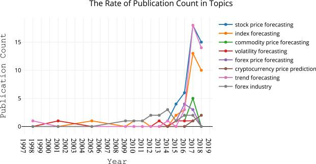

## Table of Contents

## What is financial time series forecasting?

Financial time series forecasting is about predicting future values of financial data, like stock prices or exchange rates, using past data. It's like trying to guess what will happen next based on what has happened before. People use different methods, such as looking at patterns in the data or using math models, to make these predictions.

This kind of forecasting is important for investors and businesses because it helps them make better decisions. If you can predict that a stock price will go up, you might want to buy it now. But it's not easy because financial markets can be unpredictable and influenced by many things, like news or economic changes. So, while forecasting can be helpful, it's not perfect and comes with risks.

## Why is financial time series forecasting important in finance?

Financial time series forecasting is really important in finance because it helps people make smarter choices about money. If you can guess what stock prices or interest rates might do next, you can decide whether to buy, sell, or hold onto your investments. This is super helpful for anyone who wants to grow their money, like investors or big companies. By looking at past numbers and patterns, they can try to figure out what might happen in the future and plan accordingly.

But it's not just about making money. Forecasting also helps in managing risks. If you know there's a chance that the market might go down, you can take steps to protect your investments. This is important for banks and financial institutions that need to keep their customers' money safe. Even though forecasting isn't perfect and things can change unexpectedly, it gives people a way to be more prepared and make better financial decisions.

## What are the basic types of financial time series data?

Financial time series data can be broken down into a few main types. The first type is price data, which includes things like stock prices, commodity prices, and currency exchange rates. This data shows how the value of something changes over time. For example, if you're looking at stock prices, you might see how the price of a company's stock goes up and down every day.

Another type is volume data, which tells you how much of something was traded or sold. For stocks, volume data shows how many shares were bought and sold on a given day. This can give you an idea of how interested people are in that stock. Besides price and volume, there's also data on interest rates, which affects how much it costs to borrow money, and economic indicators, like unemployment rates or GDP growth, which give you a bigger picture of the economy's health.

These different types of data are important because they help people understand what's happening in the financial world. By looking at price data, volume data, interest rates, and economic indicators, people can make better guesses about what might happen next and make smarter decisions with their money.

## What are common statistical methods used for time series forecasting?

One common statistical method for time series forecasting is the moving average. This method looks at the average of past data points over a certain period to smooth out short-term changes and highlight longer-term trends. For example, if you want to predict next month's sales, you might look at the average sales of the last three months. This helps to see the overall direction without getting distracted by small ups and downs.

Another method is the autoregressive model, which uses past values of the time series to predict future values. It's like saying that what happened in the past can help us guess what will happen next. For instance, if a stock price has been going up for the last few days, an autoregressive model might predict that it will keep going up. This method is useful because it can capture patterns in the data, but it assumes that these patterns will continue, which isn't always true.

A third method is the ARIMA model, which stands for AutoRegressive Integrated Moving Average. This combines the ideas of autoregressive models and moving averages, and it also includes a step to make the data more stable by removing trends and seasonal patterns. ARIMA is powerful because it can handle a lot of different kinds of data, but it can be tricky to set up correctly. It's like using a more advanced tool that can give better predictions if you know how to use it right.

## How does one preprocess financial time series data?

Preprocessing financial time series data means getting it ready so you can use it to make predictions. First, you need to clean the data. This means checking for any missing values or strange numbers that don't make sense. If you find any, you might need to fill in the missing values or fix the strange ones. It's like making sure all your homework is neat before you turn it in. You also need to make sure the data is in the right order, from oldest to newest, because time series data is all about what happens over time.

Next, you might need to change the data to make it easier to work with. This could mean making all the numbers the same size by a process called normalization, or taking out any big trends or seasonal patterns so you can see the smaller changes more clearly. It's like zooming in on a picture to see the details better. Once your data is clean and ready, you can start using it to make predictions about what might happen next in the financial world.

## What are the key performance metrics for evaluating forecasting models?

When you want to see how good your forecasting model is, you look at some key performance metrics. One important metric is the Mean Absolute Error (MAE). This tells you, on average, how far off your predictions are from what actually happened. If your MAE is low, it means your model is pretty good at guessing the right numbers. Another metric is the Root Mean Square Error (RMSE), which also measures how far off your predictions are, but it puts more weight on bigger mistakes. So if you have a few really bad predictions, your RMSE will be higher.

Another useful metric is the Mean Absolute Percentage Error (MAPE), which shows the average error as a percentage of the actual values. This is helpful because it gives you a sense of how big your mistakes are compared to what you were trying to predict. For example, a 5% error might be okay for some things but not for others. Finally, there's the R-squared value, which tells you how much of the changes in the data your model can explain. A higher R-squared means your model is doing a good job of capturing what's going on in the data. By looking at these metrics, you can see how well your model is working and where you might need to make improvements.

## What is the difference between univariate and multivariate time series forecasting?

Univariate time series forecasting is when you use just one type of data to make predictions. For example, if you're trying to guess what the price of a stock will be next month, you might only look at past prices of that stock. It's like trying to predict the weather by only looking at temperature data. Univariate forecasting is simpler because you're only dealing with one thing, but it might not be as accurate because it doesn't consider other factors that could affect the stock price, like news or economic changes.

Multivariate time series forecasting, on the other hand, uses more than one type of data to make predictions. So, if you're still trying to guess the future price of a stock, you might look at the stock's past prices, but also at things like the company's earnings, interest rates, and even the overall stock market trends. It's like predicting the weather by looking at temperature, humidity, and wind speed all together. Multivariate forecasting can be more accurate because it takes into account more information, but it's also more complicated because you have to figure out how all these different pieces of data work together.

## How can machine learning improve financial time series forecasting?

Machine learning can make financial time series forecasting better by finding patterns in data that are too hard for people to see. It's like having a super smart friend who can look at a lot of numbers and find hidden clues about what might happen next. For example, machine learning can look at things like stock prices, news articles, and even social media posts to figure out if a stock is going to go up or down. This is much more than what you can do just by looking at past prices, which is what traditional methods often do.

Also, machine learning models can learn and get better over time. If the model makes a wrong guess, it can learn from its mistake and do better next time. This means that the more data the model sees, the better its predictions can become. It's like practicing a sport; the more you practice, the better you get. This ability to improve makes machine learning a powerful tool for anyone trying to predict what will happen in the financial world.

## What are some advanced models used in financial time series forecasting, such as ARIMA and GARCH?

ARIMA, which stands for AutoRegressive Integrated Moving Average, is a popular model for predicting future values in financial time series. It looks at past data to see if there are any patterns or trends that can help guess what will happen next. ARIMA is good because it can handle data that changes over time, like stock prices or sales numbers. It does this by using three main parts: the autoregressive part looks at past values to predict future ones, the moving average part smooths out short-term changes, and the integrated part helps make the data more stable by removing trends. This makes ARIMA a powerful tool, but it can be tricky to set up correctly because you need to pick the right settings for each part.

GARCH, which stands for Generalized Autoregressive Conditional Heteroskedasticity, is another advanced model that's really useful for financial data. It's especially good at predicting how much the data might move around, which is important for things like stock prices that can be very unpredictable. GARCH looks at past changes in the data to guess how much the data might change in the future. This is helpful for figuring out how risky an investment might be. While GARCH can be a bit complicated to understand and set up, it's great for anyone who needs to know not just what might happen next, but how sure they can be about that guess.

## How do you handle seasonality and trends in financial time series data?

Handling seasonality and trends in financial time series data is important because these patterns can affect how you make predictions. Seasonality means that certain things happen at the same time every year, like how sales might go up during the holidays. To deal with seasonality, you can use a method called seasonal adjustment. This means taking out the seasonal patterns from the data so you can see what's really happening underneath. For example, if you know that sales always go up in December, you can adjust your data to see if there's any other trend happening that month.

Trends are long-term changes in the data, like how a company's stock price might slowly go up over time. To handle trends, you can use a method called differencing. This means subtracting the previous value from the current value to see how much the data has changed. By doing this, you can make the data more stable and easier to work with. For instance, if a stock's price is always increasing a little bit each month, differencing can help you see if there are any other changes happening that you might miss if you just looked at the raw numbers. Both seasonality and trends are important to consider because they can help you make better guesses about what might happen next in the financial world.

## What are the challenges of real-time financial forecasting and how can they be addressed?

Real-time financial forecasting is hard because the data keeps changing all the time. Imagine trying to guess the next number in a game where the rules keep changing every second. Financial markets are affected by news, social media, and other things that can change quickly. This makes it tough to keep your predictions up to date. Also, real-time data can have mistakes or missing parts, which can mess up your guesses if you don't fix them fast.

To deal with these challenges, you need to use special tools and methods. One way is to use machine learning models that can learn from new data as it comes in. These models can update their guesses quickly, kind of like how you might change your mind after hearing new information. Another way is to have systems that clean and check the data in real-time, so you can fix any mistakes before they cause problems. By doing these things, you can make your real-time financial forecasts more accurate and helpful.

## How can ensemble methods enhance the accuracy of financial time series forecasts?

Ensemble methods can make financial time series forecasts more accurate by combining the predictions from different models. Imagine you have a bunch of friends trying to guess the outcome of a game. Some might be good at guessing based on past scores, while others might be good at reading the current mood of the players. If you take all their guesses and combine them, you're likely to get a better prediction than if you just listened to one friend. In the same way, ensemble methods take the predictions from different forecasting models and blend them together to get a more reliable forecast.

These methods work because they can balance out the weaknesses of individual models. No single model is perfect, and each might make mistakes in different ways. By using ensemble methods, you can reduce the chance of making big errors because the different models will often make different kinds of mistakes. This means that the combined prediction is usually more accurate and helps you make better financial decisions. It's like having a team of experts working together to give you the best possible advice.

## What is Understanding Financial Time Series Forecasting?

Financial time series forecasting is an essential process that leverages both statistical and machine learning techniques to predict future market behavior. This method is critical for developing automated trading strategies capable of operating with minimal human intervention, significantly increasing both efficiency and profitability in trading operations.

The basis of financial time series forecasting lies in analyzing patterns within historical data. This analysis is achieved through a set of algorithms that identify trends and inform predictions about future market trends. Statistical methods, such as autoregressive integrated moving average (ARIMA) models, and machine learning models, like Random Forests and Gradient Boosting, are commonly used to uncover these patterns. These models rely on the assumption that past market behaviors hold valuable information that can help anticipate future movements.

A financial time series is a sequence of data points, typically consisting of successive closing prices of a particular stock, index, or other financial instruments, collected at uniform time intervals. Common preprocessing steps include normalization and scaling, which ensure that all data inputs are on a comparable scale, and differencing, which helps to stabilize the mean of a time series by removing changes in the level of a series, thus making it stationary. 

The forecasting process can be expressed mathematically, where the goal is to estimate a function $f$ that maps historical data $X$ to future outcomes $Y$. Formally, for a given dataset $D = \{(X_i, Y_i)\}$, where $i$ indexes time periods, the model attempts to minimize some error metric $L$, such as mean squared error, through:

$$
\min_{f} \sum_{i} L(Y_i, f(X_i))
$$

The success of financial time series forecasting largely depends on the robustness of the models and the quality of data used. Machine learning methods are particularly advantageous in dealing with non-linear relationships that are often present in financial data, enabling the capture of complex patterns that may not be apparent with traditional statistical techniques.

Developing automated trading systems around these forecasts requires careful model training and selection. Such systems are designed to autonomously execute trades based on the predictive signals derived from the forecasting models, achieving quick responses to market fluctuations. This autonomous capability is particularly useful for high-frequency trading strategies, where the speed of decision-making is paramount to exploiting ultra-short-term market inefficiencies.

In summary, financial time series forecasting is a sophisticated process that underpins the ability to make informed predictions about financial markets. By utilizing appropriate models and techniques, traders can derive significant insights that aid in formulating effective and profitable trading strategies.

## What are the key techniques in forecasting?

Supervised learning techniques, such as Logistic Regression, Linear Discriminant Analysis (LDA), and Quadratic Discriminant Analysis (QDA), are widely employed in financial time series forecasting due to their adaptability and efficiency. These techniques, integral to predicting financial markets, utilize historical data to identify patterns and extrapolate future movements. Each method has distinct characteristics that cater to varied forecasting needs.

Logistic Regression is primarily used for binary classification problems, making it effective for scenarios where the objective is to predict categorical outcomes, such as the direction of stock price movement. It models the probability that a given input point belongs to a particular category and employs the logistic function for the prediction task. For instance, in Python, one can implement logistic regression using the `scikit-learn` library:

```python
from sklearn.linear_model import LogisticRegression
model = LogisticRegression()
model.fit(X_train, y_train)
y_pred = model.predict(X_test)
```

Contrarily, Linear Discriminant Analysis (LDA) is employed when the goal is to find a linear combination of features that best separates two or more classes. LDA assumes Gaussian-distributed predictors and is especially effective when different classes have similar covariance structures. It seeks to maximize the ratio of the variance between the classes to the variance within the classes, thus optimizing class separability:

```python
from sklearn.discriminant_analysis import LinearDiscriminantAnalysis
lda = LinearDiscriminantAnalysis()
lda.fit(X_train, y_train)
y_pred = lda.predict(X_test)
```

Quadratic Discriminant Analysis (QDA) extends LDA by allowing each class to have its own covariance matrix, offering greater flexibility when class distributions have distinct variances. This method outperforms in scenarios with non-linear decision boundaries:

```python
from sklearn.discriminant_analysis import QuadraticDiscriminantAnalysis
qda = QuadraticDiscriminantAnalysis()
qda.fit(X_train, y_train)
y_pred = qda.predict(X_test)
```

The choice of technique relies on the dataset's characteristics and the desired outcome. For instance, if linear boundaries suffice in classification tasks, LDA might be preferred for its simplicity and speed. Conversely, for more complex class divisions, QDA's ability to handle non-linearity might prove advantageous.

Predictive accuracy is evaluated using metrics such as the hit rate, which indicates the proportion of correct forecasts, and the mean-squared error (MSE), which measures prediction deviation from actual values. The hit rate is a straightforward measure to gauge directional accuracy, while MSE provides insight into the magnitude of prediction errors, crucial for risk management and model selection. Calculated as:

$$
\text{MSE} = \frac{1}{n} \sum_{i=1}^n (y_i - \hat{y}_i)^2
$$

where $y_i$ is the actual value, $\hat{y}_i$ is the forecasted value, and $n$ is the total number of observations.

Choosing the appropriate technique and accurately measuring performance are vital for developing reliable forecasting models that can adapt to financial markets' inherent [volatility](/wiki/volatility-trading-strategies) and complexity.

## What is the Importance of Good Predictors?

The choice of predictors is fundamental to the efficacy of financial time series forecasting models. Predictors are the variables that the forecasting model uses to estimate future market behaviors, and selecting the right predictors directly influences the accuracy and reliability of the forecasting outcomes. Poorly selected predictors can lead to erroneous predictions and potentially substantial financial losses.

In financial time series, common predictors include time lags of stock returns and trading [volume](/wiki/volume-trading-strategy). Time lags of stock returns refer to the past prices or returns of a stock which might influence the current or future values, forming a basis for historical trend analysis. Trading volume, the quantity of shares or contracts traded over a given period, often serves as an indicator of market [liquidity](/wiki/liquidity-risk-premium) and investor interest, impacting price movements.

The selection of predictors is highly dependent on market conditions and the specific goals of the trading strategy. For example, in a bullish market, [momentum](/wiki/momentum) indicators based on the trend strength might be preferable, whereas in a volatile market, predictors that gauge historical volatility or investor sentiment could be more pertinent. 

Mathematical representation of predictors can come in many forms depending on the statistical or [machine learning](/wiki/machine-learning) models being used. In a multiple linear regression model, predictors $X_1, X_2, \ldots, X_n$ can be incorporated as follows:

$$
Y = \beta_0 + \beta_1 X_1 + \beta_2 X_2 + \ldots + \beta_n X_n + \epsilon
$$

where $Y$ is the dependent variable (e.g., future price or return), $\beta_i$ are the coefficients that the model learns, and $\epsilon$ is the error term representing the model's deviation from actual outcomes.

In Python, selecting the appropriate predictors and implementing a logistic regression model to forecast directional price movement might look like this:

```python
import pandas as pd
from sklearn.model_selection import train_test_split
from sklearn.linear_model import LogisticRegression

# Assume 'df' is a DataFrame containing historical financial data
# 'returns_lag1', 'returns_lag2', ..., 'trading_volume' are predictor columns

X = df[['returns_lag1', 'returns_lag2', 'trading_volume']]
y = df['direction'] # Binary response indicating price movement direction

X_train, X_test, y_train, y_test = train_test_split(X, y, test_size=0.2, random_state=42)

model = LogisticRegression()
model.fit(X_train, y_train)

# Predicting price direction
predictions = model.predict(X_test)
```

It is crucial to continually evaluate the significance of predictors through metrics like p-values in regression, feature importance in tree-based models, or coefficients in linear models. This ensures the model remains robust and effective across various market conditions.

## How can we forecast the S&P500: A Case Study?

The S&P500 index is a central focus for financial forecasting due to its significant liquidity and comprehensive representation of the U.S. stock market. This section examines the application of logistic regression, Linear Discriminant Analysis (LDA), and Quadratic Discriminant Analysis (QDA) to forecast the directional movement of the S&P500 index. Implementing these models effectively requires a combination of statistical knowledge and practical coding skills, particularly in Python using libraries such as NumPy, pandas, and scikit-learn. 

Logistic regression is a fundamental supervised learning technique that predicts a binary outcome from a linear combination of predictor variables. For forecasting S&P500, logistic regression can be applied to predict whether the index will move up or down. The logistic regression model is defined as:

$$

P(Y=1|X) = \frac{1}{1 + e^{-(\beta_0 + \beta_1 X_1 + \beta_2 X_2 + \ldots + \beta_n X_n)}}
$$

Where $P(Y=1|X)$ is the probability that the index increases, and $X_1, X_2, \ldots, X_n$ represent the predictor variables such as historical returns or trading volumes.

LDA, another method to predict categorical outcomes, assumes that the predictors are normally distributed and different classes share the same covariance matrix. The decision boundary of LDA is linear, and it seeks to model the difference between the class means. 

QDA, in contrast, does not assume equal covariance among classes and thus fits a quadratic decision boundary. This flexibility allows QDA to model more complex relationships in the data but can lead to overfitting, especially with small datasets.

To practically implement these models for the S&P500 forecasting task, the following Python script provides a roadmap. It creates the models using the scikit-learn library after pre-processing historical data with pandas and numerical operations with NumPy:

```python
import numpy as np
import pandas as pd
from sklearn.model_selection import train_test_split
from sklearn.preprocessing import StandardScaler
from sklearn.linear_model import LogisticRegression
from sklearn.discriminant_analysis import LinearDiscriminantAnalysis as LDA
from sklearn.discriminant_analysis import QuadraticDiscriminantAnalysis as QDA
from sklearn.metrics import accuracy_score

# Placeholder for loading S&P500 dataset
# data = pd.read_csv('SP500_data.csv')
# X = data.drop('Direction', axis=1)
# y = data['Direction']

# For illustration, assume X and y are properly defined
X_train, X_test, y_train, y_test = train_test_split(X, y, test_size=0.2, random_state=42)

# Feature scaling
scaler = StandardScaler()
X_train_scaled = scaler.fit_transform(X_train)
X_test_scaled = scaler.transform(X_test)

# Initialize models
logistic_model = LogisticRegression()
lda_model = LDA()
qda_model = QDA()

# Fit models
logistic_model.fit(X_train_scaled, y_train)
lda_model.fit(X_train_scaled, y_train)
qda_model.fit(X_train_scaled, y_train)

# Predict and evaluate
logistic_pred = logistic_model.predict(X_test_scaled)
lda_pred = lda_model.predict(X_test_scaled)
qda_pred = qda_model.predict(X_test_scaled)

print(f"Logistic Regression Accuracy: {accuracy_score(y_test, logistic_pred):.2f}")
print(f"LDA Accuracy: {accuracy_score(y_test, lda_pred):.2f}")
print(f"QDA Accuracy: {accuracy_score(y_test, qda_pred):.2f}")
```

In this script, the dataset is first split into training and testing sets to evaluate model performance. Feature scaling is critical to ensure that all predictors have the same scale and range, which significantly impacts models like logistic regression and neural networks. The logistic regression, LDA, and QDA models are then trained and evaluated on the test data, with accuracy metrics being used to assess their performance.

Ultimately, these techniques serve as a foundation for more advanced predictive modeling in financial markets, offering quantitative analysts tools to assess market trends and make informed trading decisions.

## References & Further Reading

[1]: ["QuantStart - Algorithmic Trading, Quantitative Trading, Systematic Trading."](https://www.quantstart.com/)

[2]: ["Quantcademy."](https://www.quantstart.com/quantcademy/)

[3]: ["Successful Algorithmic Trading"](https://www.investopedia.com/articles/active-trading/101014/basics-algorithmic-trading-concepts-and-examples.asp) by Michael L. Halls-Moore

[4]: ["Advanced Algorithmic Trading: Successfully Build Your Own Algorithmic Trading Business"](https://www.quantifiedstrategies.com/how-to-build-an-algorithmic-trading-strategy/) by Kevin J. Davey

[5]: Box, G. E. P., Jenkins, G. M., & Reinsel, G. C. (2015). ["Time Series Analysis: Forecasting and Control."](https://onlinelibrary.wiley.com/doi/book/10.1002/9781118619193) Wiley.

[6]: Hastie, T., Tibshirani, R., & Friedman, J. (2009). ["The Elements of Statistical Learning: Data Mining, Inference, and Prediction."](https://link.springer.com/book/10.1007/978-0-387-84858-7) Springer.

[7]: Lopez de Prado, M. (2018). ["Advances in Financial Machine Learning."](https://books.google.com/books/about/Advances_in_Financial_Machine_Learning.html?id=oU9KDwAAQBAJ) Wiley.

[8]: Jansen, S. (2020). ["Machine Learning for Algorithmic Trading: Predictive Models to Extract Signals from Market and Alternative Data for Systematic Trading Strategies with Python."](https://github.com/stefan-jansen/machine-learning-for-trading) Packt Publishing.