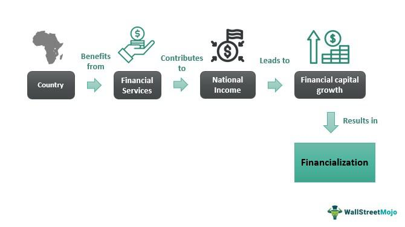

The convergence of financialization, economic impact, and algorithmic trading represents a complex and multifaceted arena in the global economy. Financialization signifies the domination of the financial sector in the economy, intertwining deeply with all other economic sectors. It involves the growing influence of financial motives, financial markets, financial actors, and financial institutions in the operation of domestic and international economies. This transformative process is marked by an enhanced presence of financial instruments and services, reshaping industrial capitalism into a form more heavily reliant on financial mechanisms.

Algorithmic trading has become an integral part of financialization, accelerating market activities and influencing market quality. By employing advanced mathematical models and robust algorithms, trading can be automated, allowing for faster execution and the ability to capitalize on minute discrepancies in asset prices. This technology-driven methodology reflects broader trends towards digitalization and technological innovation within financial systems.



This article seeks to explore these phenomena by examining the significant economic impacts and the diverse criticisms they attract. The analysis aims to provide insights into how the convergence of financialization and algorithmic trading affects market dynamics and broader economic health. Through this examination, the article will detail the potential benefits, such as market efficiency and growth opportunities, alongside risks including market volatility, economic inequality, and systemic instability. These insights form a critical understanding of how modern financial practices and technologies interplay within the global economic framework.

## Table of Contents

## Understanding Financialization

Financialization refers to the increasing role of financial motives, financial markets, and financial actors in shaping economic outcomes. This trend signifies a shift from traditional industrial capitalism, where profit generation is primarily linked to the production and sale of goods, to financial capitalism, where profits are increasingly derived from financial activities.

The financial sector's growth has consistently outpaced that of the real economy, creating a dynamic where economic structures and policies are more interconnected with financial markets. This growth is characterized by the expansive rise of financial instruments, such as derivatives, mortgage-backed securities, and hedge funds. Such instruments allow for extensive speculation and can significantly influence asset prices and financial stability. For instance, the notional value of derivatives markets has grown exponentially over recent decades, far exceeding global GDP.

A key feature of financialization is the transfer of focus from manufacturing and tangible goods production to services, particularly financial services, leading to what some economists describe as the dominance of the financial sector in the economy. This includes the integration of financial markets into global trade and production systems, enabling unprecedented flows of capital across borders and into varied investment vehicles. Consequently, this form of capitalism often results in increased economic fragility, as seen during the 2008 financial crisis, where the over-leverage of financial institutions and prevalence of complex financial products contributed to a global economic downturn.

Moreover, financialization is associated with changes in corporate governance and decision-making, where shareholder value is prioritized, often at the expense of long-term investment in productive capabilities. Corporations increasingly engage in financial investments and speculative activities rather than reinvesting in their core business operations.

Overall, financialization represents a profound transformation in the economic landscape, driven by an expanded role of finance that affects economic policies, corporate strategies, and individual financial behavior. The implications of this shift are profound, influencing everything from labor markets to international trade dynamics.

## Economic Impact of Financialization

Financialization has profound effects on economic growth, particularly by stimulating expansion in the financial services sector and related industries. This process enhances global financial market [liquidity](/wiki/liquidity-risk-premium), enabling a more efficient allocation of capital across borders and creating new investment opportunities.

The escalation of financialization is marked by the rise of complex financial instruments and the expansion of financial institutions. These advancements facilitate capital flow and improve market efficiency by supporting diverse financial activities, including lending, trading, and investing. For instance, securitization—a key feature of financialization—enables banks to transform illiquid assets into tradable securities, thereby increasing liquidity and freeing up capital for additional lending.

However, financialization can also introduce significant economic vulnerabilities. The increased focus on financial markets often shifts emphasis away from the real economy, leading to situations where asset prices are inflated, creating bubbles that can burst with devastating impacts. Historical examples such as the 2008 Global Financial Crisis illustrate the risks associated with excessive financialization. The complex derivatives and mortgage-backed securities that underpinned the crisis were emblematic of a financial system overly reliant on debt and speculative assets.

Moreover, financialization tends to exacerbate economic inequality. As financial markets grow, a disproportionate amount of wealth accumulates among those with the means and access to sophisticated financial products, widening the gap between affluent investors and the general population. This disparity is compounded by practices like stock buybacks, where companies prioritize returning profits to shareholders over reinvesting in their workforce or operations.

The intricate relationship between financialization and economic instability is further complicated by an increase in leverage and risk-taking behaviors. Financial institutions, driven by profit motives, often engage in risk-laden activities, which can lead to systemic vulnerabilities. The interconnectedness of global financial systems means that crises in one region can have swift and far-reaching repercussions globally.

In summary, while financialization does offer advantages such as improved liquidity and new investment avenues, it also poses challenges by contributing to economic instability and inequality. Striking a balance between these opportunities and risks is critical for sustainable economic progress.

## Criticism of Financialization

Financialization, while offering certain economic benefits, has been met with significant criticism on multiple fronts. One primary concern is the prioritization of short-term profits over long-term economic health. This emphasis can undermine sustainable growth by focusing on immediate financial returns rather than investing in long-term productive capacities. Critics suggest that resources are frequently diverted from the real economy—industries that produce tangible goods and services—to speculative financial activities. This diversion can lead to underinvestment in critical sectors such as manufacturing, infrastructure, and innovation.

Moreover, financialization has been linked to increasing economic inequality. The financial sector tends to disproportionately benefit wealthy individuals and entities, often through complex financial instruments and investment vehicles that are inaccessible to the average individual. The result is a widening gap between the rich and the poor, as those already possessing significant capital can further multiply their wealth, while others may face stagnation or even decline in economic opportunity.

Another concern is the heightened risk of financial crises. Financialization often involves the creation and widespread distribution of financial derivatives and other complex financial products. Such instruments can obscure true economic value and risk, leading to bubbles that, when burst, can precipitate systemic crises. The global financial crisis of 2007-2008 is frequently cited as a case where excessive financialization and the intertwining of financial instruments led to widespread economic turmoil.

Finally, financialization has been critiqued for destabilizing traditional economic sectors. Industries that once thrived on producing goods and providing services can suffer as financial returns become the primary objective. This shift can lead to the erosion of job stability and a reduction in the skills and capabilities necessary for sustaining vital sectors of the economy.

In summary, while financialization may drive certain economic efficiencies and growth in the financial sector, its broader impacts raise serious concerns about long-term economic stability, equality, and the health of the real economy.

## Algorithmic Trading: An Overview

Algorithmic trading, also known as automated or black-box trading, employs computer algorithms to execute trading strategies at speeds and volumes unachievable by human traders. These algorithms analyze a vast array of market variables and trading signals, including price movements, order [books](/wiki/algo-trading-books), and economic indicators, to make informed trading decisions.

One of the primary benefits of [algorithmic trading](/wiki/algorithmic-trading) is its potential to enhance market efficiency and liquidity. By systematizing the trading process, algorithmic trading can swiftly incorporate new information into asset prices, thus enhancing market efficiency. For example, [arbitrage](/wiki/arbitrage) algorithms can exploit price differences for the same asset across different markets, ensuring prices reflect all available information.

Algorithmic trading also increases market liquidity by facilitating high-frequency trading ([HFT](/wiki/high-frequency-trading-strategies)) strategies. HFT relies on executing numerous orders quickly and can tighten bid-ask spreads, making it cheaper for investors to buy and sell securities. This process requires significant computational power and network speed, as illustrated by the Python snippet below, which demonstrates a simple execution algorithm:

```python
import numpy as np

class SimpleAlgorithmicTrader:
    def __init__(self, threshold=0.01):
        self.threshold = threshold

    def assess_market_signal(self, price_history):
        returns = np.diff(price_history) / price_history[:-1]
        return np.mean(returns) > self.threshold

    def execute_trade(self, market_signal):
        if market_signal:
            print("Executing buy order.")
        else:
            print("Executing sell order.")

# Example usage
price_data = np.array([100, 101, 102, 103, 104])
trader = SimpleAlgorithmicTrader()
signal = trader.assess_market_signal(price_data)
trader.execute_trade(signal)
```

However, despite the advantages, there are significant concerns associated with algorithmic trading. It may lead to increased market [volatility](/wiki/volatility-trading-strategies), primarily during periods of financial stress. The infamous "Flash Crash" of May 6, 2010, serves as a notable example, where rapid sell-offs triggered by algorithms resulted in a temporary market collapse. 

Market manipulation is another concern. Strategies such as quote stuffing, where a vast number of orders are placed and quickly canceled, can create artificial fluctuations in market prices, disadvantaging slower market participants. Moreover, the reliance on complex algorithms raises questions about fairness and the potential for systemic risk, particularly if these systems behave in unintended ways.

The adoption of algorithmic trading is a manifestation of broader digitalization and technological innovation trends within the financial markets. It is facilitated by advancements in computational power, data analytics, and [machine learning](/wiki/machine-learning), reflecting ongoing progress in the financialization of global markets. As technologies evolve, regulatory considerations must address the challenges posed by algorithmic practices, ensuring that financial systems remain robust and equitable.

## Economic Impact of Algorithmic Trading

Algorithmic trading, a cornerstone of modern financial markets, offers several enhancements to market quality primarily by boosting trading [volume](/wiki/volume-trading-strategy) and liquidity. This automated trading method utilizes sophisticated algorithms to execute trades at speeds and volumes unattainable by human traders. As a result, it a catalyst in the global financial landscape, both in terms of efficiency and potential pitfalls.

One of the primary economic impacts of algorithmic trading is the facilitation of faster and more accurate pricing. Algorithms are capable of analyzing multiple market variables simultaneously, identifying minute discrepancies, and executing trades with precision. This capability ensures that prices reflect the most current market conditions, contributing to market efficiency. For example, algorithms can arbitrage tiny price differences across platforms in milliseconds, ensuring prices align across different exchanges.

The power of algorithms in enhancing liquidity comes from their ability to execute large volumes of orders without significantly impacting the market price. By doing so, they ensure that buyers and sellers can transact more easily, thus maintaining a steady market flow. Liquidity is a crucial component for a healthy market, reducing the cost of transactions and encouraging more market participation.

However, the extreme speed and high-volume capabilities intrinsic to algorithmic trading also introduce risks. The "flash crash" phenomenon is a stark example, where rapid, algorithm-driven trading can lead to severe market drops within minutes. The most notable instance was the May 6, 2010, Flash Crash, where the Dow Jones Industrial Average plunged about 1,000 points in mere minutes, only to recover shortly after. Such incidents underscore the potential for algorithmic trading to exacerbate market volatility.

Moreover, the automation and complexity of these algorithms pose challenges for regulators. Market oversight requires understanding and monitoring the intricate Web of automated strategies employed by traders, which can be daunting. There's a constant need to balance innovation with security, requiring the adaptation of regulatory frameworks that can keep pace with technological advancements.

In summary, while algorithmic trading can significantly enhance trading volumes and liquidity, thus improving market quality, it simultaneously presents challenges, particularly concerning market stability and regulatory oversight. The dual nature of algorithmic trading as both a boon and a risk necessitates careful consideration and ongoing adaptation of regulatory measures to safeguard market integrity.

## Criticism of Algorithmic Trading

Algorithmic trading, which leverages complex algorithms and high-speed data processing to execute trades, has been a transformative force in financial markets. However, its impact is not without criticism. One significant concern is that algorithmic trading may exacerbate market volatility. This occurs because the rapid and automated nature of algorithmic trades can lead to abrupt price changes, especially in thinly traded assets or during periods of market stress. Events like the "Flash Crash" of May 6, 2010, where the Dow Jones Industrial Average dropped nearly 1,000 points in minutes, highlight the potential for such systems to contribute to market instability.

Another point of contention is the creation of unfair advantages for technologically advanced market participants. Firms equipped with cutting-edge technology, such as high-frequency trading (HFT) systems, can execute orders much faster than those relying on more traditional trading methods. This technological disparity can disadvantage slower traders, who may be unable to compete on equal footing. Algorithms can exploit minuscule price discrepancies at speeds beyond human capabilities, potentially leading to a concentration of profits among firms with superior technological infrastructure.

Concerns over specific practices within algorithmic trading, such as quote-stuffing and front-running, further illustrate potential abuses. Quote-stuffing involves rapidly placing and canceling large numbers of orders to create confusion and slow down other traders' systems. This disruption can manipulate market perceptions and distort fair trading practices. Front-running, another controversial strategy, occurs when a trader uses algorithms to detect large pending orders and executes trades before these orders are completed, unfairly capitalizing on the information.

Addressing these issues necessitates robust regulation and oversight. Regulatory bodies must strike a delicate balance between fostering innovation and ensuring market integrity and fairness. Possible regulatory measures include imposing limits on order cancellation ratios, enhancing market surveillance to detect manipulative activities, and ensuring transparent reporting of algorithmic trading strategies. By implementing such safeguards, regulators can help mitigate risks associated with algorithmic trading while maintaining an equitable trading environment for all market participants.

## Conclusion

Financialization and algorithmic trading are pivotal components that shape the current economic landscape. These phenomena offer significant advantages, such as enhancing economic growth and improving the efficiency of financial markets. Financialization facilitates increased access to capital, fostering innovation and expansion within various sectors. Algorithmic trading, with its rapid execution and precise analysis, contributes to market liquidity and the optimization of trading processes.

However, the advantages are counterbalanced by notable risks. Financialization has been linked to economic instability, as it can lead to the creation of asset bubbles and exacerbate income inequality. The focus on financial metrics can divert essential resources from productive sectors, potentially undermining long-term economic stability. Algorithmic trading poses challenges like increased market volatility and sophisticated forms of market manipulation, which can undermine investor confidence and fairness in financial markets.

Addressing these challenges requires robust regulatory frameworks that can adapt to the rapid advancements in financial technology. Policymakers should aim to create environments where innovation thrives but is also aligned with the overall stability and health of the economy. Effective regulation can help mitigate risks associated with financialization and algorithmic trading, ensuring that their contributions to economic progress do not compromise the equitable and sustainable development of global markets. This balance will be crucial in navigating the complexities of the modern financial ecosystem while safeguarding the broader economic interests.

## References & Further Reading

[1]: Epstein, G. (2005). ["Financialization and the World Economy."](https://econpapers.repec.org/RePEc:elg:eebook:3455) Edward Elgar Publishing.

[2]: Krippner, G. R. (2005). ["The Financialization of the American Economy."](https://academic.oup.com/ser/article-abstract/3/2/173/1661913) American Sociological Review, 70(2), 308-333.

[3]: Lopez de Prado, M. (2018). ["Advances in Financial Machine Learning."](https://www.amazon.com/Advances-Financial-Machine-Learning-Marcos/dp/1119482089) Wiley.

[4]: Baker, A. (2010). ["Restraining Regulatory Capture? Anglo-America, Crisis Politics and Trajectories of Change in Global Financial Governance."](https://academic.oup.com/ia/article/86/3/647/2326199) Socio-Economic Review, 8(3), 665-689.

[5]: MacKenzie, D. (2006). ["An Engine, Not a Camera: How Financial Models Shape Markets."](https://academic.oup.com/mit-press-scholarship-online/book/20588) MIT Press.

[6]: Haldane, A. G. & May, R. M. (2011). ["Systemic Risk in Banking Ecosystems."](https://www.nature.com/articles/nature09659) Nature, 469(7330), 351-355.

[7]: Lazonick, W. & O'Sullivan, M. (2000). ["Maximizing Shareholder Value: A New Ideology for Corporate Governance."](https://www.tandfonline.com/doi/abs/10.1080/030851400360541) Economy and Society, 29(1), 13-35.

[8]: Johnson, B., & Herring, R. J. (2002). ["Value at Risk: Useful Measure or Dangerous Illusion?"](https://onlinelibrary.wiley.com/doi/abs/10.1111/j.0963-8008.2005.00108.x) International Review of Finance, 19(8), 1813-1842.

[9]: Patel, A., Rathi, D., & Gopalan, S. (2018). ["Algorithmic Trading and Insights of Artificial Intelligence."](https://www.nature.com/articles/s41599-020-0501-9) In: 2018 International Conference on Inventive Research in Computing Applications (ICIRCA).