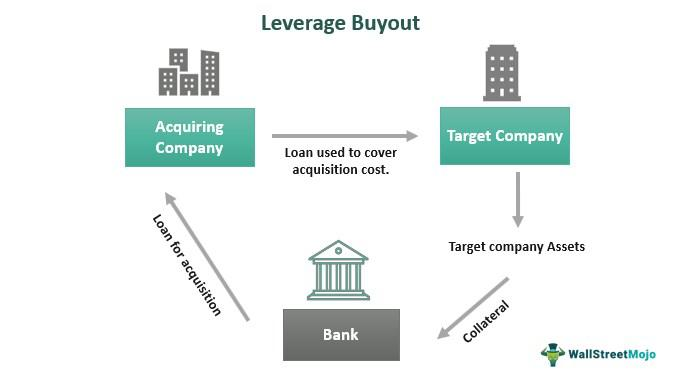

Financial strategies such as leveraged buyouts (LBOs), LBO financing, and algorithmic trading are integral to the financial industry. These methodologies enable companies to refine their capital structures, improve returns, and manage acquisitions with efficiency. Leveraged buyouts, a common acquisition strategy, involve purchasing a company primarily with borrowed funds. This technique is frequently employed by private equity firms aiming to acquire a controlling interest in a company while minimizing their equity investment.

In LBOs, borrowed capital is used as the primary source of funding, with the acquired company's assets typically serving as the collateral for the loans. This high leverage can maximize potential returns for investors if the acquisition and subsequent business operations yield favorable financial outcomes. As such, understanding the nuances of LBO financing is crucial for assessing risk and reward in these transactions.



Algorithmic trading, another critical strategy, employs computer algorithms to execute trades based on pre-set criteria. It offers significant advantages, such as increased trade execution speed and reduced transaction costs, making it a valuable tool in contemporary financial planning. Beyond its application in LBOs, algorithmic trading is widely utilized across various financial markets, providing real-time data analysis and decision-making support.

By examining the mechanics of leveraged buyouts and the strategic use of algorithmic trading, stakeholders can gain a comprehensive insight into effective financial strategies. Such understanding is key to navigating the complexities of modern finance, where these tools can significantly impact company valuation and investment performance.

## Table of Contents

## Understanding Leveraged Buyouts

A leveraged buyout (LBO) is a financial mechanism in which a significant portion of the purchase price of a company is financed through debt, with the acquired company's assets often serving as collateral for the loans obtained. This strategy is frequently employed by private equity firms to acquire companies with the aim of restructuring them to enhance performance and value. The primary purpose of executing an LBO is to generate high returns on investment, which are realized upon exiting the investment through either selling the company or taking it public.

The mechanics of an LBO involve the strategic use of financial leverage, wherein a small equity contribution from the investors, combined with substantial debt financing, facilitates the acquisition of a target company. By using leverage, investors amplify the potential returns on their own capital. The debt raised typically includes a mix of bank loans and bond issuance, which are serviced using the cash flows generated by the acquired company.

A pivotal aspect of LBOs is the treatment of the acquired company's assets, which are often used as collateral to secure the debt. This arrangement presents a dual-purpose advantage: it reduces the upfront capital requirement for the investors while simultaneously providing lenders with a tangible security interest. However, it also imposes the responsibility of consistent and robust financial management post-acquisition to service the debt and avoid financial distress.

The ultimate goal of an LBO is to improve the financial health of the acquired company. This is achieved through a variety of strategies, including operational efficiencies, cost reductions, revenue enhancements, and, in some cases, divestiture of non-core assets. Successful execution of these strategies enhances the company's profitability and value, enabling a lucrative [exit](/wiki/exit-strategy) for the investors.

LBOs gained prominence in the 1980s, notably characterized by landmark transactions such as the buyout of RJR Nabisco by Kohlberg Kravis Roberts & Co., which highlighted both the potential and the challenges of leveraged acquisitions. Today, LBOs remain a critical tool in the arsenal of financial strategies used by private equity firms, facilitating the acquisition of companies across diverse sectors. 

While the opportunity for substantial returns makes LBOs attractive, they come with inherent risks, mainly stemming from the high leverage used. These risks necessitate rigorous due diligence, effective post-acquisition management, and strategic foresight to navigate the complexities and uncertainties of the market.

## Financing Mechanisms in LBOs

Leveraged buyouts (LBOs) utilize various financing mechanisms to facilitate the acquisition of a company. The primary options include bank loans, bonds, mezzanine debt, and seller financing, each serving distinct roles in capital structure.

Bank loans often form the backbone of LBO financing. These loans, typically secured by the acquired company's assets, provide substantial capital at relatively low-interest rates. Banks prefer this secured position as it reduces their risk exposure, making them a favorable source for LBO financiers.

Bonds, particularly high-yield or "junk" bonds, are another prevalent financing choice. These are issued to finance the purchase and [carry](/wiki/carry-trading) higher interest rates, reflecting the increased risk to bondholders. Despite their cost, bonds offer flexibility by extending repayment periods, thus potentially enhancing cash flow during the early stages post-acquisition.

Mezzanine debt is a hybrid of debt and equity financing, sitting subordinate to other forms of debt, such as bank loans, but above equity in the capital structure. It often includes warrants or conversion rights, which allows lenders to convert the debt into equity at a later stage. This type of financing demands higher interest rates due to its subordinated status, but provides a vital layer of capital for firms needing to bridge financing gaps.

Seller financing involves the seller of the company extending a loan to the buyer to cover part of the purchase price. This method reflects the seller's confidence in the business's future profitability and can provide buyers with more favorable terms compared to traditional financing sources.

Private equity sponsors are integral to structuring LBO deals, providing not only initial capital but also crafting the intricate financial frameworks essential for a successful transaction. They actively participate in combining these financing options to optimize returns while managing risk exposure. The choice of financing not only dictates the cost of capital but also influences operational flexibility, debt servicing capabilities, and ultimately, the total returns achievable from the buyout. These decisions must be meticulously crafted, taking into account interest costs, payment schedules, and default risks to balance the trade-off between risk and potential reward effectively.

## The Role of Algorithmic Trading in Financial Strategies

Algorithmic trading uses sophisticated computer algorithms to execute a large number of trades swiftly and systematically. These algorithms follow pre-defined criteria, analyzing market data to identify potential trading opportunities. The primary goal is to enhance trading efficiency, reduce transaction costs, and optimize the timing and scaling of trades.

### Trading Efficiency and Cost Reduction

By automating the trading process, [algorithmic trading](/wiki/algorithmic-trading) significantly reduces the latency and human error inherent in manual trading. This automation ensures trades are executed at the most favorable prices and speeds, thus lowering transaction costs. The reduction in manual intervention also helps to minimize the risk of human error, ensuring more consistent trade execution.

### Employment in Leveraged Buyouts and Financial Activities

In leveraged buyouts (LBOs), algorithmic trading can optimize the acquisition process by efficiently managing the purchase and sale of securities related to the transaction. Additionally, algorithmic trading's ability to handle large volumes allows for the strategic entry and exit in financial markets, which is crucial in capital-intensive LBO transactions.

Beyond LBOs, algorithmic trading is utilized across various financial activities, including market-making, [arbitrage](/wiki/arbitrage), and portfolio optimization. For instance, algorithms may identify arbitrage opportunities between different markets, leveraging price discrepancies to secure profits.

### Data-Driven Insights and Decision Support

The capacity of algorithmic trading to process vast amounts of market data provides traders with valuable insights into market trends and price movements. These data-driven insights support decision-making by forecasting potential investment opportunities and risks. Advanced algorithms may incorporate [machine learning](/wiki/machine-learning) techniques to adapt to market changes, enhancing predictive accuracy.

For example, a simple Python example of an algorithmic trading strategy with moving averages might look like this:

```python
import pandas as pd

def moving_average_strategy(prices, short_window=40, long_window=100):
    signals = pd.DataFrame(index=prices.index)
    signals['Price'] = prices
    signals['ShortMA'] = prices.rolling(window=short_window, min_periods=1).mean()
    signals['LongMA'] = prices.rolling(window=long_window, min_periods=1).mean()
    signals['Signal'] = 0
    signals['Signal'][short_window:] = np.where(signals['ShortMA'][short_window:] > signals['LongMA'][short_window:], 1.0, 0.0) 
    signals['Positions'] = signals['Signal'].diff()
    return signals

# Using the function with a hypothetical price series
# prices = pd.Series([prices data])
# signals = moving_average_strategy(prices)
```

In this example, the algorithm generates buy and sell signals based on the crossover of short-term and long-term moving averages of stock prices. Such a strategy harnesses historical data to predict future price movements, exemplifying how algorithmic trading supports decision-making by leveraging statistical and mathematical models.

## Case Studies and Examples

Exploring successful leveraged buyouts (LBOs) and the financing strategies that underpin them provides valuable insights into practical applications. Throughout history, several high-profile LBOs have demonstrated how strategic use of debt and innovative techniques, such as algorithmic trading, can substantially maximize returns on investment.

One notable example of an LBO is the buyout of RJR Nabisco by Kohlberg Kravis Roberts & Co. (KKR) in 1989. This buyout is historically significant, not only due to its size—valued at approximately $31 billion—but also due to the complexity of its financing structure. KKR utilized a combination of bank loans, junk bonds, and equity contributions to facilitate the transaction. This case illustrates how diversified financing strategies can be effectively employed to complete large-scale acquisitions. The strategic structuring of debt instruments played a pivotal role in balancing risk and optimizing financial leverage.

In more recent examples, the acquisition of Dell Inc. by Michael Dell and Silver Lake Partners in 2013 is noteworthy. This $24.4 billion deal was predominantly financed through a mix of cash and equity, as well as debt instruments from major banks and investment firms. This case highlights the strategic decision to go private in order to retool the company's focus and management without the pressure from public shareholders. The financing of this LBO was designed to support a significant restructuring plan and foster long-term growth.

Algorithmic trading further complements financial strategies in LBOs by enhancing the efficiency of transaction executions. For instance, private equity firms increasingly utilize algorithmic trading to optimize the timing and pricing of security trades required for funding their investments. Algorithms can analyze vast datasets to identify favorable market conditions, facilitating strategic entry and exit points in the acquisition process. Python's capabilities in data analysis and financial modeling can be instrumental in developing such algorithms:

```python
import pandas as pd
import numpy as np

def moving_average_strategy(prices, short_window=40, long_window=100):
    signals = pd.DataFrame(index=prices.index)
    signals['short_mavg'] = prices.rolling(window=short_window, min_periods=1).mean()
    signals['long_mavg'] = prices.rolling(window=long_window, min_periods=1).mean()
    signals['signal'] = 0.0
    signals['signal'][short_window:] = np.where(signals['short_mavg'][short_window:] 
                                                > signals['long_mavg'][short_window:], 1.0, 0.0)   
    signals['positions'] = signals['signal'].diff()
    return signals
```

The code snippet above demonstrates a simple moving-average crossover strategy, which can be used to generate buy/sell signals based on pricing trends. Such strategies can be part of a broader toolkit for financial analysts working on LBO projects, facilitating informed decisions based on quantitative data.

The range of industries engaged in LBOs, from technology to consumer goods, emphasizes the versatility of these financial strategies. Each sector presents unique opportunities and challenges, demanding tailored financial constructs and strategic execution. With evolving financing techniques and advancements in algorithmic trading, the landscape of LBOs continues to adapt, showcasing the enduring relevance and potential of these financial strategies in enhancing investment performance.

## Risks and Considerations

Leveraged buyouts (LBOs) are characterized by the extensive use of debt financing, which inherently exposes transactions to significant risks. The primary concern is the burden of high levels of debt that the acquired company assumes. If the cash flows generated by the company are insufficient to meet the debt obligations, the risk of bankruptcy or severe financial distress becomes substantial. Therefore, meticulous financial planning and strict execution are vital to mitigate these vulnerabilities. This involves conducting detailed due diligence to forecast cash flows accurately, assessing the target company's market position, and implementing robust post-acquisition operational improvements.

Algorithmic trading, despite its advantages, also presents distinct risks. These risks are chiefly related to technological failures and market [volatility](/wiki/volatility-trading-strategies). The implementation of algorithmic strategies depends heavily on the flawless operation of software systems. Any malfunction or latency in these systems can lead to unintended trades and significant financial losses. Additionally, algorithms are designed based on historical data and specific market conditions. Unexpected macroeconomic events or changes in market dynamics can lead to the underperformance of these algorithms. The risk of overfitting, where the algorithm is too tightly tailored to past data rather than potential futures, is another concern. 

Furthermore, market volatility poses a risk to both LBOs and algorithmic trading. For LBOs, fluctuating market conditions can impact the cost and availability of financing, affect asset valuations, and influence the timing of exits. For algorithmic trading, volatility can lead to slippage, where trades are executed at prices different from those expected, impacting profitability. 

In conclusion, both LBOs and algorithmic trading require a disciplined approach to risk management. In LBOs, this involves maintaining manageable debt levels and ensuring strategic planning aligns with financial goals. In algorithmic trading, ongoing system maintenance, real-time monitoring, and adaptive algorithms that can adjust to market shifts are essential to safeguarding investments against the inherent risks of technology and volatility.

## Conclusion

Leveraged buyouts (LBOs) and algorithmic trading are integral components of modern financial strategies, offering remarkable potential for enhancing a company's value and maximizing investment returns. When meticulously executed, LBOs allow investors and firms to capitalize on undervalued companies by restructuring their financial architecture, optimizing operations, and strategically managing debt levels. The critical advantage of LBOs lies in their ability to amplify equity returns through the use of leverage, despite their inherent risks associated with high debt levels.

Algorithmic trading complements LBOs by providing a powerful toolkit for analyzing market trends, executing trades, and minimizing transaction costs. By utilizing pre-defined criteria and complex algorithms, market participants can harness data-driven insights to make informed decisions, thereby optimizing trade execution and improving financial performance. This technological prowess in trading can significantly reduce behavioral biases and manual errors, contributing to more efficient and effective investment strategies.

However, both LBOs and algorithmic trading come with considerable risks. The high leverage in LBOs can lead to severe financial distress if not properly managed, especially in volatile economic environments. Similarly, algorithmic trading is not without its challenges, including potential technology failures and market anomalies that may disrupt trading operations.

Despite these risks, the continuous evolution in financing methodologies and advancements in trading technology promise to usher in new opportunities for these financial tools. Innovations such as [artificial intelligence](/wiki/ai-artificial-intelligence) and machine learning are poised to refine algorithmic strategies, making them more robust and adaptive to changing market conditions. Furthermore, emerging financing options and creative deal structuring strategies are likely to enhance the efficacy and resilience of LBOs, enabling investors to mitigate risks while capitalizing on growth opportunities.

In summary, the strategic use of LBOs and algorithmic trading has the potential to transform financial landscapes by driving significant value creation and investment success. Their ongoing development and integration into financial practices will continue to shape the future of corporate finance and investment management.

## References & Further Reading

[1]: Kaplan, S. N., & Strömberg, P. (2009). ["Leveraged Buyouts and Private Equity."](https://www.aeaweb.org/articles?id=10.1257/jep.23.1.121) Journal of Economic Perspectives, 23(1), 121-146.

[2]: Klier, D., & Welge, M. K. (2007). ["Private Equity Investments: Drivers and Performance Implications of Investment Cycles."](https://www.semanticscholar.org/paper/The-Changing-Face-of-Private-Equity%3A-How-Modern-Klier-Welge/c6bf5edceb37ea04b1b0f7cc3b127e9e1f8a59e4) Journal of Private Equity, 10(2), 89-101.

[3]: Aldridge, I. (2013). ["High-Frequency Trading: A Practical Guide to Algorithmic Strategies and Trading Systems."](https://www.amazon.com/High-Frequency-Trading-Practical-Algorithmic-Strategies/dp/1118343506) Wiley.

[4]: "Loomis, C. J. (1989). ["The Deal of the Century."](https://seriosity.com/disney-to-acquire-21st-century-fox-for-52-4-billion-in-groundbreaking-deal/) Fortune Magazine"

[5]: Amihud, Y., & Mendelson, H. (1991). ["Volatility, Efficiency, and Trading: Evidence from the Japanese Stock Market."](https://onlinelibrary.wiley.com/doi/full/10.1111/j.1540-6261.1991.tb04643.x) The Review of Financial Studies, 4(3), 479-510.