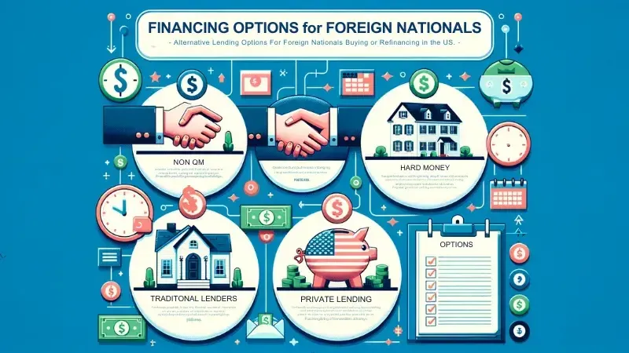

## Table of Contents

## What are the basic steps to finance foreign real estate?

Financing foreign real estate can be a bit tricky but it's doable if you follow some basic steps. First, you need to do your research. Find out about the real estate market in the country where you want to buy property. Look into the local laws about buying property as a foreigner. It's also a good idea to talk to a local real estate agent who knows the area well. They can help you understand the market and find good properties.

Next, you need to figure out how you will pay for the property. You might use your own money, or you might need a loan. If you need a loan, you'll have to check if local banks will lend money to foreigners. Sometimes, it's easier to get a loan from a bank in your home country that specializes in international property. Make sure you understand all the terms and conditions of any loan before you agree to it.

Finally, once you have the money sorted out, you can make an offer on a property. It's important to have a lawyer who knows about property law in that country to help you with the paperwork. They can make sure everything is done correctly and protect your interests. After all the paperwork is done and the money is transferred, you'll officially own the foreign property.

## What types of loans are available for purchasing property abroad?

When you want to buy property in another country, you have a few loan options to consider. One option is a local mortgage from a bank in the country where the property is located. Some countries have banks that are willing to lend money to foreigners, but the terms might be different than what you're used to at home. You might need to put down a bigger down payment, and the interest rates could be higher. It's important to check if you can even get a local mortgage as a foreigner because not all countries allow it.

Another option is to get a loan from a bank in your home country that specializes in international property loans. These banks understand the challenges of buying property abroad and can offer loans that are tailored to your needs. The advantage is that you might get better terms and easier communication since the bank is in your home country. However, these loans might still require a larger down payment and could have higher interest rates compared to a domestic mortgage.

Lastly, you might consider using a private lender or a mortgage broker who deals with international properties. Private lenders can sometimes offer more flexible terms, but they usually come with higher interest rates. A mortgage broker can help you find the best loan options from different lenders, both local and international. They can save you time and help you understand the different loan products available, but they might charge a fee for their services.

## How does the process of obtaining a mortgage differ from country to country?

The process of getting a mortgage can be different from one country to another. In some countries, it's easy for foreigners to get a local mortgage, but in other places, it can be hard or even impossible. For example, in the United States, many banks offer mortgages to foreigners, but they might ask for a bigger down payment and higher interest rates. In contrast, some countries like Thailand have strict rules that make it very difficult for foreigners to get a local mortgage. The rules about how much you can borrow, what kind of property you can buy, and how long the loan lasts can all vary a lot depending on where you are.

Another big difference is the paperwork and legal steps you need to take. In some countries, the process is quick and simple, while in others, it can take a long time and involve a lot of documents. For instance, in Canada, the process might be straightforward with clear steps, but in places like Mexico, you might need to go through a notary public and deal with more complicated legal requirements. It's also important to know that the interest rates and fees can be different from country to country. Some countries might have fixed interest rates, while others might have variable rates that can change over time. Understanding these differences is key to making a smart choice when buying property abroad.

## What are the interest rates like for foreign real estate loans?

Interest rates for foreign real estate loans can vary a lot depending on where you are buying the property and who you are borrowing from. If you get a loan from a local bank in the country where the property is, the interest rates might be higher for foreigners than for local people. Some countries might offer fixed rates, which stay the same over the life of the loan, while others might have variable rates that can go up or down. It's important to check the rates in the specific country you're looking at because they can be different from what you're used to at home.

If you decide to get a loan from a bank in your home country that specializes in international property, the interest rates might be different from local rates. These banks might offer competitive rates, but they could still be higher than what you would pay for a domestic mortgage. The rates can also depend on the type of loan you choose, like whether it's a fixed or variable rate loan, and how long the loan term is. It's a good idea to compare rates from different lenders to find the best deal for your situation.

## Are there any government programs or incentives for buying property overseas?

Some countries have government programs or incentives to help people buy property there. These can be things like tax breaks, special loans, or help with residency if you buy a home. For example, some countries in Europe might give you a tax break if you buy a property that needs fixing up. This is to encourage people to invest in and improve old buildings. Other places might offer special loans with lower interest rates to foreigners who want to buy property there. It's good to check what the country you're interested in offers because these programs can make buying property easier and cheaper.

However, not all countries have these kinds of programs. In some places, the government might not want foreigners to buy property easily, so they might not offer any incentives at all. It's important to do your research and find out if the country you're looking at has any programs that can help you. Talking to a local real estate agent or a lawyer can give you a good idea of what's available and how you can take advantage of these programs.

## How can currency exchange rates affect the cost of financing foreign property?

Currency exchange rates can have a big impact on the cost of financing foreign property. When you buy property in another country, you usually need to change your money into the local currency. If the exchange rate is good, it means you get more of the local money for your dollars, and the property might seem cheaper. But if the exchange rate is bad, you get less local money, and the property could end up costing more than you planned. Also, if you take out a loan in the local currency, the exchange rate can affect how much you have to pay back when you convert it back to your home currency.

Another thing to think about is that exchange rates can change over time. If you have a loan in the local currency and the exchange rate gets worse, it can make your monthly payments more expensive when you convert them back to your home currency. This can make it harder to budget and plan for the future. It's a good idea to keep an eye on exchange rates and maybe talk to a financial advisor to understand how they might affect your plans to buy and finance foreign property.

## What are the tax implications of financing and owning foreign real estate?

When you buy and finance foreign real estate, you need to think about the taxes you might have to pay. Different countries have different rules about taxes on property. Some places might make you pay a tax when you buy the property, called a stamp duty or transfer tax. You might also have to pay property taxes every year, just like you do at home. If you rent out the property, you could have to pay taxes on the money you earn from rent. It's important to know that these taxes can be different from what you're used to in your home country, and they can add to the cost of owning the property.

Another thing to think about is how your home country treats foreign property. Some countries might let you claim tax deductions for things like mortgage interest or property taxes on your foreign home, but others might not. You might also have to pay capital gains tax if you sell the property for more than you paid for it. The tax rules can get complicated, so it's a good idea to talk to a tax advisor who knows about international property. They can help you understand all the taxes you might have to pay and find ways to save money on taxes.

## How can one use equity from existing properties to finance foreign real estate?

Using the equity from your existing properties to finance foreign real estate can be a smart move. Equity is the difference between what your property is worth and what you still owe on it. If you have a lot of equity in your home or other properties, you can borrow against it. This means you can take out a loan using your property as collateral. The money you get from this loan can then be used to buy property in another country. This can be a good option if you can't get a loan directly from a foreign bank or if the terms of a foreign loan are not as good as what you can get at home.

However, there are some things to think about before you go this route. First, you need to make sure you can afford the payments on the new loan. If you can't keep up with the payments, you could lose your home or other properties that you used as collateral. Also, the interest rates on a loan against your equity might be different from what you would get with a regular mortgage. It's important to compare the costs and see if it makes sense for your situation. Talking to a financial advisor can help you understand all the risks and make a plan that works for you.

## What are the risks associated with financing foreign real estate?

Financing foreign real estate comes with some risks that you need to know about. One big risk is that the value of the property can go up or down, just like any other investment. If the market in the country where you bought the property goes down, you could lose money if you need to sell it. Another risk is that you might have trouble getting a loan. Some countries don't like to give loans to foreigners, so you might have to pay a bigger down payment or get a loan with a higher interest rate. And if you use the equity from your home to buy the foreign property, you could lose your home if you can't make the payments.

Another thing to think about is currency exchange rates. If the value of your home currency goes down compared to the currency of the country where you bought the property, it can make your loan payments more expensive. This can make it hard to budget and plan for the future. Also, the laws about owning property in other countries can change. If the government decides to change the rules, it could affect your ability to own or sell the property. It's a good idea to talk to a financial advisor and a lawyer who knows about international property to help you understand all the risks and make a smart decision.

## How does one qualify for international financing options?

To qualify for international financing options, you need to meet certain requirements set by the lender. If you're looking at a local bank in the country where you want to buy property, they might ask for a bigger down payment than they would from a local buyer. They might also want to see that you have a good credit history, either from your home country or internationally. Some banks might even ask for proof of income or assets to make sure you can pay back the loan. It's important to check what each bank needs because the rules can be different from one place to another.

If you're getting a loan from a bank in your home country that specializes in international property, the requirements might be a bit different. These banks often look at your credit score and financial situation in your home country. They might also want to know about the property you're buying, like its value and location. Sometimes, they might ask for a bigger down payment or charge higher interest rates because buying property abroad can be riskier. Talking to different lenders and comparing their requirements can help you find the best option for your situation.

## What are some advanced strategies for leveraging foreign real estate investments?

One advanced strategy for leveraging foreign real estate investments is to use the property for rental income. If you buy a property in a popular tourist spot or a growing city, you can rent it out to travelers or long-term tenants. The money you get from rent can help pay off your mortgage and other costs, like taxes and maintenance. This way, you're not just relying on the property's value going up to make money. You can also use the rental income to buy more properties in the same country or even in other countries, growing your investment portfolio.

Another strategy is to take advantage of currency fluctuations. If you think the currency of the country where you bought the property will get stronger compared to your home currency, you might want to keep the loan in the local currency. If the currency does get stronger, the value of your property in your home currency could go up, and you might end up paying less on your loan when you convert it back. But this is a bit risky because currency rates can be hard to predict. It's a good idea to talk to a financial advisor to understand how currency changes might affect your investment and to make a smart plan.

## How can one navigate legal and regulatory issues when financing property abroad?

When you want to finance property in another country, you need to know about the local laws and rules. Each country has its own way of doing things, and what works in one place might not work in another. For example, some countries might have rules that make it hard for foreigners to buy property or get a loan. It's a good idea to talk to a local lawyer who knows about property law in that country. They can help you understand all the paperwork and make sure you're following the rules. They can also help you with things like getting the right permits or dealing with any legal problems that come up.

Another important thing is to stay updated on any changes in the law. Governments can change rules about buying and owning property, and these changes can affect your investment. For instance, a new law might change how much tax you have to pay or add new steps to the buying process. Keeping in touch with your lawyer and maybe even joining local real estate groups can help you stay informed. Also, understanding the local language can be helpful, but if you don't, make sure your lawyer or real estate agent can help you with translations and explanations.

## References & Further Reading

[1]: Bergstra, J., Bardenet, R., Bengio, Y., & Kégl, B. (2011). ["Algorithms for Hyper-Parameter Optimization."](https://proceedings.neurips.cc/paper/2011/file/86e8f7ab32cfd12577bc2619bc635690-Paper.pdf) Advances in Neural Information Processing Systems 24.

[2]: ["Advances in Financial Machine Learning"](https://www.amazon.com/Advances-Financial-Machine-Learning-Marcos/dp/1119482089) by Marcos Lopez de Prado

[3]: ["Evidence-Based Technical Analysis: Applying the Scientific Method and Statistical Inference to Trading Signals"](https://www.amazon.com/Evidence-Based-Technical-Analysis-Scientific-Statistical/dp/0470008741) by David Aronson

[4]: ["Machine Learning for Algorithmic Trading"](https://github.com/stefan-jansen/machine-learning-for-trading) by Stefan Jansen

[5]: ["Quantitative Trading: How to Build Your Own Algorithmic Trading Business"](https://github.com/LucindaYa/quant-resources/blob/master/Quantitative%20Trading%20How%20to%20Build%20Your%20Own%20Algorithmic%20Trading%20Business.pdf) by Ernest P. Chan