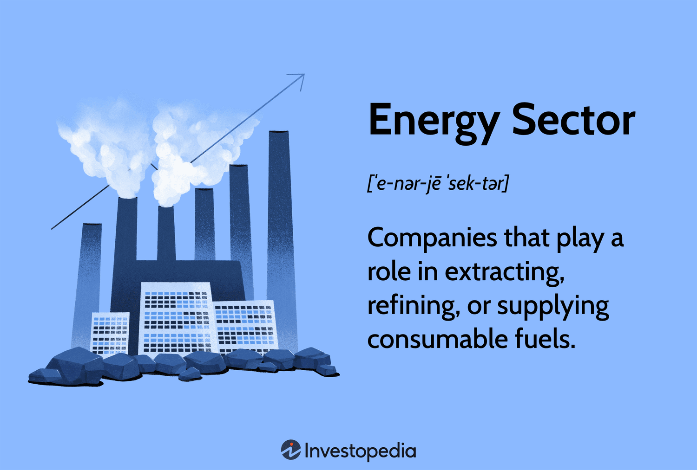

## Table of Contents

## What is the energy sector and why is it important?

The energy sector is made up of all the companies and organizations that are involved in producing and selling energy. This includes things like oil, gas, coal, and renewable energy sources like wind and solar power. The energy sector is really important because it provides the power that we need for our daily lives. Everything from turning on the lights in our homes to running factories and businesses depends on the energy that this sector produces.

The importance of the energy sector cannot be overstated. Without energy, our modern way of life would come to a standstill. It powers our transportation, heats our homes, and runs the technology we rely on every day. Additionally, the energy sector plays a big role in the economy. It creates jobs, drives innovation, and is a major part of global trade. As we move towards more sustainable energy sources, the sector is also key in helping us fight climate change and protect our planet for future generations.

## What are the main types of energy sources used in the energy sector?

The energy sector uses different types of energy sources. Some of these are called fossil fuels, which include oil, coal, and natural gas. These are called fossil fuels because they come from old plants and animals that turned into fuel over millions of years. People have been using fossil fuels for a long time because they are good at making a lot of energy quickly. But, they also make the air dirty and can harm the environment.

Another type of energy source is renewable energy. This includes things like wind, solar, hydro (water), and geothermal energy. Renewable energy comes from nature and can be used over and over again without running out. These sources are better for the environment because they don't make the air dirty like fossil fuels do. More and more people are starting to use renewable energy to help protect the planet.

There is also nuclear energy, which is a bit different. Nuclear energy comes from splitting atoms in a process called nuclear fission. It makes a lot of energy and doesn't make the air dirty like fossil fuels. But, it can be dangerous if something goes wrong at a nuclear power plant. Because of this, people have different opinions about using nuclear energy.

## How does one begin the process of finding new energy sources?

To start finding new energy sources, scientists and engineers first look at what we already know. They study how different kinds of energy work and where they come from. They might look at the sun, wind, or even the heat from the Earth. Then, they think of new ways to use these sources or find new sources altogether. This involves a lot of research and experiments. They might go out into the field to collect data or use computers to model how new energy sources could work.

Once they have some ideas, they start testing them. This can mean building small versions of new energy technologies to see if they work. They might test a new kind of solar panel or a new way to capture wind energy. If these tests go well, they can move on to bigger tests and eventually, if everything works out, they can start using the new energy source on a larger scale. It's a long process that needs a lot of patience and hard work, but it's important for finding better ways to power our world.

## What technologies are used for exploring and developing new energy resources?

To explore and develop new energy resources, scientists use many different technologies. For example, to find oil and gas, they use something called seismic imaging. This is where they send sound waves into the ground and listen to the echoes to see what's underground. They also use drilling rigs to take samples from deep in the Earth. For renewable energy like wind and solar, they use special tools to measure how much wind or sunlight is available in different places. This helps them decide where to put wind turbines or solar panels.

Once they find a new energy source, they need technology to turn it into usable energy. For solar energy, they use photovoltaic cells to turn sunlight into electricity. For wind energy, they build turbines that spin when the wind blows, which also makes electricity. For new kinds of energy like tidal or geothermal, they might use special turbines or heat exchangers to capture the energy. All these technologies need a lot of testing and improving to make sure they work well and are safe to use.

Finding and using new energy resources is a big job that needs a lot of different technologies. Scientists and engineers keep working on new ways to make energy from the Earth, the sun, the wind, and even the oceans. They use computers to design and test these new technologies before they build them for real. This helps them find the best ways to make energy that is clean and will last a long time.

## What are the key stages in the development of an energy project?

The first stage in developing an energy project is the planning and research phase. This is where scientists and engineers start by figuring out what kind of energy they want to use, like wind, solar, or something else. They do a lot of studying to see if their idea can work. They look at the land or the sea to see if it's a good spot for their energy project. They also talk to people who live nearby to see if they like the idea. If everything looks good, they start making detailed plans and figuring out how much money they will need.

The next stage is the building and testing phase. This is when they start to make the energy project real. They might build wind turbines, set up solar panels, or drill for oil or gas. They have to be very careful to make sure everything is safe and works right. Once they finish building, they test everything to see if it makes energy the way they planned. If there are any problems, they fix them. This stage can take a long time because they want to make sure the energy project will work well for many years.

The last stage is the operation and maintenance phase. This is when the energy project starts making energy for people to use. They have to keep an eye on everything to make sure it keeps working well. Sometimes things break or wear out, so they fix them or replace them. They also keep checking to see if the energy project is still good for the environment and the people around it. If they find better ways to make energy, they might even update the project to make it even better.

## How do environmental considerations impact energy sector development?

Environmental considerations have a big impact on how the energy sector grows and changes. When people plan new energy projects, they have to think about how it might affect the environment. For example, building a new power plant or drilling for oil can harm the air, water, and land. Because of this, there are rules and laws that say what energy companies can and can't do. They have to do things like clean up after themselves and use technology that makes less pollution. If they don't follow these rules, they might have to pay a lot of money or even stop their project.

Because of these environmental concerns, more and more people are looking for cleaner ways to make energy. This is why renewable energy sources like wind, solar, and hydro power are becoming more popular. These sources don't make the air dirty like fossil fuels do. Governments and companies are spending a lot of money to make these clean energy technologies better and cheaper. This shift to cleaner energy is helping to slow down climate change and protect the planet for the future. But it's a big challenge because we still need a lot of energy, and changing how we make it takes time and money.

## What are the economic challenges and opportunities in energy development?

The energy sector faces many economic challenges when trying to develop new projects. One big challenge is the high cost of building new energy facilities. Whether it's a wind farm, a solar panel array, or a new oil rig, the upfront costs can be very high. This means companies need to find a lot of money to start these projects, and they might have to wait a long time before they start making money back. Another challenge is that the price of energy can go up and down a lot. This makes it hard for companies to plan and can make their projects less profitable if the price of energy drops. Also, there are rules and taxes that can make energy projects more expensive and harder to do.

But there are also many economic opportunities in energy development. One big opportunity is the growing demand for clean energy. As more people and countries want to use renewable energy like wind and solar, there is a lot of money to be made in building and selling these new technologies. This can create new jobs and help the economy grow. Another opportunity is in finding new ways to make energy more efficient. Companies that can find ways to use less energy to do the same work can save money and sell their ideas to others. Finally, as the world moves away from fossil fuels, there are chances for companies to help with this transition, like by turning old oil and gas facilities into new uses.

## How does government regulation affect the energy sector?

Government rules have a big effect on the energy sector. These rules tell energy companies what they can and can't do. For example, there are laws about how much pollution a power plant can make. If a company doesn't follow these rules, they might have to pay a lot of money or even stop their project. These rules can make it harder and more expensive for energy companies to do their work. But they are important because they help protect the environment and keep people safe.

On the other hand, government rules can also help the energy sector grow. Governments can give money or tax breaks to companies that make clean energy like wind or solar power. This helps these companies start new projects and make more clean energy. Governments can also set goals for how much of the energy should come from clean sources. This pushes the whole energy sector to find new and better ways to make energy. So, while rules can make things harder, they can also create new chances for the energy sector to grow and change.

## What role do renewable energy sources play in the current energy sector?

Renewable energy sources like wind, solar, and hydro power are becoming more and more important in the energy sector. They are called renewable because they come from nature and can be used over and over again without running out. This is different from fossil fuels like oil and coal, which will run out one day. More people are using renewable energy because it's better for the environment. It doesn't make the air dirty like fossil fuels do. Governments and companies are spending a lot of money to make renewable energy technologies better and cheaper.

Renewable energy is also helping to fight climate change. When we burn fossil fuels, they make gases that trap heat in the air and make the Earth warmer. Renewable energy doesn't make these gases, so it helps to slow down climate change. This is why many countries have goals to use more renewable energy in the future. It's a big change for the energy sector, but it's important for keeping our planet safe for the future.

## How can advances in technology improve efficiency and sustainability in energy development?

Advances in technology can make energy development more efficient and sustainable. For example, new kinds of solar panels and wind turbines are being made that can turn more of the sun's light and wind's power into electricity. This means we can get more energy from the same amount of sun or wind. Also, smart grids and energy storage systems help us use energy better. Smart grids can send electricity where it's needed most, and batteries can store extra energy to use later. These technologies help us waste less energy and use what we have more wisely.

Technology also helps us find new ways to make energy that are better for the environment. Scientists are working on things like tidal energy, which uses the power of the ocean's tides, and geothermal energy, which uses heat from the Earth. These new energy sources don't make the air dirty like fossil fuels do. Plus, technology can help us use less energy in the first place. Things like LED lights and better insulation in buildings mean we don't need as much energy to do the same things. By using technology to make and use energy more efficiently, we can help protect the planet and make sure we have enough energy for the future.

## What are the future trends and predictions for the energy sector?

In the future, the energy sector is expected to see big changes. More and more people will use renewable energy like wind, solar, and hydro power. This is because these sources are better for the environment and don't run out like fossil fuels do. Governments and companies are working hard to make these technologies cheaper and easier to use. This means we might see more wind turbines and solar panels in our neighborhoods. Also, new kinds of energy like tidal and geothermal might become more common. These changes will help fight climate change and make sure we have enough energy for everyone.

Another trend is that technology will keep getting better. This will help us use energy more efficiently. For example, smart grids and batteries will help us use and store energy better. We might also see more electric cars and buildings that use less energy. These technologies will help us waste less energy and use what we have more wisely. As these technologies get better and cheaper, more people will start using them. This will make the energy sector more sustainable and help protect our planet for the future.

## How can one stay updated with the latest developments in the energy sector?

To stay updated with the latest developments in the energy sector, you can read news from websites and newspapers that talk about energy. Websites like Reuters, Bloomberg, and the International Energy Agency have a lot of information about what's happening in the energy world. You can also follow energy companies and experts on social media. They often share news and their thoughts about new energy projects and technologies. Another good way is to sign up for newsletters from energy organizations. They send emails with the latest news and trends in the energy sector.

You can also learn about new developments by listening to podcasts or watching videos about energy. There are many podcasts and YouTube channels that talk about the latest in renewable energy, fossil fuels, and new technologies. Going to conferences and webinars is another way to stay informed. These events bring together experts who share the newest ideas and projects in the energy sector. By using these different ways, you can keep up with all the exciting changes happening in energy.

## What is Understanding Finding and Development (F&D) in Energy Exploration?

Finding and Development (F&D) costs are a crucial metric for assessing the financial feasibility of exploration and development activities in the energy sector. These costs encompass all expenses associated with discovering and developing new properties to add to commodity reserves. They are routinely calculated by dividing the total expenditures during a specific period by the [volume](/wiki/volume-trading-strategy) of commodities discovered within that timeframe. For instance, in the oil industry, F&D costs are typically reported on a per barrel basis, whereas, for natural gas, they are expressed per cubic foot.

Mathematically, F&D costs can be represented as:

$$
F\&D\ Cost = \frac{\text{Total Exploration and Development Expenses}}{\text{Volume of Commodities Discovered}}
$$

Efficient management of F&D costs is imperative for the competitiveness and profitability of companies engaged in the energy exploration sector. The ability to minimize these costs while maintaining or even improving the discovery rate of commodity reserves is often a testament to a company's technological prowess and strategic planning. Firms that achieve lower F&D costs can typically offer reduced prices or reinvest savings into further exploration, thereby reinforcing their market position.

In addition to financial prudence, efficient F&D processes contribute to more sustainable practices. By optimizing operations and reducing unnecessary expenditures, companies not only safeguard their bottom lines but also enhance their capacity to respond to fluctuations in energy demand and market conditions.

The calculation and effective management of F&D costs demand a deep understanding of both geological factors and the technological tools available for exploration and development. Companies that successfully integrate these elements into their operations can achieve significant advantages, ensuring long-term viability and alignment with evolving energy market dynamics.

## References & Further Reading

[1]: Bergstra, J., Bardenet, R., Bengio, Y., & Kégl, B. (2011). ["Algorithms for Hyper-Parameter Optimization."](https://dl.acm.org/doi/10.5555/2986459.2986743) Advances in Neural Information Processing Systems 24.

[2]: ["Advances in Financial Machine Learning"](https://www.amazon.com/Advances-Financial-Machine-Learning-Marcos/dp/1119482089) by Marcos Lopez de Prado

[3]: ["Evidence-Based Technical Analysis: Applying the Scientific Method and Statistical Inference to Trading Signals"](https://www.amazon.com/Evidence-Based-Technical-Analysis-Scientific-Statistical/dp/0470008741) by David Aronson

[4]: ["Machine Learning for Algorithmic Trading"](https://github.com/stefan-jansen/machine-learning-for-trading) by Stefan Jansen

[5]: ["Quantitative Trading: How to Build Your Own Algorithmic Trading Business"](https://www.amazon.com/Quantitative-Trading-Build-Algorithmic-Business/dp/1119800064) by Ernest P. Chan