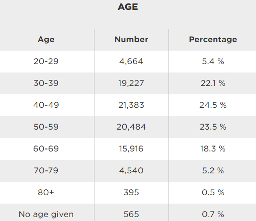

## Table of Contents

## What are the basic financial needs of someone in their 20s?

In your 20s, one of the most important financial needs is to build a strong foundation for your future. This means starting to save money regularly, even if it's a small amount each month. You should also begin to learn about managing your money, like how to make a budget and stick to it. It's a good time to start thinking about retirement, too. Even though it seems far away, putting a little money into a retirement account now can help a lot later.

Another key need is to manage debt wisely. Many people in their 20s have student loans or might start using credit cards. It's important to pay these off as quickly as you can to avoid paying a lot in interest. If you can, try to avoid taking on too much debt. Also, think about getting insurance, like health insurance, to protect yourself from big unexpected costs. Building good money habits in your 20s will help you a lot as you get older.

## How can a financial advisor help someone in their 30s with family planning?

A financial advisor can be really helpful for someone in their 30s who is thinking about starting a family. They can help you figure out how much money you'll need for things like having a baby, taking time off work, and maybe even changing to a bigger home. They can also help you make a plan to save up for these costs. This might mean setting up a special savings account or changing how you invest your money to make sure you have enough when you need it.

Another way a financial advisor can help is by looking at your insurance needs. When you have a family, you might need more insurance to make sure they're taken care of if something happens to you. This could be life insurance, health insurance, or even disability insurance. The advisor can help you pick the right kind and amount of insurance. They can also help you think about your long-term goals, like saving for your kids' education or your own retirement, and make sure your financial plan includes these goals.

## What should someone in their 40s look for in a financial planner?

When someone in their 40s is looking for a financial planner, they should find someone who understands their life stage. At this age, people often have more responsibilities like paying for their kids' education, saving for retirement, and maybe taking care of aging parents. A good financial planner will help you make a plan that takes all these things into account. They should be able to explain things in a way that's easy to understand and help you feel confident about your financial future.

It's also important to find a financial planner who is trustworthy and has the right qualifications. You want someone who is a fiduciary, which means they have to put your interests first. They should have certifications like a CFP (Certified Financial Planner) or a similar credential that shows they know what they're doing. Make sure to check their background and see if they have experience helping people in their 40s with similar goals and challenges. A good planner will not only help you with your money today but will also be there to guide you as your needs change over time.

## How does retirement planning differ for someone in their 50s versus their 60s?

For someone in their 50s, retirement planning is about getting ready for the future. At this age, people usually start thinking more seriously about when they want to stop working and how much money they'll need. They might start saving more by putting extra money into their retirement accounts, like a 401(k) or an IRA. They also need to think about things like healthcare costs and maybe helping their kids with college. A big part of planning in your 50s is making sure you're on track and making adjustments if you need to, like saving more or working a bit longer.

When someone reaches their 60s, retirement planning becomes more about finalizing the plan and getting ready to actually retire. By now, people are often closer to their retirement date, so they need to make sure they have enough saved up. They might start moving their money into safer investments that won't lose value as easily. They also need to think about when to start taking Social Security and how to use their savings so they last as long as they need them to. Planning in your 60s is about making sure everything is set so you can enjoy your retirement without worrying about money.

## What specific financial products should a young adult consider with a financial advisor?

A young adult should consider a few key financial products with the help of a financial advisor. One important product is a savings account. This is a safe place to keep money that you might need soon, like for emergencies or short-term goals. A financial advisor can help you find a savings account with a good interest rate so your money can grow a little bit over time. Another product to think about is a retirement account, like a 401(k) if your job offers it, or an IRA if it doesn't. Even if retirement seems far away, starting to save now can make a big difference later. A financial advisor can help you choose the right type of retirement account and decide how much to save each month.

Another product that can be useful is a health savings account (HSA) if you have a high-deductible health plan. An HSA lets you save money for medical expenses and the money grows without being taxed. This can be a smart way to save for healthcare costs now and in the future. Lastly, a young adult might want to consider life insurance, especially if they have people who depend on them. A financial advisor can help you understand the different types of life insurance and decide if it's something you need right now. By talking to a financial advisor about these products, a young adult can start building a strong financial foundation.

## How can a financial planner assist someone in their 30s with managing debt?

A financial planner can really help someone in their 30s manage their debt. At this age, people often have different kinds of debt, like student loans, credit card debt, or maybe a mortgage. A good financial planner can look at all these debts and help you figure out which ones to pay off first. They might suggest paying off the debt with the highest interest rate first because that saves you the most money in the long run. Or, they might help you make a plan to pay off smaller debts first to feel like you're making progress.

The financial planner can also help you make a budget that includes paying off your debt. They can show you how to cut back on spending in some areas so you can put more money towards your debt. They might also talk to you about options like debt consolidation, which can make it easier to manage your payments. Plus, a financial planner can help you avoid getting into more debt by giving you tips on how to use credit wisely. By working with a financial planner, someone in their 30s can get a clear plan to become debt-free and feel more in control of their money.

## What are the key considerations for someone in their 40s when choosing an investment strategy?

For someone in their 40s, choosing an investment strategy should focus on balancing growth and safety. At this age, you're probably thinking about your future, like retirement and maybe your kids' education. You want your money to grow, but you also don't want to take too many risks because you don't have as much time to recover from big losses. A good strategy might be to keep some of your money in stocks, which can grow a lot over time, but also put some in safer investments like bonds. This way, you can still see your money grow but also have some protection.

Another key thing to think about is how much time you have until you need the money. If you're planning to retire in 20 years, you might be okay with taking a bit more risk now. But if you need the money sooner, like for your kids' college in 5 years, you'll want to be more careful. Talking to a financial advisor can help you figure out the right mix of investments for your goals and how comfortable you are with risk. They can also help you adjust your plan as your life changes, making sure you stay on track for a secure future.

## How should someone in their 50s adjust their financial portfolio as they near retirement?

As someone in their 50s gets closer to retirement, they should start to change their financial portfolio to be safer. They might have been investing in stocks to grow their money, but now it's time to move some of that money into things like bonds or other safe investments. This helps protect the money they've saved so they don't lose a lot if the stock market goes down. They should also think about how much money they'll need each year in retirement and make sure their investments can give them that money without running out.

Another thing to do in your 50s is to check if you're saving enough for retirement. You might want to put more money into your retirement accounts like a 401(k) or an IRA, especially since you can save more after you turn 50. It's also a good time to think about when you'll start taking Social Security and how that will affect your savings. Talking to a financial advisor can help you make a plan that fits your needs and makes sure you're ready for a comfortable retirement.

## What are the advanced estate planning options a financial advisor can offer to someone in their 60s?

For someone in their 60s, a financial advisor can offer advanced estate planning options that help make sure their money and things go to the right people after they're gone. One option is setting up a trust. A trust can help you avoid probate, which is the legal process that can take a long time and cost a lot of money. With a trust, you can decide exactly how and when your money and things are given out, which can be really helpful if you want to take care of your family or leave money to charity.

Another option is to use advanced directives, like a living will or a healthcare proxy. These documents say what kind of medical care you want if you can't speak for yourself. They make sure your wishes are followed and can take some stress off your family during a hard time. A financial advisor can also help you with tax planning to make sure your estate pays as little in taxes as possible. This can mean setting up things like charitable remainder trusts, which let you give to charity and still get some money back for yourself or your family. By working with a financial advisor, someone in their 60s can make a detailed plan that protects their money and makes things easier for their loved ones.

## How can a financial planner help optimize tax strategies for someone at any age?

A financial planner can help anyone at any age save money on taxes by looking at their whole financial situation. They can find ways to lower your taxes now and in the future. For example, they might suggest putting money into retirement accounts like a 401(k) or an IRA. These accounts let you save money before you pay taxes on it, which can lower your tax bill each year. They can also help you use tax credits and deductions you might not know about, like ones for education or home improvements.

As you get older, a financial planner can help you plan for things like Social Security and how to take money out of your retirement accounts in a way that keeps your taxes low. They can also help you with estate planning to make sure your money goes to your family with as little tax as possible. By working with a financial planner, you can make smart choices about your money that save you a lot in taxes over your lifetime.

## What are the criteria for evaluating the credentials and experience of a financial advisor at different life stages?

When you're young, like in your 20s or 30s, you want a financial advisor who knows a lot about saving money and planning for the future. Look for someone with a Certified Financial Planner (CFP) certification, which means they've passed tough tests and have a good understanding of financial planning. You should also check if they have experience helping people your age. They should be good at explaining things simply and helping you start saving for things like a house or retirement. It's also important that they are a fiduciary, which means they have to put your interests first, not their own.

As you get older, like in your 40s or 50s, you need an advisor who can help with more complicated stuff like investing and getting ready for retirement. They should still have a CFP or another good certification, but now you also want to see if they've worked with people who are close to retiring. They should be able to help you figure out how much money you'll need and how to invest it safely. In your 60s and beyond, you want an advisor who knows about estate planning and can help you make sure your money goes to your family the way you want. They should be experienced in tax planning too, to help you keep as much of your money as possible. Always check their background and see if other people have been happy with their advice.

## How can someone in their 70s and beyond continue to benefit from financial planning?

Even in their 70s and beyond, people can still get a lot of help from financial planning. At this age, it's all about making sure your money lasts as long as you need it. A financial planner can help you figure out how much money you can spend each month without running out. They can also help you make sure your investments are safe and not too risky. This is important because you don't want to lose money when you're relying on it to live.

Another big part of financial planning in your 70s is estate planning. This means making sure your money and things go to your family or friends the way you want after you're gone. A financial planner can help you set up trusts or wills to make this happen smoothly. They can also help you with taxes, so your family doesn't have to pay too much when they get your money. By working with a financial planner, you can feel more secure and make things easier for your loved ones.

## References & Further Reading

[1]: Bergstra, J., Bardenet, R., Bengio, Y., & Kégl, B. (2011). ["Algorithms for Hyper-Parameter Optimization."](https://papers.nips.cc/paper/4443-algorithms-for-hyper-parameter-optimization) Advances in Neural Information Processing Systems 24.

[2]: ["Advances in Financial Machine Learning"](https://www.amazon.com/Advances-Financial-Machine-Learning-Marcos/dp/1119482089) by Marcos Lopez de Prado

[3]: ["Evidence-Based Technical Analysis: Applying the Scientific Method and Statistical Inference to Trading Signals"](https://www.amazon.com/Evidence-Based-Technical-Analysis-Scientific-Statistical/dp/0470008741) by David Aronson

[4]: ["Machine Learning for Algorithmic Trading"](https://github.com/stefan-jansen/machine-learning-for-trading) by Stefan Jansen

[5]: ["Quantitative Trading: How to Build Your Own Algorithmic Trading Business"](https://www.amazon.com/Quantitative-Trading-Build-Algorithmic-Business/dp/1119800064) by Ernest P. Chan