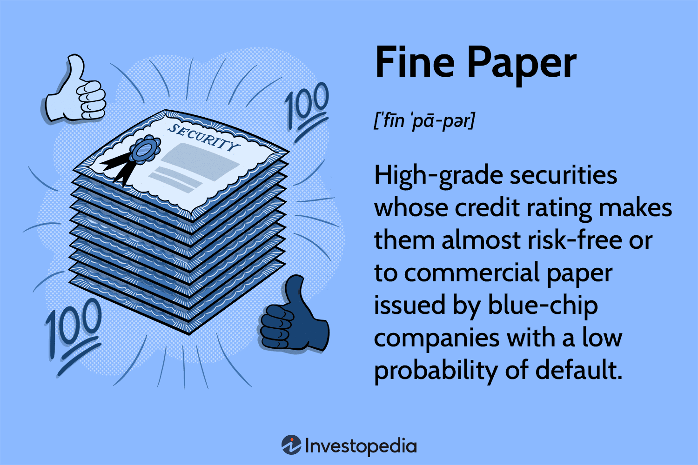

## Table of Contents

## What is fine paper?

Fine paper is a type of high-quality paper that is used for special purposes. It is made from very good materials, like cotton or linen fibers, which make it strong and smooth. People use fine paper for things like writing important letters, printing fancy invitations, or making art. It feels nice to touch and looks elegant.

There are different kinds of fine paper, and each one is made for a specific use. Some are very thick and heavy, while others are thin but still strong. The color can be bright white or have a soft, creamy look. Fine paper can also have special finishes, like being glossy or having a rough texture. This makes it perfect for different projects, depending on what you need.

## How is fine paper different from regular paper?

Fine paper is different from regular paper because it is made from better materials, like cotton or linen, instead of just wood pulp. This makes fine paper stronger and smoother. Regular paper, on the other hand, is usually made from wood and is not as strong or smooth. Fine paper is used for special things like fancy invitations or important documents, while regular paper is used for everyday stuff like printing or writing notes.

Another difference is that fine paper often has special finishes and textures. It can be glossy or have a rough feel, and it comes in different colors like bright white or soft cream. Regular paper usually doesn't have these special finishes and is mostly just plain and white. Because of these differences, fine paper costs more than regular paper, but it's worth it when you need something that looks and feels really nice.

## What are the common materials used to make fine paper?

Fine paper is made from high-quality materials like cotton and linen. These materials make the paper strong and smooth. Cotton is often used because it makes the paper last a long time and feel nice to touch. Linen is also used because it gives the paper a special texture that people like.

Sometimes, fine paper can also have a little bit of wood pulp in it, but not as much as regular paper. This helps keep the cost down a bit while still making the paper good quality. The mix of these materials makes fine paper perfect for special uses like fancy invitations or important documents.

## What are the typical characteristics of fine paper?

Fine paper is known for being strong and smooth. It's made from good materials like cotton or linen, which make it last a long time. When you touch fine paper, it feels nice because it's not rough like some other papers. It's also thick and heavy, which makes it perfect for special things like fancy invitations or important letters.

Fine paper can have different finishes and textures. It might be glossy and shiny, or it might have a rough feel that people like. The color of fine paper can be bright white or a soft, creamy color. These special features make fine paper look elegant and feel luxurious. That's why people choose it for important projects where they want everything to look and feel just right.

## What are the primary uses of fine paper?

Fine paper is used for special things because it looks and feels really nice. People use it to write important letters or to print fancy invitations for events like weddings or big parties. Because fine paper is strong and smooth, it's perfect for these special uses. It makes the letters or invitations look elegant and important.

Artists also like to use fine paper for their work. They might draw or paint on it because the paper can handle different art supplies well. The special finishes and textures of fine paper can make the art look even better. So, fine paper is not just for writing; it's also great for creating beautiful art pieces.

## How is fine paper manufactured?

Fine paper is made in a special way to make sure it's strong and smooth. First, the materials like cotton or linen are cleaned and turned into a pulp. This pulp is mixed with water to make a slurry. The slurry is then spread out on a flat screen to form a thin layer. This layer is pressed to squeeze out extra water and then dried. After drying, the paper is smoothed out even more by running it through rollers. This makes the paper feel nice and look good.

After the paper is made, it can be treated to have special finishes. Some fine paper might be coated to make it glossy, while other paper might be left rough for a different feel. The paper can also be cut into different sizes and shapes depending on what it will be used for. All these steps make sure that fine paper is perfect for fancy invitations, important letters, or beautiful art.

## What are the different types of fine paper available in the market?

There are different types of fine paper you can find in stores. One type is cotton paper, which is made mostly from cotton fibers. It's really strong and lasts a long time, so people use it for important documents like certificates or fancy art prints. Another type is linen paper, which has a special texture that feels a bit rough but looks very nice. People like to use linen paper for fancy invitations or special stationery.

Another kind of fine paper is vellum paper, which is thin but strong. It has a smooth, almost see-through look that makes it perfect for elegant invitations or overlays in art projects. There's also laid paper, which has lines on it that give it a special pattern. People use laid paper for formal letters or to add a classic touch to their projects. Each type of fine paper has its own special features, so you can pick the one that fits best with what you need.

## What are the standards and certifications for fine paper?

Fine paper has to meet special standards to make sure it's really good quality. One important standard is the ISO 9706, which says the paper should last a long time without getting yellow or breaking down. This is important for things like important documents or art that people want to keep for many years. Another standard is the ISO 11108, which talks about how much cotton or linen should be in the paper. This helps make sure the paper is strong and smooth.

There are also certifications that show fine paper is good. The FSC (Forest Stewardship Council) certification means the paper comes from trees that were cut down in a way that's good for the environment. This is important for people who care about nature. The Acid-Free certification is another one to look for. It means the paper won't turn yellow or break down over time because it doesn't have harmful acids in it. These standards and certifications help people know they're getting high-quality fine paper that will last and look nice.

## How does fine paper contribute to the quality of printed materials?

Fine paper makes printed materials look and feel better. When you print on fine paper, the colors and images come out sharp and clear. This is because fine paper is smooth and doesn't have rough spots that can mess up the print. It also makes the ink sit nicely on the paper, so the print looks more vibrant and lasts longer. People often choose fine paper for things like fancy invitations or important documents because it makes them look special and high-quality.

Using fine paper also makes the printed materials feel nice to touch. Fine paper is made from good materials like cotton or linen, which makes it strong and smooth. When you hold a piece of printed fine paper, it feels luxurious and elegant. This can make a big difference, especially for special events or important letters where you want everything to feel just right. So, fine paper not only makes things look better but also adds a nice touch to how they feel.

## What are the environmental considerations in the production of fine paper?

Making fine paper can have effects on the environment. The good news is that some fine paper is made from cotton or linen, which can be better for the environment than using just wood. These materials can come from leftover scraps from other industries, which means fewer trees need to be cut down. Also, some fine paper makers use water and energy in smart ways to make less waste. They might recycle water used in making the paper, which helps save this important resource.

But there are still things to think about. Making fine paper can use a lot of energy, and if the energy comes from burning coal or gas, it can add to air pollution. The process also makes waste, like leftover pulp or chemicals, which need to be handled carefully so they don't harm the environment. Some fine paper makers try to do better by getting certifications like FSC, which means they are trying to take care of forests and use resources in a way that's good for the planet.

## How can one identify high-quality fine paper?

You can tell if fine paper is high quality by looking at and touching it. High-quality fine paper feels smooth and strong. It's made from good materials like cotton or linen, which make it last a long time. When you hold it, it feels nice and doesn't tear easily. The color of high-quality fine paper is usually bright white or a soft, creamy color, which looks elegant.

Another way to know if fine paper is good is by checking for special finishes and textures. High-quality fine paper might be glossy or have a rough feel that people like. It can also have special patterns like lines on laid paper. If the paper has certifications like FSC or Acid-Free, it means it's been made in a way that's good for the environment and will last a long time without turning yellow. These things show that the fine paper is really good and perfect for special uses like fancy invitations or important art.

## What are the future trends and innovations in the fine paper industry?

The fine paper industry is always looking for new ways to make paper even better. One big trend is using more eco-friendly materials. People are trying to make fine paper from things like recycled cotton or leftover linen scraps. This helps save trees and is better for the environment. Another trend is making paper that can be used with new technology. For example, some fine papers are now made to work well with digital printing machines, which can print fancy designs and colors more easily.

Another innovation in the fine paper industry is adding special features to the paper. Some companies are making fine paper with built-in security features, like watermarks or special fibers, to make it harder to copy important documents. There's also a trend towards making paper that feels even nicer to touch. New finishes and textures are being developed to make fine paper feel more luxurious. These trends and innovations show that the fine paper industry is always working to make paper that looks great, feels nice, and is good for the planet.

## What is the future of fine paper and algo trading?

The landscape of fine paper investments is poised for significant evolution, driven by advancements in technology and changing market dynamics. Fine paper, in the financial sense, refers to high-grade securities, often used for short-term financing by corporations. As investors seek diversification and optimal returns, the role of fine paper in investment portfolios is becoming increasingly nuanced.

Technological advancements, particularly in algorithmic trading, are shaping the future of managing fine paper investments. Algorithmic trading utilizes complex algorithms to make trading decisions at speeds and accuracies beyond human capabilities. Technologies like artificial intelligence (AI) and machine learning are allowing these algorithms to analyze vast datasets, identifying investment opportunities with greater precision. For instance, machine learning models can be used to predict market behaviors based on historical data, continuously learning and adapting to new information. A simple linear regression model, often a starting point in machine learning, can be expressed as:

$$
y = \beta_0 + \beta_1x + \epsilon
$$

where $y$ is the predicted variable, $x$ is the independent variable, $\beta_0$ is the y-intercept, $\beta_1$ is the slope of the line, and $\epsilon$ is the error term.

Regulatory changes also play a critical role in the evolving landscape of fine paper and algorithmic trading. Governments and financial institutions are increasingly scrutinizing the impact of high-frequency trading and algorithm-based trading systems on market stability. Future regulations may focus on enhanced transparency and risk management mechanisms for algorithmic trading platforms. For fine paper, regulatory shifts might include stricter credit rating requirements and more comprehensive disclosure mandates to protect investors.

Staying ahead in these changing financial markets requires investors and traders to employ strategic adaptability. This includes leveraging technology to develop robust, data-driven investment strategies and maintaining flexibility to pivot in response to new regulatory landscapes. Investors could benefit from using simulation tools to assess various trading scenarios, thereby preparing for uncertainties without significant capital exposure.

The synergy between traditional investment tools and modern trading technologies offers a promising path forward. By integrating established financial instruments like fine paper with innovative trading solutions, investors can create diversified, resilient portfolios. The challenge lies in balancing the reliability of traditional assets with the dynamic potential of algorithmic strategies. In conclusion, the future of fine paper and algorithmic trading is characterized by the continuous integration of technology-driven efficiencies with time-tested investment principles, promising novel opportunities for sophisticated market participants.

## References & Further Reading

[1]: Bergstra, J., Bardenet, R., Bengio, Y., & Kégl, B. (2011). ["Algorithms for Hyper-Parameter Optimization."](https://dl.acm.org/doi/10.5555/2986459.2986743) Advances in Neural Information Processing Systems 24.

[2]: ["Advances in Financial Machine Learning"](https://www.amazon.com/Advances-Financial-Machine-Learning-Marcos/dp/1119482089) by Marcos Lopez de Prado

[3]: ["Evidence-Based Technical Analysis: Applying the Scientific Method and Statistical Inference to Trading Signals"](https://www.amazon.com/Evidence-Based-Technical-Analysis-Scientific-Statistical/dp/0470008741) by David Aronson

[4]: ["Machine Learning for Algorithmic Trading"](https://github.com/stefan-jansen/machine-learning-for-trading) by Stefan Jansen

[5]: ["Quantitative Trading: How to Build Your Own Algorithmic Trading Business"](https://github.com/LucindaYa/quant-resources/blob/master/Quantitative%20Trading%20How%20to%20Build%20Your%20Own%20Algorithmic%20Trading%20Business.pdf) by Ernest P. Chan