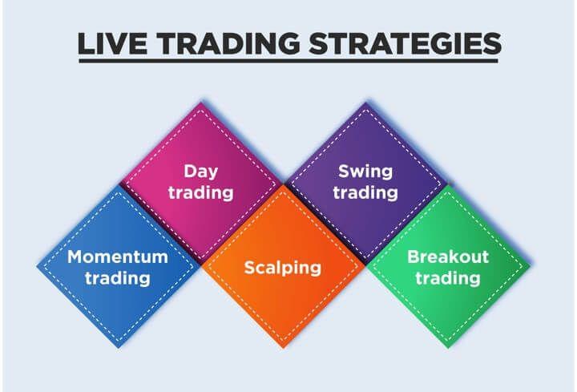

In recent years, machine learning has emerged as a pivotal technology across various sectors, including algorithmic trading. As financial markets have become increasingly complex and data-driven, the adoption of machine learning has enabled more sophisticated and nuanced trading strategies. This article explores the intersection of machine learning fine-tuning, model optimization, and their application in algorithmic trading. Fine-tuning, a process that involves making minor adjustments to pre-trained models, is critical to adapting algorithms for specific market conditions and maximizing their predictive accuracy.

Moreover, model optimization plays an indispensable role in ensuring that trading algorithms operate efficiently in high-stakes financial environments. Optimized models are better equipped to make rapid, informed decisions, which are essential when split-second differences can dictate substantial financial outcomes. These improvements not only enhance predictive capabilities but also bolster risk management, a fundamental component of sustainable trading success. Machine learning model optimization strengthens algorithmic trading by refining parameters and structures, thereby reducing errors and adapting to market volatility.



The importance of model optimization in financial markets, where rapid decision-making is crucial, cannot be overstated. The ability to capitalize on small market movements or mitigate potential downturns can lead to significant gains or losses. As we unpack the components critical to optimized trading algorithms, understanding the integration of machine learning technologies is vital in developing effective trading strategies that are robust and adaptable to ever-changing market dynamics.

Join us as we explore the technologies and methodologies driving modern algorithmic trading, revealing how machine learning stands at the forefront of financial innovation. From fine-tuned models to advanced optimization techniques, the evolution of algorithmic trading fueled by machine learning holds immense potential for future advancements in finance.

## Table of Contents

## Understanding Machine Learning and Fine-Tuning

Machine learning is a powerful technology, best understood as a method for training algorithms to learn from data, enabling them to make informed predictions or decisions. This process involves creating a model that identifies patterns within the data and uses these insights to predict future outcomes. The effectiveness of a machine learning model largely hinges on two key processes: training and fine-tuning.

Fine-tuning, in machine learning, specifically refers to the refinement of a pre-trained model to improve its performance for a specific task. This adjustment is crucial because initial models are often trained on broad datasets and possess general capabilities. However, when applied to particular tasks, especially in volatile fields like finance, they require specific tweaks for optimized performance. For example, a model initially trained on historical stock market data might need fine-tuning to address recent shifts in economic policy or unexpected events affecting market psychology. This can be achieved through a series of adjustments, which might include altering hyperparameters, updating the dataset, or implementing regularization techniques to avoid overfitting.

In finance, fine-tuning finds a parallel in the continuous recalibration of investment strategies. Markets are inherently dynamic, characterized by ever-shifting conditions and data. As such, a strategy that thrives in one market environment may falter as circumstances evolve. Fine-tuning models in this sector means ensuring that trading algorithms remain aligned with these changes, thus maintaining their efficacy and relevance.

Several methodologies for fine-tuning exist, ranging from straightforward to complex. Simple parameter adjustments might involve tweaking the learning rate or optimizing batch sizes to increase model accuracy. More advanced approaches can involve augmenting existing data with more recent, relevant datasets. Python, a popular programming language for [machine learning](/wiki/machine-learning), facilitates such refinements thanks to libraries like TensorFlow and PyTorch. For example, in PyTorch, fine-tuning might involve unfreezing a portion of the model layers and allowing gradient updates on these layers during retraining:

```python
import torch
import torch.nn as nn
from torchvision import models

# Load a pre-trained model
model = models.resnet18(pretrained=True)

# Freeze all layers
for param in model.parameters():
    param.requires_grad = False

# Unfreeze the last layer
model.fc.requires_grad = True

# Define a new classifier
model.fc = nn.Linear(model.fc.in_features, 2)  # Assume binary classification
```

Fine-tuning is indispensable for adapting machine learning models to dynamic markets. Without it, models risk becoming obsolete, as they may fail to recognize new clues or trends. Effective fine-tuning ensures that a model not only continues to deliver accurate predictions but also contributes significantly to trading decisions that reflect current market realities.

Ultimately, the process of fine-tuning is a critical component in the ongoing challenge of maintaining and enhancing the performance of machine learning models in ever-changing conditions. By applying these methodologies, financial analysts and traders can sustain the relevance and effectiveness of their [algorithmic trading](/wiki/algorithmic-trading) strategies, ensuring they stay competitive in an increasingly data-driven financial landscape.

## Model Optimization: Key to Effective Algo Trading

Model optimization involves the refinement of machine learning models to augment their performance and efficiency, playing an essential role in algorithmic trading. Machine learning models, when correctly optimized, can significantly improve prediction accuracy and timing of trades, thus leading to higher returns.

One of the fundamental techniques in model optimization is hyperparameter tuning. Hyperparameters, unlike model parameters learned during training, are set before the learning process begins and control the learning process itself. Techniques such as grid search and random search are commonly used to find the optimal set of hyperparameters for a given model. For example, in a Random Forest model, hyperparameter tuning might involve selecting the optimal number of trees or the maximum depth of each tree.

Another key aspect of optimization is feature selection, which involves identifying the most relevant input variables for a model to improve its predictive accuracy while reducing overfitting. Feature selection methods range from basic techniques like correlation coefficient analysis to more advanced methods such as Recursive Feature Elimination and LASSO regression, which help in refining models by excluding irrelevant or redundant features.

Ensemble methods, which combine multiple models to improve overall performance, are also a crucial component of model optimization in trading. Techniques such as bagging, boosting, and stacking fall under this category. Bagging, exemplified by methods like Random Forest, reduces variance and overfitting by training multiple models independently on random subsets of data. Boosting techniques, such as AdaBoost, sequentially train models by focusing on errors made by previous models to improve accuracy. Stacking involves training a meta-model to combine the predictions from several base models, often resulting in better performance than any individual model.

Real-world applications demonstrate how meticulously optimized models can catalyze improved risk-adjusted returns in trading strategies. For instance, [quantitative trading](/wiki/quantitative-trading) firms have successfully employed optimization techniques to develop models that consistently capture market anomalies and leverage them for profitable trades.

The objective in optimizing models for algorithmic trading is to construct robust, resilient systems that can endure the [volatility](/wiki/volatility-trading-strategies) and unpredictability inherent in financial markets. These models need to dynamically adapt to shifting market conditions, requiring continuous monitoring and adjustment to sustain high performance. The iterative process of optimization ensures that trading algorithms remain effective over time, balancing the twin goals of maximizing returns and minimizing risks.

## Applying Machine Learning in Algo Trading

Algorithmic trading, or algo trading, revolutionizes the financial markets by executing trades through automated processes that follow predetermined rules, eliminating the need for human intervention. Machine learning plays a transformative role in enhancing the capabilities of algo trading. By leveraging historical data, machine learning models can predict future market movements, thereby augmenting the efficiency and effectiveness of trading strategies.

### Machine Learning Models in Algo Trading

Different types of machine learning models are employed in algo trading, each catering to specific trading tasks and predictions. Three primary models include:

- **Regression Models:** These models are instrumental in predicting continuous variables, such as asset prices or trading volumes. Linear regression and its advanced counterparts, like Lasso and Ridge regression, are commonly used to forecast market trends based on historical data patterns.

- **Classification Models:** Used to categorize and make binary or multiclass predictions, classification models are essential for determining the likelihood of market conditions, such as upward or downward trends. Popular algorithms include Decision Trees, Support Vector Machines (SVM), and Logistic Regression, each offering insights into potential investment strategies.

- **Deep Learning Models:** These models, particularly neural networks, are adept at capturing complex patterns in vast datasets. Convolutional Neural Networks (CNN) and Recurrent Neural Networks (RNN), including Long Short-Term Memory (LSTM) networks, are particularly effective for sequential data analysis, ideal for time-series forecasting in financial markets.

### Case Studies of Successful Applications

Several case studies highlight the efficacy of machine learning in algorithmic trading. For instance, hedge funds and trading firms have successfully used neural networks to predict stock movements, resulting in improved return on investment (ROI). One notable case involved using LSTM models to process historical stock prices and economic indicators, enabling the model to anticipate price swings with impressive accuracy.

### Enhancing Algo Trading Systems

The optimization of machine learning models can significantly boost the efficiency of algo trading systems. Fine-tuning hyperparameters, selecting optimal features, and employing robust ensemble methods such as Random Forests and Gradient Boosting can increase model accuracy and reduce overfitting. These techniques lead to more reliable trading decisions, maximizing profits while effectively managing risks.

In conclusion, the integration of sophisticated machine learning models enhances the capability of algo trading systems, making them more predictive and adaptive to market dynamics. As the financial markets continue to evolve, the role of machine learning in refined, data-driven trading strategies will undoubtedly expand, promising even greater innovations in algorithmic trading.

## Challenges and Future Outlook

Deploying machine learning in algorithmic trading, while promising, presents several challenges. One of the primary concerns is data quality. Effective machine learning models require robust, accurate, and extensive datasets to generate reliable predictions. However, financial data is often noisy, incomplete, or aggregated in ways that can obscure patterns essential for effective trading strategies. Moreover, the presence of anomalies and biases can significantly skew model outcomes if not addressed properly. Therefore, ensuring high-quality data preprocessing and cleansing is vital for the success of machine learning applications in trading.

Another significant challenge is model overfitting. A model that is too complex may fit the training data too closely, capturing noise along with the underlying pattern. This can lead to poor generalization to new, unseen data, reducing the model's effectiveness in real-time trading scenarios. Methods such as cross-validation, regularization techniques like L1 or L2 penalties, and the use of simpler models can help mitigate these risks.

Regulatory considerations and ethical concerns add another layer of complexity. As algorithmic trading systems increasingly rely on self-learning models, there is a growing need for transparency in decision-making processes. Regulatory bodies require that trading algorithms be auditable and comply with stringent financial market regulations. Furthermore, the ethical implications of algorithm-driven market activities, such as the potential for market manipulation or unfair trading advantages, demand careful oversight.

The industry is responding to these challenges through several strategies. The development of more sophisticated data management systems helps in maintaining the quality and integrity of the data used for training machine learning models. Additionally, researchers and practitioners are focusing on creating interpretable machine learning models that provide insights into how decisions are made, ensuring compliance with regulatory standards.

The future of algorithmic trading is likely to witness the seamless integration of [artificial intelligence](/wiki/ai-artificial-intelligence) capabilities. This will involve the convergence of machine learning with other technologies such as natural language processing and cognitive computing to develop more adaptive and intelligent trading systems. Continuous model refinement and the adoption of adaptive learning strategies will enable these systems to evolve with changing market dynamics, maintaining their relevance and effectiveness.

As technological advancements continue, machine learning is set to become increasingly integral to strategic decision-making in financial markets. The ability to quickly process and analyze vast quantities of data will empower traders and analysts to make more informed decisions, potentially transforming the landscape of algorithmic trading. However, balancing innovation with regulatory compliance and ethical considerations will remain critical to harness the full potential of machine learning in this domain.

## Conclusion

Machine learning represents a transformative force within algorithmic trading by enabling the fine-tuning and optimization of trading models. These advancements in machine learning enhance predictive capabilities and risk management, facilitating not only profitability but also sustainable trading practices. As the intersection of technology and finance becomes increasingly sophisticated, traders and analysts are afforded new possibilities for improving trading strategies and outcomes.

The adaptability of machine learning ensures that as trading environments change, models can evolve continuously to maintain relevance and effectiveness. Advanced strategies in machine learning allow for this adaptability by enabling ongoing adjustments, thus supporting strategic decision-making. A vital aspect in the field's growth is the capacity for continuous learning and adaptation, which underscores the importance of remaining agile in the use of these technologies.

As the integration of machine learning into algorithmic trading continues, promising developments on the horizon suggest a future where financial strategies are more innovative and responsive than ever before. The synergy of machine learning with finance is set to redefine traditional approaches, opening avenues for efficiency and innovation that were previously unimaginable. The pathway towards full integration is ongoing, with machine learning poised to play a central role in shaping the future of finance.

## References & Further Reading

[1]: Bergstra, J., Bardenet, R., Bengio, Y., & Kégl, B. (2011). ["Algorithms for Hyper-Parameter Optimization."](https://dl.acm.org/doi/10.5555/2986459.2986743) Advances in Neural Information Processing Systems 24.

[2]: ["Advances in Financial Machine Learning"](https://www.amazon.com/Advances-Financial-Machine-Learning-Marcos/dp/1119482089) by Marcos Lopez de Prado

[3]: ["Evidence-Based Technical Analysis: Applying the Scientific Method and Statistical Inference to Trading Signals"](https://www.amazon.com/Evidence-Based-Technical-Analysis-Scientific-Statistical/dp/0470008741) by David Aronson

[4]: ["Machine Learning for Algorithmic Trading"](https://github.com/stefan-jansen/machine-learning-for-trading) by Stefan Jansen

[5]: ["Quantitative Trading: How to Build Your Own Algorithmic Trading Business"](https://www.amazon.com/Quantitative-Trading-Build-Algorithmic-Business/dp/1119800064) by Ernest P. Chan